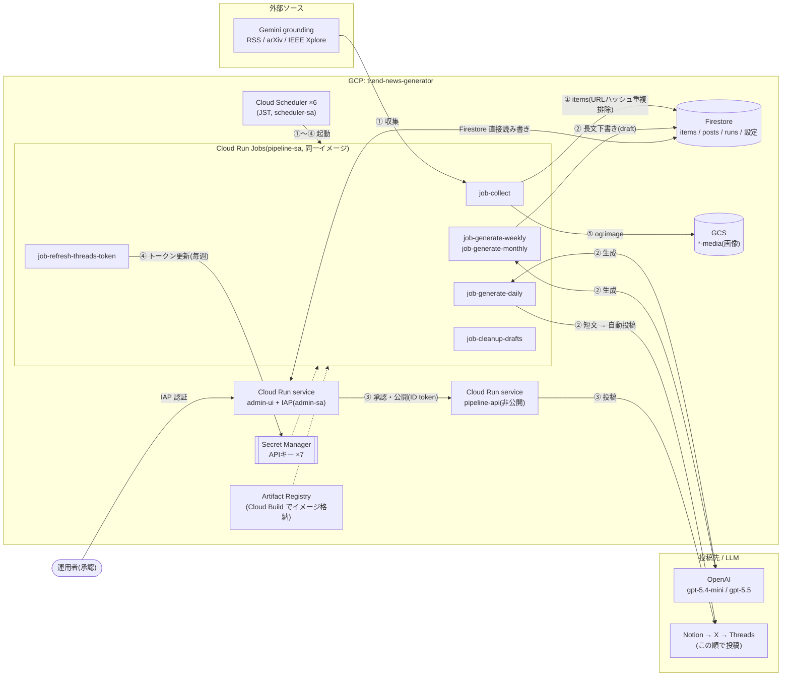

# trend-news-generator

技術・経済・国際政治などのトレンドを毎日自動収集し、X・Threads・Notion に自動投稿するシステム。

- **日次**: SNS向け短文を自動生成・自動投稿(X=日本語 / Threads=韓国語 / Notion=英語)
- **週次**: Economist・FT級の分析記事を下書き生成 → 管理画面で承認して投稿
- **月次**: 研究レポート級の深掘り記事を下書き生成 → 承認して投稿

## 構成

| ディレクトリ | 内容 |
|---|---|
| `pipeline/` | Python 3.12。収集・生成・投稿パイプライン(Cloud Run Jobs)と承認API(FastAPI, Cloud Run service) |
| `admin/` | Next.js 15 管理画面(Cloud Run + IAP)。カテゴリ・ソース・プロンプト・チャネル設定、下書き承認。UI言語 ko/ja/en |
| `infra/` | gcloud ベースのセットアップ・デプロイスクリプト |
| `shared/` | Python/TypeScript 共有定数(cadence, channel, status) |
| `docs/` | 認証情報の発行手順(`setup-credentials.md`)、運用手順(`runbook.md`) |

## クラウド構成図 + フロー

GCP プロジェクト `trend-news-generator`(asia-northeast1)。矢印の番号 ①〜④ が処理フロー。



### フロー概要(JST)

| # | 時刻 | 処理 |
|---|---|---|
| ① | 毎日 06:00 | `job-collect` — 外部ソース収集 → Firestore `items` + GCS 画像 |
| ② | 毎日 08:00 | `job-generate-daily` — 短文生成 → X(日)/Threads(韓)/Notion(英)へ自動投稿 |
| ② | 月曜 07:00 / 毎月1日 07:00 | weekly / monthly — 2段階生成(gpt-5.4-mini 選定 → gpt-5.5 長文)→ 下書き |
| ③ | 随時 | admin-ui で下書き承認 → pipeline-api 経由で Notion → X → Threads に投稿 |
| ④ | 月曜 03:00 | `job-refresh-threads-token` — Threads long-lived token を Secret Manager に更新 |
| — | 毎日 04:00 | `job-cleanup-drafts` — 承認されないまま30日を過ぎた下書きを自動削除 |

各カテゴリ×周期に**焦点キーワード**（管理画面のプロンプト編集で設定）を入れると、収集（Gemini Web 検索の方向づけ）と生成の両方でそのキーワードを重視する。

## セットアップ

> 前提: `gcloud` にログイン済みで、既定プロジェクトが `trend-news-generator` であること（`gcloud config set project trend-news-generator`）。組織なしプロジェクトのため IAP は初回のみコンソールで OAuth クライアントを作成する（下記「補足」参照）。

1. `docs/setup-credentials.md` に従い X / Threads / Notion / OpenAI / Gemini の認証情報を発行
2. `infra/00-bootstrap.sh` — GCP API有効化、Firestore、GCS、Artifact Registry、サービスアカウント
3. `infra/01-secrets.sh` — Secret Manager にシークレット登録(対話式)
4. `infra/10-deploy-pipeline.sh` — pipeline イメージのビルドと service(pipeline-api) + 7 jobs のデプロイ
5. seed 実行: `gcloud run jobs execute job-seed --region asia-northeast1 --wait`
6. `infra/11-deploy-admin.sh` — 管理UIを `--iap` 付きでデプロイ
7. `infra/20-schedulers.sh` — Cloud Scheduler 6本を作成

上記 1〜7（認証情報の発行を除く）は `./deploy.sh` で一括実行できる。`01-secrets.sh` は対話式のため既定ではスキップされる — 初回セットアップで含めたい場合は `./deploy.sh --with-secrets` を使う（`./deploy.sh --help` でオプション一覧）。

## Cloud への反映（デプロイ）

コードや設定を変えたら、**変更した対象に応じて `infra/` のスクリプトを再実行**する（＝これがこのシステムの「デプロイ」。CI/CD は無く手動）。前提は上記セットアップと同じ（`gcloud` ログイン済み・プロジェクト＝`trend-news-generator`）。pipeline・管理画面の両方を変えた・まとめて確実に反映したいときは `./deploy.sh --skip-bootstrap`（土台は初回のみでよいので通常は省略）で `10 → seed → 11 → 20` を一括実行してもよい。

| 変えたもの | 実行するコマンド | 反映先 |
|---|---|---|
| **pipeline のコード**（`pipeline/**`：収集・生成・投稿・API・ジョブ） | `bash infra/10-deploy-pipeline.sh` | イメージを再ビルド → pipeline-api + 全7ジョブを更新（数分／Cloud Build） |
| **管理画面のコード**（`admin/**`：画面・i18n・server actions） | `bash infra/11-deploy-admin.sh` | admin-ui を再ビルド・再デプロイ（数分） |
| **スケジュール／ジョブの増減**（`infra/env.sh` の `JOBS`・`infra/20-schedulers.sh` の cron） | `bash infra/10-deploy-pipeline.sh`（ジョブ増減時）→ `bash infra/20-schedulers.sh` | ジョブ作成 → Cloud Scheduler を作成/更新 |
| **APIキー／トークン**（Secret Manager） | `printf '%s' '<値>' \| gcloud secrets versions add <名前> --data-file=-` | ジョブは次回実行から反映（`:latest` 参照）。サービス（pipeline-api）は再デプロイか `gcloud run services update pipeline-api --region asia-northeast1` で新リビジョンにすると反映 |
| **カテゴリ・ソース・プロンプト・焦点キーワード・チャネルON/OFF・言語** | **デプロイ不要**。管理画面（admin-ui）で編集 | 管理画面が Firestore を直接書き、次回のジョブ実行から反映（`seed.py` の既定値は新規環境にしか効かない） |

補足:
- **今すぐ試したい**とき: デプロイ後、管理画面ダッシュボードの「コンテンツ生成」ボタン（① 収集 / ② 日次・週次・月次生成）でスケジュールを待たずに実行できる。CLI なら `gcloud run jobs execute job-<名前> --region asia-northeast1 --wait`。
- `10-deploy-pipeline.sh` の再実行は `--set-env-vars` を**全置換**するため、`gcloud` で手動追加した環境変数上書きは消える（モデル名は `config.py` の既定＝`gemini-3.5-flash` が正しいので通常は不要）。
- IAP の初回設定（組織なしプロジェクト）: Cloud コンソールで同意画面＋OAuth クライアントを作成し、`gcloud iap settings set` でプロジェクトに適用する。詳細は `docs/runbook.md`。

## ローカル開発

pipeline は **uv で管理する `.venv`（Python 3.13）** に閉じ込める（グローバル Python は汚さない）。

```bash
# pipeline
cd pipeline
uv venv && uv pip install -e ".[dev]"   # 初回のみ
uv run pytest                            # テスト（現在 58 件）
uv run python -m app.jobs.collect        # ADC + .env で単発実行

# admin
cd admin
npm install
npm run dev
```
