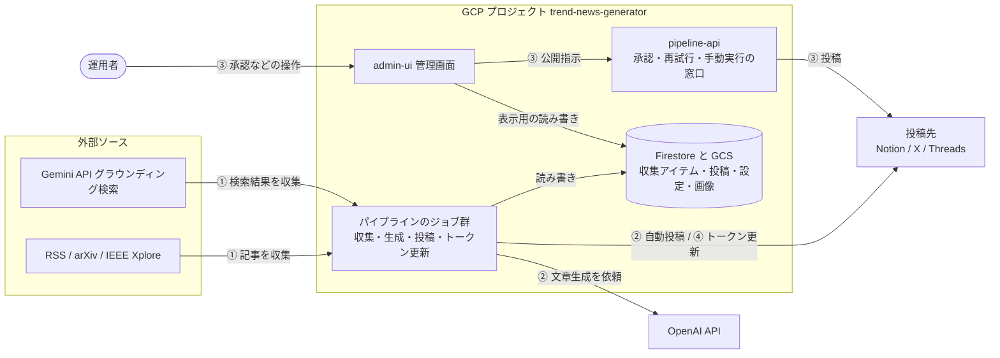
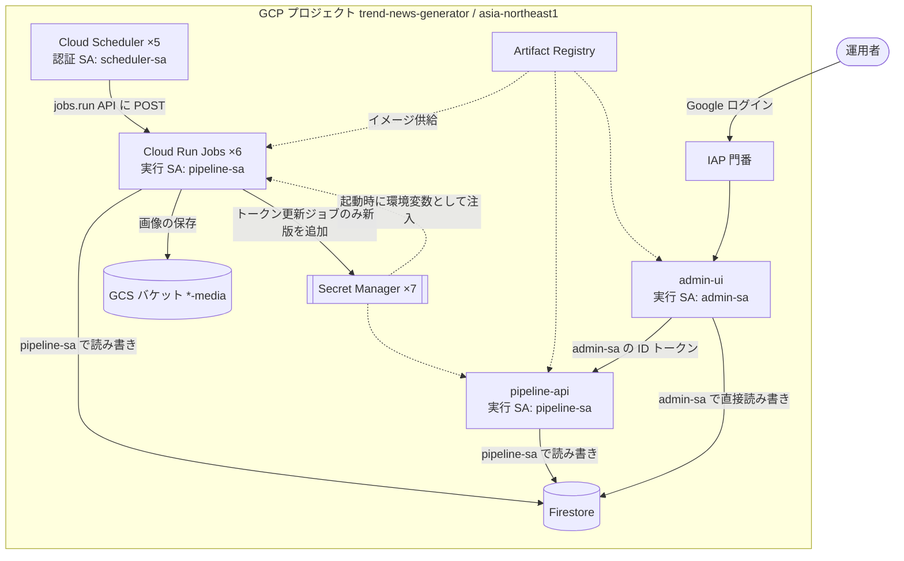
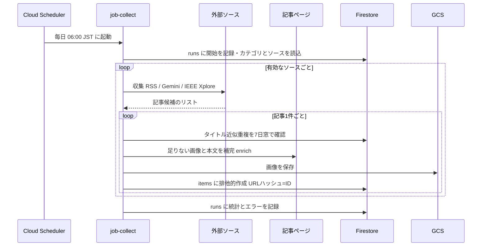
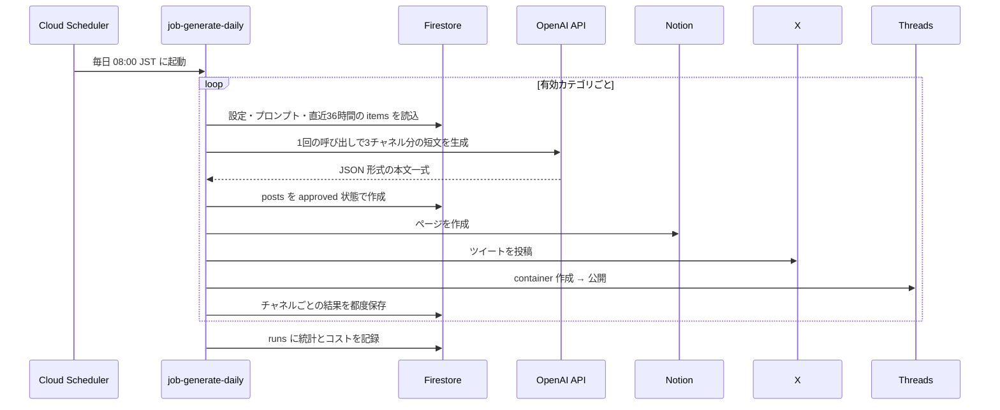
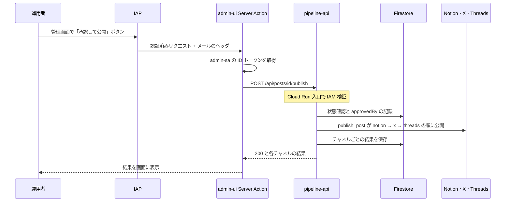
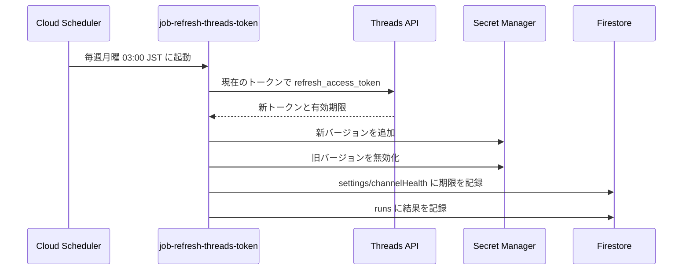
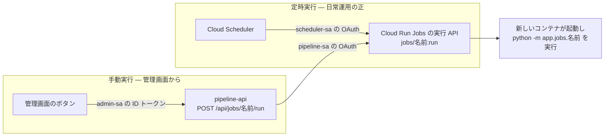
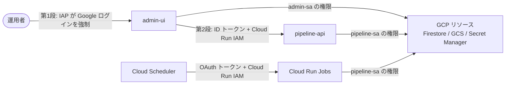

# 02. アーキテクチャ — システム全体の構成図

> 対象コード時点: コミット f703290 + 未コミット変更 / 最終更新: 2026-07-12

trend-news-generator の全体像を図で示す文書である。ルート [README.md](../../README.md) にも構成図が 1 枚あるが、あちらは 5 分で読むための要約版であり、**システム構成の記述はこの文書(tech-report 側)が「正」**(食い違ったときに信じる側)となる(§8)。個々の処理の内部は [05-detailed-design/](05-detailed-design/01-pipeline-foundation.md) の各文書、設定値・IAM・cron の一覧は [04-parameters.md](04-parameters.md)、データ構造は [03-data-model.md](03-data-model.md) に譲り、本書は「何がどこにあり、どうつながって動くか」に集中する。

## 1. この文書で分かること

1. システムが外部の何とつながっているか(§2)と、GCP プロジェクトの中にどんな部品があり、誰が何を呼べるか(§3)
2. README のフロー①〜④(収集 → 生成・自動投稿 → 承認公開 → トークン更新)が、どの部品をどの順に通って実行されるか(§4 のシーケンス図 4 枚)
3. ジョブが起動される 2 つの経路の違い(§5)、認証・認可の全体像(§6)、システム全体を貫く 4 つの設計判断とその理由(§7)

## 2. システムコンテキスト図 — 外の世界との4方向のつながり

まず最も引いた視点から。本システムは GCP(Google Cloud Platform、Google のクラウドサービス群)上で完結し、外部とは「情報を仕入れる相手」「文章を書かせる相手」「投稿する相手」「操作する人間」の 4 方向でつながる。矢印の①〜④は README のフロー番号(§4 で 1 本ずつ図解する)。

図の読み方: 左の外部ソースからニュースを仕入れ(①)、OpenAI に投稿文を書かせ(②)、右の 3 つの投稿先へ流す(②が日次の自動投稿、③が人間の承認を挟む週次・月次の公開)。運用者は管理画面(admin-ui)だけを触り、管理画面は表示のための読み書きを Firestore へ直接行う一方、「外部に投稿する」という取り返しのつかない操作だけは pipeline-api という別の窓口を経由する。④は Threads の認証トークンを毎週更新する保守フローで、投稿先のうち Threads とだけ通信する。チャネル(投稿先)ごとの言語は既定で X=日本語 / Threads=韓国語 / Notion=英語(Firestore の `channelConfigs` で変更可能)。

登場コンポーネント:

| 名前 | 実体 | 定義場所 |
|---|---|---|
| 外部ソース | RSS/Atom フィード(arXiv の Atom も含む)・IEEE Xplore API・Gemini のグラウンディング検索(生成 AI に Google 検索結果を根拠として引かせる仕組み) | 接続先の一覧は Firestore `sources` コレクション(初期値は `pipeline/app/jobs/seed.py`)。取得処理は `pipeline/app/collectors/` |
| パイプラインのジョブ群 | Cloud Run Jobs ×6(§3 で個別に示す) | `pipeline/app/jobs/`。デプロイは `infra/10-deploy-pipeline.sh` |
| pipeline-api | Cloud Run サービス(FastAPI 製の小さな API) | `pipeline/app/main.py`。詳細は [05-detailed-design/05-pipeline-api.md](05-detailed-design/05-pipeline-api.md) |
| admin-ui | Cloud Run サービス(Next.js 15 の管理画面) | `admin/src/`。詳細は [05-detailed-design/07-admin-ui.md](05-detailed-design/07-admin-ui.md) |
| Firestore と GCS | ドキュメント型データベースとファイル置き場 | スキーマは [03-data-model.md](03-data-model.md) |
| OpenAI API | 投稿文を生成する LLM(文章を読み書きできる AI) | 呼び出しは `pipeline/app/generators/openai_client.py`。モデル名の正は [04-parameters.md](04-parameters.md) |
| 投稿先 | Notion・X・Threads の各 API | クライアントは `pipeline/app/publishers/` |
| 運用者 | 管理画面を操作する人間 | 入場許可のメールアドレスは `infra/env.sh` の `ADMIN_EMAIL` |

## 3. GCP リソース構成図 — 何があり、誰が何を呼べるか

次に GCP の中を開く。**Cloud Run** は GCP のコンテナ実行サービスで、HTTP を待ち受ける常駐型の「サービス」と、起動されて処理を終えると止まる「ジョブ」の 2 種類がある。本システムはサービス 2 つ+ジョブ 6 つ。**サービスアカウント(SA)**はプログラム専用の Google アカウントで、3 つを役割別に使い分ける(矢印のラベルに付記)。

図の読み方: 実線は実行時の呼び出し、点線は起動時の供給(イメージとシークレット)。定時実行は Cloud Scheduler(指定時刻に HTTP リクエストを送るタイマー)が scheduler-sa の認証でジョブを蹴り、人間の操作は IAP(Identity-Aware Proxy、Google ログインを強制する門番)を通って admin-ui に届く。admin-ui が pipeline-api を呼べるのは、admin-sa が pipeline-api の呼び出し権限(`run.invoker`)を持つからで、逆に他の誰も呼べない。図で省略した線が 3 本ある — admin-sa は GCS の読み取り(画像プレビュー用)もでき、pipeline-api はジョブと同じ pipeline-sa で動くため GCS・Secret Manager にも同様に触れる。また scheduler-sa の権限はスケジュール対象の 5 ジョブに限られ、job-seed(初期データ投入)にはスケジューラ自体がない。ロールの網羅表は [04-parameters.md](04-parameters.md) の §6 が正。

リソース一覧(メモリ・タイムアウト・cron 式・シークレット名などの具体値は転記せず、[04-parameters.md](04-parameters.md) の §3〜§5 を正とする):

| 名前 | 種別 | 役割 | 作成スクリプト |
|---|---|---|---|
| pipeline-api | Cloud Run サービス | 承認公開・チャネル再試行・手動ジョブ実行の HTTP 窓口。未認証アクセスは入口で拒否 | `infra/10-deploy-pipeline.sh` |
| admin-ui | Cloud Run サービス | 管理画面。IAP の背後に置かれ、許可されたメールのみ入場可 | `infra/11-deploy-admin.sh` |
| job-collect | Cloud Run ジョブ | フロー① 収集 | `infra/10-deploy-pipeline.sh` |
| job-generate-daily | Cloud Run ジョブ | フロー② 日次短文の生成と自動投稿 | 同上 |
| job-generate-weekly / job-generate-monthly | Cloud Run ジョブ ×2 | フロー② 週次・月次長文の下書き生成(投稿はしない) | 同上 |
| job-refresh-threads-token | Cloud Run ジョブ | フロー④ Threads トークン更新 | 同上 |
| job-seed | Cloud Run ジョブ | 初期データ投入(初回のみ手動実行) | 同上 |
| sched-collect ほか計 5 本 | Cloud Scheduler | 上記ジョブの定時起動(job-seed を除く)。全て日本時間指定 | `infra/20-schedulers.sh` |
| Firestore | データベース | `items`(収集アイテム)・`posts`(投稿)・`runs`(実行記録)・カテゴリやプロンプト等の設定群 | `infra/00-bootstrap.sh` |
| trend-news-generator-media | GCS バケット | 収集画像(og:image)の置き場。完全非公開で、外部への受け渡しは期限付きの署名 URL のみ | 同上 |
| シークレット ×7 | Secret Manager | OpenAI・Gemini・X・Threads・Notion・IEEE の鍵とトークン(暗号化保管の金庫) | `infra/01-secrets.sh` |
| pipeline リポジトリ | Artifact Registry | Docker イメージ置き場(`pipeline:latest` と `admin:latest` の 2 つだけ) | `infra/00-bootstrap.sh` |
| pipeline-sa / admin-sa / scheduler-sa | サービスアカウント ×3 | 権限の分離(§6) | 同上 |

## 4. フロー別シーケンス図 — README の①〜④の実行経路

README の表にあるフロー①〜④を、時間の流れに沿ったシーケンス図(登場者を縦線で並べ、上から下へ時系列にやり取りを示す図)で 1 本ずつ示す。

### 4.1 フロー① 収集 — job-collect

毎朝の仕入れ。ソースの種別(RSS / Gemini グラウンディング / IEEE Xplore)ごとに対応する収集処理が走り、取れた記事 1 件ずつを「タイトルがほぼ同じものは 7 日窓で破棄 → 記事ページから代表画像と本文を補完 → 画像を GCS へ → Firestore `items` へ保存」と流す。保存時のドキュメント ID が正規化 URL のハッシュそのものなので、同じ URL は何度実行しても 1 件にしかならない(この冪等性=何度やっても結果が同じ性質のおかげで、このジョブだけは失敗時の自動再実行が許されている)。1 つのソースや 1 件の記事の失敗は隔離され、収集全体は止まらない。全容は [05-detailed-design/02-collect.md](05-detailed-design/02-collect.md)。

| 名前 | 実体 | 定義場所 |
|---|---|---|
| Cloud Scheduler | `sched-collect` | `infra/20-schedulers.sh` |
| job-collect | Cloud Run ジョブ(`python -m app.jobs.collect`) | 本体は `pipeline/app/jobs/collect.py` |
| 外部ソース | RSS/Atom・Gemini API・IEEE Xplore API | 取得処理は `pipeline/app/collectors/` |
| 記事ページ | 収集アイテムのリンク先 Web ページ | 補完処理は `pipeline/app/collectors/enrich.py` |
| Firestore | `items` `runs` `sources`(RSS キャッシュの書き戻し先) | [03-data-model.md](03-data-model.md) |
| GCS | 画像の保存先バケット | `pipeline/app/utils/gcs.py` |

### 4.2 フロー② 日次生成と自動投稿 — job-generate-daily

毎朝の投稿。カテゴリごとに LLM を 1 回だけ呼んで X・Threads・Notion の 3 本文をまとめて受け取り、文字数を検査してから投稿(post)を作る。既定では承認不要(`approved`)なので、**同じジョブのプロセス内で**そのまま `publish_post()` が呼ばれ、notion → x → threads の固定順(§7.4)で公開まで進む。運用フラグ `dailyRequireApproval` を有効にすると下書き(`draft`)で止まり、フロー③と同じ承認経路に乗る。週次(月曜 07:00)・月次(毎月 1 日 07:00)の長文ジョブもこの図の「生成 → posts 作成」までは同型だが、2 段階生成(軽量モデルで素材選定 → 上位モデルで執筆)であること、そして**必ず `draft` で止まり投稿処理を一切呼ばない**ことが違う。生成の詳細は [05-detailed-design/03-generate.md](05-detailed-design/03-generate.md)、投稿の詳細は [05-detailed-design/04-publish.md](05-detailed-design/04-publish.md)。

| 名前 | 実体 | 定義場所 |
|---|---|---|
| Cloud Scheduler | `sched-generate-daily`(週次・月次は別スケジューラ) | `infra/20-schedulers.sh` |
| job-generate-daily | Cloud Run ジョブ | 本体は `pipeline/app/jobs/generate_daily.py`、生成ロジックは `pipeline/app/generators/daily.py` |
| OpenAI API | 短文生成(既定モデルは [04-parameters.md](04-parameters.md) 参照) | 呼び出しは `pipeline/app/generators/openai_client.py` |
| Notion / X / Threads | 3 チャネルの公開 API | `pipeline/app/publishers/notion.py` / `x.py` / `threads.py`、束ね役は `pipeline/app/publishers/base.py` の `publish_post()` |
| Firestore | `posts` `items` `runs` と設定群 | [03-data-model.md](03-data-model.md) |

### 4.3 フロー③ 承認 → 公開 — 管理画面から pipeline-api へ

週次・月次の下書き(および承認制にした日次)を人間が公開する経路。ブラウザは pipeline-api を直接呼ばず、IAP を通過したリクエストを admin-ui の Server Action(サーバ側で動く関数)が受け、admin-sa 名義の ID トークン(Google が署名した本人証明)を付けて pipeline-api を呼ぶ。IAP がヘッダに載せた運用者のメールアドレスは `approvedBy` として投稿に記録される。公開処理は同期実行なので、応答が返った時点で結果が確定している — ただし**チャネル単位の失敗は HTTP エラーにならず**、応答本文の `status`(`partially_published` 等)で表現される。失敗チャネルだけをやり直す `retry-channel` という隣のエンドポイントもある。API の全仕様は [05-detailed-design/05-pipeline-api.md](05-detailed-design/05-pipeline-api.md)、二重投稿を防ぐ冪等性の仕掛けは [05-detailed-design/04-publish.md](05-detailed-design/04-publish.md)。

| 名前 | 実体 | 定義場所 |
|---|---|---|
| 運用者 | IAP に許可された Google アカウントの人間 | 許可は `infra/11-deploy-admin.sh`(既定メールは `infra/env.sh`) |
| IAP | Google ログインを強制する門番。通過者のメールをヘッダで伝える | 読み取りは `admin/src/lib/iap.ts` |
| admin-ui Server Action | `approveAndPublish()` など | `admin/src/lib/actions.ts`、トークン付与は `admin/src/lib/pipelineClient.ts` |
| pipeline-api | FastAPI の `publish()` エンドポイント | `pipeline/app/main.py` |
| Notion・X・Threads | 公開先 3 チャネル(公開の実体は `publish_post()`) | `pipeline/app/publishers/base.py` |
| Firestore | `posts` の状態遷移と結果保存 | [03-data-model.md](03-data-model.md) |

### 4.4 フロー④ Threads トークン自動更新 — job-refresh-threads-token

Threads の投稿用トークンは約 60 日で失効するため、毎週更新して常に余裕を保つ保守フロー。新トークンは Secret Manager の同じシークレットに**新バージョンとして追加**され、旧バージョンは削除ではなく無効化に留める(問題があったとき戻せるように)。各ジョブ・サービスはシークレットを「最新バージョン」参照で環境変数として起動時に取り込むため、新トークンが効くのは**次にコンテナが起動するときから**。更新結果は `settings/channelHealth` に書かれ、管理画面ダッシュボードの「残り日数」表示と失敗時の赤い警告バナーの源泉になる。この書き込みのために pipeline-sa はこのシークレットに限りバージョン追加・管理の権限を追加付与されている([04-parameters.md](04-parameters.md) §3)。詳細は [05-detailed-design/06-ops-jobs.md](05-detailed-design/06-ops-jobs.md)。

| 名前 | 実体 | 定義場所 |
|---|---|---|
| Cloud Scheduler | `sched-threads-refresh` | `infra/20-schedulers.sh` |
| job-refresh-threads-token | Cloud Run ジョブ | 本体は `pipeline/app/jobs/refresh_threads_token.py` |
| Threads API | `graph.threads.net` のトークン更新エンドポイント | 呼び出しは `pipeline/app/publishers/threads.py` の `refresh_long_lived_token()` |
| Secret Manager | シークレット `threads-access-token` のバージョン群 | 作成と権限付与は `infra/01-secrets.sh` |
| Firestore | `settings/channelHealth` と `runs` | [03-data-model.md](03-data-model.md) |

## 5. ジョブ起動の2経路 — 定時実行と手動実行は同じジョブに合流する

同じジョブを起動する経路が 2 つある。**入口は違うが、最終的にどちらも同じ Cloud Run Job を起動する**ので、実行される場所・環境は同一になる。

上段の定時実行は、Cloud Scheduler が Cloud Run Jobs の実行 API(`https://run.googleapis.com/v2/.../jobs/<ジョブ名>:run` への POST)を scheduler-sa の OAuth トークン付きで叩く。下段の手動実行は、管理画面 → pipeline-api の `POST /api/jobs/名前/run` を経て、pipeline-api が **同じ実行 API を pipeline-sa の権限で叩く**。どちらも **Cloud Run Job として新しいコンテナ**が立ち上がるので、リソース設定(タスクタイムアウト 1800s 等)も環境変数・シークレットの取り込みも同一。以前は手動実行だけ pipeline-api のプロセス内で走らせていたが、長時間ジョブがインスタンス縮退で中断し得たため、この「実ジョブ起動」方式に統一した。違いは入口だけである。

| 観点 | 定時実行 | 手動実行 |
|---|---|---|
| 起動をかける主体 | Cloud Scheduler(scheduler-sa) | pipeline-api(pipeline-sa)※管理画面のボタン経由 |
| 実行場所 | ジョブ専用の新しいコンテナ | **同左**(同じ Cloud Run Job) |
| 適用されるリソース設定 | ジョブ側の設定(タスクタイムアウト等) | 同左 |
| 応答の意味 | —(スケジューラが受ける) | 202 Accepted =「起動を受け付けた」だけ。ジョブの成否は HTTP では分からない(起動自体の失敗は 502) |
| 成否の確認先 | Firestore `runs` と Cloud Logging | 同左(`runs` が唯一の真実) |

手動実行が効くには pipeline-sa が各ジョブに `run.invoker` を持つ必要がある(`infra/10-deploy-pipeline.sh` が付与)。仕組みの詳細は [05-detailed-design/05-pipeline-api.md](05-detailed-design/05-pipeline-api.md) 6a 節。

## 6. 認証・認可の2段構え

「人間の入口」と「サービス間の呼び出し」で守り方を変えている。加えて、各コンポーネントが GCP リソースに触るときは実行 SA の権限がそのまま効く。

- **第 1 段(人間 → admin-ui)= IAP。** Google アカウントでログインし、かつ `roles/iap.httpsResourceAccessor` を許可されたメールでなければ、管理画面のアプリコードに一切到達できない。本プロジェクトは組織なし GCP のため、IAP が要求する OAuth クライアントはカスタムのものをスクリプト外で一度だけ適用済み(`gcloud iap settings set`)。IAP が使えない環境の代替案は [../runbook.md](../runbook.md)。
- **第 2 段(admin-ui → pipeline-api)= ID トークン + Cloud Run IAM。** pipeline-api は未認証アクセスを入口で拒否する設定でデプロイされ、admin-sa だけが `roles/run.invoker` を持つ。admin-ui のサーバ側が admin-sa 名義の ID トークン(宛先 URL を刻印した短命の証明書)を取得して付与し、Cloud Run が署名・期限・宛先をアプリのコードが動く前に検証する。
- **リソースアクセス = 実行 SA の権限。** pipeline-sa は Firestore 読み書き・GCS 読み書き・全シークレットの読み取り(+ `threads-access-token` のみ書き込み)・署名 URL 発行のための自己権限を持つ。admin-sa は Firestore 読み書きと GCS 読み取りのみで、**シークレットには一切触れない**(外部 API を呼ぶ処理はすべて pipeline 側に寄せてあるため)。scheduler-sa は 5 ジョブの起動だけができる。全ロールの正確な一覧は [04-parameters.md](04-parameters.md) §6。

## 7. 横断的な設計判断

個々の文書に散らばる「なぜこうなっているか」のうち、システム全体の形を決めている 4 つをここにまとめる。

### 7.1 単一イメージで pipeline-api と 6 ジョブを兼ねる

pipeline 側の Docker イメージは 1 つ(`pipeline:latest`)だけで、既定の起動コマンドは API サーバ(uvicorn)、ジョブとしてデプロイするときは起動コマンドを `python -m app.jobs.<名前>` に差し替える(`infra/10-deploy-pipeline.sh`)。利点は 3 つ — (1) API とジョブでコードのバージョンがずれる事故が構造的に起きない、(2) ビルドが 1 回で済む、(3) 手動実行(§5)と定時実行が文字どおり同じ関数を通る。裏返しの注意として、pipeline のコードを直すと 7 つのリソースが同時に新しくなる。

### 7.2 Terraform を使わず gcloud スクリプトで構築する

インフラは番号順に実行する 5 本のシェルスクリプト(`infra/00` → `01` → `10` → `11` → `20`)で作る。サービス 2 つ+ジョブ 6 本という規模の個人運用では、状態管理ツール(Terraform 等)を持ち込む学習・保守コストより「読めば分かる冪等スクリプト」の単純さが勝つ、という判断。各スクリプトは再実行しても安全に同じ状態へ収束するよう書かれている。読解は [05-detailed-design/08-infra.md](05-detailed-design/08-infra.md)。

### 7.3 pipeline-api はアプリ無認証 + Cloud Run IAM 保護に寄せる

`pipeline/app/main.py` には認証コードが 1 行もないが、これは意図的な設計である(冒頭の docstring に明記)。呼び出し元が admin-sa の 1 系統しかなく、Cloud Run 入口の検証(署名・期限・宛先)はアプリで再実装しても劣化コピーにしかならない。認証を外に出したことで API 本体は 100 行少々に収まり、テストも認証モックなしで書ける。「コードを読むと無認証に見える」ことに驚かないこと。ローカルで起動すれば誰でも叩けるのも正常(守っているのは Cloud Run であってコードではない)。根拠と検証方法は [05-detailed-design/05-pipeline-api.md](05-detailed-design/05-pipeline-api.md)。

### 7.4 公開順は notion → x → threads で固定

週次・月次の長文は全文を Notion に置き、X と Threads にはティーザー(本文へ誘導する短い紹介文)+ Notion の公開 URL を流す。**URL の供給元である Notion を必ず最初に公開する必要がある**ため、順序は `pipeline/app/publishers/base.py` の `publish_post()` に固定で書かれている。あるチャネルの失敗は隔離され、外部 ID の記録などの冪等性ガードにより再実行しても二重投稿にならない。順序を変えたくなったら、それは URL 供給の設計ごと見直すということ — [05-detailed-design/04-publish.md](05-detailed-design/04-publish.md) を先に読むこと。

## 8. ルート README.md の図との関係

ルート [README.md](../../README.md) の「クラウド構成図 + フロー」は、本書 §2〜§3 の 2 枚を 1 枚に圧縮し、フロー表(①〜④)で §4 を要約したものである。役割分担は次のとおり。

| | README.md | 本書(02-architecture.md) |
|---|---|---|
| 想定読者と時間 | 初見の人が 5 分で全体をつかむ | 構成を正確に知りたい人・変更する人 |
| 粒度 | 1 図 + 1 表 | コンテキスト図・リソース図・シーケンス図 4 枚・認証図 |
| 本書だけにある情報 | — | SA 別の呼び出し線、ジョブ起動の 2 経路、認証の 2 段構え、設計判断の理由 |
| 食い違ったとき | **本書(tech-report 側)が正**。README を本書に合わせて直す | — |

README の図は要約ゆえに単純化がある(例: 週次・月次ジョブを 1 ノードに束ねる、pipeline-api への SA 線を省く)。構成に関する疑問はまず本書で確認し、実装レベルの疑問は [05-detailed-design/](05-detailed-design/01-pipeline-foundation.md) の該当章へ進むこと。
