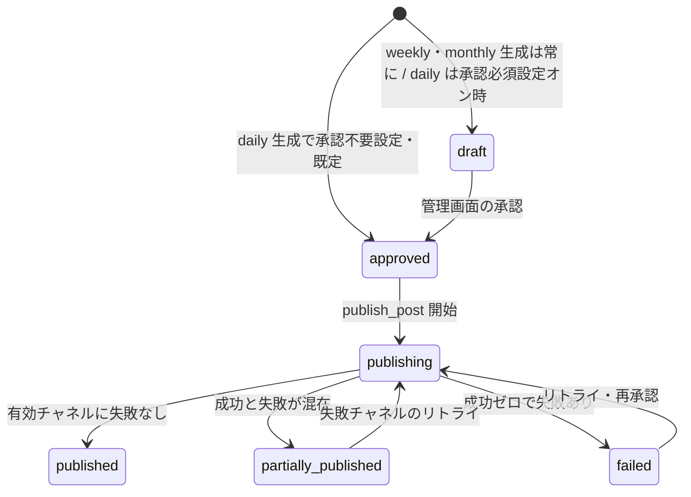
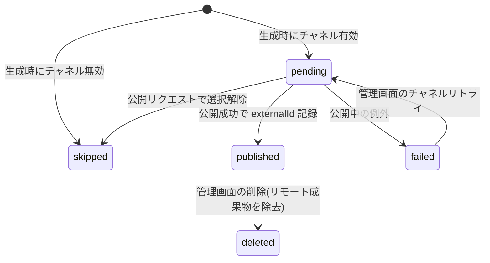

# 03. データモデル — Firestore コレクション仕様

> 対象コード時点: コミット 2c640f3 + 未コミット変更 / 最終更新: 2026-07-15(Research Chat の `chatThreads` / `chatThreads/{id}/messages` / `chatUsage` コレクションと、`posts` / `researchRuns` への chat 連携フィールド追加を反映)

## 1. この文書で分かること

- 本システムがデータベース(Firestore)に保存している全 8 コレクション・10 種類のドキュメントの構造と、それぞれを「どのコードが書き、どのコードが読むか」。
- ドキュメント ID の命名規約(URL ハッシュ・合成 ID など)と、それが pipeline と管理画面(admin)の間の「暗黙の内部 API」になっている理由。
- 投稿(post)とチャネル別公開状態の状態遷移、複合インデックスの用途、スキーマ変更時に同時に触るべきファイル一覧。

**前提用語**: Firestore は GCP のドキュメント型データベースで、「コレクション(テーブルに相当)」の中に「ドキュメント(1 レコードに相当、中身は JSON 風のフィールドの集まり)」が並ぶ。各ドキュメントは「ドキュメント ID(docID)」で一意に識別される。本システムのスキーマの「正」は `pipeline/app/models.py` の Pydantic モデル(Python でデータの型と初期値を宣言する仕組み)であり、admin 側の `admin/src/lib/types.ts` はその手書きミラーである(乖離は各節に注記)。全体像は `02-architecture.md`、数値の既定値一覧は `04-parameters.md` を参照。

## 2. コレクション一覧

| コレクション | docID 規約 | 主な書き手 | 主な読み手 | 一言説明 |
|---|---|---|---|---|
| `items` | 正規化 URL の SHA-256 先頭 32 文字 | collect ジョブ | 生成ジョブ | 収集した記事 1 件 = 1 ドキュメント |
| `posts` | 自動採番 | 生成ジョブ・公開処理・admin | admin・公開処理 | 生成された投稿とチャネル別の公開状態 |
| `runs` | 自動採番 | 各ジョブ(seed を除く) | admin | ジョブ実行 1 回の記録(統計・エラー・コスト) |
| `categories` | slug(例 `science-technology`) | seed・admin | 全ジョブ・admin | 収集・生成の単位となるカテゴリ |
| `sources` | 可読 ID(seed)/ `src-<ミリ秒時刻>`(admin 新規) | seed・admin・rss コレクタ | collect ジョブ・admin | 収集元(RSS / Gemini / IEEE)の定義 |
| `channelConfigs` | `{categoryId}_{format}_{channel}` | seed・admin | 生成ジョブ・admin | カテゴリ×フォーマット×チャネル単位の有効/言語設定 |
| `promptTemplates` | `{categoryId}_{format}` | seed・admin | 生成ジョブ・admin | 生成プロンプトのテンプレート |
| `settings`(doc `app`) | 固定名 `app` | seed・admin | 生成・公開処理・admin | 全体設定(短文の承認要否・画像添付など) |
| `settings`(doc `notion`) | 固定名 `notion` | seed・admin | Notion publisher・admin | 投稿先 Notion データベースの ID |
| `settings`(doc `channelHealth`) | 固定名 `channelHealth` | Threads トークン更新ジョブ | admin | Threads トークンの期限・エラー表示用 |
| `researchRuns` | `rr_{YYYYMMDD}_{ランダム6}` | research API・Research Harness | admin・Harness | レポート調査の状態・計画・予算・lease(§4.7 / doc 10) |
| `researchRuns/{id}/evidence` | `sha256(canonicalUrl)[:32]` | Harness extract | Harness・admin | 証拠メタ+スナップショット参照(EvidenceRecord。doc 10 §4.5) |
| `researchRuns/{id}/claims` | `{claimId}` | Harness verify | Harness・admin | 検証済み論点(裏取り/立場/信頼度。doc 10 §4.7) |
| `researchRuns/{id}/events` | 自動採番 | Harness 全フェーズ | admin | 追記専用の監査ログ(doc 10 §6.5) |
| `chatThreads` | `ct_{YYYYMMDD}_{ランダム6}` | chat API(グラフ) | admin・chat API | Research Chat の会話 1 本(タイトル・状態・累計コスト) |
| `chatThreads/{id}/messages` | 自動採番 | chat API(グラフ) | admin・chat API | 会話内の 1 メッセージ(ユーザー発言 or アシスタント応答) |
| `chatUsage` | 固定書式 `YYYY-MM`(UTC) | chat API(`repo/chat.py` の `add_usage()`) | admin(`getCostSummary()`) | チャットの月次コスト集計(ダッシュボードのコストカード用) |

> **研究系4コレクション(`researchRuns` とサブコレクション)は Research Agent(レポート)専用**で、pydantic 定義は `pipeline/app/research/schemas.py`、Firestore アクセスは `pipeline/app/repo/research.py`(本リポジトリ初のトランザクション lease を含む)。全フィールド表・JSON 例・docID 規約・状態機械は一次資料の [`05-detailed-design/10-research-agent.md`](05-detailed-design/10-research-agent.md) を参照。状態値 `researchRunStatuses`(queued / running / awaiting_plan_approval / awaiting_review / completed / failed / cancelled / budget_exhausted)は `shared/constants.json` にあり §7 の enum チェックリスト対象。複合インデックス `researchRuns(status ASC, createdAt ASC)`(§6 の #6)がキュー取得に必要。`trigger` は `manual` / `scheduled` に加え Research Chat からのレポート・ハンドオフを表す `chat` を取り得る(値そのものは既存の自由文字列フィールドで enum 化はされていない)。`trigger == "chat"` のときだけ `seedContext: {threadId, messageId, summary, sources[{url, title, snippet}]} | null` が設定され、plan フェーズが「検証すべき前提」として参照する(既存の裏取りを鵜呑みにはしない。doc 11 §5.6)。
>
> **チャット系3コレクション(`chatThreads` とサブコレクション `messages`、および `chatUsage`)は Research Chat 専用**で、pydantic 定義は `pipeline/app/chat/schemas.py`、Firestore アクセスは `pipeline/app/repo/chat.py`。全フィールド表・処理フロー・難所解説は一次資料の [`05-detailed-design/11-research-chat.md`](05-detailed-design/11-research-chat.md)(§4.4)を参照。`ChatThread`: `{title, requestedBy, status("active"|"archived"), cancelRequested, totals{messages, costUsd}, createdAt, updatedAt, lastMessageAt}`。`ChatMessage`: `{seq, role("user"|"assistant"), mode("chat"|"research"), depth("quick"|"deep"|null), content, status("streaming"|"complete"|"error"|"cancelled"), sources[{n,url,title,tier,score,connector}], usage{costUsd,promptTokens,completionTokens,model}|null, handoffs[{format,refId,at}], error, createdAt}`。**表示順は `createdAt` ではなく `seq`**(`repo/chat.py` の `append_message()` がトランザクションで `totals.messages` から採番): ユーザー発言とその応答が同一クロックティックに書かれ得るうえ、アシスタント側ドキュメントは本文確定前に先に作られるため。取得した本文(fetch した web ページのテキスト、コード上の呼称は「readings」)は**意図的に永続化しない**(design doc 11 §5.5)ため、メッセージ 1 件のサイズは 1MiB 上限から十分に余裕がある。`chatUsage/{YYYY-MM}` は `{costUsd, messages}` を `finish_message()` 完了ごとに `firestore.Increment` で加算し、月キーは UTC(admin の既存の月次コスト集計と合わせるため)。`chatThreads` のスレッド一覧は `status` の等価条件と `lastMessageAt` の並べ替えを組み合わせるため**複合インデックス #7 が必須**(§6 の実例を参照。当初「不要」と誤記して本番障害を出した)。`messages` の並べ替えは `seq` 単独なので自動の単一フィールドインデックスで足りる。

## 3. 各コレクション詳細

以下の表で使う書き手・読み手の略記と実体の対応:

| 略記 | 実体(コードファイル) |
|---|---|
| collect | `pipeline/app/jobs/collect.py`(書き込みは `pipeline/app/repo/items.py` 等の repo 層経由) |
| short 生成 | `pipeline/app/generators/short.py`(入口は `pipeline/app/jobs/generate_short.py`) |
| longform 生成 | `pipeline/app/generators/longform.py`(article 専用。入口は `pipeline/app/jobs/generate_article.py` → `longform_runner.py`。旧 monthly はレポート=Research Agent に置換、doc 10) |
| publish | `pipeline/app/publishers/base.py` の `publish_post()` と `_publish_*()` |
| api | `pipeline/app/main.py`(pipeline-api。詳細は `05-detailed-design/05-pipeline-api.md`) |
| token 更新 | `pipeline/app/jobs/refresh_threads_token.py` |
| seed | `pipeline/app/jobs/seed.py`(初期データ投入。詳細は `05-detailed-design/06-ops-jobs.md`) |
| admin 読 | `admin/src/lib/data.ts`(画面表示用の読み取り) |
| admin 書 | `admin/src/lib/actions.ts`(画面からの保存処理) |

共通の注意: repo 層は保存時に `model_dump(exclude={"id"})` を使うため、**`id` フィールドはドキュメント本体には保存されない**(docID そのものが ID)。読み出し時に `Item(id=d.id, ...)` のように docID から復元する。`categories` の `slug` も同様に本体には保存されない。

### items

出典クラス: `pipeline/app/models.py` の `Item`(画像参照は同 `ImageRef`)。docID は `pipeline/app/normalize.py` の `item_doc_id()` が生成する(第 4 章)。書き込みは `pipeline/app/repo/items.py` の `create_if_absent()` — Firestore の `create`(既存なら失敗する作成専用操作)を使い、同じ URL を二度収集しても 2 件にならない。admin は items を一切読み書きしない(`admin/src/lib/types.ts` に対応する型も無い)。

| フィールド | 型 | 意味 | 書き手 | 読み手 |
|---|---|---|---|---|
| `categoryId` | string | 属するカテゴリの slug | collect | daily/longform 生成、collect の重複判定 |
| `title` | string | 記事タイトル(原文) | collect | 生成(プロンプト素材) |
| `canonicalUrl` | string | 正規化済み URL(第 4 章) | collect | 生成(プロンプト素材) |
| `publishedAt` | timestamp / null | 記事側の発行日時 | collect | 現状参照するコードは無い |
| `collectedAt` | timestamp | 収集日時。時間窓クエリの軸 | collect | `recent_for_category()` / `title_hash_seen_since()` |
| `summary` | string | 収集元由来の要約(RSS・Gemini とも最大 2,000 字) | collect | 生成(プロンプト素材) |
| `contentText` | string | 記事ページから抽出した本文(最大 10,000 字。`collectors/enrich.py` の `MAX_CONTENT_CHARS`) | collect | longform 生成の第 2 段(最大 4,000 字使用)、summary 空時の代替 |
| `titleNormHash` | string | 正規化タイトルの SHA-256 先頭 16 文字 | collect | `title_hash_seen_since()`(7 日窓の近似重複判定) |
| `sourceId` | string | 収集元 `sources` の docID | collect | 参照コード無し(来歴トレース用) |
| `imageRefs` | array<{gcsPath, mime}> | og:image を GCS に保存した参照。パスは `items/{docID}/og.{拡張子}`、8MB 以下の jpeg/png/webp/gif のみ | collect | daily 生成(先頭画像を X/Threads 添付候補に採用) |
| `groundingCitations` | array<string> | Gemini グラウンディング検索の出典 URL(最大 20 件) | collect | 参照コード無し(来歴保存用) |
| `usedInPostIds` | array<string> | この item を使った post の docID | generate 系ジョブ(`items.mark_used()`、追記は ArrayUnion) | 参照コード無し |

具体例(`items/1f9a…`(32 文字の 16 進数)):

```json
{
  "categoryId": "science-technology",
  "title": "New chip fab announced in Kumamoto",
  "canonicalUrl": "https://arstechnica.com/tech/2026/07/new-chip-fab",
  "publishedAt": "2026-07-11T22:10:00Z",
  "collectedAt": "2026-07-12T02:00:41Z",
  "summary": "TSMC and partners announced ...",
  "contentText": "(記事本文の抽出テキスト、最大10,000字)",
  "titleNormHash": "9c2fa41b6d803e17",
  "sourceId": "scitech-arstechnica",
  "imageRefs": [{ "gcsPath": "items/1f9a…/og.jpeg", "mime": "image/jpeg" }],
  "groundingCitations": [],
  "usedInPostIds": ["(postのdocID)"]
}
```

### posts

出典クラス: `pipeline/app/models.py` の `Post`(入れ子に `ChannelState`・`TokenUsage`)。1 ドキュメント = 1 本の投稿(記事)で、X・Threads・Notion の 3 チャネル分の本文と公開状態を `channels` マップに内包する。書き込み経路が最も多いコレクション: 生成が `repo/posts.py` の `create()` で作り、公開処理が `set_status()` / `update_channel()` を細かく打ち、admin の下書き編集(`admin/src/lib/actions.ts` の `saveDraft()`)が `title` / `summary` / `body` / `channels.{x,threads}.text` をドット記法(マップ内の 1 フィールドだけを更新する書き方)で直接更新する。

| フィールド | 型 | 意味 | 書き手 | 読み手 |
|---|---|---|---|---|
| `format` | string | `short`(短文、旧 daily)/ `article`(記事、旧 weekly)/ `report`(レポート、旧 monthly) | 生成 | admin 読 |
| `categoryId` | string | カテゴリ slug | 生成 | admin 読、publish(カテゴリ表示名の解決) |
| `status` | string | 投稿全体の状態(第 5 章の遷移図参照) | 生成・api・publish | admin 読、api のガード |
| `title` | string | 記事タイトル(Notion ページ名にもなる) | 生成、admin 書 | publish、admin 読 |
| `summary` | string | 記事要約 | 生成、admin 書 | publish(body 空時の代替)、admin 読 |
| `body` | string | 記事本文(markdown)。Notion 公開時にブロックへ変換 | 生成、admin 書 | publish、admin 読 |
| `sourceItemIds` | array<string> | 元になった items の docID | 生成 | admin 読 |
| `tokenUsage` | map | LLM 使用量の実測 `{inputTokens, outputTokens, costUsd}` | 生成 | admin 読 |
| `channels` | map<string, ChannelState> | キーは `x` / `threads` / `notion`。下表参照 | 生成・publish・api・admin 書(text のみ) | publish、admin 読 |
| `createdAt` | timestamp | 作成日時(`posts.create()` が付与) | `repo/posts.py` | admin 読(一覧の並び順) |
| `approvedBy` | string | 承認者のメールアドレス(IAP 認証由来) | api(公開エンドポイント) | admin 読 |
| `publishedAt` | timestamp / null | 1 チャネル以上成功した時刻 | publish | pipeline のみ(**注: `types.ts` の `Post` には無い**) |
| `researchRunId` | string | **report のみ**。生成元の `researchRuns/{id}`(監査・再現性の逆参照) | Research Harness review(handoff) | admin 読 |
| `localizations` | map<lang, {title, summary, body, notionPageId?, url?}> | **report のみ**。ja/ko/en の言語別本文。言語別 Notion 3ページの ID/URL を公開時に格納(doc 10 §6.2) | Harness review(handoff)・publish | publish・admin 読 |
| `chatThreadId` / `chatMessageId` | string | この下書きが Research Chat のハンドオフ由来のときだけ設定される、元会話・元メッセージへの逆参照(`chatThreads/{chatThreadId}/messages/{chatMessageId}`)。既定は空文字(doc 11 §5.6) | 生成(chat ハンドオフ経由の short/article/report) | admin 読(トレース用) |

#### channels 内の ChannelState(重点解説)

出典クラス: `pipeline/app/models.py` の `ChannelState`。生成時に channelConfigs の設定を「その時点のスナップショット」として複製して作られるため、後から channelConfigs を変えても既存 post には影響しない。

| フィールド | 型 | 意味 | 書き手 | 読み手 |
|---|---|---|---|---|
| `enabled` | boolean | このチャネルに投稿するか。channelConfigs から複製。公開時の選択解除で false になる | 生成、api | publish(対象判定)、admin 読 |
| `lang` | string | 出力言語コード(`ja` / `ko` / `en`) | 生成 | admin 読 |
| `text` | string | チャネル向け本文。X・Threads はこれをそのまま投稿(長文は Notion URL を後置)。**notion の `text` は実質未使用**(公開処理は `post.body` を使う) | 生成、admin 書 | publish |
| `threadParts` | array<string> | X のスレッド分割(short で 2 分割以上になったときのみ非空) | short 生成 | publish(`x.publish()` の thread_parts) |
| `status` | string | チャネル単位の状態(第 5 章) | 生成・publish・api | publish の冪等判定、admin 読 |
| `externalId` | string | 公開先が発行した ID。X=ツイート ID、Threads=公開メディア ID、Notion=ページ ID。**非空なら再公開しない冪等キー**(冪等 = 同じ操作を繰り返しても結果が 1 回分になる性質) | publish | publish、admin 読 |
| `url` | string | 公開 URL。X は `https://x.com/i/status/{externalId}` を組み立て、Notion は API が返す URL。**Threads には現状セットされない** | publish | publish(Notion URL をティーザーへ転記)、admin 読 |
| `error` | string | 直近の失敗理由(先頭 1,000 字に切り詰め) | publish(失敗時)、api(リトライ時にクリア) | admin 読 |
| `imageGcsPath` | string | X/Threads 添付画像の GCS パス(short 生成のみ設定) | short 生成 | publish(X はバイト列添付、Threads は署名 URL) |
| `containerId` | string | **Threads 専用**。Threads は「コンテナ作成 → 公開」の 2 段階 API で、その中間 ID。作成直後に `posts.update_channel()` で永続化するため、公開前にクラッシュしてもリトライ時に同じコンテナを再利用でき、二重投稿にならない | publish | publish(再開時) |
| `pageId` | string | **Notion 専用**。ページ ID(`externalId` と同値が入る) | publish | 参照コード無し(表示・トレース用) |

具体例(`posts/(自動採番ID)`、short が全チャネル成功した状態。一部フィールドは省略):

```json
{
  "format": "short",
  "categoryId": "science-technology",
  "status": "published",
  "title": "Science & Technology — 2026-07-12",
  "summary": "(Notion向けダイジェスト)",
  "body": "(markdown本文)",
  "sourceItemIds": ["1f9a…", "…"],
  "tokenUsage": { "inputTokens": 5200, "outputTokens": 810, "costUsd": 0.0041 },
  "channels": {
    "x": { "enabled": true, "lang": "ja", "text": "(日本語の投稿文)", "threadParts": [],
           "status": "published", "externalId": "19460001…",
           "url": "https://x.com/i/status/19460001…", "error": "",
           "imageGcsPath": "items/1f9a…/og.jpeg", "containerId": "", "pageId": "" },
    "threads": { "enabled": true, "lang": "ko", "text": "(韓国語の投稿文)",
                 "status": "published", "externalId": "17980002…", "url": "",
                 "containerId": "17970003…", "imageGcsPath": "items/1f9a…/og.jpeg" },
    "notion": { "enabled": true, "lang": "en", "text": "(英語ダイジェスト)",
                "status": "published", "externalId": "230f…", "pageId": "230f…",
                "url": "https://www.notion.so/…" }
  },
  "createdAt": "2026-07-12T08:00:21Z",
  "approvedBy": "",
  "publishedAt": "2026-07-12T08:01:05Z"
}
```

### runs

出典クラス: `pipeline/app/models.py` の `Run`(統計は同 `RunStats`)。ジョブ実行 1 回につき 1 ドキュメント。`pipeline/app/repo/runs.py` の `start()` が開始時に作成し、`finish()` が終了時に統計・エラー・コストを上書きする。admin ダッシュボード(`admin/src/app/[locale]/page.tsx`)が直近実行一覧と当月コスト合計の材料にする。

| フィールド | 型 | 意味 | 書き手 | 読み手 |
|---|---|---|---|---|
| `jobType` | string | `collect` / `generate_short` / `generate_article` / `refresh_threads_token`(旧 run 文書には `generate_daily` / `generate_weekly` / `generate_monthly` が履歴として残る。admin 集計は `startsWith('generate')` で新旧両対応) | 各ジョブ | admin 読 |
| `startedAt` / `finishedAt` | timestamp | 開始・終了時刻 | `repo/runs.py` | admin 読(並び順・当月集計の絞り込み) |
| `ok` | boolean | `errors` が空なら true | 各ジョブ | admin 読 |
| `stats` | map | `{collected, deduped, postsCreated, published, failed}` | 各ジョブ | admin 読 |
| `errors` | array<string> | 発生したエラー文字列の蓄積 | 各ジョブ | admin 読 |
| `costUsd` | number | その実行の LLM コスト概算(USD) | generate 系ジョブ | admin 読(`getMonthCostUsd()`) |

注意: `shared/constants.json` の `jobTypes` には `seed` も含まれる(admin の「今すぐ実行」ボタンと pipeline-api の `JOB_MODULES` 用)が、**seed ジョブ自身は runs を書かない**ため、`jobType == "seed"` の runs ドキュメントは現状発生しない。また `types.ts` の `Run.stats` は `Record<string, number>` と緩い型で、`RunStats` の 6 フィールド(`collected` / `deduped` / `postsCreated` / `published` / `failed` / `deleted`。`deleted` は cleanup_drafts が削除件数を入れる)を明示していない。

具体例: `{ "jobType": "collect", "startedAt": "2026-07-11T21:00:02Z", "finishedAt": "2026-07-11T21:03:40Z", "ok": true, "stats": { "collected": 42, "deduped": 17, "postsCreated": 0, "published": 0, "failed": 0 }, "errors": [], "costUsd": 0 }`

### categories

出典クラス: `pipeline/app/models.py` の `Category`。docID = `slug`(URL 風の小文字ハイフン区切り識別子)で、seed は `business-economics` / `science-technology` / `geopolitics-history` の 3 件を投入する。pipeline 側の読み取りは `pipeline/app/repo/configs.py` の `enabled_categories()` のみで、`enabled == true` を `sortOrder` 順に返す — collect・生成の処理単位はすべてこれ。

| フィールド | 型 | 意味 | 書き手 | 読み手 |
|---|---|---|---|---|
| `name` | string | 表示名(例 "Science & Technology") | seed、admin 書 | 生成(プロンプトの `{category}`)、publish(Notion の Category プロパティ)、admin 読 |
| `searchHints` | array<string> | 検索のヒント語。**現状 pipeline のどのコードも読まない**(Gemini 収集は `sources.query` を使う)。admin での表示・編集のみ | seed、admin 書 | admin 読のみ |
| `enabled` | boolean | 無効カテゴリは collect・生成の対象外 | seed、admin 書 | `enabled_categories()` |
| `sortOrder` | number | 処理・表示順 | seed、admin 書 | `enabled_categories()`(ソート)、admin 読 |

具体例(`categories/science-technology`): `{ "name": "Science & Technology", "searchHints": ["AI", "semiconductors", "space", "biotech", "breakthrough research"], "enabled": true, "sortOrder": 1 }`

### sources

出典クラス: `pipeline/app/models.py` の `Source`。収集元 1 つ = 1 ドキュメント。docID は seed では人間可読な ID(例 `bizecon-gemini`、`scitech-arstechnica`)、admin から新規作成時に ID 欄を空にすると `src-${Date.now()}`(ミリ秒時刻)が自動で振られる(`admin/src/lib/actions.ts` の `saveSource()`)。seed は 10 件を投入し、うち `scitech-arxiv-csai`(arXiv は Atom 形式なので `rss` タイプで処理)と `scitech-ieee` の 2 件は `enabled: false` で寝かせてある。

| フィールド | 型 | 意味 | 書き手 | 読み手 |
|---|---|---|---|---|
| `categoryId` | string | 属するカテゴリの slug | seed、admin 書 | `enabled_sources()` |
| `type` | string | `rss` / `gemini_grounded` / `ieee_xplore`。collect がコレクタ実装を選ぶキー | seed、admin 書 | collect |
| `url` | string | `rss` 用のフィード URL(他タイプでは空) | seed、admin 書 | rss コレクタ |
| `query` | string | `gemini_grounded` / `ieee_xplore` 用の検索クエリ(rss では空) | seed、admin 書 | 各コレクタ |
| `enabled` | boolean | 収集対象か | seed、admin 書 | `enabled_sources()` |
| `etag` / `lastModified` | string | HTTP 条件付き GET(前回から変化がなければ 304 で本文を省く仕組み)のキャッシュ値 | rss コレクタ(`configs.update_source_cache()`)、seed・admin 書(空文字で初期化) | rss コレクタ |
| `lastFetchedAt` | timestamp | 最終取得時刻 | rss コレクタ | admin 読 |

注意: `types.ts` の `Source` には `etag` / `lastModified` が無い(admin は表示しないため。保存時は `actions.ts` が空文字で上書き初期化する)。

具体例(`sources/scitech-arstechnica`): `{ "categoryId": "science-technology", "type": "rss", "url": "https://feeds.arstechnica.com/arstechnica/index", "query": "", "enabled": true, "etag": "W/\"abc\"", "lastModified": "Fri, 11 Jul 2026 20:55:00 GMT", "lastFetchedAt": "2026-07-11T21:00:05Z" }`

### channelConfigs

出典クラス: `pipeline/app/models.py` の `ChannelConfig`。docID = `{categoryId}_{format}_{channel}`(例 `science-technology_short_x`)。seed は 3 カテゴリ × 3 フォーマット × 3 チャネル = 27 件を、既定言語 x=`ja` / threads=`ko` / notion=`en`(`seed.py` の `CHANNEL_LANGUAGES`)で投入する。生成ジョブは投稿を作る瞬間にこれを読み、`ChannelState` の `enabled` / `lang` に複製する。

| フィールド | 型 | 意味 | 書き手 | 読み手 |
|---|---|---|---|---|
| `categoryId` / `format` / `channel` | string | docID の 3 要素と同じ値(検索できるよう本体にも重複保存) | seed、admin 書 | admin 読(一覧) |
| `enabled` | boolean | この組み合わせで投稿するか | seed、admin 書 | short/longform 生成(`configs.channel_config()`) |
| `language` | string | 出力言語(`ja` / `ko` / `en`) | seed、admin 書 | short/longform 生成(プロンプトの言語指定に変換) |

重要な仕様: ドキュメントが存在しない場合、`pipeline/app/repo/configs.py` の `channel_config()` は **`enabled=False, language="en"` のフォールバック値を返す**。つまり「設定が無い組み合わせ = 投稿しない」であり、新カテゴリを追加したら channelConfigs も作らないとどのチャネルにも流れない。

具体例(`channelConfigs/science-technology_short_x`): `{ "categoryId": "science-technology", "format": "short", "channel": "x", "enabled": true, "language": "ja" }`

### promptTemplates

出典クラス: `pipeline/app/models.py` の `PromptTemplate`。docID = `{categoryId}_{format}`(例 `science-technology_article`)。seed が `pipeline/app/generators/prompts.py` の `DEFAULTS` から 3 カテゴリ × 3 フォーマット = 9 件を投入する。`enabled=false` にすると `configs.prompt_template()` が None を返し、そのカテゴリ×フォーマットの生成はスキップされる(生成の詳細は `05-detailed-design/03-generate.md`)。

| フィールド | 型 | 意味 | 書き手 | 読み手 |
|---|---|---|---|---|
| `categoryId` / `format` | string | docID の 2 要素と同じ値 | seed、admin 書 | admin 読 |
| `systemPrompt` | string | LLM への役割指示(short は投稿文、article/report は本記事の執筆用) | seed、admin 書 | 生成 |
| `userPromptTemplate` | string | 本文生成プロンプト。プレースホルダは `{items}` `{category}` `{date}` `{language}` `{keywords}`(short はさらに `{x_language}` `{threads_language}` `{notion_language}`、article/report の第 2 段は `{theme}` `{outline}` `{x_language}` `{threads_language}`) | seed、admin 書 | 生成 |
| `outlineSystemPrompt` / `outlineUserPromptTemplate` | string | article/report の 2 段階生成の第 1 段(記事の選定と骨子作り)用。short では空 | seed、admin 書 | longform 生成 |
| `modelOverride` | string | 空でなければ既定モデル名(`config.py`)を上書き | seed(空)、admin 書 | 生成 |
| `focusKeywords` | string[] | このカテゴリ×フォーマットで重視するキーワード。**収集**(同カテゴリの全フォーマット分の和集合で Gemini Web 検索を方向づけ。`configs.category_focus_keywords()`)と**生成**(プロンプトに焦点指示を付加。`prompts.apply_keywords()`)の両方で効く。空 = 従来どおり。'重視'ポリシー(キーワード以外の重要ニュースも拾う) | seed(空)、admin 書 | 収集・生成 |
| `customInstructions` | string | オーナーの自由記述の常設リクエスト(ko/ja/en どれで書いてもよい)。`configs.custom_instructions()` が読み、`prompts.custom_instructions_block()` が OWNER INSTRUCTIONS ブロックとして生成プロンプト末尾に付加する(short / article の2段階 / report の write)。**出力言語は変えない**(言語指定は channelConfigs が優先)。テンプレートの `enabled` フラグとは独立に読まれる | seed(空)、admin 書(`/focus` の `saveFocus()`) | 生成(short・article・report write) |
| `enabled` | boolean | false なら生成スキップ | seed、admin 書 | `prompt_template()` |

具体例(`promptTemplates/science-technology_short`、プロンプト本文は省略): `{ "categoryId": "science-technology", "format": "short", "systemPrompt": "You are a sharp, trustworthy news curator…", "userPromptTemplate": "Today is {date}. Category: {category}…", "outlineSystemPrompt": "", "outlineUserPromptTemplate": "", "modelOverride": "", "focusKeywords": [], "customInstructions": "", "enabled": true }`

### settings

`settings` コレクションは固定名の 3 ドキュメントを持つ。それぞれ役割がまったく異なるので個別に説明する。

**`settings/app`** — 出典クラス: `pipeline/app/models.py` の `AppSettings`。システム全体の動作フラグ。seed が既定値で作成し、admin の設定ページ(`saveAppSettings()`)が更新、pipeline は `configs.app_settings()` で毎回読む(ドキュメントが無ければモデルの既定値)。

| フィールド | 型 | 意味 | 書き手 | 読み手 |
|---|---|---|---|---|
| `timezone` | string | 表示用タイムゾーン(既定 `Asia/Tokyo`)。**pipeline は読まない**(実際のスケジュールは Cloud Scheduler 側の設定) | seed、admin 書 | admin 読のみ |
| `shortRequireApproval` | boolean | true なら短文も `draft`(下書き)で止める安全弁(既定 false = 自動投稿) | seed、admin 書 | short 生成(初期 status の分岐) |
| `xAllowUrlOnShort` | boolean | 短文の X 投稿にも Notion URL を付けるか(既定 false。X は URL 付きだとリーチが下がる想定の運用判断) | seed、admin 書 | publish(`_publish_x()`) |
| `attachImages` | boolean | X/Threads への画像添付を行うか(既定 true) | seed、admin 書 | short 生成(画像選択)、publish(`_load_image()` / 署名 URL 発行) |
| `globalChannels` | map<string, bool> | チャネル全体のキルスイッチ `{x, threads, notion}`(既定 `{x: false, threads: false, notion: true}`)。**生成時に channelConfigs の `enabled` と AND** される(`configs.channel_config()` が false のチャネルを強制無効化)。カテゴリ別設定を書き換えずに全カテゴリ一括でチャネルを止められる。ダッシュボードの自動化グリッドには true のチャネル列だけが表示される | seed、admin 書(設定ページ) | `configs.channel_config()`、admin 読 |

**`settings/notion`** — 対応する Pydantic モデルは無く、`{ "databaseId": string }` だけの素のドキュメント。Notion publisher(`pipeline/app/publishers/notion.py` の `publish()`)が `configs.notion_database_id()` で読み、**空のままだと Notion 公開は RuntimeError で失敗する**(初期セットアップ後に admin の設定ページで入力する運用。手順は `docs/setup-credentials.md`)。

**`settings/channelHealth`** — チャネルの健全性表示用。**Python 側にモデルが無い**(素の dict を `configs.update_channel_health()` が merge 書き込み)。型定義は TS 側の `ChannelHealth`(`admin/src/lib/types.ts`)のみ、という逆転構造なので注意。書き手は token 更新ジョブ、読み手は admin ダッシュボードだけ。

| フィールド | 型 | 意味 | 書き手 | 読み手 |
|---|---|---|---|---|
| `threadsLastRefreshAt` | timestamp | Threads トークンを最後に更新した時刻 | token 更新 | admin 読 |
| `threadsTokenExpiresAt` | timestamp | 現トークンの失効予定時刻(ダッシュボードのカウントダウン表示用) | token 更新 | admin 読 |
| `threadsRefreshError` | string | 直近の更新エラー(先頭 500 字。成功時は空文字にリセット) | token 更新 | admin 読 |

具体例(`settings/channelHealth`): `{ "threadsLastRefreshAt": "2026-07-06T18:00:03Z", "threadsTokenExpiresAt": "2026-09-04T18:00:03Z", "threadsRefreshError": "" }`

## 4. ドキュメント ID 規約

| コレクション | 規約 | 生成コード |
|---|---|---|
| `items` | 正規化 URL の SHA-256 ハッシュ(元データから固定長の値を作る一方向関数)の 16 進表現 64 文字のうち**先頭 32 文字** | `pipeline/app/normalize.py` の `item_doc_id()` |
| `posts` / `runs` | Firestore の自動採番(`.add()` が生成するランダム ID) | `repo/posts.py` の `create()` / `repo/runs.py` の `start()` |
| `categories` | slug をそのまま docID に | `jobs/seed.py`、admin の `saveCategory()` |
| `sources` | 人間が付ける可読 ID。admin で ID 欄を空にすると `src-<ミリ秒時刻>` | `jobs/seed.py`、admin の `saveSource()` |
| `promptTemplates` | `{categoryId}_{format}` | 下記参照 |
| `channelConfigs` | `{categoryId}_{format}_{channel}` | 下記参照 |
| `settings` | 固定名 `app` / `notion` / `channelHealth` | `jobs/seed.py` |
| `chatThreads` | `ct_{YYYYMMDD}_{ランダム6}`(`researchRuns` の `rr_{YYYYMMDD}_{ランダム6}` と同じ書式) | `repo/chat.py` の `new_thread_id()` |
| `chatThreads/{id}/messages` | Firestore の自動採番。並び順は docID ではなく `seq`(§2 参照) | `repo/chat.py` の `append_message()` |

items の URL 正規化(`canonicalize_url()`)は、小文字化・`www.` 除去・追跡用クエリパラメータ(`utm_*` や `fbclid` など)の除去・パラメータのソート・末尾スラッシュ除去を行う。これにより「同じ記事の少し違う URL」が同じ docID に落ち、`create_if_absent()` の作成専用書き込みと合わせて **URL 単位の完全重複排除**が成立する(収集の詳細は `05-detailed-design/02-collect.md`)。

### 合成 ID は「暗黙の内部 API」

`promptTemplates` と `channelConfigs` の docID は、pipeline と admin が**それぞれ独立に同じ文字列組み立て規則を実装する**ことで一致させている。つまりこの規約は、どこにも型として宣言されていないのに双方が依存する「暗黙の内部 API」である。片方だけ変えると、エラーにならずに「設定が見つからない → フォールバック値で動く」形で静かに壊れる(channelConfigs の場合は該当チャネルが投稿されなくなる)ため、変更時は以下の全箇所を同時に直すこと。

依存箇所(Grep で確認済みの全リスト):

- pipeline 側
  - `pipeline/app/repo/configs.py` の `prompt_template()`(`f"{category_id}_{post_format.value}"`)と `channel_config()`(`f"{category_id}_{post_format.value}_{channel.value}"`)
  - `pipeline/app/jobs/seed.py`(初期投入時に同じ規則で docID を組み立てる)
  - `pipeline/scripts/migrate_cadence_to_format.py`(旧 `{cat}_{cadence}` → `{cat}_{format}` の docID リネームを末尾トークンから分解して行う)
- admin 側
  - `admin/src/app/[locale]/channels/page.tsx`(`` `${cat.slug}_${fmt}_${channel}` `` を組み立てて `saveChannelConfig()` に渡す)
  - `admin/src/app/[locale]/prompts/page.tsx`(`` `${cat.slug}_${fmt}` `` を組み立てて編集ページへのリンクにする)
  - `admin/src/app/[locale]/prompts/[id]/page.tsx`(**逆方向の依存**: URL 中の docID を最後の `_` で分解して categoryId と format を復元する)

なお最後の「分解」は `id.lastIndexOf('_')`(移行スクリプトは末尾からの `rsplit`)を使うため、カテゴリ slug にアンダースコアが混ざっても壊れはしないが、format 側に `_` を含む値を追加すると壊れる。カテゴリ slug はハイフン区切り(seed の 3 件はすべてそう)を守るのが安全である。

## 5. 状態遷移

### (a) posts.status

`PostStatus`(`pipeline/app/models.py`)の 6 値: `draft`(下書き)/ `approved`(承認済み)/ `publishing`(公開処理中)/ `published`(公開済み)/ `partially_published`(一部公開)/ `failed`(失敗)。



図の読み方: 投稿の入口は 2 つある。article(と後続のレポート)は必ず `draft` で作られ、admin での承認を待つ。short は `settings/app` の `shortRequireApproval` が false(既定)なら最初から `approved` で作られ、`generate_short` ジョブがそのまま `publish_post()` を呼ぶ — これが「短文は自動投稿」の実体である。同フラグが true のときだけ short も `draft` で止まり、article と同じ承認フローに乗る。終端は 3 種類で、公開後に失敗チャネルだけをやり直すと再び `publishing` を経由する。

| 遷移 | トリガー | 実行コード |
|---|---|---|
| (生成) → `draft` | article の生成。short は `shortRequireApproval=true` のときのみ | `generators/longform.py` / `generators/short.py` の `generate_for_category()`(保存は `repo/posts.py` の `create()`) |
| (生成) → `approved` | short の生成(承認不要設定・既定) | `generators/short.py` の `generate_for_category()` |
| `draft` → `approved` | admin の承認ボタン → pipeline-api 呼び出し(`approvedBy` に IAP のメールを記録) | `pipeline/app/main.py` の `publish()`(`posts.update_fields()`) |
| `approved` → `publishing` | 公開処理の開始 | `pipeline/app/publishers/base.py` の `publish_post()` |
| `publishing` → `published` | 有効チャネルに `failed` が 1 つも無い | `publish_post()` 末尾の集計 |
| `publishing` → `partially_published` | `published` と `failed` が混在 | 同上 |
| `publishing` → `failed` | `failed` があり `published` がゼロ | 同上 |
| `failed` / `partially_published` → `publishing` | admin のチャネル単位リトライ(`approved` を経由しない) | `pipeline/app/main.py` の `retry_channel()` → `publish_post()` |
| `failed` / `partially_published` → `approved` → `publishing` | admin から公開全体をやり直した場合 | `pipeline/app/main.py` の `publish()` |

補足 2 点。(1) api の `publish()` が拒否(HTTP 409)するのは `published` と `publishing` のみで、`failed` 等からの再実行は許容される — 二重投稿は post の状態ではなく各チャネルの `externalId` 冪等キーで防ぐ設計(`05-detailed-design/04-publish.md`)。(2) まれなケースとして、有効チャネルの結果がすべて `skipped` だと集計上は「失敗なし」なので `published` になる(`publishedAt` は null のまま)。

### (b) ChannelState.status

`ChannelStatus`(`pipeline/app/models.py`)の 5 値: `pending`(公開待ち)/ `published` / `failed` / `skipped`(対象外)/ `deleted`(リモート削除済み)。



図の読み方: チャネル状態は投稿(post)全体の状態とは独立に、チャネルごとに進む。生成時に channelConfigs で無効だったチャネルは最初から `skipped`。admin の公開画面でチェックを外したチャネルも公開直前に `skipped`(かつ `enabled=false`)へ落とされる。`publish_post()` は `published` / `skipped`、または `externalId` が既に入っているチャネルを飛ばすため、途中クラッシュ後の再実行でも成功済みチャネルへ再投稿しない。`skipped` と `published` から戻る遷移は存在しない(リトライできるのは `failed` のみ)。`deleted` は admin の削除操作(pipeline-api の `POST /api/posts/{id}/delete` → `publishers/base.py` の `delete_post_channels()`)がリモート成果物(X ツイート・Threads メディア・Notion ページ)を削除した終端状態で、`enabled=false` も同時にセットされ再公開はされない([05-detailed-design/04-publish.md](05-detailed-design/04-publish.md) 参照)。

| 遷移 | トリガー | 実行コード |
|---|---|---|
| (生成) → `pending` | channelConfigs でそのチャネルが有効 | `generators/daily.py` / `generators/longform.py` の `generate_for_category()` |
| (生成) → `skipped` | channelConfigs でそのチャネルが無効 | 同上 |
| `pending` → `skipped` | 公開リクエストの `channels` に含めなかったチャネル(`enabled=false` も同時に設定) | `pipeline/app/main.py` の `publish()` |
| `pending` → `published` | notion → x → threads の順の公開が成功し `externalId` を記録 | `publishers/base.py` の `_publish_notion()` / `_publish_x()` / `_publish_threads()` |
| `pending` → `failed` | 公開中の例外(`error` に先頭 1,000 字を保存) | `publishers/base.py` の `publish_post()` の except 節 |
| `failed` → `pending` | admin のチャネルリトライ(`error` をクリアしてから単一チャネルで `publish_post()`) | `pipeline/app/main.py` の `retry_channel()` |
| `published` → `deleted` | admin の削除操作(リモート成果物の削除に成功。`enabled=false` も同時設定) | `pipeline/app/main.py` の `delete_post()` → `publishers/base.py` の `delete_post_channels()` |

## 6. 複合インデックス

Firestore では「複数フィールドを組み合わせた絞り込み+並べ替え」に複合インデックス(検索を高速化するための事前の並び順定義)が必要で、無いとクエリ自体がエラーになる。定義は `infra/firestore.indexes.json` に 7 件(デプロイ手順は `05-detailed-design/08-infra.md`)。各定義と、それを必要とするクエリの対応:

| # | コレクション | フィールド構成 | 対応するクエリ | 用途 |
|---|---|---|---|---|
| 1 | `items` | `categoryId` ASC, `collectedAt` DESC | `pipeline/app/repo/items.py` の `recent_for_category()` | 生成の元ネタ取得(short=36 時間窓・最大 15 件、article=7 日窓・最大 120 件) |
| 2 | `items` | `categoryId` ASC, `titleNormHash` ASC, `collectedAt` DESC | `pipeline/app/repo/items.py` の `title_hash_seen_since()` | 収集時の 7 日窓タイトル近似重複判定 |
| 3 | `posts` | `status` ASC, `createdAt` DESC | `admin/src/lib/data.ts` の `getDrafts()` | admin の下書き一覧(`status=='draft'` を新しい順に 30 件) |
| 4 | `posts` | `format` ASC, `createdAt` DESC | (現状クエリ無し) | フォーマット別絞り込みの将来用(旧 `cadence` 索引を移行時に置換。旧 `recent_by_cadence()` は削除済み) |
| 5 | `sources` | `categoryId` ASC, `enabled` ASC | `pipeline/app/repo/configs.py` の `enabled_sources()` | collect のカテゴリ別有効ソース取得 |
| 6 | `researchRuns` | `status` ASC, `createdAt` ASC | Research Agent のキュー取得(doc 10、後続フェーズ) | queued/running の run を古い順に lease |
| 7 | `chatThreads` | `status` ASC, `lastMessageAt` DESC | `admin/src/lib/data.ts` の `getChatThreads()`(および `pipeline/app/repo/chat.py` の `list_threads()`) | チャットのスレッド一覧(`status=='active'` を最終発言の新しい順に 30 件) |

このほかのクエリ(admin の `getRecentPosts()` / `getRecentRuns()` / `getMonthCostUsd()` / `getChatMessages()`、`repo/items.py` の `recent_all()` など)は単一フィールドの絞り込み・並べ替えだけなので、Firestore が自動で持つ単一フィールドインデックスで足り、定義は不要(`recent_all()` は `collectedAt` の範囲条件と並べ替えが**同一フィールド**なので複合にならない)。**逆に言うと、repo 層や `data.ts` に「等価条件+別フィールドの範囲/並べ替え」を組み合わせた新しいクエリを書いたら、この JSON への追記とデプロイが必須**である。

> **実例(2026-07-15)**: #7 はこの規則を見落として本番で踏んだ。`getChatThreads()` は `where(status=='active')` + `orderBy(lastMessageAt desc)` = まさに「等価条件+別フィールドの並べ替え」だったが、計画書の「インデックス追加不要」を検証せずに実装したため、`/chat` を開くたびに `9 FAILED_PRECONDITION: The query requires an index`(admin 側は "Application error: a server-side exception has occurred")で 500 になった。**コレクションが空でも発生する**(データ量ではなくクエリ形状で決まる)ので、ローカルの単体テスト(Firestore をモックする)では絶対に検知できない。新しいクエリを足したら、まずこの表に照らすこと。

## 7. 変更するときは

スキーマは複数ファイルに手書きで複製されており、自動同期は admin の prebuild コピー 1 箇所しかない。変更の種類ごとに、同時に触るべき場所:

| 変更の種類 | 同時に触るファイル |
|---|---|
| enum 値の追加・変更(format / channel / status / sourceType / jobType / language) | `shared/constants.json`(唯一のソース)→ `pipeline/app/models.py` の対応 Enum(**手書きミラー**。pipeline は実行時に constants.json を読まない)→ admin 再ビルド(prebuild の `node scripts/sync-constants.mjs` が `admin/src/lib/shared-constants.json` へコピー)→ 本文書 |
| `posts` / `items` 等へのフィールド追加 | `pipeline/app/models.py` → `admin/src/lib/types.ts` + `admin/src/lib/data.ts` のマッパー(`mapPost()` などは明示列挙式なので追記漏れに注意)→ 表示するなら admin の該当ページ → 本文書 |
| 設定値(`settings/app`)の追加 | `pipeline/app/models.py` の `AppSettings` → `pipeline/app/jobs/seed.py` の初期値 → `types.ts` の `AppSettingsDoc` → `data.ts` の `getAppSettings()` → `actions.ts` の `saveAppSettings()` → `admin/src/app/[locale]/settings/page.tsx` → 本文書と `04-parameters.md` |
| 初期データ(カテゴリ・ソース・テンプレート)の変更 | `pipeline/app/jobs/seed.py`(および `generators/prompts.py` の `DEFAULTS`)。**seed は create-only(既存ドキュメントは触らない)**なので、稼働中の環境には効かない — 既存データは admin から編集するか手動移行が必要 |
| 新しい複合クエリの追加 | `infra/firestore.indexes.json` に追記してデプロイ → 本文書の第 6 章 |
| 合成 docID 規約の変更 | 第 4 章の依存箇所リスト全部(`repo/configs.py` / `jobs/seed.py` / admin の channels・prompts 3 ページ)+ 既存ドキュメントの移行 |

現時点で確認済みの pipeline / admin 間の型乖離(いずれも実害はないが、フィールド追加時に混乱しやすいので列挙):

- `types.ts` の `Post` に `publishedAt` が無い(admin は表示しない)。
- `types.ts` の `Source` に `etag` / `lastModified` が無い(かつ `saveSource()` は両者を空文字で上書きするため、admin でソースを保存し直すと条件付き GET キャッシュはリセットされる)。
- `Item` に対応する TS 型が存在しない(admin は items を読まない)。
- `Run.stats` は TS では `Record<string, number>` と非明示。
- `ChannelHealth` は TS のみに型があり、Python 側にモデルが無い(書き手が `refresh_threads_token.py` の素の dict)。

また、`categories.searchHints` と `settings/app.timezone` は「書けるが pipeline は読まない」フィールドである(前者は Gemini 検索が `sources.query` を使うため、後者はスケジュールが Cloud Scheduler 管理のため)。将来これらを使う実装を入れるか、削るかはこの文書の更新とセットで判断すること。
