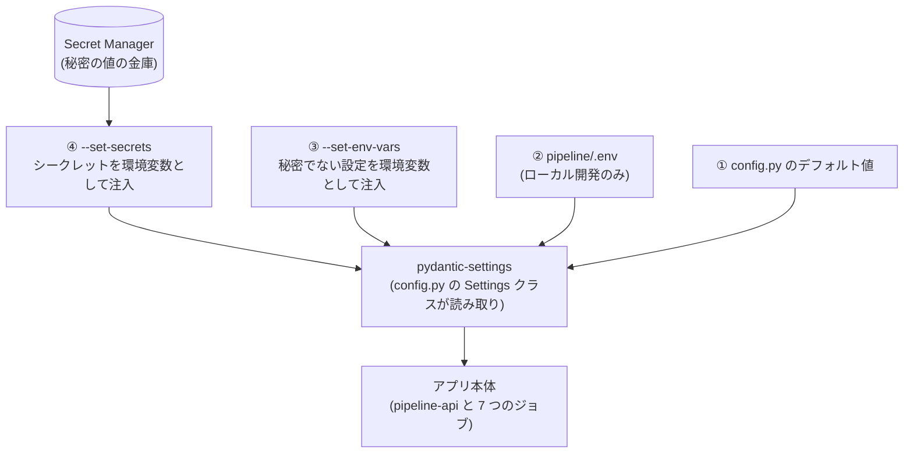

# 04. パラメーターシート — 設定値の一覧

> 対象コード時点: コミット f192157 + 未コミット変更(M2: 並列 fan-out — max_concurrency=4・generate-report 2Gi/2cpu / M1: LangGraph の 2 設定 / M0-a: LangSmith / Research Chat: `chat_*`)/ 最終更新: 2026-07-15

この文書は trend-news-generator が「いま、どういう設定値で動いているか」の一覧の**正**(基準表)である。値の意味・定義場所・変更時に触る場所だけを扱い、作業手順そのものは扱わない。

- 認証情報(API キーなど)の発行手順 → [setup-credentials](../setup-credentials.md)
- 障害対応(投稿失敗・トークン失効など) → [runbook](../runbook.md)
- Firestore のデータ構造 → [03-data-model.md](03-data-model.md)
- 公開処理の詳細設計 → [05-detailed-design/04-publish.md](05-detailed-design/04-publish.md)

この文書で分かること:

1. 設定がどの層(コード・ファイル・Cloud Run・Secret Manager)にあり、どれが勝つのか(§1)
2. アプリ設定の全項目と本番での注入元(§2)
3. シークレット(秘密の値)の一覧とローテーション(§3)
4. Cloud Run のサービス・ジョブのリソース設定と再試行方針(§4)
5. 定期実行のスケジュール(§5)
6. 権限(IAM)の全付与内容(§6)
7. 再デプロイなしで変えられる運用フラグ(§7)
8. コードに直書きされた定数(§8)
9. 「これを変えたいときはどこを触るか」の対応表(§9)

## 1. 設定の4層構造 — なぜ同じ値が複数の場所にあるのか

**環境変数**とは、プログラムの外側から渡す「名前=値」形式の設定のこと。本システムの設定値は次の4つの層のどれかにあり、番号が大きい層ほど優先される。

| 層 | 置き場所 | 効く環境 | 例 |
|---|---|---|---|
| ① デフォルト値 | `pipeline/app/config.py` の `Settings` クラス | 全環境(何も設定しないときの最後の砦) | `gemini_model = "gemini-3.5-flash"` |
| ② `.env` ファイル | `pipeline/.env`(各自の手元にだけ置く。ひな形は `pipeline/.env.example`) | ローカル開発のみ | `OPENAI_API_KEY=sk-...` |
| ③ Cloud Run の環境変数 | `infra/10-deploy-pipeline.sh` などの `--set-env-vars` フラグ | 本番 | `PROJECT_ID=trend-news-generator` |
| ④ Secret Manager 注入 | 同スクリプトの `--set-secrets` フラグ | 本番(秘密の値のみ) | `OPENAI_API_KEY=openai-api-key:latest` |

図の読み方: アプリは起動時に `pipeline/app/config.py` の `get_settings()` で設定を1回だけ読み込む(キャッシュされる)。読み込みを担う pydantic-settings というライブラリは「環境変数 > `.env` ファイル > コード上のデフォルト値」の順で値を探す。本番(Cloud Run)では③と④がどちらも「コンテナ起動時に環境変数として注入」されるので必ず勝ち、`.env` はコンテナに存在しないため出番がない。ローカルでは③④がないので `.env` とデフォルト値だけで動く。

**なぜ同じ値が複数の場所にあるのか。** たとえば `PROJECT_ID` は ①(config.py)にも ②のひな形(.env.example)にも `infra/env.sh` にも書かれている。役割が違うためで、①は「何も設定しなくてもローカルで動く」ための初期値、③は「本番で値を明示し、環境の取り違えを防ぐ」ための注入である。`infra/env.sh` はさらに別世界で、**デプロイ作業をする人のシェル用**の変数(gcloud コマンドの引数になるだけ)であり、アプリは一切読まない。つまり「アプリ実行時の世界(config.py)」と「デプロイ時の世界(infra/env.sh)」の2つがあり、両者の値は手動で揃えている。

反映タイミングの注意: ③④は**コンテナ起動時に固定**される。ジョブは実行のたびに新しいコンテナが立つので「次回実行から反映」、サービス(pipeline-api / admin-ui)は「新しいインスタンスが立ってから反映」となる。

対応ルール: pydantic-settings はフィールド名を大文字にした環境変数を探す(`project_id` ← `PROJECT_ID`)。`extra="ignore"` 指定のため、知らない環境変数があっても無視される。

## 2. config.py 全フィールド表

`pipeline/app/config.py` の `Settings` クラスがアプリ設定の全項目である。**型は原則 str** だが、数値(`research_max_loops` 等の int、`research_budget_usd_default` の float)と真偽値(`langsmith_tracing` の bool)もある。「本番での上書き元」列は `infra/10-deploy-pipeline.sh` のどのフラグで注入されるかを示す(pipeline-api と全6ジョブに同一内容が入る)。

表の読み方: 「本番での上書き元: なし」は「infra スクリプトは何も注入せず、デフォルト値のまま動く」という意味(手動の gcloud 上書きの可能性は補足参照)。「使用箇所」はそのフィールドを実際に読むコードの場所。

| フィールド(環境変数名) | デフォルト値 | 本番での上書き元 | 意味 / 使用箇所 |
|---|---|---|---|
| `project_id`(`PROJECT_ID`) | `trend-news-generator` | `--set-env-vars`(共通4変数) | GCP プロジェクト ID。`repo/client.py`(Firestore)、`utils/gcs.py`(GCS)、`jobs/refresh_threads_token.py`(Secret Manager) |
| `region`(`REGION`) | `asia-northeast1` | `--set-env-vars`(共通4変数) | リージョン名。**現行のアプリコードは参照していない**(実際の配置先は `infra/env.sh` の同名変数が決める) |
| `timezone`(`TIMEZONE`) | `Asia/Tokyo` | なし | **現行のアプリコードは参照していない**。実行時刻は Cloud Scheduler の `--time-zone`(§5)が決める |
| `gcs_bucket`(`GCS_BUCKET`) | `trend-news-generator-media` | `--set-env-vars`(共通4変数) | 画像保存先の GCS バケット。`utils/gcs.py` |
| `pipeline_service_account`(`PIPELINE_SERVICE_ACCOUNT`) | (空) | `--set-env-vars`(共通4変数) | GCS 署名URLの署名主体となるサービスアカウントのメール。`utils/gcs.py` の `signed_url()` |
| `openai_api_key`(`OPENAI_API_KEY`) | (空) | `--set-secrets`(openai-api-key:latest) | 文章生成用。`generators/openai_client.py` |
| `gemini_api_key`(`GEMINI_API_KEY`) | (空) | `--set-secrets`(gemini-api-key:latest) | グラウンディング検索収集用。`collectors/gemini_grounded.py` |
| `x_credentials`(`X_CREDENTIALS`) | (空) | `--set-secrets`(x-credentials:latest) | X の OAuth 1.0a 認証4値をまとめた1行 JSON。`publishers/x.py` |
| `threads_access_token`(`THREADS_ACCESS_TOKEN`) | (空) | `--set-secrets`(threads-access-token:latest) | Threads の長期アクセストークン。`publishers/threads.py`、`jobs/refresh_threads_token.py` |
| `threads_user_id`(`THREADS_USER_ID`) | (空) | `--set-secrets`(threads-user-id:latest) | Threads のユーザー ID(数値文字列)。`publishers/threads.py` |
| `notion_api_key`(`NOTION_API_KEY`) | (空) | `--set-secrets`(notion-api-key:latest) | Notion 内部インテグレーションのトークン。`publishers/notion.py` |
| `ieee_api_key`(`IEEE_API_KEY`) | (空) | `--set-secrets`(ieee-api-key:latest。シークレットが存在する場合のみ) | IEEE Xplore API キー(任意)。空なら該当ソースをスキップ。`collectors/ieee_xplore.py` |
| `threads_app_secret`(`THREADS_APP_SECRET`) | (空) | なし | **宣言のみで現行コードは未使用**(下記の注記参照) |
| `openai_model_daily`(`OPENAI_MODEL_DAILY`) | `gpt-5.6-luna` | なし(デフォルトのまま) | 短文生成、および長文生成の第1段階(選定)の安価モデル名。**フィールド名/env 名は据え置き**(本番ジョブの env 上書きと乖離させないため。CLAUDE.md 落とし穴)。`generators/short.py`、`generators/longform.py` |
| `openai_model_longform`(`OPENAI_MODEL_LONGFORM`) | `gpt-5.6-terra` | なし | 長文生成の第2段階(本文執筆)のモデル名。`generators/longform.py` |
| `gemini_model`(`GEMINI_MODEL`) | `gemini-3.5-flash` | なし(下記の注意参照) | グラウンディング収集のモデル名。`collectors/gemini_grounded.py` |
| `research_planner_model`(`RESEARCH_PLANNER_MODEL`) | `gpt-5.6-sol` | なし | レポート調査の最上位判断(planner・critic)モデル。doc 10 |
| `research_model`(`RESEARCH_MODEL`) | `gpt-5.6-terra` | なし | レポート調査の推論系(verifier・writer・localizer)モデル。doc 10 |
| `research_fast_model`(`RESEARCH_FAST_MODEL`) | `gpt-5.6-luna` | なし | レポート調査の軽量系(クエリ精緻化・triage・抽出・テーマ自動選定)モデル |
| `deep_research_provider`(`DEEP_RESEARCH_PROVIDER`) | `openai` | なし | Deep Research 補助のプロバイダ。`openai`/`gemini`/`off` |
| `deep_research_model`(`DEEP_RESEARCH_MODEL`) | `o4-mini-deep-research` | なし | Deep Research のモデル名(flag 有効時のみ) |
| `research_budget_usd_default`(`RESEARCH_BUDGET_USD_DEFAULT`) | `10.0` | なし | 1レポートあたりのハード予算上限 |
| `research_max_loops`(`RESEARCH_MAX_LOOPS`) | `2` | なし | verify→gather ループバックの上限 |
| `research_max_fetches`(`RESEARCH_MAX_FETCHES`) | `80` | なし | 1 run あたりの取得(fetch)上限 |
| `research_wall_clock_min`(`RESEARCH_WALL_CLOCK_MIN`) | `40` | なし | 1 run のソフト実時間上限(分。task-timeout 内) |
| `research_checkpoint_ttl_days`(`RESEARCH_CHECKPOINT_TTL_DAYS`) | `14` | なし | LangGraph チェックポイントの保持日数。`graph/checkpointer.py` が全ドキュメントに `expiresAt` を刻み、Firestore の TTL ポリシー(`00-bootstrap.sh`)が回収する。成功 run は自分で消すので、これが効くのは失敗・cancel・承認待ち放置の run |
| `research_max_concurrency`(`RESEARCH_MAX_CONCURRENCY`) | `4` | なし | `graph.stream(config={"max_concurrency": ...})` — フェーズ内 fan-out(gather の RQ×コネクタ / extract の文書 / verify の RQ / write の言語)の並列 worker 数上限(M2) |
| `semantic_scholar_api_key`(`SEMANTIC_SCHOLAR_API_KEY`) | 空 | Secret Manager(任意) | academic コネクタ用。無くてもフォールバックで動く |
| `chat_model`(`CHAT_MODEL`) | `gpt-5.6-sol` | なし | Research Chat の壁打ち(sparring)応答生成、および調査モード深掘り(deep)の統合(synthesize)を担う最上位判断モデル。doc 11 |
| `chat_research_model`(`CHAT_RESEARCH_MODEL`) | `gpt-5.6-terra` | なし | Research Chat 調査モードのクイック(quick)統合(synthesize)モデル |
| `chat_fast_model`(`CHAT_FAST_MODEL`) | `gpt-5.6-luna` | なし | Research Chat の軽量系(調査計画・ソース選定・ギャップ判定・スレッドタイトル自動生成・handoff 時のテーマ抽出)モデル |
| `chat_budget_quick_usd`(`CHAT_BUDGET_QUICK_USD`) | `0.7` | なし | 調査モード・クイック(quick)1メッセージあたりのハード予算上限(USD) |
| `chat_budget_deep_usd`(`CHAT_BUDGET_DEEP_USD`) | `3.0` | なし | 調査モード・ディープ(deep)1メッセージあたりのハード予算上限(USD) |
| `chat_max_fetches_quick`(`CHAT_MAX_FETCHES_QUICK`) | `6` | なし | クイック(quick)1メッセージあたりの取得(fetch)上限件数 |
| `chat_max_fetches_deep`(`CHAT_MAX_FETCHES_DEEP`) | `14` | なし | ディープ(deep)1メッセージあたりの取得(fetch)上限件数 |
| `chat_history_max_messages`(`CHAT_HISTORY_MAX_MESSAGES`) | `40` | なし | LLM に渡す会話履歴の直近件数(トリム窓) |
| `chat_wall_clock_quick_min`(`CHAT_WALL_CLOCK_QUICK_MIN`) | `3` | なし | クイック(quick)1メッセージのソフト実時間上限(分) |
| `chat_wall_clock_deep_min`(`CHAT_WALL_CLOCK_DEEP_MIN`) | `10` | なし | ディープ(deep)1メッセージのソフト実時間上限(分) |
| `langsmith_tracing`(`LANGSMITH_TRACING`) | `false`(bool) | `--set-env-vars`(**`langsmith-api-key` シークレットが存在する場合のみ** `true`) | LangSmith へのトレース送信の有効化フラグ。`utils/observability.py`。単独では効かない(下記) |
| `langsmith_api_key`(`LANGSMITH_API_KEY`) | (空) | `--set-secrets`(langsmith-api-key:latest。シークレットが存在する場合のみ) | LangSmith API キー(`lsv2_...`)。`utils/observability.py` |
| `langsmith_project`(`LANGSMITH_PROJECT`) | `trend-news-generator` | `--set-env-vars`(同上の条件付き) | トレースの送信先プロジェクト名。アプリコードは読まず、**LangSmith SDK が `os.environ` から直読する**(下記の注意) |
| `threads_token_secret_name`(`THREADS_TOKEN_SECRET_NAME`) | `threads-access-token` | なし | トークン更新ジョブが新バージョンを書き込む先のシークレット名。`jobs/refresh_threads_token.py` |

補足(重要なものから順に):

- **LangSmith のトレーシングは「フラグ+キー」の両方が揃って初めて有効**(`utils/observability.py` の `langsmith_enabled()`)。本番では `infra/10-deploy-pipeline.sh` が `langsmith-api-key` シークレットの有無を見て3つ全部をまとめて注入するので、**シークレットを消して再デプロイすればキルスイッチ**になる(env は毎デプロイ全置換のため確実に消える)。ローカルで有効化したい場合のみ `pipeline/.env` に `LANGSMITH_TRACING=true` を書く。トレース送信が失敗しても run は落ちない(全例外を swallow)。
- **`LANGSMITH_*` だけは「①→④の4層」の外にもう1つ読み手がいる**(この表の他の項目と違う点)。LangSmith SDK は `Settings` を経由せず `os.environ` を**直接**見てトレースの ON/OFF を判定する。ところが `.env` ファイルは pydantic-settings が `Settings` に読み込むだけで `os.environ` には反映されないため、**ローカルで `.env` にだけ書くと「アプリは有効だと思っているのに SDK は無効のまま=トレースが1件も出ない」という無言の食い違い**が起きる(本番は Cloud Run が本物の環境変数を渡すので発生しない)。このため `utils/observability.py` の `_export_env()` が、有効化時に解決済みの値を `os.environ` へ書き戻して両者を一致させている。SDK 側は env 読み取りを lru_cache するので、キャッシュのクリアも同関数が行う。
- 関連する罠: SDK は `LANGSMITH_*` より**レガシーな `LANGCHAIN_*` 名前空間を優先**する。`LANGCHAIN_TRACING_V2=false` が環境にあると `LANGSMITH_TRACING=true` を無言で打ち消す(本システムは `LANGCHAIN_*` を設定しないので通常は無関係だが、トレースが出ない時の調査ポイント)。
- **Research Chat(`chat_*` 10項目)は新規シークレット・新規 env var・新規 Cloud Run ジョブ/スケジューラのいずれも追加しない**。pipeline-api(既存の1サービス)にエンドポイントを増設するだけで、モデル呼び出しは既存の LangSmith 配線(§2 上記)と `research/llm.py` の予算計上経路をそのまま再利用する。詳細設計は [05-detailed-design/11-research-chat.md](05-detailed-design/11-research-chat.md)。
- **`threads_app_secret` は未使用**。リポジトリ全体を検索した結果、参照は `pipeline/app/config.py` の宣言1箇所のみで、`.env.example` にも `infra/01-secrets.sh` にも登場しない。config.py のコメントは「トークン更新ジョブにのみ必要」と述べているが、実装(`publishers/threads.py` の `refresh_long_lived_token()`)は既存トークンだけで更新できる `th_refresh_token` 方式のため、アプリシークレットは不要になっている。コメントが実装より古い。
- **「本番での上書き元: なし」の項目も、gcloud を手で実行すれば上書きできる**。CLAUDE.md の「本番ジョブには `GEMINI_MODEL` 等の env 上書きが入っている場合がある」はこの手動上書きを指す(infra スクリプト内には存在しない。§4.4)。モデル名を変える前は config.py のデフォルトと本番の実際の環境変数の両方を確認すること。
- モデル名は Firestore の `promptTemplates` に `modelOverride` が設定されているカテゴリではそちらが優先される(`generators/short.py` と `generators/longform.py` の `template.modelOverride or settings...`)。→ [03-data-model.md](03-data-model.md)
- `.env.example` に載っているのは一部の項目だけ(`TIMEZONE`・`THREADS_APP_SECRET`・モデル名各種・`THREADS_TOKEN_SECRET_NAME` は載っていない)。ローカルではデフォルト値で足りるため。

## 3. Secret Manager シークレット表

**シークレット**とは、API キーやトークンなど秘密の値を暗号化保管し、バージョン履歴付きで管理する GCP サービス(Secret Manager)上の入れ物のこと。`infra/01-secrets.sh` が対話式に作成し、再実行すると既存シークレットには**新しいバージョンの追加**になる。全件 `--replication-policy=automatic`。

| シークレット名 | 中身の形式 | 必須か | 消費するジョブ・サービス | 自動ローテーション |
|---|---|---|---|---|
| `openai-api-key` | `sk-` で始まる文字列 | 必須 | job-generate-short / article | なし(手動) |
| `gemini-api-key` | Google API キー(プロジェクト内で発行したもの) | 必須 | job-collect | なし |
| `x-credentials` | 1行 JSON `{"consumer_key","consumer_secret","access_token","access_token_secret"}` | 必須 | job-generate-short(短文の自動投稿)、pipeline-api(承認公開・リトライ) | なし |
| `threads-access-token` | Threads 長期アクセストークン(約60日有効) | 必須 | job-generate-short、pipeline-api、job-refresh-threads-token | **あり(毎週月曜 03:00 JST に自動更新)** |
| `threads-user-id` | 数値文字列 | 必須 | job-generate-short、pipeline-api | なし |
| `notion-api-key` | `ntn_` / `secret_` で始まるトークン | 必須 | job-generate-short、pipeline-api | なし |
| `ieee-api-key` | IEEE Xplore API キー | **任意**(空でスキップ可) | job-collect / job-generate-report(ieee コネクタ) | なし |
| `semantic-scholar-api-key` | Semantic Scholar API キー | **任意**(空なら OpenAlex/Crossref にフォールバック) | job-generate-report(academic コネクタ) | なし |
| `langsmith-api-key` | `lsv2_` で始まる文字列 | **任意**(存在しなければトレーシングごと無効) | 全ジョブ / pipeline-api(OpenAI 呼び出しのトレース) | なし |

補足:

- 注入は `infra/10-deploy-pipeline.sh` が pipeline-api と全6ジョブへ**一括で**行う(単一イメージのため、消費しないジョブにも同じセットが入る)。`ieee-api-key` / `semantic-scholar-api-key` / `langsmith-api-key` は「シークレットが存在する場合のみ注入」の条件付き。`langsmith-api-key` はさらに、存在するとき `--set-env-vars` 側にも `LANGSMITH_TRACING=true` と `LANGSMITH_PROJECT` を追加する(§2 補足)。
- 参照は常に `:latest`(最新バージョン)。ジョブは実行開始時に解決するので、新バージョン追加後の**次回実行**から有効になる。
- 「消費する」列は、pipeline-api の手動ジョブ実行機能(§4.1)を使うと pipeline-api がどのジョブの処理も代行できるため、厳密には pipeline-api はすべてのシークレットを消費し得る。表はコード上の主たる消費者を示す。
- **`threads-access-token` だけ特別扱い**: job-refresh-threads-token が毎週、Meta の更新 API で新トークンを取得し、`jobs/refresh_threads_token.py` の `_rotate_secret()` が (1) 新バージョンを追加し (2) それ以外の有効バージョンをすべて無効化する。この自動更新のため、pipeline-sa にはこのシークレットに限り `secretVersionAdder`(バージョン追加)と `secretVersionManager`(無効化)の2ロールが追加付与されている(`infra/01-secrets.sh`)。他のシークレットは読み取り(`secretAccessor`)のみ。
- 各値の発行方法 → [setup-credentials](../setup-credentials.md)。失効・漏えい時の対応 → [runbook](../runbook.md)。

## 4. Cloud Run 設定表

Cloud Run には**サービス**(HTTP リクエストを待ち受ける常駐型)と**ジョブ**(起動され、処理を終えると止まる実行型)の2種類がある。本システムはサービス2つ+ジョブ6つで、すべて `asia-northeast1` にある。値の出典はサービス・ジョブとも `infra/10-deploy-pipeline.sh`(admin-ui のみ `infra/11-deploy-admin.sh`)。

コンテナイメージは2つだけで(名前は `infra/env.sh` で定義)、pipeline-api と6ジョブは**同一のイメージ** `.../pipeline/pipeline:latest` を起動コマンド違いで使い回し、admin-ui は `.../pipeline/admin:latest` を使う。したがって pipeline 側のコードを直すと、サービスとジョブ全部が同時に新しくなる。

### 4.1 サービス

| 名前 | 実行 SA | メモリ / CPU | タイムアウト | max-instances | 認証 | 環境変数 |
|---|---|---|---|---|---|---|
| pipeline-api | pipeline-sa | 512Mi / 1 | 900秒 | 2 | `--no-allow-unauthenticated`(未認証は拒否)+ admin-sa にのみ `run.invoker` を付与。アプリ側の認証は意図的に無し | 共通4変数 + 全シークレット |
| admin-ui | admin-sa | 512Mi / 1 | 指定なし(Cloud Run 既定の300秒) | 2 | IAP(`--iap`)。`infra/env.sh` の `ADMIN_EMAIL`(moc9058@gmail.com)のみ通過許可 | `PROJECT_ID` / `PIPELINE_API_URL` / `GCS_BUCKET` |

- 「共通4変数」= `PROJECT_ID`, `REGION`, `GCS_BUCKET`, `PIPELINE_SERVICE_ACCOUNT`(`infra/10-deploy-pipeline.sh` の `COMMON_ENV`)。
- pipeline-api の役割は、投稿の公開(`/api/posts/{id}/publish`)・チャネル単位のリトライ(`/api/posts/{id}/retry-channel`)・ジョブの手動起動(`/api/jobs/{name}/run`。Cloud Run Jobs を呼ぶのではなく、同じイメージ内のジョブモジュールをプロセス内でバックグラウンド実行する)。
- admin-ui の `PIPELINE_API_URL` はデプロイ時に pipeline-api の URL を取得して埋め込む。`GCS_BUCKET` は注入されているが**現行の admin コードには参照箇所がない**(将来用ないし残置)。

### 4.2 ジョブ7種

大半のジョブは同一イメージ、実行 SA は pipeline-sa、メモリ 512Mi / CPU 1、`--task-timeout=1800`(1回の実行が30分を超えると失敗として打ち切り)、環境変数は共通4変数+全シークレット。起動コマンドは `--command=python --args=-m,app.jobs.<名前>`(ジョブ名のハイフンはモジュール名ではアンダースコア。例: job-generate-short → `app.jobs.generate_short`)。**例外は `job-generate-report`(Research Agent、doc 10)**: 実行が長く重く、M2 からはフェーズ内 fan-out が最大 `research_max_concurrency`(4)本のスレッドで並列に LLM/fetch を回すため `--memory=2Gi --cpu=2 --task-timeout=3600`、かつ retries=**1**(draft のみで投稿しない・lease/checkpoint resume で二重実行を防ぐ。§4.3)。`10-deploy-pipeline.sh` がこのジョブだけ個別に上書きする。

| ジョブ | 役割 | max-retries | 起動元 |
|---|---|---|---|
| job-collect | 収集(RSS / arXiv / IEEE Xplore / Gemini グラウンディング+画像取得) | **1** | スケジューラ(毎日 06:00) |
| job-generate-short | 短文投稿の生成+自動公開 | **0** | スケジューラ(毎日 08:00) |
| job-generate-article | 記事(長文)の下書き生成 | **0** | スケジューラ(月曜 07:00) |
| job-generate-report | レポート調査(Research Agent)。キュー消費+lease で researchRuns を処理。**2Gi / 2cpu** / 3600秒 | **1** | pipeline-api の `_trigger_job`(admin 起動 or 毎月1日 07:00 の scheduled run 経由) |
| job-cleanup-drafts | 未承認の下書きを30日で自動削除 | **0** | スケジューラ(毎日 04:00) |
| job-refresh-threads-token | Threads トークンの自動更新 | **0** | スケジューラ(月曜 03:00) |
| job-seed | 初期データ投入(カテゴリ・ソース・設定の既定値) | **1** | 手動のみ(スケジューラなし) |

### 4.3 max-retries の方針(変更禁止)

`max-retries` は、ジョブが異常終了したとき Cloud Run が**自動で再実行する回数**。`infra/10-deploy-pipeline.sh` は既定を 0 とし、collect と seed だけ 1 に上げている。

- **0(生成・投稿・トークン更新)**: 途中まで投稿した状態でクラッシュした後に自動再実行されると、同じ内容を**二重投稿**しかねない。「失敗したら止めて人が状況を見る」に倒している。復旧のしかたは [runbook](../runbook.md)。
- **1(collect / seed)**: 何度実行しても結果が変わらない(冪等な)処理なので、再試行しても安全。collect は収集アイテムの文書 ID が正規化 URL のハッシュのため再実行しても重複せず、seed は既存データを上書きしない方式。

この方針は CLAUDE.md の確定事項であり、崩さないこと。なお §8.5 の API リトライ(ジョブ実行の中での再試行)とは別物。

### 4.4 ジョブ個別の env 上書きは infra には存在しない

`infra/10-deploy-pipeline.sh` を通読すると、pipeline-api と全ジョブに設定される環境変数は**完全に同一のセット**(共通4変数+シークレット)であり、特定ジョブだけ `GEMINI_MODEL` などを上書きする記述は**存在しない**。CLAUDE.md の「本番ジョブには env 上書きが入っている場合がある」は、`gcloud run jobs update --update-env-vars ...` のような**手動操作で後から適用され得る**という意味である。逆に、`10-deploy-pipeline.sh` を再実行すると `--set-env-vars` は**全置換**のため、手動で足した上書きは消える。この双方向のずれ(ドリフト)があり得るため、モデル名などを調べるときは「config.py のデフォルト」と「本番リソースの実際の env」を両方確認する。

## 5. Cloud Scheduler 表

**Cloud Scheduler** は、決めた時刻に HTTP リクエストを送る GCP のタイマー。`infra/20-schedulers.sh` が作成する(既存なら更新に切り替わる)。ジョブ直起動の5本は `create_sched()`(宛先 = Cloud Run Jobs 実行 API `https://run.googleapis.com/v2/.../jobs/<名>:run`、scheduler-sa の **OAuth** トークン)。レポートの1本だけは `create_sched_oidc()`(宛先 = pipeline-api の `POST /api/research/runs`、**OIDC** ID トークン。audience = pipeline-api の URL。scheduler-sa に pipeline-api サービスの `run.invoker` を付与)。

**cron 式**は「分 時 日 月 曜日」の5欄で実行タイミングを表す記法(`*` は毎回、曜日の `1` は月曜)。すべて `--time-zone="Asia/Tokyo"` 指定なので JST で読める。

| スケジューラ名 | cron 式 | JST での意味 | 起動するジョブ | 認証方式 | 実行状態 |
|---|---|---|---|---|---|
| sched-collect | `0 6 * * *` | 毎日 06:00 | job-collect | scheduler-sa の OAuth トークン | ENABLED |
| sched-generate-short | `0 8 * * *` | 毎日 08:00 | job-generate-short | 同上 | ENABLED |
| sched-generate-article | `0 7 * * 1` | 毎週月曜 07:00 | job-generate-article | 同上 | ENABLED |
| sched-generate-report | `0 7 1 * *` | 毎月1日 07:00 | pipeline-api `POST /api/research/runs`(→ job-generate-report) | scheduler-sa の **OIDC** ID トークン(audience = pipeline-api URL) | ENABLED |
| sched-cleanup-drafts | `0 4 * * *` | 毎日 04:00 | job-cleanup-drafts | 同上(OAuth) | ENABLED |
| sched-threads-refresh | `0 3 * * 1` | 毎週月曜 03:00 | job-refresh-threads-token | 同上(OAuth) | **PAUSED**(下記) |

- 認証は `--oauth-service-account-email` で scheduler-sa の **OAuth アクセストークン**を付ける方式。宛先が Google 自身の API(googleapis.com)の場合は OAuth を使う(自前サービス宛に使う OIDC ID トークンではない)。
- **実行状態(ENABLED/PAUSED)はスクリプトが唯一のソース**。`infra/20-schedulers.sh` 末尾の `ACTIVE_SCHEDS` / `PAUSED_SCHEDS` の2配列が宣言で、スクリプトは毎回どちらかへ強制的に寄せる(`gcloud scheduler jobs update` は実行状態を変えないため、resume/pause を明示的に呼ぶ)。**コンソールや gcloud で手動 pause/resume しても次の `./deploy.sh` で宣言どおりに戻る** — 恒久的に変えたいときは配列間で名前を移すこと(env の全置換と同じ思想)。
- `sched-threads-refresh` が PAUSED な理由: X/Threads を運用していない(Notion 専用モード)ため。トークンはプレースホルダのままなので、動かしても毎週失敗が `runs` に積まれるだけになる。再開するには `PAUSED_SCHEDS` から `ACTIVE_SCHEDS` へ移して再デプロイ。スケジューラ自体は作成されたまま残る。
- job-seed に対応するスケジューラは無い(初期投入は1回だけ手動実行)。
- 時刻設計の意図: 06:00 収集 → 08:00 短文生成(直近36時間の収集アイテムを利用)。記事は生成しても下書き止まりで、公開は管理画面での承認後(フォーマット=short/article/report ごとの承認フローは §7)。

## 6. IAM マトリクス

**IAM** は「誰(アカウント)に・何の権限(ロール)を・どの範囲(スコープ)で許すか」を決める GCP の仕組み。**サービスアカウント(SA)**はプログラム専用の Google アカウントで、本システムは3つを使い分ける(定義は `infra/env.sh`)。

| アカウント | ロール | スコープ | 付与するスクリプト | 目的 |
|---|---|---|---|---|
| pipeline-sa | `roles/datastore.user` | プロジェクト全体 | `infra/00-bootstrap.sh` | Firestore の読み書き |
| pipeline-sa | `roles/storage.objectAdmin` | バケット `gs://trend-news-generator-media` | `infra/00-bootstrap.sh` | 収集画像の保存・取得 |
| pipeline-sa | **`roles/iam.serviceAccountTokenCreator`** | **pipeline-sa 自身** | `infra/00-bootstrap.sh` | **GCS 署名URLの発行(下記)** |
| pipeline-sa | `roles/secretmanager.secretAccessor` | 7シークレット個別 | `infra/01-secrets.sh` | シークレットの読み取り |
| pipeline-sa | `roles/secretmanager.secretVersionAdder` | `threads-access-token` のみ | `infra/01-secrets.sh` | 新トークンのバージョン追加(§3) |
| pipeline-sa | `roles/secretmanager.secretVersionManager` | `threads-access-token` のみ | `infra/01-secrets.sh` | 旧バージョンの無効化(§3) |
| pipeline-sa | `roles/run.invoker` | 6ジョブ個別 | `infra/10-deploy-pipeline.sh`(ジョブ作成ループ内) | 管理画面「今すぐ実行」で Cloud Run Job を起動([05-pipeline-api.md](05-detailed-design/05-pipeline-api.md) 6a) |
| admin-sa | `roles/datastore.user` | プロジェクト全体 | `infra/00-bootstrap.sh` | 管理画面から Firestore を直接読み書き |
| admin-sa | `roles/storage.objectViewer` | バケット | `infra/00-bootstrap.sh` | 画像の閲覧(読み取りのみ) |
| admin-sa | `roles/run.invoker` | pipeline-api サービス | `infra/10-deploy-pipeline.sh` | 公開・リトライ・ジョブ起動 API の呼び出し |
| scheduler-sa | `roles/run.invoker` | スケジュール対象の5ジョブ個別 | `infra/20-schedulers.sh` の `grant_invoker()` | 定期実行(job-seed は対象外) |
| ユーザー moc9058@gmail.com | `roles/iap.httpsResourceAccessor` | admin-ui(IAP) | `infra/11-deploy-admin.sh` | 管理画面へのアクセス許可 |

### pipeline-sa の「自分自身への serviceAccountTokenCreator」が署名URLに必須

**GCS 署名URL**とは、「この URL を知っていれば有効期限内だけ非公開ファイルを見られる」一時 URL のこと。Threads は投稿に添付する画像を「URL で渡す」API のため、非公開バケットにある収集画像を渡すには署名URLが必須になる(`publishers/base.py` の `_publish_threads()`。有効期限30分は §8.5)。

署名には通常サービスアカウントの秘密鍵ファイルが必要だが、Cloud Run には秘密鍵を置かない。代わりに `utils/gcs.py` の `signed_url()` が「pipeline-sa が pipeline-sa 自身になりすまして署名する」IAM Credentials API 方式を使っており、それを許可するのがこの**自己付与**ロールである。**これを外すと Threads への画像添付が静かに失敗する**(コードは警告ログを出して画像なしで投稿を続行する)。なお X への画像添付は画像のバイト列を直接アップロードする方式なので署名URLを使わない。

上記のマトリクスが infra スクリプトの付与する権限のすべてである。イメージのビルド(Cloud Build)や Artifact Registry へのアクセスは GCP 既定のサービスアカウント・権限のままで、カスタマイズしていない。

## 7. Firestore 内の可変設定(settings/app)

再デプロイなしで変えられる運用フラグ。管理画面の Settings ページで編集し、各ジョブは実行のたびに読み直すので**次のジョブ実行から即座に効く**。初期値は job-seed が投入する(`pipeline/app/jobs/seed.py`)。スキーマの全体像は [03-data-model.md](03-data-model.md) を参照。

| フィールド | 初期値 | 運用上の意味 |
|---|---|---|
| `timezone` | `Asia/Tokyo` | 表示用の情報。**パイプラインのコードはこの値を読まない**(実行時刻を変えたいときは §5 のスケジューラを変える) |
| `shortRequireApproval` | `false` | 安全弁。`true` にすると短文投稿も自動公開されず下書き(draft)で止まり、管理画面での承認が必要になる(`generators/short.py`) |
| `xAllowUrlOnShort` | `false` | 短文の X 投稿の末尾に Notion 公開URLを付けるかどうか(`publishers/base.py` の `_publish_x()`)。記事(article)のティーザーにはこの設定に関係なく必ず付く |
| `attachImages` | `true` | 収集アイテム由来の画像(og:image)を X / Threads 投稿に添付するかどうか(生成時に `generators/short.py` が画像を選び、公開時に `publishers/base.py` が再確認する) |
| `globalChannels` | `{x: false, threads: false, notion: true}` | チャネル全体のキルスイッチ。生成時に `repo/configs.py` の `channel_config()` がカテゴリ別 `channelConfigs.enabled` と **AND** する(false のチャネルは全カテゴリで投稿されない)。管理画面の設定ページで切替 |

このほか運用上効く Firestore 設定として、`settings/notion` の `databaseId`(Notion の投稿先データベース ID。空だと Notion への公開が `publishers/notion.py` の `publish()` で例外になる)、チャネルごとの言語・有効/無効(`channelConfigs`)、プロンプト本文とモデル上書き(`promptTemplates`)がある。これらの構造も [03-data-model.md](03-data-model.md) に譲る。

## 8. ハードコード定数表(コードを変えないと変わらない値)

§2 の設定は環境変数で差し替えられるが、この節の値は**ソースコードに直接書かれた定数**である。変更するには「コード修正 → イメージ再ビルド → 再デプロイ(`infra/10-deploy-pipeline.sh`。admin 側の値のみ `infra/11-deploy-admin.sh`)」が必要で、環境変数や管理画面では変えられない。

### 8.1 収集(collect)

| 定数 | 値 | 定義場所 | 意味 |
|---|---|---|---|
| `MAX_ENTRIES_PER_FEED` | 30 | `pipeline/app/collectors/rss.py` | 1フィードから取り込む最大エントリ数(arXiv の Atom もこの経路) |
| 要約の保存上限 | 2,000文字 | `collectors/rss.py`、`collectors/ieee_xplore.py` | summary / abstract の切り詰め |
| `MAX_RECORDS` | 10 | `collectors/ieee_xplore.py` | IEEE Xplore 1クエリの最大取得件数 |
| `MAX_CONTENT_CHARS` | 10,000文字 | `collectors/enrich.py` | 記事ページ本文テキストの取り込み上限 |
| `MAX_IMAGE_BYTES` | 8 MiB | `collectors/enrich.py` | og:image のダウンロード上限(超過した画像は使わない) |
| `_IMAGE_MIMES` | jpeg / png / webp / gif | `collectors/enrich.py` | 添付候補として許可する画像形式 |
| HTTP タイムアウト | RSS 20秒 / IEEE 20秒 / enrich 15秒 | 各ファイル | 外部サイト取得の待ち時間上限 |

### 8.2 生成(generate)

| 定数 | 値 | 定義場所 | 意味 |
|---|---|---|---|
| `LOOKBACK_HOURS` | 36時間 | `generators/short.py` | 短文生成が対象にする収集アイテムの遡り範囲 |
| `MAX_ITEMS` | 15件 | `generators/short.py` | 短文生成のプロンプトに入れる収集アイテムの最大数 |
| 縮小リトライの目標長 | X 250(加重)/ Threads 480文字 | `generators/short.py` の `_shrink_retry()` | 文字数超過時に1回だけ再生成する際の指示値(本来の上限 280 / 500 より安全マージンを取る) |
| 最終トリム | 499文字+「…」 | `generators/short.py` | 再生成後もなお Threads 上限を超える場合の強制切り詰め |
| `LOOKBACK` | 記事 168時間(7日) | `generators/longform.py` | 長文生成の対象期間 |
| `MAX_CANDIDATES` | 120件 | `generators/longform.py` | 第1段階(選定)に渡す候補の上限 |
| `MAX_SELECTED` | 25件 | `generators/longform.py` | 第2段階(執筆)に渡す採用アイテムの上限 |
| 最少候補数 | 3件 | `generators/longform.py` | これ未満のカテゴリはその回をスキップ |
| 1アイテム本文の上限 | 4,000文字 | `generators/longform.py`(`format_items_for_prompt` の引数) | 第2段階プロンプトに入れる本文の切り詰め |

### 8.2.1 レポート調査(research)

| 定数 | 値 | 定義場所 | 意味 |
|---|---|---|---|
| `MAX_SELECTED` | 20件 | `research/graph/nodes/gather.py` | triage が選ぶソースの上限(超過分は切り捨て) |
| `MAX_REFINED_QUERIES` | 2件 | `research/graph/nodes/gather.py` | RQ×コネクタあたりの精緻化クエリ数 |
| `MIN_EVIDENCE_PER_RQ` | 2件 | `research/graph/nodes/verify.py` | RQ が resolved になる最低証拠数(かつ primary/secondary ≥1) |
| `PHASE_MIN_USD` | gather .70 / extract .50 / verify .60 / write 1.00 / review .30 | `research/budget.py` | そのフェーズに**入る**のに必要な残予算(下回ると graceful stop) |
| `DEEP_RESEARCH_MIN_USD` | 3.0 | `research/budget.py` | DR が自動スキップになる残予算のしきい値 |
| `DEEP_RESEARCH_FALLBACK_USD` | 2.0 | `research/sources/deep_research.py` | DR のレスポンスから usage が取れない時に積む見積り |
| `WEB_SEARCH_CALL_USD` | 0.010 | `generators/openai_client.py` | 組込み web_search ツールの1回あたり単価($10/1,000回)。DR の課金の大半 |
| `CHUNK_BYTES` | 900,000 | `research/graph/checkpointer.py` | チェックポイント blob の1チャンク上限。Firestore の1ドキュメント上限(約1MiB)の内側に収めるための値 |
| `RECURSION_LIMIT` | 50 | `research/graph/runner.py` | `graph.stream` の superstep 上限。既定の 25 では「gather ループ2回+revise 1回」の最悪ケースに足りない |
| `LEASE_TTL_MIN` | 30分 | `research/state.py` | heartbeat がこれを超えた `running` は stale = 再取得可 |

### 8.3 文字数制限と整形

| 定数 | 値 | 定義場所 | 意味 |
|---|---|---|---|
| `X_LIMIT` | 280(加重) | `publishers/renderer.py` | X の上限。全角級の文字は2、それ以外は1と数える |
| `_TCO_WEIGHT` | 23 | `publishers/renderer.py` | URL 1本は実際の長さに関係なく一律23と数える(X の短縮仕様) |
| `THREADS_LIMIT` | 500文字 | `publishers/renderer.py` | Threads の上限(単純な文字数) |
| スレッド分割の余白 | 上限 −8 | `publishers/renderer.py` の `split_for_x_thread()` | 長文を連投に分割する際、連番「 (i/n)」の分を確保 |
| admin 側ミラー | X 280 / Threads 500 / URL 23 | `admin/src/lib/textLimits.ts` | 管理画面の入力欄でライブ表示するための近似実装。**`renderer.py` を変えたらこちらも手で揃える必要がある**(自動同期はない) |

### 8.4 投稿(publish)

| 定数 | 値 | 定義場所 | 意味 |
|---|---|---|---|
| `BLOCKS_PER_REQUEST` | 100 | `publishers/notion.py` | Notion へ1リクエストで送るブロック数(API の上限) |
| `THROTTLE_S` | 0.35秒 | `publishers/notion.py` | 追記リクエスト間の待ち時間(約3リクエスト/秒に抑える) |
| `MAX_RICH_TEXT` | 2,000文字 | `publishers/notion.py` | Notion の1テキスト断片の上限に合わせた分割 |
| `NOTION_VERSION` | `2022-06-28` | `publishers/notion.py` | Notion API のバージョン指定ヘッダー |
| ページタイトル上限 | 200文字 | `publishers/notion.py` の `publish()` | タイトルの切り詰め |
| `POLL_INTERVAL_S` | 2秒 | `publishers/threads.py` | Threads メディアコンテナの状態確認間隔 |
| `POLL_MAX_ATTEMPTS` | 15回 | `publishers/threads.py` | 最大約30秒待って準備できなければ失敗扱い |
| HTTP タイムアウト | 30秒 | `publishers/notion.py`、`publishers/threads.py` | API 呼び出しの待ち時間上限 |

### 8.5 リトライ・その他

| 定数 | 値 | 定義場所 | 意味 |
|---|---|---|---|
| API リトライ回数 | 3回試行 | `pipeline/app/utils/retry.py` | 429(レート制限)・5xx・通信断のみ再試行。それ以外の 4xx は即時失敗(`PermanentPublishError`) |
| バックオフ | 指数(係数2、最短2秒、最長30秒) | `pipeline/app/utils/retry.py` | 再試行の間隔を倍々に広げる |
| 署名URLの有効期限 | 30分 | `utils/gcs.py` の `signed_url()`(引数デフォルト) | Threads 添付画像の一時URL(§6) |
| トークン期限の想定値 | 60日 | `jobs/refresh_threads_token.py` | 更新 API が `expires_in` を返さない場合のフォールバック |

※ Cloud Run のジョブ再実行(§4.3 の max-retries)とこの API リトライは別物。API リトライは1回のジョブ実行の中で同じ API 呼び出しをやり直すもので、二重投稿にならない粒度で適用されている。

### 8.6 Research Chat

| 定数 | 値 | 定義場所 | 意味 |
|---|---|---|---|
| `CONTENT_FLUSH_SECONDS` | 1.5秒 | `pipeline/app/chat/api.py` | ストリーミング中のアシスタント本文を Firestore へ増分保存する間隔。Firestore の書き込み上限(1ドキュメントあたり毎秒約1回)に余裕を持って収まるよう間引く |
| `CANCEL_POLL_SECONDS` | 5.0秒 | `pipeline/app/chat/api.py` | キャンセル要否(`cancelRequested`)を Firestore に確認する間隔。トークン毎に読みに行くのは無駄なため間引く |
| `PING_SECONDS` | 15秒 | `pipeline/app/chat/api.py` | SSE 応答が無音のときに keep-alive コメント(`: ping`)を送る間隔。プロキシ・ブラウザ側のタイムアウトを防ぐ |
| `MAX_QUERIES` | quick 4 / deep 10 | `pipeline/app/chat/graph.py` | 調査モードで plan フェーズが生成する検索クエリの上限件数(深さ別) |
| `MAX_SELECT` | quick 6 / deep 14 | `pipeline/app/chat/graph.py` | select フェーズが本文取得(read)の対象に選ぶソースの上限件数(深さ別) |
| `MAX_LOOPS` | 1 | `pipeline/app/chat/graph.py` | ディープ(deep)のギャップ判定ループ(gap→search の再実行)の上限回数 |

### 8.7 共有の列挙値ファイル(shared/constants.json)

`shared/constants.json` には、フォーマット(short / article / report)・チャネル(x / threads / notion)・投稿ステータス・ソース種別・言語・レポート調査ステータス(`researchRunStatuses`)などの**列挙値**(取り得る値のリスト)が定義されている。これも「コードを変えないと変わらない値」の一種で、扱いに癖がある。

- 管理画面(admin)は `npm run build` の前処理(`admin/scripts/sync-constants.mjs`。`admin/package.json` の `prebuild`)でこのファイルを `admin/src/lib/` にコピーして使う。**変更後は admin の再ビルドが必要**。
- pipeline 側の同じ列挙は `pipeline/app/models.py` の enum として定義されており、**現行の Python コードは constants.json を読み込まない**。両者の一致は手動で保つ必要がある。

## 9. 変更するときは(対応表)

| 変えたいもの | 触る場所 | 反映のさせ方 |
|---|---|---|
| ローカル開発の値(API キー等) | `pipeline/.env`(ひな形は `pipeline/.env.example`) | プロセスを再起動するだけ |
| 本番のモデル名など非シークレット設定 | `pipeline/app/config.py` のデフォルト値、恒久化するなら `infra/10-deploy-pipeline.sh` の `--set-env-vars` にも追記 | `10-deploy-pipeline.sh` を再実行(再デプロイ)。※ `--set-env-vars` は全置換なので、gcloud 手動の上書きは再デプロイで消える(§4.4) |
| シークレットの値 | Secret Manager に新バージョン | `infra/01-secrets.sh` を再実行(必須項目は全て再入力が必要)、または対象だけ `gcloud secrets versions add`。ジョブは次回実行から、サービスは新インスタンスから反映 |
| Threads トークン | 原則触らない(毎週月曜 03:00 に自動更新) | 手動更新が必要になった場合 → [runbook](../runbook.md) |
| 実行時刻(cron) | `infra/20-schedulers.sh` の `create_sched` 呼び出し行 | 編集して再実行(既存スケジューラは更新に切り替わる) |
| ハードコード定数(§8) | 該当ソースコード | 修正 → `10-deploy-pipeline.sh`(admin 側の値は `11-deploy-admin.sh`)で再ビルド・再デプロイ |
| 列挙値(フォーマット・チャネル等) | `shared/constants.json` と `pipeline/app/models.py` の両方(§8.7) | pipeline と admin の両方を再ビルド・再デプロイ |
| 運用フラグ(承認・URL・画像) | 管理画面の Settings ページ | 保存すれば次のジョブ実行から有効(再デプロイ不要) |
| チャネルの言語・有効/無効、プロンプト | 管理画面(`channelConfigs` / `promptTemplates`) | 同上。データ構造は [03-data-model.md](03-data-model.md) |
| IAM・バケット・Firestore インデックス | `infra/00-bootstrap.sh` | 再実行(冪等=何度実行しても安全に同じ状態になる) |
| 管理画面に入れる人 | `infra/env.sh` の `ADMIN_EMAIL` | `infra/11-deploy-admin.sh` を再実行して IAP に許可を追加 |
| 認証情報を新しく発行したい | — | 手順は [setup-credentials](../setup-credentials.md) |
| 障害からの復旧 | — | 手順は [runbook](../runbook.md) |
