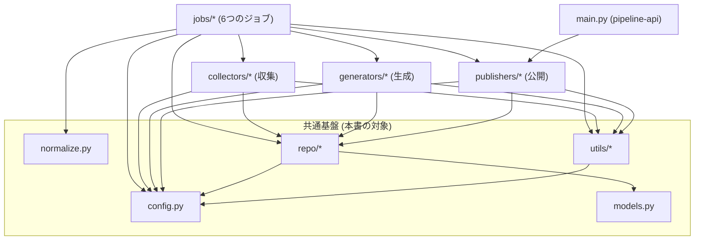

# 詳細設計 01: pipeline 共通基盤(config・models・normalize・repo・utils)

> 対象コード時点: コミット e073130 + 未コミット変更 / 最終更新: 2026-07-14(`deleted` 状態・globalChannels・custom_instructions 反映)

## 1. この文書で分かること

- pipeline のすべてのジョブ(収集・生成・公開など、決まった時刻に起動する処理単位)から使われる共通部品 —— 設定(`config.py`)、データ型(`models.py`)、URL 正規化(`normalize.py`)、Firestore アクセス層(`repo/`)、ユーティリティ(`utils/`)—— の役割と主要関数。
- 重複収集・二重投稿を防ぐ土台になっている 3 つの仕組み(URL ハッシュによる条件付き作成、dot-path 部分更新、共通リトライポリシー)の読み解き方。
- 機能別文書(02-collect 以降)を読むための前提知識。Python の文法そのもの(デコレータや型ヒントの読み方)は `00-code-reading-primer.md` を参照。

## 2. 関連ファイル一覧

| パス | 役割 |
| --- | --- |
| `pipeline/app/config.py` | モデル名・API キーなど全設定の一元管理。環境変数と `.env` から読み込む |
| `pipeline/app/models.py` | Firestore のドキュメント構造を写した Pydantic モデルと enum 5 種 |
| `pipeline/app/normalize.py` | URL・タイトルの正規化と重複排除用ハッシュの生成 |
| `pipeline/app/repo/client.py` | Firestore クライアントのシングルトン `db()` |
| `pipeline/app/repo/items.py` | `items` コレクション(収集アイテム)の作成・検索・重複判定 |
| `pipeline/app/repo/posts.py` | `posts` コレクション(投稿)の作成と部分更新 |
| `pipeline/app/repo/runs.py` | `runs` コレクション(ジョブ実行記録)の開始/終了 |
| `pipeline/app/repo/configs.py` | カテゴリ・ソース・プロンプト・チャネル設定・`settings/*` の読み書き |
| `pipeline/app/repo/__init__.py` | `db` の再エクスポートのみ(実質空) |
| `pipeline/app/utils/gcs.py` | GCS への画像保存と、秘密鍵なしでの署名 URL 発行 |
| `pipeline/app/utils/logging.py` | Cloud Logging が解釈できる JSON 構造化ログ |
| `pipeline/app/utils/retry.py` | 外部 API 呼び出し共通のリトライポリシー `api_retry` |
| `shared/constants.json` | Python/TypeScript 共通 enum の唯一のソース(`models.py` と手動同期) |
| `pipeline/pyproject.toml` | 依存パッケージの定義と pytest の設定 |

## 3. モジュール関係図



実行の入り口は 2 つある。Cloud Scheduler が起動する `jobs/*`(`collect` `generate_daily` `generate_weekly` `generate_monthly` `refresh_threads_token` `seed` の 6 ジョブ。`jobs/longform_runner.py` は weekly/monthly から呼ばれる共通処理でジョブ本体ではない)と、管理画面からの公開・リトライ要求を受ける `main.py`(pipeline-api)である。どちらも機能モジュール(collectors/generators/publishers)を呼び、それらすべてが本書の共通基盤に依存する。設定は必ず `config.py` 経由、Firestore の読み書きは必ず `repo/` 経由、外部 API のリトライとログは `utils/` 経由 —— という一方向の依存に揃えてあるため、機能側のコードには GCP の生 API がほとんど現れない。なお `models.py` は図中のほぼ全モジュールから import されるが、線が煩雑になるため代表として `repo/` からの依存だけを描いた。`normalize.py` を使うのは現状 `jobs/collect.py` のみ。

## 4. モジュール別解説

### 4.1 config.py — 設定の一元管理

**役割**: プロジェクト ID・GCS バケット名・利用する AI モデル名・各種 API キーなど、環境によって変わる値をすべて 1 クラス(`Settings`)に集めたもの。コードのどこかに API キーやモデル名を直書きせず、必ずここを経由するのがこのリポジトリの規約。

**仕組み(pydantic-settings)**: `Settings` は pydantic-settings ライブラリの `BaseSettings` を継承している。ここに `openai_api_key: str = ""` のようにフィールドを宣言すると、インスタンス化した瞬間に**同名の環境変数**(慣例として大文字。この例では `OPENAI_API_KEY`)が探され、あれば宣言した既定値を上書きする。環境変数とは、OS がプロセスに渡す「名前=値」の設定のことで、Cloud Run では `--set-env-vars` / `--set-secrets`(Secret Manager の値を環境変数として注入する仕組み)で与えられる。

`model_config = SettingsConfigDict(env_file=".env", extra="ignore")` により、ローカル実行ではカレントディレクトリの `.env` ファイル(`cp .env.example .env` で用意)からも読む。`extra="ignore"` は、`.env` にクラスに存在しないキーが書かれていてもエラーにしない指定。

#### get_settings()

`@lru_cache` 付きの関数で、`Settings()` を返すだけ。`lru_cache` は「同じ引数での呼び出し結果を記憶して使い回す」デコレータ(関数に機能を後付けする Python の仕組み)で、引数なし関数に付けると事実上の**シングルトン**(プロセス内にインスタンスが 1 つだけ存在するパターン)になる。どのモジュールから何度呼んでも、環境変数の読み込みは初回の 1 回だけで済む。

全フィールドの名前・既定値・本番での上書き状況の一覧はここには転記しない。[`../04-parameters.md`](../04-parameters.md) を参照。

**難所・注意**:

- `lru_cache` ゆえに、**最初の `get_settings()` 呼び出し以降に環境変数を変えても反映されない**。テストで設定を差し替えたい場合はこの性質を意識する必要がある。
- 本番の Cloud Run ジョブには `GEMINI_MODEL` などの環境変数上書きが入っている場合がある。つまり `config.py` に書かれた既定値(`gemini-3.5-flash` 等)と本番の実効値は**乖離し得る**。モデル名を変更するときはコードとデプロイ設定の両方を確認すること(7 章)。
- API キー系フィールドの既定値はすべて空文字列。import した時点では欠けていてもエラーにならず、実際にそのキーを使う collector や publisher の呼び出しで初めて失敗する(「使わない機能のキーは無くても動く」ようにするための設計)。

### 4.2 models.py — データ型と enum

**役割**: Firestore(後述 4.4)に保存する各ドキュメントの「形」を Python の型として写した、いわばスキーマの写し。pydantic の `BaseModel` を継承しており、フィールドの型が宣言と合っているかを読み書きのたびに自動検証してくれる。

**enum 5 種と `shared/constants.json` の同期**: enum(列挙型)とは「取りうる値をあらかじめ有限個に固定した型」のこと。本システムの enum は Python(pipeline)と TypeScript(管理画面)の両方で使うため、`shared/constants.json` を唯一のソースと定め、`models.py` の enum は**それを手で写したもの**になっている(コード生成はしていないので、片方だけ直すとズレる。7 章参照)。

| enum | 値 | 意味 |
| --- | --- | --- |
| `Cadence` | `daily` `weekly` `monthly` | 投稿のカデンス(周期) |
| `Channel` | `x` `threads` `notion` | 配信チャネル |
| `PostStatus` | `draft` `approved` `publishing` `published` `partially_published` `failed` | 投稿全体の状態(下書き `draft` から始まる) |
| `ChannelStatus` | `pending` `published` `failed` `skipped` `deleted` | 投稿の中のチャネル単位の状態(`deleted` は管理画面からのリモート削除済み) |
| `SourceType` | `rss` `gemini_grounded` `ieee_xplore` | 収集ソースの種類(arXiv も `rss` として扱う) |

`constants.json` には他に `languages`(`ja` `ko` `en`)と `jobTypes`(6 ジョブ名)があるが、これらに対応する Python の enum は無い。`jobTypes` は `Run.jobType` に入る素の文字列、`languages` は主に管理画面が使う。

**`str, Enum` の意味**: `class Cadence(str, Enum)` のように `str` を同時に継承すると、各メンバー(`Cadence.daily`)自体が文字列 `"daily"` としても振る舞う。`== "daily"` の比較が成立し、JSON や Firestore にそのまま文字列として書き込める。

**`model_dump()` による Firestore への保存**: `model_dump()` は pydantic モデルを Python の辞書(dict)に変換するメソッドで、repo 層は `post.model_dump(exclude={"id"})` の形でその辞書を Firestore に渡す。enum フィールドは辞書の中にメンバーのまま残るが、上記のとおり `str` を継承しているため Firestore クライアントは通常の文字列として保存する(`pipeline/app/repo/posts.py` の `set_status()` のように明示的に `.value` で文字列化している箇所もある)。`exclude={"id"}` は、`id` をドキュメントの中身ではなくドキュメント ID そのものとして別管理するための除外。

**主要モデルの役割**(フィールドの一覧と型はここには転記しない。[`../03-data-model.md`](../03-data-model.md) を参照):

- `Item` — 収集アイテム 1 件。`id` は正規化 URL のハッシュ([#items](../03-data-model.md#items))
- `Post` / `ChannelState` / `TokenUsage` — 投稿 1 件。`channels` は `{"x": ChannelState, ...}` という辞書で、チャネルごとの文面・状態・外部 ID を持つ([#posts](../03-data-model.md#posts))
- `Run` / `RunStats` — ジョブ 1 回の実行記録(開始/終了時刻、件数、エラー一覧)
- `Category` / `Source` — 何をどこから収集するかの設定
- `PromptTemplate` — カテゴリ×カデンスごとの生成プロンプト
- `ChannelConfig` — カテゴリ×カデンス×チャネルごとの有効/言語設定
- `AppSettings` — `settings/app` に置く全体設定(承認要否・画像添付・チャネル全体スイッチ `globalChannels`(既定 `{x: false, threads: false, notion: true}`)など)
- `ImageRef` — GCS 上の画像への参照(パスと MIME タイプ)

フィールド名が `categoryId` のような camelCase なのは、Firestore 上のフィールド名と 1:1 で一致させるため(別名変換の層を作らない、という割り切り)。

### 4.3 normalize.py — URL・タイトルの正規化

**役割**: 同じニュースを二重に取り込まないための正規化ロジック。ここでいうハッシュとは「任意のデータを固定長の値に変換する計算で、同じ入力からは必ず同じ値が出る」もの(sha256 という方式を使用)。重複判定は 2 系統ある。

1. **URL の完全一致**: `canonicalize_url()` で表記ゆれを消した URL を `item_doc_id()` でハッシュ化し、その値をそのまま Firestore の `items` ドキュメント ID にする。同じ記事 URL を再収集しても同じ ID になるので、作成が自動的に空振りする(4.4 の `create_if_absent()`)。
2. **タイトルの近似一致**: 別のメディアが同じ話題を報じた場合は URL が違うので 1. では捕まらない。`title_norm_hash()` で語順・大文字小文字・記号を無視したハッシュを作り、7 日窓で照合する(4.4 の `title_hash_seen_since()`)。

| 関数 | 入力 → 出力 | 使いどころ |
| --- | --- | --- |
| `canonicalize_url()` | URL → 正規化済み URL | 収集直後(`pipeline/app/jobs/collect.py` の `_persist()`) |
| `item_doc_id()` | 正規化 URL → 32 文字の ID | `items` のドキュメント ID |
| `normalize_title()` | タイトル → 単語をソートした文字列 | `title_norm_hash()` の内部 |
| `title_norm_hash()` | タイトル → 16 文字のハッシュ | 近似重複チェック |

#### canonicalize_url()

【難所】この関数は「どの表記ゆれを、どの順で消すか」がすべてなので全文を掲げる。

```python
def canonicalize_url(url: str) -> str:
    url = url.strip()
    scheme, netloc, path, query, _fragment = urlsplit(url)
    scheme = (scheme or "https").lower()
    netloc = netloc.lower()
    if netloc.startswith("www."):
        netloc = netloc[4:]
    if netloc.endswith(":80") and scheme == "http":
        netloc = netloc[:-3]
    if netloc.endswith(":443") and scheme == "https":
        netloc = netloc[:-4]
    params = [
        (k, v)
        for k, v in parse_qsl(query, keep_blank_values=True)
        if k.lower() not in _TRACKING_PARAMS
    ]
    params.sort()
    if path != "/":
        path = path.rstrip("/")
    return urlunsplit((scheme, netloc, path or "/", urlencode(params), ""))
```

- `url.strip()` — 前後の空白や改行を除去する。フィードや AI の出力に混ざりがちなゴミ対策。
- `urlsplit(url)` — URL を scheme(`https`)/netloc(ホスト名)/path/query/fragment(`#` 以降)の 5 要素に分解する標準関数。
- `scheme = (scheme or "https").lower()` — scheme が無い URL は `https` とみなし、小文字に揃える。
- `netloc.lower()` — ホスト名の大文字小文字は同じサイトを指すので小文字に統一(`Example.com` = `example.com`)。
- `www.` の除去 — `www.example.com` と `example.com` を同一視する。
- `:80` / `:443` の除去 — それぞれ http / https の既定ポートで、書いても書かなくても同じ接続先なので落とす。
- `parse_qsl(..., keep_blank_values=True)` — クエリ文字列を `(キー, 値)` の一覧に分解。値が空のパラメータも保持する。
- `if k.lower() not in _TRACKING_PARAMS` — `utm_source` や `fbclid` などアクセス解析用のパラメータ(モジュール冒頭に 18 種類定義)を捨てる。これらは「どこから来たか」の記録であって記事の同一性に関係ないため。
- `params.sort()` — 残ったパラメータをキー順に並べ替え、`?a=1&b=2` と `?b=2&a=1` を同一視する。
- `path.rstrip("/")` — 末尾スラッシュを除去(`/news/` = `/news`)。ただしルート `/` だけはそのまま残す(`path or "/"` で復元)。
- `urlunsplit((..., ""))` — 最後の空文字列が fragment。ページ内位置を示すだけなので破棄して再組み立てする。

#### item_doc_id()

正規化済み URL を sha256 でハッシュ化し、16 進表現の**先頭 32 文字**を返す。これが `items` のドキュメント ID になる(「安定していて」「十分短く」「衝突が実用上起きない」長さとしての選択)。

#### normalize_title() / title_norm_hash()

【難所】語順非依存の仕組みはこの 3 行に集約されている。

```python
_WORD_RE = re.compile(r"[a-z0-9가-힣぀-ヿ一-鿿]+")


def normalize_title(title: str) -> str:
    """Lowercased, accent-stripped, sorted word bag — order-insensitive."""
    title = unicodedata.normalize("NFKD", title).lower()
    words = sorted(set(_WORD_RE.findall(title)))
    return " ".join(words)


def title_norm_hash(title: str) -> str:
    return hashlib.sha256(normalize_title(title).encode("utf-8")).hexdigest()[:16]
```

- `_WORD_RE` — 「単語」とみなす文字の範囲を定めた正規表現。`a-z0-9`(小文字化済みの英数字)、`가-힣`(ハングル)、`぀-ヿ`(ひらがな・カタカナ)、`一-鿿`(CJK 統合漢字)。ここに**含まれない**記号・空白・句読点はすべて単語の区切りとして無視される。「!」の有無や「Fed Raises Rates!」の感嘆符が結果に影響しないのはこのため。
- `unicodedata.normalize("NFKD", title)` — Unicode の互換分解。全角英数字を半角相当に揃え、`é` のようなアクセント付き文字を「基底文字+アクセント記号」に分解する。アクセント記号は `_WORD_RE` に含まれないので、結果として `café` と `cafe` が同一視される。
- `.lower()` — 大文字小文字を無視。
- `findall` → `set` → `sorted` — タイトルから単語を抜き出し、`set` で重複を捨て、`sorted` でアルファベット順に並べる。**出現順の情報を意図的に捨てる**のがポイントで、「Fed Raises Rates」と「rates raises fed」がどちらも `fed raises rates` になる。いわゆる bag of words(語の袋)。
- `title_norm_hash()` — その文字列を sha256 して先頭 16 文字。`Item.titleNormHash` に保存され、Firestore のクエリ条件として使えるようになる。

### 4.4 repo/ — Firestore アクセス層

**役割**: Firestore は GCP のドキュメント型データベースで、データは「コレクション」(表に相当)の中の「ドキュメント」(JSON のようなレコード)として保存される。`repo/` はこの Firestore への読み書きをコレクションごとの関数にまとめた層。ジョブや publisher は Firestore の生 API を触らず、必ずここを通る。`models.py` のオブジェクトと Firestore ドキュメントの相互変換(`model_dump()` / コンストラクタ)もこの層の仕事。

なお、複数の条件を組み合わせたクエリ(後述の `title_hash_seen_since()` など)には Firestore の「複合インデックス」(検索を成立させるための索引)が必要で、`infra/00-bootstrap.sh` が作成している。新しいクエリを足すときはインデックスも足す(7 章)。

#### db()(client.py)

`@lru_cache` 付きで `firestore.Client(project=...)` を返すシングルトン。認証情報は ADC(Application Default Credentials: 実行環境が持つ資格情報を自動検出する仕組み。Cloud Run 上ではサービスアカウント、ローカルでは `gcloud auth application-default login` の結果)に任せている。`repo/__init__.py` は `db` を再エクスポートするだけで、利用側は `from app.repo import configs, items, runs` のようにサブモジュール単位で import するのが慣例。

#### items.py の関数

| 関数 | 何をするか |
| --- | --- |
| `create_if_absent(item)` | URL ハッシュ ID で条件付き作成。既存なら `False`(完全重複) |
| `title_hash_seen_since(category_id, title_hash, days=7)` | 同カテゴリで同じ `titleNormHash` が `days` 日以内に収集済みかどうか |
| `recent_for_category(category_id, hours, limit=120)` | 直近 `hours` 時間の収集アイテムを新しい順に最大 `limit` 件(生成の材料集め) |
| `get_many(item_ids)` | ID のリストを一括取得。存在しない ID は黙って除外 |
| `mark_used(item_ids, post_id)` | 各アイテムの `usedInPostIds` に投稿 ID を追記 |

`mark_used()` は batch(複数の書き込みを 1 リクエストにまとめる仕組み)と `ArrayUnion`(「配列に、まだ無ければ追加する」というサーバー側の操作)を組み合わせている。読み取ってから書き戻す方式と違い、同時実行しても追記が失われない。

##### create_if_absent()

【難所】重複排除の心臓部。トランザクションのコードは書かれていないのに競合安全である理由を読む。

```python
def create_if_absent(item: Item) -> bool:
    """Transactional create keyed by URL hash; returns False if it already exists."""
    ref = db().collection(COLLECTION).document(item.id)
    try:
        ref.create(item.model_dump(exclude={"id"}))
        return True
    except Exception as exc:  # AlreadyExists
        if type(exc).__name__ == "AlreadyExists":
            return False
        raise
```

- `document(item.id)` — ドキュメント ID を Firestore に採番させず、`item.id` = sha256(正規化 URL) の先頭 32 文字で**自分で決める**。同じ URL は必ず同じ ID になる。
- `ref.create(...)` — Firestore の `create` は「その ID のドキュメントが**まだ存在しない場合だけ**作成する」条件付き書き込み。存在チェックと作成がサーバー側で不可分(アトミック)に行われるため、「読んでから書く」方式で起きるような競合(2 つの処理が同時に同じ URL を書いてしまう)が原理的に起きない。
- `model_dump(exclude={"id"})` — `id` はドキュメント ID として使うので、ドキュメントの中身からは除外する。
- `except` 節 — 既に存在する場合、Google のライブラリは `AlreadyExists` 例外を投げる。ここでは例外クラスを import せず、クラス名の文字列で判定している(`google.api_core` への依存をこのファイルに増やさないための書き方)。
- `return False` — 呼び出し側(`jobs/collect.py`)はこれを**エラーではなく正常な結果**として受け取り、`deduped`(重複件数)に計上する。
- `raise` — `AlreadyExists` 以外(権限エラーなど)は握りつぶさずそのまま上げる。

#### posts.py の関数

| 関数 | 何をするか |
| --- | --- |
| `create(post)` | `createdAt` を現在時刻にして追加。ID は Firestore の自動採番。戻り値が投稿 ID |
| `get(post_id)` | 1 件取得。無ければ `None` |
| `set_status(post_id, status, **extra)` | `status` と任意の追加フィールドを部分更新 |
| `update_channel(post_id, channel, state)` | `channels` のうち 1 チャネル分だけを丸ごと置き換え(dot-path) |
| `update_fields(post_id, fields)` | 任意フィールドの部分更新(汎用) |

##### set_status() / update_channel() / update_fields()

【難所】dot-path 部分更新。公開処理のクラッシュ復帰を支える仕組みなので 3 関数まとめて読む。

```python
def set_status(post_id: str, status: PostStatus, **extra) -> None:
    updates: dict = {"status": status.value, **extra}
    db().collection(COLLECTION).document(post_id).update(updates)


def update_channel(post_id: str, channel: str, state: ChannelState) -> None:
    db().collection(COLLECTION).document(post_id).update(
        {f"channels.{channel}": state.model_dump()}
    )


def update_fields(post_id: str, fields: dict) -> None:
    db().collection(COLLECTION).document(post_id).update(fields)
```

- `update()` — Firestore の部分更新。渡したキーだけを書き換え、他のフィールドには触らない(ドキュメント全体を置き換える `set` とは別物)。
- `set_status()` の `status.value` — enum を明示的に文字列化して保存。`**extra` により `publishedAt` などを同じ 1 回の書き込みで更新できる(`publishers/base.py` の `publish_post()` が利用)。
- `update_channel()` の `f"channels.{channel}"` — キーに含まれるドット(`.`)は Firestore では「ネストしたフィールドへのパス」を意味する。つまり `channels` という辞書全体ではなく、`channels.x` のような **1 チャネル分だけ**を `ChannelState` 丸ごとで置き換える。
- これが重要な理由 — 公開は notion → x → threads の固定順で進み、1 チャネル終わる(または失敗する)たびに `update_channel()` で途中経過を永続化する。もし `channels` 全体を書き戻す作りだと、手元の古いオブジェクトで他チャネルの最新状態(たとえばクラッシュ復帰用に保存した Threads の `containerId`)を上書きして消してしまう。dot-path はその事故を構造的に防ぐ。
- `update_fields()` — キー名を呼び出し側が組み立てる汎用版。管理画面からの本文編集などに使われる。

#### runs.py の関数とジョブ共通の骨格

`start(job_type)` は `Run(jobType=..., startedAt=現在時刻)` を `runs` コレクションに追加して実行 ID を返す。`finish(run_id, run)` は `finishedAt` を設定したうえで、`id` / `jobType` / `startedAt` を**除いた**フィールドを `update` する(開始時に記録した値を上書きしないための除外)。

すべてのジョブはこの 2 つで挟んだ同じ骨格を持つ。`pipeline/app/jobs/collect.py` の `main()` が典型で、

1. `run_id = runs.start("collect")` —— まず「実行が始まった」ことを記録する
2. 処理本体 —— 失敗は `run.errors` に文字列で積み、`run.stats`(`collected` / `deduped` など)を加算しながら続行する
3. `run.ok = not run.errors` としてから `runs.finish(run_id, run)` —— エラーがあっても必ず終了記録を書く

という流れになる。この `runs` の記録が管理画面のジョブ履歴と、[`../../runbook.md`](../../runbook.md) の障害切り分けの一次情報になる。`job_type` の文字列は `shared/constants.json` の `jobTypes` と揃える約束。

#### configs.py の関数

`categories` `sources` `promptTemplates` `channelConfigs` と `settings/*` を担当する。

| 関数 | 何をするか |
| --- | --- |
| `enabled_categories()` | `enabled == true` のカテゴリを `sortOrder` 順で返す。`slug` はドキュメント ID |
| `enabled_sources(category_id)` | カテゴリ配下の有効な収集ソース一覧 |
| `update_source_cache(source_id, etag, last_modified)` | RSS の条件付き取得用キャッシュ(ETag / Last-Modified)と `lastFetchedAt` を保存 |
| `prompt_template(category_id, cadence)` | ID `{categoryId}_{cadence}` のテンプレート。**無い、または `enabled` が偽なら `None`** |
| `channel_config(category_id, cadence, channel)` | ID `{categoryId}_{cadence}_{channel}` の設定。**無ければ既定値を合成して返す**。さらに `settings/app.globalChannels` が false のチャネルは `enabled=False` に強制(グローバルスイッチとの AND) |
| `custom_instructions(category_id, format)` | `promptTemplates/{categoryId}_{format}` の `customInstructions` を生で読む(テンプレートの `enabled` は無視 — 手動実行にも効かせるため)。無ければ空文字 |
| `app_settings()` | `settings/app`。無ければ `AppSettings()` の既定値 |
| `notion_database_id()` | `settings/notion` の `databaseId`。無ければ空文字列 |
| `update_channel_health(fields)` | `settings/channelHealth` へ merge 書き込み(トークン期限などの健全性情報) |

**既定値挙動**がこのモジュールの設計思想で、「設定ドキュメントが無くてもコードは落ちない。ただし安全側に倒す」。特に `channel_config()` は、該当ドキュメントが存在しないとき `enabled=False, language="en"` の `ChannelConfig` を合成して返す —— つまり**設定していないチャネルには決して投稿されない**。`prompt_template()` が `None` を返した場合、呼び出し側はそのカテゴリ×カデンスの生成をスキップする。`update_channel_health()` の `set(..., merge=True)` は「ドキュメントが無ければ作成、あれば渡したフィールドだけ上書き」という操作。

### 4.5 utils/ — gcs・logging・retry

#### upload_bytes() / download_bytes()(gcs.py)

GCS(Google Cloud Storage)は GCP のファイル置き場で、「バケット」という入れ物にファイル(blob)を保存する。本システムでは収集した記事のサムネイル画像(og:image)を `items/{docId}/og.{拡張子}` というパスに保存し、投稿時に取り出して添付する。この 2 関数はその出し入れをするだけの薄いラッパーで、バケット名は常に `settings.gcs_bucket`。クライアントは `_client()`(`lru_cache` シングルトン)。

#### signed_url()(gcs.py)

**署名 URL** とは「この URL を知っている人は、**期限内に限り**このファイルをダウンロードできる」という許可証付きの URL のこと。バケット自体は非公開のままでよい。Threads に画像を添付するには、Threads のサーバー側が取りに来られる公開 URL を渡す必要があるため、これを使う(既定の有効期限は 30 分)。

**鍵レス署名の仕組み**: 署名 URL を作るには本来、サービスアカウント(プログラム用の Google アカウント)の秘密鍵で署名する必要がある。しかし Cloud Run 上のコンテナには秘密鍵ファイルを置いていない(鍵ファイルは漏えいリスクの塊なので持たない方針)。代わりに「Google の IAM Credentials API に署名だけを代行してもらう」方式をとる。この代行依頼が通るのは、pipeline-sa が**自分自身に対する** `roles/iam.serviceAccountTokenCreator` 権限を持っているからで、`infra/00-bootstrap.sh` が付与している。この IAM を外すと `signed_url()` が失敗し、画像添付が壊れる。

【難所】

```python
def signed_url(path: str, minutes: int = 30) -> str:
    settings = get_settings()
    creds, _ = google.auth.default()
    sa_email = settings.pipeline_service_account or getattr(
        creds, "service_account_email", ""
    )
    signing_creds = impersonated_credentials.Credentials(
        source_credentials=creds,
        target_principal=sa_email,
        target_scopes=["https://www.googleapis.com/auth/devstorage.read_only"],
    )
    bucket = _client().bucket(settings.gcs_bucket)
    return bucket.blob(path).generate_signed_url(
        version="v4",
        expiration=datetime.timedelta(minutes=minutes),
        credentials=signing_creds,
    )
```

- `google.auth.default()` — 実行環境の資格情報(ADC)を取得。Cloud Run 上では pipeline-sa の資格情報になる。
- `sa_email` — 署名者にするサービスアカウントのメールアドレス。設定 `pipeline_service_account` を優先し、無ければ資格情報オブジェクトから推測する(ローカルの ADC ではメールが取れないことがあるため、設定での明示が確実)。
- `impersonated_credentials.Credentials(...)` — 「`source_credentials` の権限を使って、`target_principal`(= pipeline-sa 自身)として振る舞う」資格情報。これを署名に使うと、秘密鍵の代わりに IAM Credentials API の `signBlob` が呼ばれる。`target_scopes` は読み取り専用に絞ってある。
- `generate_signed_url(version="v4", ...)` — V4 という現行方式の署名 URL を生成。`expiration` が有効期限、`credentials` に上の代行資格情報を渡すのがミソ。

#### setup_logging() / get_logger()(logging.py)

**構造化ログ**とは、人間向けの文章ではなく機械が解析できる形式(ここでは JSON 1 行)でログを書くこと。Cloud Run の標準出力に JSON を 1 行書くと、Cloud Logging(GCP のログ収集基盤)がそれを自動解析し、`severity` キーを重大度(INFO / WARNING / ERROR)として扱い、残りのキーを検索可能なフィールド(jsonPayload)にしてくれる。

- `_JsonFormatter` — `severity` / `message` / `logger` を基本に、例外情報(`exception`)と、`extra={"fields": {...}}` で渡された任意の辞書をマージして JSON 化する。`ensure_ascii=False` で日本語がそのまま出力され、`default=str` により datetime などもエラーにせず文字列化される。
- `setup_logging()` — ルートロガーに出力先を設定する。既にハンドラがあれば何もしないので、何度呼んでも安全(冪等)。レベルは INFO。
- `get_logger(name)` — `setup_logging()` を済ませてからロガーを返す。各モジュール冒頭の `log = get_logger(__name__)` が定型。
- 書き方の慣習 — `log.warning("collector failed", extra={"fields": {"error": msg}})` のように `fields` に構造化データを載せると、Cloud Logging でフィールド検索できる。

#### api_retry と PermanentPublishError(retry.py)

**役割**: X / Threads / Notion への HTTP 呼び出しに共通で掛けるリトライ方針。tenacity はリトライ処理のライブラリで、`api_retry` はそのデコレータ。関数定義に `@api_retry` を 1 行付けるだけで自動再試行が入る。

【難所】ファイルの本体は次の 17 行しかないが、「何を再試行し、何をしないか」の線引きがすべてここにある。

```python
class PermanentPublishError(Exception):
    """Non-retryable failure; surfaces as channel status=failed in the admin UI."""


def _is_retryable(exc: BaseException) -> bool:
    if isinstance(exc, httpx.HTTPStatusError):
        code = exc.response.status_code
        return code == 429 or code >= 500
    return isinstance(exc, (httpx.TransportError, httpx.TimeoutException))


api_retry = retry(
    retry=retry_if_exception(_is_retryable),
    stop=stop_after_attempt(3),
    wait=wait_exponential(multiplier=2, min=2, max=30),
    reraise=True,
)
```

- `PermanentPublishError` — publisher が「これはリトライしても直らない失敗」と明示するための独自例外。現状は `pipeline/app/publishers/threads.py` が使う(メディアコンテナが `ERROR` になった場合と、待っても `FINISHED` にならなかった場合)。httpx の例外ではないので `_is_retryable()` が偽を返し、**当然リトライされない**。`publishers/base.py` の `publish_post()` に捕捉され、そのチャネルの状態が `failed`・`error` にメッセージ、として記録されて管理画面に表示される。
- `_is_retryable()` — 再試行してよい失敗の定義。HTTP 429(レート制限 = 呼び出しすぎ)と 5xx(相手サーバーの一時的な障害)、および httpx(HTTP クライアントライブラリ)の `TransportError` / `TimeoutException`(接続断・タイムアウト)。いずれも「時間を置けば直る見込みがある」もの。
- 裏を返すと、**429 以外の 4xx(認証エラー・リクエスト不正など)はリトライしない**。何度送っても同じ結果になるので、即座に失敗させて原因を表面化させる。
- `stop_after_attempt(3)` — 初回を含め最大 3 回試行。
- `wait_exponential(multiplier=2, min=2, max=30)` — 指数バックオフ(失敗のたびに待ち時間を 2 のべき乗で伸ばす方式)。係数 2、下限 2 秒、上限 30 秒。3 回試行なので実際に待つのは最大 2 回。
- `reraise=True` — 3 回とも失敗した場合、tenacity 独自の `RetryError` に包まず**元の例外をそのまま**投げ直す。呼び出し側は普通の `try/except` で扱える。

## 5. エラー時の挙動

| 事象 | 挙動 |
| --- | --- |
| 外部 API が 429 / 5xx / タイムアウト・接続断 | `api_retry` が指数バックオフで最大 3 回試行。それでも失敗なら元の例外がそのまま上がる |
| 外部 API が 429 以外の 4xx(認証エラー等) | リトライせず即時失敗 |
| `PermanentPublishError` | リトライせず即時失敗。`publish_post()` がそのチャネルの状態を `failed` にし、`error` にメッセージ(先頭 1000 文字)を保存。管理画面から確認・リトライできる |
| `items` 作成時の `AlreadyExists` | **エラーではなく正常系**。`create_if_absent()` が `False` を返し、収集ジョブは `deduped` に計上して先へ進む |
| Firestore / GCS の呼び出し失敗 | `api_retry` の対象外(Google クライアントライブラリ標準の挙動に任せる)。捕捉されなければジョブの `run.errors` 行きか、ジョブ自体の失敗になる |

層の関係にも注意。アプリ内リトライ(`api_retry`)と Cloud Run ジョブ自体のリトライ(`--max-retries`)は別物で、**投稿系ジョブは `--max-retries=0`** に固定してある。ジョブ丸ごとの再実行は「どこまで投稿済みか」を問わずやり直すため二重投稿の危険があるからで、安全な再試行はアプリ内の `api_retry` と、公開処理の冪等設計(`externalId` / Threads `containerId` が保存済みのチャネルは再公開しない)だけが担う。この前提を崩さないこと(collect / seed のみ retries=1)。

ジョブ内では「1 つの失敗で全体を止めない」方針が徹底されている。たとえば収集ジョブは 1 ソースの失敗を warning ログと `run.errors` への追記で済ませて次のソースへ進む(「1 本の壊れたフィードが実行全体を殺さない」)。エラーの一覧は `runs` に残るので、トークン失効・収集 0 件などの実際の対応手順は [`../../runbook.md`](../../runbook.md) を参照。

## 6. 関連テスト

正規化ロジックは「一度決めたら変えにくい仕様」である(変えると既存データの ID・ハッシュと非互換になる。7 章)。そのため `pipeline/tests/test_normalize.py` が実質的な仕様書になっており、次を保証する。

- トラッキングパラメータ(`utm_*` など)は消え、通常のパラメータ(`id=1`)は残る
- `www.`・`#fragment`・末尾スラッシュの除去と、ホスト名の小文字化
- クエリパラメータの順序が違っても同じ URL に正規化される
- ルートパス `/` はそのまま保持される
- `item_doc_id()` は安定(同じ入力 → 同じ ID)かつ 32 文字
- タイトルの語順・大文字小文字・記号(`!`)の違いを無視して同じハッシュになる
- 別内容のタイトルは別ハッシュになる
- 日本語(CJK)タイトルでも句読点の有無を無視できる

`repo/` と `utils/` 自体の単体テストは無い(GCP クライアントの薄いラッパーのため、実物なしで検証できる部分が少ない)。代わりに `pipeline/tests/test_publish_orchestration.py` が、`posts.get` / `posts.set_status` / `posts.update_channel` などを monkeypatch でインメモリ実装に差し替えたうえで、公開順序・冪等性・部分失敗といった上位の振る舞いを検証している —— つまり repo 層の**関数シグネチャと呼び出し規約**がテストの前提になっている。実行は `cd pipeline && pytest`(`pyproject.toml` で `testpaths=["tests"]`、`asyncio_mode="auto"`、HTTP モック用に respx を dev 依存として同梱)。

## 7. 変更するときは

| やりたい変更 | 必要な作業 |
| --- | --- |
| enum 値の追加・変更(状態・チャネル等) | `shared/constants.json` と `pipeline/app/models.py` の**両方**を手動で揃える。管理画面は prebuild で constants.json を `admin/src/lib/` にコピーするため**再ビルドが必要** |
| ジョブ種別の追加 | `constants.json` の `jobTypes` に追記し、`runs.start()` に渡す文字列と一致させる |
| AI モデル名の変更 | `pipeline/app/config.py` の既定値に加え、本番 Cloud Run ジョブの環境変数上書き(`GEMINI_MODEL` 等)も確認。現在値の一覧は [`../04-parameters.md`](../04-parameters.md) |
| Firestore フィールドの追加 | `models.py` に**必ず既定値付きで**追加(既定値が無いと、そのフィールドを持たない既存ドキュメントの読み込みが検証エラーになる)。[`../03-data-model.md`](../03-data-model.md) と管理画面側の型も更新 |
| 正規化ロジックの変更 | 既存 `items` の ID・`titleNormHash` と非互換になり、変更前後で同じ記事が重複し得ることを理解したうえで行う。`tests/test_normalize.py` を必ず更新 |
| 複数条件の新しいクエリの追加 | 複合インデックスが必要なら `infra/00-bootstrap.sh` に追記(無いとクエリが実行時エラーになる) |
| リトライ回数・対象の変更 | 投稿系ジョブ `--max-retries=0` の前提(アプリ内リトライのみが安全)を崩さない。`PermanentPublishError` の「リトライ不能」という意味を保つ |
| 署名 URL・サービスアカウントまわり | pipeline-sa の自己 token-creator 権限(`infra/00-bootstrap.sh`)が前提。壊れたときの症状と対処は [`../../runbook.md`](../../runbook.md) |
