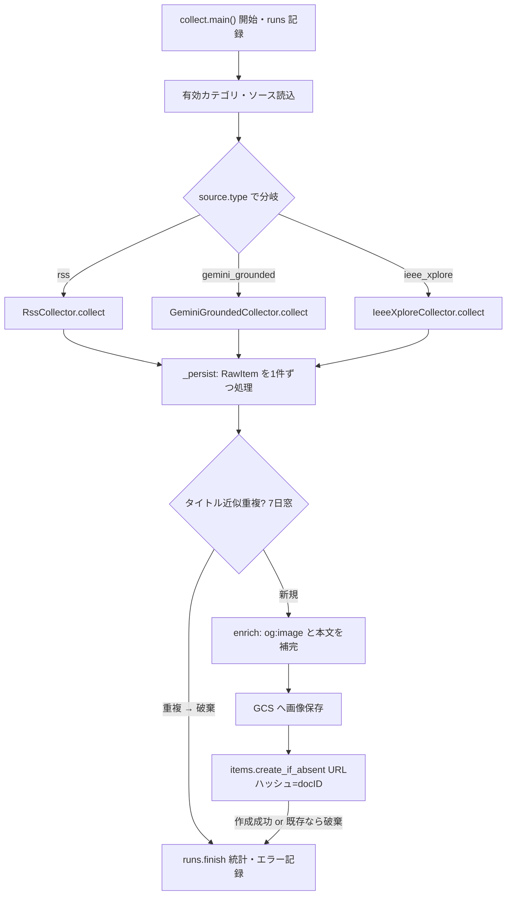

# 収集フロー(job-collect)詳細設計

> 対象コード時点: コミット f703290 + 未コミット変更 / 最終更新: 2026-07-12

## 1. この文書で分かること

- 毎日 06:00 JST に動くジョブ `job-collect`(README のフロー①)が、外部ソース(RSS/Atom・Gemini グラウンディング検索・IEEE Xplore)からニュースを集めて Firestore の `items` コレクションと GCS(Google Cloud Storage、ファイル置き場)に保存するまでの全経路。
- 同じ記事を二度保存しないための「二重の重複排除」(URL ハッシュ + タイトル近似判定)の仕組みと、その設計理由。
- 1 つのソースや 1 件の記事が失敗しても収集全体が止まらない「失敗の隔離」の実装と、障害時にどこを見ればよいか。

前提知識(パイプライン共通のジョブ実行基盤・`runs` 記録・ログの読み方)は [01-pipeline-foundation.md](01-pipeline-foundation.md) を、コードの読み進め方は [00-code-reading-primer.md](00-code-reading-primer.md) を先に参照してください。

## 2. 関連ファイル一覧

| 役割 | ファイル | 概要 |
|---|---|---|
| エントリポイント | `pipeline/app/jobs/collect.py` | ジョブ本体。`main()` がループを回し、`_persist()` が 1 件ずつ保存する |
| コレクタ共通の型 | `pipeline/app/collectors/base.py` | 収集結果の入れ物 `RawItem` と、コレクタの共通インターフェース `Collector`(Protocol) |
| RSS/Atom コレクタ | `pipeline/app/collectors/rss.py` | フィード取得(条件付き GET)と解析。arXiv の Atom もここで処理 |
| Gemini コレクタ | `pipeline/app/collectors/gemini_grounded.py` | Gemini のグラウンディング検索(生成 AI に Google 検索結果を根拠として与える仕組み)でニュースを収集 |
| IEEE コレクタ | `pipeline/app/collectors/ieee_xplore.py` | IEEE Xplore Metadata Search API(論文検索 API)から学術記事を収集 |
| 補完(enrich) | `pipeline/app/collectors/enrich.py` | 記事ページを取得して og:image(ページの代表画像)と本文テキストを補う |
| 正規化・ハッシュ | `pipeline/app/normalize.py` | URL 正規化と、重複判定用ハッシュ(固定長の指紋文字列)の生成。重複排除の要 |
| items アクセス層 | `pipeline/app/repo/items.py` | `items` への排他的作成(`create_if_absent`)と 7 日窓のタイトル重複検索 |
| 設定アクセス層 | `pipeline/app/repo/configs.py` | 有効なカテゴリ・ソースの読み出し、RSS キャッシュ情報の保存 |
| 実行記録 | `pipeline/app/repo/runs.py` | `runs` コレクションへの開始/終了記録 |
| GCS ヘルパ | `pipeline/app/utils/gcs.py` | 画像バイト列のアップロード(`upload_bytes`)— 本フローではこれのみ使用 |
| データ型定義 | `pipeline/app/models.py` | `Source` `SourceType` `Item` `Run` などの Pydantic モデル |
| テスト | `pipeline/tests/test_rss.py` ほか | `test_academic_sources.py` `test_normalize.py` と `tests/fixtures/`(`sample_feed.xml` `arxiv_atom.xml`) |

保存先のスキーマ(`items` の全フィールド)は [../03-data-model.md#items](../03-data-model.md#items) を参照。

## 3. 全体フロー



図の流れはカテゴリ × ソースの二重ループの「1 周分」を表しています。`main()` はまず `runs` に開始を記録し、有効なカテゴリごとに有効なソースを読み込み、ソースの種別(`SourceType`)に応じた 3 種類のコレクタのどれかで生データ(`RawItem` のリスト)を取得します。取得できた 1 件ごとに `_persist()` が「タイトル近似重複の 7 日窓チェック → 足りない画像・本文の補完(enrich)→ 画像の GCS 保存 → `items` への排他的作成」を行い、最後に全体の統計とエラーを `runs` に書き戻します。重複と判定された件は保存されずに `deduped` として数えられるだけで、エラーにはなりません。

## 4. 処理の流れ

1. **起動**: Cloud Scheduler が `0 6 * * *`(Asia/Tokyo、`infra/20-schedulers.sh`)で Cloud Run Job `job-collect` を起動し、コンテナ内で `python -m app.jobs.collect` が実行されます。管理画面からの手動実行時は pipeline-api の `POST /api/jobs/collect/run`(`pipeline/app/main.py`)が同じ `main()` をバックグラウンドで呼びます。
2. **runs 記録の開始**: `main()` は最初に `runs.start("collect")` で `runs` コレクションに開始時刻付きのドキュメントを作り、ID を受け取ります。以降の統計(収集数・重複破棄数)とエラー文字列は手元の `Run` オブジェクトに貯め、最後にまとめて書き戻します。
3. **コレクタと HTTP クライアントの準備**: `SourceType` の 3 値(`rss` / `gemini_grounded` / `ieee_xplore`)をキーに、対応するコレクタのインスタンスを辞書に登録します。あわせて enrich 用の共有 `httpx.Client`(タイムアウト 20 秒、リダイレクト追従、User-Agent `trend-news-generator/1.0`)を 1 つ作ります。
4. **カテゴリ・ソースの読込**: `configs.enabled_categories()` が `enabled == true` のカテゴリを `sortOrder` 順で返し、各カテゴリについて `configs.enabled_sources()` が有効なソース(Firestore `sources` コレクション)を返します。
5. **ソースごとの収集(失敗はソース単位で隔離)**: ソースの `type` に対応するコレクタの `collect(source)` を呼びます。この呼び出し全体が `try/except` で包まれており、例外が出たら警告ログと `run.errors` への追記だけして次のソースへ進みます(`continue`)。**1 本のフィードが壊れていても他のソースの収集は続く**、というのがこのジョブの基本方針です。
6. **1 件ごとの保存(`_persist()`)**: コレクタが返した `RawItem` を 1 件ずつ処理します。(a) URL を正規化してドキュメント ID(URL の SHA-256 ハッシュ先頭 32 文字)とタイトル正規化ハッシュを計算、(b) 同カテゴリで過去 7 日以内に同じタイトルハッシュの収集アイテム(item)があれば破棄(`deduped` +1)、(c) 画像 URL か本文が欠けていれば記事ページを取得して og:image と本文テキスト(最大 10,000 文字)を補完、(d) 画像があればダウンロードして GCS の `items/{docID}/og.{拡張子}` に保存、(e) `items.create_if_absent()` で排他的に作成し、成功なら `collected` +1、既存なら `deduped` +1。この 1 件分も `try/except` で包まれ、失敗は `run.errors` に残して次の件へ進みます。
7. **統計の記録**: 全ループ終了後、`run.ok = not run.errors`(エラーが 1 件でもあれば `false`)を設定して `runs.finish()` で終了時刻・統計・エラー一覧を書き戻し、構造化ログに `collected` / `deduped` / `errors` 件数を出して終了します。

## 5. 関数リファレンス(呼び出し順)

### main()

`pipeline/app/jobs/collect.py` の `main()`。

- **役割**: 収集ジョブ全体の指揮。runs 記録、カテゴリ × ソースの二重ループ、失敗の隔離、統計の確定。
- **入出力**: 引数・戻り値なし。実質の出力は Firestore(`items` / `runs` / `sources`)と GCS への書き込み。
- **呼び出し元**: Cloud Run Job `job-collect`(スケジューラ起動)/ pipeline-api の `run_job()`(手動実行)。
- **呼び出し先**: `runs.start()` → `configs.enabled_categories()` → `configs.enabled_sources()` → 各コレクタの `collect()` → `_persist()` → `runs.finish()`。
- **外部アクセス**: Firestore(configs/runs 経由)。HTTP は各コレクタと enrich が行う。
- **要点**: コレクタ辞書は `SourceType` の全 3 値を網羅しているため `KeyError` は起きない。例外の捕捉範囲は「コレクタ実行」と「1 件の保存」の 2 箇所だけで、設定読込の失敗はジョブ全体の失敗になる(§7)。

### _persist()

`pipeline/app/jobs/collect.py` の `_persist()`。

- **役割**: `RawItem` 1 件を正規化・重複判定・補完・画像保存し、`Item` として `items` に書き込む。
- **入出力**: 入力は `RawItem`・`Source`・共有 `httpx.Client`・統計オブジェクト。戻り値なし(統計への加算が結果)。
- **呼び出し元**: `main()` の内側ループ。
- **呼び出し先**: `canonicalize_url()` / `item_doc_id()` / `title_norm_hash()`(normalize)、`items.title_hash_seen_since()`、`fetch_page()` / `fetch_image()`(enrich)、`gcs.upload_bytes()`、`items.create_if_absent()`。
- **外部アクセス**: Firestore、記事ページ・画像への HTTP GET、GCS アップロード。
- **要点**: enrich は「画像 URL か本文のどちらかが欠けているとき」だけ実行される。RSS 由来は本文が空、Gemini 由来は画像も本文も空なので、実運用ではほぼ毎件ページ取得が走る。保存される `collectedAt` は UTC。

### RssCollector.collect()

`pipeline/app/collectors/rss.py` の `RssCollector.collect()`。

- **役割**: RSS/Atom フィード(サイトの更新情報を機械可読で配信する定型 XML)を条件付き GET で取得し、`parse_feed()` に渡す。
- **入出力**: `Source`(`url` を使用)→ `list[RawItem]`。未更新(304)なら空リスト。
- **呼び出し元**: `main()`。**呼び出し先**: `configs.update_source_cache()`、`parse_feed()`。
- **外部アクセス**: フィード URL への HTTP GET(専用 `httpx.Client`、タイムアウト 20 秒)。成功時は Firestore の `sources` ドキュメントに ETag / Last-Modified / 取得時刻を書き戻す。
- **要点**: 前回取得時の `etag` / `lastModified` を `If-None-Match` / `If-Modified-Since` ヘッダで送り、サーバーが「変わっていない」と答えたら(HTTP 304)ダウンロードも解析もしない(§6-b)。キャッシュ書き戻しは `source.id` があるときのみ(テスト用の ID なしソースでは書かない)。

### parse_feed()

`pipeline/app/collectors/rss.py` の `parse_feed()`。

- **役割**: フィードのバイト列を `feedparser` で解析し、`RawItem` のリストへ変換する純粋関数。
- **入出力**: `bytes` → `list[RawItem]`(最大 `MAX_ENTRIES_PER_FEED` = 30 件)。
- **呼び出し元**: `RssCollector.collect()` とテスト。**外部アクセス**: なし。
- **要点**: `link` か `title` が欠ける項目は捨てる。要約は 2,000 文字まで。画像は `media:content` → `media:thumbnail` → 画像 MIME の enclosure の優先順で拾う(`_entry_image()`)。公開日時は `published_parsed` / `updated_parsed` を UTC に変換(`_entry_published()`)。feedparser は RSS と Atom を区別なく扱うため、**arXiv API の Atom もこの関数がそのまま処理する**(§8)。この段階では URL の正規化はせず、生の URL のまま返す(正規化は `_persist()` の責務)。

### GeminiGroundedCollector.collect()

`pipeline/app/collectors/gemini_grounded.py` の `GeminiGroundedCollector.collect()`。

- **役割**: ソースが持つ検索テーマ(`source.query`)を 1 回のグラウンディング付き生成に渡し、直近 24〜48 時間の主要ニュース 5〜8 件を JSON で受け取って `RawItem` 化する。
- **入出力**: `Source`(`query` を使用)+ `focus_keywords`(任意)→ `list[RawItem]`。
- **焦点キーワード**: `main()` はカテゴリごとに `configs.category_focus_keywords()`(同カテゴリの全カデンス `promptTemplates.focusKeywords` の和集合)を求め、それを `collect(source, focus_keywords)` に渡す。キーワードがあれば検索プロンプト末尾に「これらを重視せよ。ただし重要ニュースは引き続き拾え」という一文を足す('重視'であって'限定'ではない)。RSS / IEEE コレクタも同じ引数を受け取るが**無視する**(固定フィード・固定クエリのため。[base.py] のプロトコル)。キーワード未設定なら従来の挙動と一致する。
- **呼び出し元**: `main()`。**呼び出し先**: `_extract_json_array()`、`_grounding_uris()`。
- **外部アクセス**: Gemini API(`google-genai` SDK、モデルは `config.py` の `gemini_model`、既定 `gemini-3.5-flash`。ただし本番ジョブは env で上書きされている場合があるので変更時は両方確認)。`google_search` ツールを有効化し、temperature 0.2。
- **要点**: プロンプトで「JSON 配列のみ・URL の捏造禁止・検索結果に現れた URL のみ」を指示。応答の各行から `url`(`http` 始まり必須)と `title` が揃うものだけ採用し、要約は 2,000 文字まで。グラウンディングの引用 URI 一覧は**同じ応答から生まれた全 `RawItem` に共通で**添付され、`Item.groundingCitations` として Firestore に残る(出典の追跡用)。

### _extract_json_array()

`pipeline/app/collectors/gemini_grounded.py` の `_extract_json_array()`。

- **役割**: 生成 AI の応答テキストから JSON 配列を頑健に取り出す(§6-c)。
- **入出力**: `str` → `list`(失敗時は空リスト、例外は投げない)。
- **呼び出し元**: `GeminiGroundedCollector.collect()`。**外部アクセス**: なし。
- **要点**: コードフェンス(```` ``` ````)を剥がし、最初の `[` から最後の `]` までを切り出して解析。壊れた応答でもジョブを止めず「0 件」に落とす。

### _grounding_uris()

`pipeline/app/collectors/gemini_grounded.py` の `_grounding_uris()`。

- **役割**: Gemini 応答のメタデータから、根拠として実際に参照された Web ページの URI を回収する。
- **入出力**: SDK の応答オブジェクト → `list[str]`(最大 20 件)。
- **呼び出し元**: `GeminiGroundedCollector.collect()`。**外部アクセス**: なし。
- **要点**: `candidates → grounding_metadata → grounding_chunks → web.uri` と深い入れ子を `getattr` で防御的に辿り、全体を `try/except` で包む「ベストエフォート」実装。引用が取れなくても収集自体は成功する(§6-c)。

### IeeeXploreCollector.collect()

`pipeline/app/collectors/ieee_xplore.py` の `IeeeXploreCollector.collect()`。

- **役割**: IEEE Xplore Metadata Search API に検索クエリを投げ、最新論文のメタデータを収集する。
- **入出力**: `Source`(`query` を使用)→ `list[RawItem]`。
- **呼び出し元**: `main()`。**呼び出し先**: `parse_articles()`。
- **外部アクセス**: `https://ieeexploreapi.ieee.org/api/v1/search/articles` への HTTP GET(タイムアウト 20 秒)。出版日の降順で最大 `MAX_RECORDS` = 10 件。
- **要点**: API キー(`ieee_api_key`、無料枠は 1 日約 200 コール)が未設定なら**警告ログを出して空リストを返す**だけで、エラーにしない。キー未設定のままソースを有効化しても他の収集を巻き込まない設計。

### parse_articles()

`pipeline/app/collectors/ieee_xplore.py` の `parse_articles()`。

- **役割**: API の JSON 応答を `RawItem` のリストへ変換する純粋関数。
- **入出力**: `dict` → `list[RawItem]`。**呼び出し元**: `IeeeXploreCollector.collect()` とテスト。**外部アクセス**: なし。
- **要点**: URL は `html_url` 優先・なければ `pdf_url`、どちらもなければその論文を捨てる。出版日は `"1 June 2026"` / `"June 2026"` / `"2026"` の 3 書式を順に試す。抄録(abstract)は 2,000 文字まで。

### fetch_page()

`pipeline/app/collectors/enrich.py` の `fetch_page()`。

- **役割**: 記事ページの HTML を取得し、og:image の URL と可読テキストを抜き出す補完処理。
- **入出力**: `(URL, httpx.Client)` → `(og:image の URL, 本文テキスト)`。失敗時は例外を投げず `("", "")`。
- **呼び出し元**: `_persist()`(画像 URL か本文が欠けているときのみ)。
- **外部アクセス**: 記事 URL への HTTP GET(タイムアウト 15 秒)。
- **要点**: Content-Type に `html` を含まない応答は無視。BeautifulSoup で `<meta property="og:image">` を読み、`script` / `style` / `nav` / `footer` / `header` / `aside` を除去してから本文テキストを最大 `MAX_CONTENT_CHARS` = 10,000 文字で切り出す。失敗は info ログのみで、収集を止めない。

### fetch_image()

`pipeline/app/collectors/enrich.py` の `fetch_image()`。

- **役割**: 画像 URL からバイト列をダウンロードして MIME 型(ファイル種別の表記、例 `image/jpeg`)と共に返す。
- **入出力**: `(URL, httpx.Client)` → `(bytes, MIME)` または `None`。
- **呼び出し元**: `_persist()`(画像 URL があるときのみ)。**外部アクセス**: 画像 URL への HTTP GET(タイムアウト 15 秒)。
- **要点**: 許可 MIME は `image/jpeg` / `image/png` / `image/webp` / `image/gif` のみ、サイズ上限 `MAX_IMAGE_BYTES` = 8 MiB。条件を満たさなければ黙って `None`(画像なしで保存が続行される)。

### 補助関数(normalize / repo)

| 関数 | 場所 | 一言 |
|---|---|---|
| `canonicalize_url()` | `pipeline/app/normalize.py` | URL 正規化: 小文字化・`www.` と既定ポート除去・追跡パラメータ(`utm_*` 等)除去・クエリ並べ替え・末尾スラッシュとフラグメント除去 |
| `item_doc_id()` | 同上 | 正規化 URL の SHA-256 先頭 32 文字 = `items` のドキュメント ID |
| `normalize_title()` / `title_norm_hash()` | 同上 | タイトルを小文字・記号除去・単語の並び順非依存の「単語袋」にしてから SHA-256 先頭 16 文字 |
| `title_hash_seen_since()` | `pipeline/app/repo/items.py` | 同カテゴリ・同タイトルハッシュ・`collectedAt` が窓内(既定 7 日)の item が 1 件でもあるか |
| `create_if_absent()` | 同上 | Firestore の `create`(既存なら失敗する作成)による排他挿入 |
| `enabled_categories()` / `enabled_sources()` / `update_source_cache()` | `pipeline/app/repo/configs.py` | 有効設定の読込と RSS キャッシュ書き戻し |
| `upload_bytes()` | `pipeline/app/utils/gcs.py` | バケット `trend-news-generator-media`(既定)への画像アップロード |

## 6. 難所解説

### (a) 二重の重複排除 — なぜ二段構えか

`pipeline/app/jobs/collect.py` の `_persist()` から、重複排除に関わる部分を抜粋します(補完・画像保存は中略)。

```python
def _persist(raw: RawItem, source: Source, http: httpx.Client, stats) -> None:
    canonical = canonicalize_url(raw.url)
    doc_id = item_doc_id(canonical)
    t_hash = title_norm_hash(raw.title)

    if items.title_hash_seen_since(source.categoryId, t_hash, days=7):
        stats.deduped += 1
        return

    # …(中略: enrich による補完と GCS への画像保存)…

    if items.create_if_absent(item):
        stats.collected += 1
    else:
        stats.deduped += 1
```

- 2 行目: 生 URL を正規化します。`utm_source` などの追跡パラメータや `www.`、末尾スラッシュの違いを吸収するので、「見た目は違うが同じ記事を指す URL」が同一の文字列になります。
- 3 行目: 正規化 URL のハッシュがそのまま Firestore のドキュメント ID になります。**ID そのものが重複判定キー**という設計です。
- 4 行目: タイトルからも別のハッシュを作ります。`normalize_title()` は単語を小文字化して並べ替えるため、「Fed Raises Rates」と「rates raises fed」が同じハッシュになります(語順・記号・大文字小文字に鈍感)。
- 6〜8 行目: **一段目 = タイトル近似判定**。同カテゴリで過去 7 日以内に同じタイトルハッシュの item があれば、ページ取得や画像ダウンロードをする前に破棄します。同じ出来事を別メディアが報じた「URL は違うが実質同じ話」を弾くのが目的で、窓を 7 日に限るのは「1 週間後に同じ語群のタイトルが再登場したら、それは別の続報かもしれない」からです。
- 12〜15 行目: **二段目 = URL 完全一致判定**。`create_if_absent()` が作成に失敗(= 既存)なら重複として数えます。

二段目の実体は `pipeline/app/repo/items.py` の `create_if_absent()` です。

```python
def create_if_absent(item: Item) -> bool:
    """Transactional create keyed by URL hash; returns False if it already exists."""
    ref = db().collection(COLLECTION).document(item.id)
    try:
        ref.create(item.model_dump(exclude={"id"}))
        return True
    except Exception as exc:  # AlreadyExists
        if type(exc).__name__ == "AlreadyExists":
            return False
        raise
```

- 3 行目: URL ハッシュを ID とするドキュメント参照を得ます。
- 5 行目: `create()` は「まだ存在しないときだけ成功する」Firestore の原子的操作(途中に割り込まれない一回きりの操作)です。「先に存在確認してから書く」方式と違い、確認と書き込みの間に他の処理が割り込む余地がありません。
- 7〜9 行目: 既存だった場合に飛んでくる `AlreadyExists` 例外だけを「重複」として静かに `False` を返し、それ以外(接続障害など)は再送出して呼び出し元のエラー処理に委ねます。

**なぜ二段構えか**: 二つの判定は守備範囲が違います。URL ハッシュ(二段目)は「同一 URL の再収集」を**恒久的かつ確実に** 1 回に抑えますが、別ドメインの同じニュースは URL が違うため素通りします。タイトル近似(一段目)はそれを補いますが、単語袋の一致という緩い判定なので、期間(7 日)とカテゴリで範囲を絞って誤爆を抑えています。また一段目は検索(読み取り)なので、判定を保存前の早い位置に置くことで無駄なページ取得・画像ダウンロードを節約し、二段目は書き込みそのものを門番にすることで、ジョブの再実行(`--max-retries=1`)や手動再実行が走っても**絶対に二重保存にならない**ことを保証します。

### (b) RSS の条件付き GET — 304 の意味

`pipeline/app/collectors/rss.py` の `RssCollector.collect()` を抜粋します。

```python
    def collect(self, source: Source) -> list[RawItem]:
        headers = {}
        if source.etag:
            headers["If-None-Match"] = source.etag
        if source.lastModified:
            headers["If-Modified-Since"] = source.lastModified

        resp = self._client.get(source.url, headers=headers)
        if resp.status_code == 304:
            log.info("rss not modified", extra={"fields": {"source": source.url}})
            return []
        resp.raise_for_status()

        if source.id:
            configs.update_source_cache(
                source.id,
                resp.headers.get("etag", ""),
                resp.headers.get("last-modified", ""),
            )
        return parse_feed(resp.content)
```

- 3〜4 行目: ETag はサーバーが応答に付ける「コンテンツのバージョン番号」のような識別子です。前回の取得時に Firestore の `sources` ドキュメントへ保存しておいた値を `If-None-Match` ヘッダで送ると、「このバージョンなら手元にあります」という意思表示になります。
- 5〜6 行目: 同様に、前回の `Last-Modified`(最終更新時刻)を `If-Modified-Since` で送ります。ETag と最終更新時刻はサーバーによってどちらか一方しか返さないことがあるため、両方を併用しています。
- 8〜11 行目: サーバーが「前回から変わっていない」と判断すると、本文なしの **HTTP 304 Not Modified** が返ります。この場合は転送も解析も丸ごと省略して空リストを返します。毎朝同じフィードを叩くこのジョブでは、更新のない日の帯域とパース時間がゼロになるうえ、フィード側サーバーへの負荷礼儀(polite fetching)にもなります。
- 12 行目: 304 以外の異常(404 や 500 など)はここで例外になり、`main()` のソース単位 try/except に拾われます。
- 14〜19 行目: 新しい本文を受け取れたら、応答ヘッダの ETag / Last-Modified を次回のために `sources` ドキュメントへ書き戻します(ヘッダがなければ空文字で上書き)。`source.id` が空のとき(テストなど)は書き戻しません。

### (c) Gemini 応答からの JSON 回収と grounding URI

生成 AI の応答は「JSON だけ返せ」と指示しても、コードフェンスで包んだり前置きの文章を付けたりすることがあります。`pipeline/app/collectors/gemini_grounded.py` の `_extract_json_array()` はそれを織り込んだ防御的なパーサです。

```python
def _extract_json_array(text: str) -> list:
    text = text.strip()
    if text.startswith("```"):
        text = re.sub(r"^```[a-z]*\n?|```$", "", text, flags=re.MULTILINE).strip()
    start, end = text.find("["), text.rfind("]")
    if start == -1 or end == -1:
        return []
    try:
        parsed = json.loads(text[start : end + 1])
        return parsed if isinstance(parsed, list) else []
    except json.JSONDecodeError:
        return []
```

- 3〜4 行目: 応答が ```` ```json ```` のようなコードフェンスで始まっていたら、正規表現で開始・終了フェンスを剥がします。
- 5〜7 行目: 「最初の `[` から最後の `]` まで」を配列本体とみなします。前後にどんな前置き・後書きが付いていても、配列部分だけを切り出せます。どちらかが見つからなければ諦めて空リストです。
- 8〜12 行目: 切り出した文字列を JSON として解析します。壊れた JSON(`JSONDecodeError`)や、配列でなくオブジェクトが返ってきた場合も空リストに落とします。**どんな応答が来ても例外を上に投げない**ので、Gemini の気まぐれが `run.errors` を汚すことはなく、単に「そのソースは 0 件」になります。

もう 1 つの難所が、根拠 URL の回収を担う `_grounding_uris()` です。

```python
def _grounding_uris(response) -> list[str]:
    uris = []
    try:
        for cand in response.candidates or []:
            meta = getattr(cand, "grounding_metadata", None)
            for chunk in getattr(meta, "grounding_chunks", None) or []:
                web = getattr(chunk, "web", None)
                if web and getattr(web, "uri", None):
                    uris.append(web.uri)
    except Exception:  # citation extraction is best-effort
        pass
    return uris[:20]
```

- 4 行目: グラウンディング付き応答には、生成候補(candidates)ごとに「どの検索結果を根拠にしたか」のメタデータが付きます。
- 5〜8 行目: `candidates → grounding_metadata → grounding_chunks → web → uri` という深い入れ子を、各段で `getattr(…, None)` を使って辿ります。SDK のバージョンや応答内容によってどの階層も欠け得るため、属性が無くても `AttributeError` で落ちないようにする防御です。
- 10〜11 行目: それでも想定外の形が来たら丸ごと握りつぶします。引用はあくまで「出典の追跡」というおまけであり、引用が取れないことを理由に収集を失敗させない、という優先順位がコメント(best-effort)に表れています。
- 12 行目: 念のため 20 件で打ち切ります。回収した URI は同じ応答由来の全 item の `groundingCitations` に入り、後段(記事生成や管理画面)で出典として参照できます。

### (d) Collector が Protocol(構造的型)である意味

`pipeline/app/collectors/base.py` はコレクタ共通の「契約」を定義します。

```python
class RawItem(BaseModel):
    title: str
    url: str
    publishedAt: Optional[datetime] = None
    summary: str = ""
    contentText: str = ""
    imageUrl: str = ""
    groundingCitations: list[str] = []


class Collector(Protocol):
    def collect(self, source: Source) -> list[RawItem]: ...
```

- 1〜8 行目: `RawItem` は「どのソース由来でも同じ形」に揃えた収集直後の生データです。必須は `title` と `url` だけで、公開日時・要約・画像 URL・引用はソースの得手不得手に応じて空でよい、という緩い契約になっています。欠けた分は後段の enrich が補います。
- 11〜12 行目: `Collector` は Python の `Protocol` です。Protocol は「このシグネチャの `collect()` メソッドを持っていれば、継承していなくてもこの型とみなす」という**構造的型付け**(いわゆるダックタイピングに型検査を付けたもの)の宣言です。

実際、`RssCollector` / `GeminiGroundedCollector` / `IeeeXploreCollector` はどれも `Collector` を継承していません。それでも `main()` は 3 つを同じ辞書に入れて同じ呼び方(`collector.collect(source)`)で扱えます。この設計の利点は 3 つあります。第一に、**新しいソース種別の追加が「`collect()` を持つクラスを 1 つ書く」だけ**で済み、基底クラスの都合(コンストラクタ引数や共通状態)に縛られません。各コレクタは自分に必要な依存(httpx クライアントや genai クライアント)だけをコンストラクタで受け取れて、テスト時の差し替えも容易です。第二に、base.py のドキュメンテーション文字列にある通り「重複排除・画像取得・永続化はジョブ側が握り、コレクタは無状態(stateless)」という責務分離が型のうえでも強制されます。コレクタは `list[RawItem]` を返すだけで、Firestore のことを一切知りません。第三に、mypy などの型検査では辞書に入れた時点で「`collect()` の形が合っているか」が検証されるため、実行時ではなく開発時に契約違反へ気付けます。

## 7. エラー時の挙動

失敗は「狭い範囲で捕まえて記録し、進み続ける」のが本ジョブの原則です。影響範囲ごとに整理します。

| 失敗の単位 | 起きる場所 | 挙動 | `runs` への残り方 |
|---|---|---|---|
| 1 ソースの失敗 | `main()` 内の `collector.collect(source)` | 警告ログ + `run.errors` に `source {id または url/query}: {例外}` を追記して `continue`。**同カテゴリの他ソース・他カテゴリは影響なし** | `errors` に 1 行、`ok=false` |
| 1 件の失敗 | `main()` 内の `_persist(raw, …)`(GCS アップロード失敗や Firestore 書込障害など) | `run.errors` に `persist {url}: {例外}` を追記して次の件へ | `errors` に 1 行、`ok=false` |
| enrich の失敗 | `fetch_page()` / `fetch_image()` の内部 | **エラー扱いにすらならない**。`("", "")` / `None` を返し、画像・本文なしのまま item は保存される(info ログのみ) | 残らない(`collected` に含まれる) |
| IEEE キー未設定 | `IeeeXploreCollector.collect()` | 警告ログ + 空リスト。エラー扱いしない | 残らない |
| 重複 | `_persist()` の一段目/二段目 | 正常系。破棄して `deduped` に加算 | `stats.deduped` |
| 設定読込の失敗 | `configs.enabled_categories()` / `enabled_sources()`(Firestore 障害・不正なソースドキュメントのモデル検証エラー) | try/except の外なので**ジョブ全体が異常終了** | `finishedAt` の無い `runs` ドキュメントが残る(下記) |

補足:

- ジョブ全体が途中でクラッシュした場合、`runs.start()` で作られたドキュメントは `finishedAt` が空のまま残ります。「開始記録はあるのに終了記録がない run」はクラッシュの痕跡として読めます。
- Cloud Run Job としての `job-collect` は `--max-retries=1`(`infra/10-deploy-pipeline.sh`)なので、異常終了時に 1 回だけ自動再実行されます。§6-a の二段目(URL ハッシュの排他作成)があるため、再実行しても既に保存済みの item が二重になることはありません。**投稿系ジョブが `--max-retries=0` なのとは意図的に方針が異なります**(二重投稿は取り返しがつかないが、二重収集は無害)。タスクのタイムアウトは 1,800 秒です。
- 部分的に失敗しても `run.ok=false` になるだけで、収集できた item は次の 08:00 の記事生成にそのまま使われます。
- **収集が 0 件のとき**(全ソース失敗・フィード全滅・Gemini quota 超過など)の切り分け手順は [../../runbook.md](../../runbook.md) の「収集 0 件」を参照してください。

## 8. 関連テスト

テストは `pipeline/tests/` にあり、いずれもネットワークに出ない純粋関数テストです(このフローの HTTP 部分は薄く、解析ロジックに複雑さが集中しているため。プロジェクト全体の HTTP モックには respx を使いますが、収集系はフィクスチャの解析で足ります)。

- **`pipeline/tests/test_rss.py`** — `parse_feed()` の仕様を `tests/fixtures/sample_feed.xml`(RSS 2.0、3 項目)で固定します。固定しているのは: タイトル空の項目は捨てられて 2 件になること、`media:content` から画像 URL が拾えること、画像のない項目は `imageUrl` が空文字であること、`pubDate` が `publishedAt` に変換されること、そして **`RawItem.url` には `utm_source=rss` が残ったままである**こと。最後の点は「解析段階では URL を触らず、正規化は `_persist()` の責務」という層の分離をテストが明文化しているものです。
- **`pipeline/tests/test_academic_sources.py`** — 学術ソース 2 種を固定します。`test_arxiv_atom_parses_through_feed_collector` は `tests/fixtures/arxiv_atom.xml`(arXiv API 形式の Atom)を**そのまま `parse_feed()` に通して** 2 件解析できることを検証しており、これが「arXiv は専用コレクタではなく `rss` ソースとして処理される」ことの実行可能な根拠です(`pipeline/app/models.py` の `SourceType.rss` のコメントと、`pipeline/app/jobs/seed.py` の `scitech-arxiv-csai` ソースが `type: "rss"` で `export.arxiv.org` の URL を持つことも同じ事実を示します)。IEEE 側は、URL を持たない論文が捨てられること・`"1 June 2026"` 形式の日付が解析できること・API キー未設定時に `collect()` が空リストを返すことを固定します。
- **`pipeline/tests/test_normalize.py`** — 重複排除の土台を固定します: 追跡パラメータ(`utm_*`)の除去、`www.`・フラグメント・末尾スラッシュの除去、クエリ並び順の正規化、ルートパス `/` の保持、ドキュメント ID が安定して 32 文字であること、タイトルハッシュが語順・大文字小文字・記号に鈍感で(`Fed Raises Rates!` ≡ `FED raises rates`)、別の話(`Fed raises rates` と `BOJ cuts rates`)では衝突しないこと、日本語などの CJK タイトルでも句読点差を吸収できること。ここが壊れると §6-a の両段が同時に壊れるため、正規化ロジックを触るときは必ずこのテストを先に読んでください。

実行は `cd pipeline && pytest`(`pytest-asyncio` は `asyncio_mode=auto`)。

## 9. 変更するときは

| やりたいこと | 触る場所 |
|---|---|
| RSS フィードを 1 本足す/止める | **コード変更不要**。管理画面の Sources(`admin/src/app/[locale]/sources/page.tsx` が UI)から `sources` に追加・`enabled` を切替。初期データに含めたいなら `pipeline/app/jobs/seed.py` の `SOURCES` |
| Gemini の検索テーマを変える | `sources` ドキュメントの `query`(管理画面から)。プロンプト自体は `pipeline/app/collectors/gemini_grounded.py` の `_PROMPT` |
| 件数上限・窓・タイムアウトを変える | `rss.py` の `MAX_ENTRIES_PER_FEED`、`ieee_xplore.py` の `MAX_RECORDS`、`enrich.py` の `MAX_CONTENT_CHARS` / `MAX_IMAGE_BYTES`、`collect.py` の `days=7`。一覧と根拠は [../04-parameters.md](../04-parameters.md) |
| Gemini のモデルを変える | `pipeline/app/config.py` の `gemini_model` **と本番ジョブの env 上書きの両方**(乖離しやすい既知の落とし穴) |

**ソース種別(`SourceType`)を追加する場合**のチェックリスト:

1. `pipeline/app/models.py` — `SourceType` に enum 値を追加。`Source` モデルに新しい設定フィールドが必要ならここへ。
2. `shared/constants.json` — `sourceTypes` に同じ値を追加(Python/TS 共通 enum の唯一のソース)。admin は `npm run build` の prebuild で `admin/src/lib/shared-constants.json` にコピーするため、**admin の再ビルドが必要**。
3. `pipeline/app/collectors/<新種別>.py` — `collect(self, source: Source) -> list[RawItem]` を持つクラスを新規作成(§6-d の通り継承は不要)。API キーが要るなら `pipeline/app/config.py` に設定項目を追加し、`infra/01-secrets.sh` のシークレット作成と `infra/10-deploy-pipeline.sh` の `--set-secrets` 連携も追加(`ieee-api-key` の実装が手本。キー未設定時は空リストで退避する作法も踏襲する)。
4. `pipeline/app/jobs/collect.py` — `main()` のコレクタ辞書に `SourceType.<新種別>: <新コレクタ>()` を登録。ここを忘れると該当ソースで `KeyError` になりジョブ全体が落ちる。
5. `pipeline/app/jobs/seed.py` — 初期ソースに含めるなら `SOURCES` へ追加(既存環境ではジョブ `job-seed` は既存ドキュメントを上書きしない)。
6. 管理画面 — 種別選択は `admin/src/lib/constants.ts` の `SOURCE_TYPES` 経由で constants.json から自動反映されるが、`url` / `query` 以外の入力欄が要るなら `admin/src/app/[locale]/sources/page.tsx` とその server action を拡張。
7. テスト — `pipeline/tests/` に解析関数の純粋関数テストとフィクスチャ(`tests/fixtures/`)を追加。既存の `test_academic_sources.py` が最小構成の見本。

保存形(`items`)にフィールドを足す変更は本フローだけで閉じません。[../03-data-model.md#items](../03-data-model.md#items) と後段の生成フロー(`03-generate.md`)への影響を先に確認してください。
