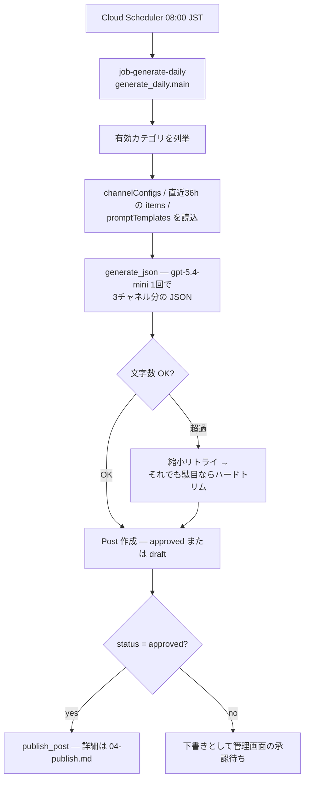
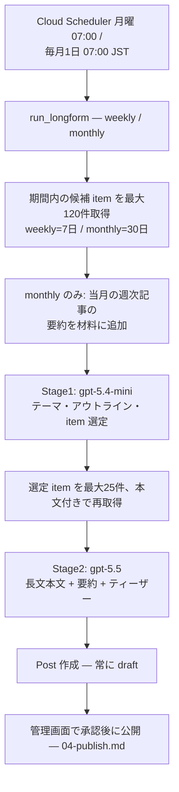

# ② 生成フロー詳細設計 — 日次短文と週次・月次長文

> 対象コード時点: コミット f703290 + 未コミット変更 / 最終更新: 2026-07-12

## 1. この文書で分かること

- 毎日 08:00(JST)の `job-generate-daily` が、収集アイテム(item)から X・Threads・Notion 向けの短文投稿(post)を LLM 1回の呼び出しで作り、承認不要なら即投稿するまでの仕組み。
- 月曜 07:00 の `job-generate-weekly` と毎月1日 07:00 の `job-generate-monthly` が、「安いモデルで素材選定 → 高性能モデルで本文執筆」という2段階で長文記事の下書き(`draft`)を作る仕組み。
- 文字数超過への多段防御、トークン数からのコスト概算、プロンプト(LLM への指示文)の2層構造という、このフロー特有の設計判断。

LLM(大規模言語モデル)とは、文章を読み書きできる AI のことです。本システムでは OpenAI 社のモデルを使い、収集済みの item を材料に投稿文を書かせます。フロー全体の位置づけ(①収集 → ②生成 → ③投稿)は `01-pipeline-foundation.md` を、直前の①収集は `02-collect.md` を、直後の③投稿は `04-publish.md` を参照してください。

## 2. 関連ファイル一覧

| ファイル | 役割 |
| --- | --- |
| `pipeline/app/jobs/generate_daily.py` | 日次ジョブ本体。カテゴリごとに短文生成 → 保存 → (承認不要なら)即投稿 |
| `pipeline/app/jobs/generate_weekly.py` | 週次ジョブの入口。`run_longform(Cadence.weekly)` を呼ぶだけの薄いラッパー |
| `pipeline/app/jobs/generate_monthly.py` | 月次ジョブの入口。`run_longform(Cadence.monthly)` を呼ぶだけ |
| `pipeline/app/jobs/longform_runner.py` | 週次・月次共通のジョブ骨格(カテゴリループ・保存・実行記録) |
| `pipeline/app/generators/daily.py` | 日次短文の生成ロジック(1回の LLM 呼び出しで3チャネル分を JSON 生成) |
| `pipeline/app/generators/longform.py` | 週次・月次長文の2段階生成ロジック |
| `pipeline/app/generators/openai_client.py` | OpenAI API の薄いラッパー。JSON モード呼び出しとコスト概算 |
| `pipeline/app/generators/prompts.py` | プロンプトの既定文面(`DEFAULTS`)と item 整形関数 |
| `pipeline/app/repo/items.py` | item の読み書き(期間指定取得・ID指定取得・使用済みマーク) |
| `pipeline/app/repo/posts.py` | post の読み書き(作成・カデンス別の直近取得ほか) |
| `pipeline/app/repo/configs.py` | カテゴリ・チャネル設定・プロンプトテンプレート・アプリ設定の読み取り |
| `pipeline/app/repo/runs.py` | ジョブ実行記録(`runs` コレクション)の開始・終了 |
| `pipeline/app/models.py` | データ構造の定義(`Post` `TokenUsage` `ChannelState` など) |
| `pipeline/app/publishers/renderer.py` | チャネル別の文字数規則(X の重み付きカウント等)。生成時の検査にも使う |
| `pipeline/app/config.py` | モデル名などの設定値(`openai_model_daily` / `openai_model_longform`) |

## 3. 全体フロー

### (a) 日次短文(job-generate-daily、毎日 08:00 JST)



日次はカテゴリごとに LLM を1回だけ呼び、X 用・Threads 用・Notion 用の3テキストをまとめて JSON で受け取ります。文字数を検査し、超過していれば「短く書き直せ」というリトライを1回、それでも Threads が長ければ機械的に切り詰めます。アプリ設定 `dailyRequireApproval` が無効(既定)なら post は `approved` で作られ、その場でジョブ内から投稿まで進みます。有効なら `draft` で止まり、管理画面での承認を待ちます。

### (b) 週次・月次長文(job-generate-weekly / job-generate-monthly)



長文は「選定」と「執筆」を分けた2段階です。Stage1 は安価なモデル(`gpt-5.4-mini`)に候補一覧(タイトル+要約)だけを渡してテーマ・章立て・使う item の ID を選ばせ、Stage2 は高性能モデル(`gpt-5.5`)に選ばれた item の本文全文を渡して記事を書かせます。月次は Stage1 の材料に当月の週次記事の要約を加える「階層的蓄積」を行います。生成結果は必ず `draft` で保存され、このジョブは投稿しません。承認後の公開で X/Threads のティーザー(本文へ誘導する短い宣伝文)末尾に Notion 公開 URL が付く、という後段の話は `04-publish.md` に譲ります。

## 4. 処理の流れ

### 4.1 日次(`generate_daily.main()` → `daily.generate_for_category()`)

1. **実行記録の開始** — `runs.start("generate_daily")` で Firestore の `runs` コレクションに開始レコードを作り、以降の統計(作成数・投稿数・失敗数・コスト)をここに集めます。
2. **カテゴリループ** — `configs.enabled_categories()` が返す有効カテゴリを1つずつ処理します。1カテゴリの失敗は `try/except` で捕まえて記録し、次のカテゴリへ進みます(§7)。
3. **チャネル設定の読込** — `configs.channel_config()` で category×cadence×channel ごとの設定(有効/無効と言語)を X・Threads・Notion の3件読みます。**3チャネルすべて無効ならそのカテゴリはスキップ**(`None` を返す)。設定ドキュメントが存在しないチャネルは「無効・英語」として扱われます。
4. **直近アイテムの取得** — `items.recent_for_category(category.slug, LOOKBACK_HOURS, limit=MAX_ITEMS)` で **直近36時間**(`LOOKBACK_HOURS = 36`)の item を新しい順に**最大15件**(`MAX_ITEMS = 15`)取得。0件ならスキップします。36時間なのは、毎日 06:00 の収集が1回失敗しても前日分でカバーできる余裕を持たせるためです。
5. **プロンプト構築** — `configs.prompt_template(category.slug, Cadence.daily)` で Firestore の `promptTemplates` からテンプレートを読み(無い・無効ならスキップ)、`userPromptTemplate.format(...)` にプレースホルダを流し込みます。item 一覧は `prompts.format_items_for_prompt()` が「タイトル/要約/URL」の箇条書きに整形。言語は `channelConfigs` の値(`ja`/`ko`/`en`)を "Japanese" 等の英語名に変換して `x_language` などとして注入します(プロンプト本文は内容の指示だけを担い、言語は設定から来る、という分業)。**焦点キーワード**(`template.focusKeywords`)は `{keywords}` として渡され、さらに `prompts.apply_keywords()` が「テンプレに `{keywords}` が無ければ焦点指示の一文を末尾に自動付加」します。これにより、ユーザーがシステムプロンプトを編集しなくても、キーワード欄を入れるだけで生成の焦点が変わります(週次・月次も同様に第1段の選定プロンプトと第2段の執筆プロンプトの両方へ付加)。
6. **LLM 1回で3チャネル分を JSON 生成** — `openai_client.generate_json()` を1回呼び、`x_text` / `threads_text` / `notion_title` / `notion_summary` を持つ JSON を受け取ります。モデルはテンプレートの `modelOverride`、無ければ `config.py` の `openai_model_daily`(既定 `gpt-5.4-mini`)。トークン使用量は `TokenUsage` に累積されます。
7. **文字数検査と縮小リトライ** — `x_text` はまず `renderer.strip_urls()` で URL を除去(日次の X 投稿は原則 URL 無しの方針)。`renderer.fits_x()`(重み付き280字)か `renderer.fits_threads()`(500字)に落ちたら、`_shrink_retry()` で「前回の出力を添えて短く書き直せ」と同じモデルにもう1回だけ依頼。それでも Threads が超過するときは末尾を切って「…」を付けるハードトリム。X はトリムせず、超過分は `renderer.split_for_x_thread()` で連投スレッドに分割します(§6.2)。
8. **Post の組み立て** — `Post` を `cadence=daily` で作ります。`status` は `dailyRequireApproval` が真なら `draft`、偽(既定)なら `approved`。Notion 向けには `notion_summary` を `body` にも入れます。アプリ設定 `attachImages` が有効なら、直近 item のうち最初に画像を持つものの GCS パスを X/Threads の添付画像として記録します。無効なチャネルは最初から `skipped` 状態です。
9. **保存と使用済みマーク** — `posts.create(post)` で保存し、`items.mark_used()` で材料にした item 全件へ post ID を記録します(管理画面で「この item はどの投稿に使われたか」を追えるように)。
10. **即投稿** — post が `approved` のときだけ `publish_post(post_id)` を呼びます。公開順(notion → x → threads)や冪等性の仕組みは本文書の範囲外で、`04-publish.md` を参照してください。`draft` のまま止まった場合はログに残して次のカテゴリへ。
11. **実行記録の確定** — 全カテゴリ処理後、`runs.finish()` で統計・エラー一覧・概算コストを書き込みます。

### 4.2 週次・月次(`run_longform()` → `longform.generate_for_category()`)

1. **共通骨格** — `generate_weekly.py` / `generate_monthly.py` はそれぞれ `run_longform(Cadence.weekly)` / `run_longform(Cadence.monthly)` を呼ぶだけです。カデンス(cadence=投稿頻度の種別)以外のロジックは `longform_runner.py` と `longform.py` で完全に共通化されています。ジョブ種別名は `generate_weekly` / `generate_monthly` として `runs` に記録されます。
2. **テンプレートと候補の取得** — カテゴリごとに `promptTemplates` を読み(無ければスキップ)、`items.recent_for_category()` で候補 item を取得します。振り返り期間は `LOOKBACK = {weekly: 7*24, monthly: 30*24}`(時間)、つまり週次7日・月次30日で、上限は `MAX_CANDIDATES = 120` 件。**候補が3件未満なら「材料不足」としてスキップ**します。
3. **Stage1: 選定とアウトライン(安いモデル)** — 候補を `format_items_for_prompt(candidates, include_ids=True)` で「`[item ID]` タイトル/要約/URL」形式に整形します(この段階では本文全文は渡さない)。**月次のみ**、`_weekly_summaries_for_month()` が当月の週次記事のタイトルと要約を `[weekly:postID]` 行として追記します — 月次レポートが週次記事の積み上げの上に立つ「階層的蓄積」です。これを `openai_model_daily`(`gpt-5.4-mini`)に渡し、`theme`(週/月を貫くテーマ)・`title`・`outline`(章立て)・`selected_item_ids`(使う item の ID、15〜25件を指示)を JSON で受け取ります。
4. **選定結果の確定** — 返ってきた ID から文字列でないものを除き、`MAX_SELECTED = 25` 件に切り詰め、`weekly:` で始まる ID(週次記事への参照であり item ではない)を除外してから `items.get_many()` で実体を引き直します。1件も解決できなければ、保険として候補の先頭25件をそのまま使います。
5. **Stage2: 本文執筆(高性能モデル)** — 選ばれた item を今度は `max_content=4000` 付きで整形し、**各 item の本文全文(最大4,000字)** をプロンプトに含めます。Stage1 の `theme` と `outline` も添えて、`modelOverride` または `openai_model_longform`(既定 `gpt-5.5`)に渡し、`title` / `body`(Markdown の長文。週次1,200〜1,800語、月次3,000〜5,000語を既定プロンプトで指示)/ `summary` / `teasers`(X・Threads 用ティーザー)を受け取ります。
6. **Post の組み立て — 常に `draft`** — 長文の `Post` は無条件に `status=draft` です(週次・月次は必ず人間の承認を挟む運用決定)。本文は `body` に、X/Threads チャネルにはティーザー文だけを入れます(公開 URL は承認後の公開処理で付く)。Notion チャネルの `text` は空で、公開時に `body` からページが組み立てられます。X ティーザーは `strip_urls()` で URL を除去しますが、**日次と違い文字数検査や縮小リトライはここでは行いません**(既定プロンプトで X 200字・Threads 400字以下を指示し、URL 追記時の切り詰めは公開側 `renderer.append_url()` が担当)。
7. **保存と記録** — 日次と同じく `posts.create()` → `items.mark_used()` → `runs.finish()`。投稿処理は一切呼びません。承認後の公開は管理画面から pipeline-api 経由で行われます(`04-publish.md`)。

## 5. 関数リファレンス(呼び出し順)

### generate_daily.main()

- **役割**: 日次ジョブのエントリポイント。`python -m app.jobs.generate_daily` で起動される。
- **入出力**: 引数・戻り値なし。副作用として `posts` / `items` / `runs` を更新し、承認不要時は外部 SNS へ投稿する。
- **呼び出し元・先**: Cloud Run Job `job-generate-daily`(Cloud Scheduler `0 8 * * *` JST)から起動 → `configs.enabled_categories()`、`daily.generate_for_category()`、`posts.create()`、`items.mark_used()`、`publish_post()`、`runs.start()/finish()`。
- **外部アクセス**: Firestore。`publish_post` 経由で Notion/X/Threads API(詳細は `04-publish.md`)。
- **要点**: カテゴリ単位の例外隔離。post 作成後に `post.status != PostStatus.approved` なら投稿せずログだけ残す。`run.costUsd` に各 post の概算コストを小数6桁で累積。

### daily.generate_for_category()

- **役割**: 1カテゴリ分の日次短文 post を作る中核関数。
- **入出力**: `Category` を受け取り、`Post | None` を返す(スキップ時 `None`。保存は呼び出し元)。
- **呼び出し元・先**: `generate_daily.main()` から → `configs.channel_config()/prompt_template()/app_settings()`、`items.recent_for_category()`、`prompts.format_items_for_prompt()`、`generate_json()`、`_shrink_retry()`、`renderer.strip_urls()/fits_x()/fits_threads()/split_for_x_thread()`。
- **外部アクセス**: Firestore 読み取り、OpenAI API(1〜2回)。
- **要点**: スキップ条件は3つ — 全チャネル無効・直近36時間の item 0件・テンプレート無し/無効。LLM 呼び出しは通常1回で3チャネル分をまかなう(チャネル別に呼ばないのでコストが1/3)。X 本文が280重み字を超えたままでも、スレッド分割(`threadParts`)で吸収するためエラーにしない。

### daily._shrink_retry()

- **役割**: 文字数超過時の1回限りの修正パス。「前回の出力」をプロンプトに埋め込み、同じ JSON をより短く再生成させる。
- **入出力**: モデル名・system/user プロンプト・前回の結果 dict・累積用 `TokenUsage` → 新しい結果 dict。
- **呼び出し元・先**: `generate_for_category()` から条件付きで1回だけ → `generate_json()`。
- **要点**: 依頼する長さは「X 250重み字・Threads 480字」と、実際の上限(280/500)より意図的に厳しい値。LLM は指示をやや超えがちなので余裕を持たせている。リトライ分のトークンも同じ `usage` に累積される。

### longform_runner.run_longform()

- **役割**: 週次・月次共通のジョブ骨格。日次の `main()` から「即投稿」を除いた形。
- **入出力**: `Cadence`(`weekly` / `monthly`)を受け取る。戻り値なし。
- **呼び出し元・先**: `generate_weekly.main()` / `generate_monthly.main()` から → `longform.generate_for_category()`、`posts.create()`、`items.mark_used()`、`runs.start()/finish()`。
- **要点**: `job_type = f"generate_{cadence.value}"` として `runs` に記録するので、管理画面では週次と月次が別ジョブとして見える。`publish_post` を呼ぶコードパスが存在しない=長文が誤って自動投稿される余地が構造的にない。

### longform.generate_for_category()

- **役割**: 1カテゴリ分の長文下書きを2段階生成で作る中核関数。
- **入出力**: `Category` と `Cadence` → `Post | None`(常に `status=draft`)。
- **呼び出し元・先**: `run_longform()` から → `configs.*`、`items.recent_for_category()/get_many()`、`_weekly_summaries_for_month()`(月次のみ)、`prompts.format_items_for_prompt()`、`generate_json()`(2回)。
- **外部アクセス**: Firestore、OpenAI API(Stage1 と Stage2 で計2回)。
- **要点**: Stage1 は `openai_model_daily`、Stage2 は `modelOverride or openai_model_longform` と、**`modelOverride` が効くのは Stage2 だけ**。Stage1 のプロンプトは `outlineSystemPrompt` / `outlineUserPromptTemplate` が空だと `prompts.WEEKLY_OUTLINE_SYSTEM` と `"{items}"` に落ちる(月次でも週次用の既定文に落ちる点に注意)。

### longform._weekly_summaries_for_month()

- **役割**: 月次 Stage1 の材料として、同カテゴリ・直近31日以内に作られた週次 post のタイトルと要約を1つの文字列に組み立てる。
- **入出力**: カテゴリ slug → `"[weekly:postID] タイトル\n  要約"` を改行連結した文字列(該当なしなら空文字)。
- **呼び出し元・先**: `generate_for_category()`(月次のみ)から → `posts.recent_by_cadence("weekly", limit=8)`。
- **要点**: Firestore クエリは「週次 post を新しい順に8件」だけで、カテゴリと31日以内の絞り込みは Python 側で行う(カテゴリ数×週数が小さい前提の単純化)。ID に `weekly:` 接頭辞を付けるのは、Stage1 が誤ってこれを item として選定しても後段で除外できるようにするため。

### openai_client.generate_json()

- **役割**: OpenAI Chat Completions を JSON モードで1回呼び、結果を dict で返す。全生成処理が通る唯一の LLM 呼び出し口。
- **入出力**: モデル名・system プロンプト・user プロンプト・累積用 `TokenUsage` → `dict`(パース済み JSON)。
- **呼び出し元・先**: `daily.generate_for_category()`、`daily._shrink_retry()`、`longform.generate_for_category()` から → OpenAI SDK(`chat.completions.create`)、`cost_usd()`。
- **外部アクセス**: OpenAI API(API キーは Secret Manager から `config.py` 経由)。
- **要点**: `response_format={"type": "json_object"}` で「必ず有効な JSON を返す」モードを使うため、正規表現でのテキスト切り出しが不要。使用トークンを `usage` 引数に**加算**していくので、複数回呼んでも post 1件分の合計が自然に得られる(§6.1)。

### openai_client.cost_usd()

- **役割**: 入出力トークン数から概算コスト(USD)を計算する。
- **入出力**: モデル名・入力トークン数・出力トークン数 → 小数6桁の USD。
- **要点**: 単価表 `PRICES` はコード内の固定値で、**gpt-5.4-mini = 入力 $0.75 / 出力 $4.50、gpt-5.5 = 入力 $5.00 / 出力 $30.00(いずれも100万トークンあたり)**。これは**請求とは別の「コスト目安」**であり、OpenAI の実請求額とは一致しない(価格改定に自動追従しないし、`PRICES` に無いモデル名は $0 として扱われる)。実額は OpenAI ダッシュボードで確認する(`../../runbook.md` のコスト監視参照)。

### prompts.format_items_for_prompt()

- **役割**: item のリストを LLM に渡すテキストに整形する共通関数。
- **入出力**: `Item` のリスト、`include_ids`(`[item ID]` 接頭辞を付けるか)、`max_content`(0より大きければ本文全文を最大その文字数まで添付)→ 複数行文字列。
- **呼び出し元・先**: 日次(ID なし・要約のみ)、長文 Stage1(ID あり・要約のみ)、長文 Stage2(ID あり・`max_content=4000` で全文添付)から。
- **要点**: 要約が空の item は本文先頭300字で代用。`include_ids` は Stage1 に「選んだ item を ID で答えさせる」ために必須。item の本文自体は収集時に1万字で切られている(`models.py` の `Item.contentText`)。

### 参照する Firestore アクセス関数(repo 層)

| 関数 | 役割(生成フローから見た範囲) |
| --- | --- |
| `configs.enabled_categories()` | `enabled=true` のカテゴリを `sortOrder` 順で返す。両ジョブのループ対象 |
| `configs.prompt_template()` | `promptTemplates/{category}_{cadence}` を読む。**ドキュメントが無い、または `enabled=false` なら `None`**(=そのカテゴリをスキップ) |
| `configs.channel_config()` | `channelConfigs/{category}_{cadence}_{channel}` を読む。無ければ「無効・英語」の既定値を返す |
| `configs.app_settings()` | `settings/app`(`dailyRequireApproval` / `attachImages` など)を読む |
| `items.recent_for_category()` | `categoryId` と `collectedAt >= now - hours` で絞り、新しい順に `limit` 件 |
| `items.get_many()` | ID リストから item をまとめて取得(存在しない ID は黙って落ちる) |
| `items.mark_used()` | 各 item の `usedInPostIds` に post ID を `ArrayUnion` で追記(バッチ書き込み) |
| `posts.create()` | `createdAt` を付けて `posts` に追加し、自動採番された ID を返す |
| `posts.recent_by_cadence()` | カデンス指定で新しい順に post を取得(月次の階層的蓄積が使用) |
| `runs.start()` / `runs.finish()` | 実行記録の開始・確定。スキーマは `../03-data-model.md` 参照 |

## 6. 難所解説

### 6.1 JSON モード生成とコスト累積 — `openai_client.generate_json()`

`pipeline/app/generators/openai_client.py` の中心部です。

```python
def generate_json(
    model: str, system_prompt: str, user_prompt: str, usage: TokenUsage
) -> dict:
    """One JSON-mode completion; accumulates tokens/cost into `usage`."""
    resp = _client().chat.completions.create(
        model=model,
        messages=[
            {"role": "system", "content": system_prompt},
            {"role": "user", "content": user_prompt},
        ],
        response_format={"type": "json_object"},
    )
    if resp.usage:
        usage.inputTokens += resp.usage.prompt_tokens
        usage.outputTokens += resp.usage.completion_tokens
        usage.costUsd = round(
            usage.costUsd + cost_usd(model, resp.usage.prompt_tokens, resp.usage.completion_tokens),
            6,
        )
    return json.loads(resp.choices[0].message.content or "{}")
```

- `usage: TokenUsage` — 戻り値で返すのではなく、呼び出し側が持つ入れ物に**加算**する設計。日次の「初回+縮小リトライ」や長文の「Stage1+Stage2」のように複数回呼んでも、post 1件の合計トークン・合計コストが自動的にまとまる。
- `messages=[system, user]` — system(役割と禁止事項: 「提供された item の事実のみ使う」等)と user(当日の材料と出力仕様)の2通だけ。会話履歴は持たない使い切り呼び出し。
- `response_format={"type": "json_object"}` — JSON モード。モデルが構文的に正しい JSON だけを返すことを API 側が保証するため、後段は `json.loads` 一発でよい。ただし**キーの有無までは保証されない**ので、呼び出し側は `result.get("x_text", "")` のように欠損に耐える書き方をしている。
- `if resp.usage:` — API が返した実測トークン数(プロンプト側と生成側)を読む。トークンとは LLM が文章を数える課金単位(日本語はおおむね1〜2文字で1トークン)。
- `usage.costUsd = round(..., 6)` — `cost_usd()` は `PRICES` の単価(100万トークンあたり USD)から計算した**目安**。この値が post の `tokenUsage.costUsd` になり、さらにジョブ側で `run.costUsd` に集計されて管理画面のコスト表示の元になる。実請求とは別物である点は §5 の `cost_usd()` 参照。
- `or "{}"` — 応答本文が空だった場合に空 dict へ倒し、パース例外ではなく「値が全部欠けている」扱いにする保険。

### 6.2 文字数超過の多段防御 — `daily.generate_for_category()`

X は単純な文字数ではなく「重み付き文字数」(全角=2、半角=1、URL は一律23)で280が上限、Threads は素の500字が上限です(`pipeline/app/publishers/renderer.py`)。LLM は「250字以内で」と指示しても超えることがあるため、日次は3段構えで守ります。

```python
    x_text = renderer.strip_urls(str(result.get("x_text", "")))
    threads_text = str(result.get("threads_text", ""))
    if not renderer.fits_x(x_text) or not renderer.fits_threads(threads_text):
        result = _shrink_retry(model, template.systemPrompt, user_prompt, result, usage)
        x_text = renderer.strip_urls(str(result.get("x_text", "")))
        threads_text = str(result.get("threads_text", ""))
    # last resort: hard-trim so the daily run never dies on length
    if not renderer.fits_threads(threads_text):
        threads_text = threads_text[: renderer.THREADS_LIMIT - 1] + "…"

    x_parts = renderer.split_for_x_thread(x_text)
```

- **第1段(予防)**: プロンプト自体が X 250重み字・Threads 480字と、上限より2〜4%厳しい値を指示(`prompts.DAILY_USER`)。`strip_urls()` は生成文に紛れ込んだ URL を除去する(URL 1つで重み23を食うため、日次 X は URL を載せない方針)。
- **第2段(縮小リトライ)**: どちらかが超過したら `_shrink_retry()` を**1回だけ**。前回の出力を丸ごと見せて「同じ JSON をもっと短く」と依頼するので、内容を保ったまま縮む可能性が高い。リトライは追加コストなので無限には行わない。
- **第3段(ハードトリム)**: それでも Threads が超過したら `THREADS_LIMIT - 1`(=499字)で切って「…」を付ける。文としては不格好でも、**日次ジョブが文字数だけを理由に落ちることは絶対にない**という保証を優先した「last resort」。
- **X だけトリムしない理由**: 最後の行の `split_for_x_thread()` が、超過した X 本文を文境界で分割し「 (1/3)」のような連番付きの連投スレッドに変換するため、切り捨てる必要がない。分割結果が2件以上のときだけ `Post.channels["x"].threadParts` に保存され、公開側が順に投稿する。

なお週次・月次のティーザーはこの検査を通りません。長文は人間の承認を挟むうえ、公開時の URL 追記で `renderer.append_url()` が上限に収まるまで本文を削るため、生成段階では厳密でなくてよいという割り切りです。

### 6.3 2段階生成のモデル使い分け — `longform.generate_for_category()`

```python
    outline = generate_json(
        settings.openai_model_daily,
        template.outlineSystemPrompt or prompts.WEEKLY_OUTLINE_SYSTEM,
        outline_user,
        usage,
    )
    selected_ids = [
        i for i in outline.get("selected_item_ids", []) if isinstance(i, str)
    ][:MAX_SELECTED]
    selected = items.get_many([i for i in selected_ids if not i.startswith("weekly:")])
    if not selected:
        selected = candidates[:MAX_SELECTED]
    # …(中略: Stage2 用プロンプト組み立て)…
    model = template.modelOverride or settings.openai_model_longform
    article = generate_json(model, template.systemPrompt, article_user, usage)
```

- **Stage1 は `openai_model_daily`(`gpt-5.4-mini`)** — 最大120件の候補の「タイトル+要約」を読ませて選定と章立てだけをさせる。入力は大きいが出力は小さい仕事なので、単価が gpt-5.5 の 1/6.7(入力)しかない mini で十分。
- **Stage2 は `openai_model_longform`(`gpt-5.5`)** — 入力を「選ばれた最大25件×本文最大4,000字」に絞り込んだうえで、品質が問われる長文執筆だけを高いモデルにやらせる。**もし1段階で「120件の全文を gpt-5.5 に読ませて書かせる」と、入力トークンが桁で増え、かつ選定と執筆を同時にやらせて品質も落ちる**。この分業がコストと品質のトレードオフの答えになっている。
- `if isinstance(i, str)` と `[:MAX_SELECTED]` — LLM の返す `selected_item_ids` は形式が乱れうる(数値混入・過剰な件数)ため、型と件数をコード側で強制する。
- `not i.startswith("weekly:")` — 月次で材料に混ぜた週次記事の参照 ID は item ではないので、実体の取得対象から外す(要約として読ませること自体が目的で、Stage2 の「全文素材」には使わない)。
- `if not selected: selected = candidates[:MAX_SELECTED]` — Stage1 が実在しない ID ばかり返しても、新しい順の先頭25件で Stage2 を続行するフォールバック。「選定の失敗」で週次記事が丸ごと欠番になるより、平凡でも記事が出るほうがよいという判断。
- `template.modelOverride or ...` — カテゴリ×カデンス単位でモデルを差し替えられるのは Stage2 のみ。選定はどのカテゴリでも mini で固定。

### 6.4 プロンプトの2層構造 — Firestore `promptTemplates` と `prompts.DEFAULTS`

プロンプトは「コード内の既定値」と「Firestore 上の実体」の2層です。`pipeline/app/generators/prompts.py` の `DEFAULTS`(daily は system+user、weekly/monthly はさらに outline 用2種)は、seed ジョブが初回に `promptTemplates/{category}_{cadence}` として Firestore へ書き込むための**雛形**であり、**実行時に読まれるのは常に Firestore 側**です。管理画面での編集は Firestore を書き換えるだけで即反映され、コードのデプロイは不要です。

```python
    template = configs.prompt_template(category.slug, Cadence.daily)
    if template is None:
        ...
        return None

    today = datetime.now(timezone.utc).strftime("%Y-%m-%d")
    user_prompt = template.userPromptTemplate.format(
        items=prompts.format_items_for_prompt(recent),
        category=category.name,
        date=today,
        language=LANG_NAMES.get(cfg_no.language, cfg_no.language),
        x_language=LANG_NAMES.get(cfg_x.language, cfg_x.language),
        threads_language=LANG_NAMES.get(cfg_th.language, cfg_th.language),
        notion_language=LANG_NAMES.get(cfg_no.language, cfg_no.language),
    )
    model = template.modelOverride or settings.openai_model_daily
```

- `configs.prompt_template()` — Firestore から読む層。ドキュメントが無い/無効なら `None` で、**既定値には自動で落ちない**(seed 前のカテゴリは生成されない)。
- `.format(items=..., category=..., date=..., language=...)` — テンプレート本文の `{items}` などのプレースホルダに実データを流し込む。日次はさらにチャネル別言語(`{x_language}` `{threads_language}` `{notion_language}`)、長文 Stage2 は `{theme}` `{outline}` が使える。**管理画面でテンプレートを編集する際、その cadence で渡されないプレースホルダ(例: 日次に `{theme}`)を書くと `KeyError` になり、そのカテゴリの生成が失敗する**(§7 の隔離で他カテゴリには波及しない)。
- 言語の分離 — テンプレートは「何を書くか」だけを指示し、「何語で書くか」は `channelConfigs` から注入される契約(`prompts.py` 冒頭の docstring)。X=日本語/Threads=韓国語/Notion=英語という運用は、この注入値を変えるだけで切り替えられる。
- `modelOverride or ...` — テンプレート単位のモデル上書き。空文字なら `config.py` の既定へ。ここで `PRICES` に無いモデル名を指定するとコスト目安が $0 になる点に注意(§5 `cost_usd()`)。

## 7. エラー時の挙動

- **カテゴリ単位の隔離**: `generate_daily.main()` と `run_longform()` はどちらも、生成中の例外を `try/except` で捕まえて `run.errors` に `"generate {slug}: {原因}"` を追記し、**次のカテゴリの処理を続行**します。1カテゴリのプロンプト不備や API エラーで全カテゴリが道連れになることはありません。日次の投稿失敗(`publish {postId}: ...`)も同様に記録して続行します。
- **スキップ条件(エラーではなく正常系)**: 日次は「3チャネルすべて無効」「直近36時間の item 0件」「テンプレート無し/無効」で、長文は「テンプレート無し/無効」「候補 item 3件未満」で、その回のそのカテゴリを黙って(ログには残して)スキップします。スキップは `run.errors` に載らず `ok` にも影響しません。
- **runs への記録**: 開始時に `runs.start()`、終了時に `runs.finish()` で `ok`(エラー0件なら真)・`stats`(`postsCreated` / `published` / `failed`)・`errors`・`costUsd` が確定します。管理画面のジョブ履歴はこのコレクションを表示しています。
- **ジョブ全体が落ちた場合**: 生成系3ジョブは投稿を伴いうるため Cloud Run Job の `--max-retries=0` でデプロイされており、自動再実行されません(二重投稿防止。`01-pipeline-foundation.md`)。`runs` に `finishedAt` の無いレコードが残るのがサインです。
- **OpenAI の quota(利用枠)超過・障害時**: `generate_json()` は例外をそのまま投げるので、上記の隔離により「全カテゴリぶん同じエラーが並ぶ」形になります。対応手順(枠の確認・時間を置いた手動再実行)は `../../runbook.md` を参照してください。

## 8. 関連テスト

`pipeline/tests/` を確認した結果を正直に書くと、**`generators/`(daily.py・longform.py・openai_client.py・prompts.py)と `jobs/generate_*.py` を直接対象にした単体テストは存在しません**。出力が LLM 次第で決定的でないことが主因です。そのぶん、周辺の決定的なロジックがテストで固められています。

| テスト | 生成フローとの関係 |
| --- | --- |
| `pipeline/tests/test_renderer.py` | 日次が使う文字数規則そのもの。全角=2/URL=23 の重み、`fits_x` / `fits_threads` の境界、`split_for_x_thread` の連番と各パートの上限、`strip_urls`、`append_url` の切り詰めを検証 |
| `pipeline/tests/test_publish_orchestration.py` | 生成が作った `Post` の「契約」を下流側から検証。日次 X に URL が付かないこと、週次ティーザーに Notion URL が追記されること、`skipped` チャネルの扱いなど |
| `pipeline/tests/test_api.py` | pipeline-api 経由のジョブ起動・公開エンドポイントの入口を検証 |

つまり「LLM が何を書くか」は守れないが、「書かれたものが各チャネルの制約に収まる/収まるように加工される」ことと「post の形が公開処理と噛み合う」ことは間接的に守られています。生成ロジックを変更したら、最低限 `cd pipeline && pytest` で回帰がないことを確認し、決定的な部分(例: `_weekly_summaries_for_month()` のフィルタ、`format_items_for_prompt()` の整形)を触る場合はテスト追加を検討してください。

## 9. 変更するときは

| 変更したいこと | 触る場所 | 注意 |
| --- | --- | --- |
| 使用モデルの変更 | `pipeline/app/config.py` の `openai_model_daily` / `openai_model_longform` **と** 本番ジョブの環境変数上書き(`gcloud run jobs describe` で確認)の**両方** | 片方だけ変えると本番と手元で挙動が乖離する(CLAUDE.md 記載の落とし穴)。`openai_client.py` の `PRICES` にも新モデルの単価を追加しないとコスト目安が $0 になる |
| 特定カテゴリだけモデルを変える | 管理画面で該当 `promptTemplates` の `modelOverride` を設定 | 効くのは日次と長文 Stage2 のみ。Stage1 は常に `openai_model_daily` |
| プロンプトの文面変更 | 運用中は**管理画面**(Firestore の `promptTemplates` を直接編集、即反映) | `prompts.py` の `DEFAULTS` は seed 時の雛形にすぎず、変更しても既存ドキュメントには反映されない(新カテゴリの seed にだけ効く)。プレースホルダはその cadence で渡されるものだけを使う(§6.4) |
| 文字数制限の変更 | `pipeline/app/publishers/renderer.py`(`X_LIMIT` / `THREADS_LIMIT`)**と** `admin/src/lib/textLimits.ts` の同名定数 | 2箇所は手動ミラー。さらに `prompts.py` の既定プロンプト内の指示値(250/480、ティーザー200/400)と `daily._shrink_retry()` の文言(250/480)も揃えること |
| 日次の振り返り時間・件数 | `pipeline/app/generators/daily.py` の `LOOKBACK_HOURS`(36)/ `MAX_ITEMS`(15) | 件数を増やすと入力トークンが線形に増える。パラメータ一覧は `../04-parameters.md` |
| 長文の候補数・選定数・期間 | `pipeline/app/generators/longform.py` の `LOOKBACK` / `MAX_CANDIDATES`(120)/ `MAX_SELECTED`(25)と最少件数(3) | `MAX_SELECTED`×`max_content=4000` が Stage2 の入力サイズを決める。既定プロンプトの「15-25 ids」の文言とも整合させる |
| 日次を承認制にする | 管理画面から `settings/app` の `dailyRequireApproval` を true に | コード変更不要。post が `draft` で止まり、承認後の公開は `04-publish.md` の経路 |
| 単価表の更新 | `pipeline/app/generators/openai_client.py` の `PRICES` | あくまで目安値。実請求は OpenAI ダッシュボード(`../../runbook.md`) |
| post / run のフィールド追加 | `pipeline/app/models.py` → `../03-data-model.md#posts` を更新 | admin 側の表示(`admin/src/lib/data.ts`)と `shared/constants.json` の enum に影響しないか確認 |

スケジュール(08:00 / 月曜 07:00 / 毎月1日 07:00)を変えたい場合は `infra/20-schedulers.sh` の cron 式を編集して再実行します(`01-pipeline-foundation.md`)。
