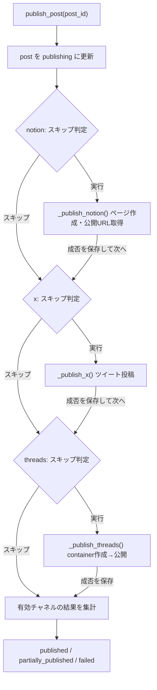

# 詳細設計 04: 投稿(publish)— オーケストレーションとチャネル別クライアント

> 対象コード時点: コミット f703290 + 未コミット変更 / 最終更新: 2026-07-12

## 1. この文書で分かること

- 生成済みの投稿(post)が **Notion → X → Threads の固定順** で公開されるまでの全ロジックと、順序が固定である理由。
- 途中でクラッシュしても二重投稿にならない仕組み(チャネル毎のスキップ判定・`externalId`・Threads の `containerId` 永続化)。
- X の OAuth 1.0a 署名と加重文字数、Threads の 2 段階公開、Notion の Markdown→ブロック変換という、3 つの外部 API クライアントの実装詳細。

本章は README フロー③のうち「実際に投稿する側」を扱う。管理画面からの HTTP 入口(承認・リトライのエンドポイント)は [05-pipeline-api.md](05-pipeline-api.md)、投稿の本文・ティーザー(本文へ誘導する短い紹介文)を作る側は [03-generate.md](03-generate.md) を参照。

用語の統一: **投稿(post)** = 生成ジョブが作った 1 記事分のデータ(Firestore `posts` の 1 ドキュメント)。**チャネル** = 公開先サービス(X / Threads / Notion)。**オーケストレーション** = 複数チャネルへの投稿を正しい順序・条件で束ねる調整処理。

## 2. 関連ファイル一覧

| ファイル | 役割 |
| --- | --- |
| `pipeline/app/publishers/base.py` | オーケストレータ。`publish_post()` が本章の主役 |
| `pipeline/app/publishers/renderer.py` | 文字数計算(X の加重カウント)・スレッド分割・URL 付与 |
| `pipeline/app/publishers/x.py` | X API v2 クライアント。OAuth 1.0a 署名を自前実装 |
| `pipeline/app/publishers/threads.py` | Threads Graph API クライアント(container 方式の 2 段階公開) |
| `pipeline/app/publishers/notion.py` | Notion API クライアント。Markdown→ブロック変換とページ作成 |
| `pipeline/app/utils/gcs.py` | 画像のダウンロード(`download_bytes()`)と署名 URL 発行(`signed_url()`) |
| `pipeline/app/utils/retry.py` | `api_retry`(自動再試行)と `PermanentPublishError`(基盤は [01-pipeline-foundation.md](01-pipeline-foundation.md)) |
| `pipeline/app/repo/posts.py` | 投稿状態の Firestore 保存(`update_channel()` / `set_status()`) |
| `pipeline/app/models.py` | `ChannelState` / `PostStatus` / `ChannelStatus`(スキーマは [../03-data-model.md#posts](../03-data-model.md#posts)) |
| `pipeline/app/jobs/generate_daily.py` | 呼び出し元①: 日次ジョブ。生成直後に自動で `publish_post()` を呼ぶ |
| `pipeline/app/main.py` | 呼び出し元②: pipeline-api の承認・リトライ([05-pipeline-api.md](05-pipeline-api.md)) |
| `admin/src/lib/textLimits.ts` | 管理画面用の文字数ルール近似ミラー(TypeScript 実装) |
| `pipeline/tests/test_publish_orchestration.py` ほか 3 本 | 本章の挙動を固定するテスト(§8) |

## 3. 全体フロー



`publish_post()` は 3 チャネルを固定順で 1 つずつ処理する。各チャネルは独立した try/except に包まれており、**あるチャネルが失敗しても残りのチャネルは続行される**(失敗隔離)。成功・失敗いずれの場合も、そのチャネルの結果はループ内で即座に Firestore へ書き戻される(`posts.update_channel()`)。全チャネル終了後に有効チャネルの結果を集計し、post 全体の最終 status を決める。「スキップ判定」は既に公開済み・無効・明示スキップのチャネルを再実行しないための門番で、これが本フローの冪等性(べきとうせい: 同じ処理を何度実行しても結果が 1 回分にしかならない性質)を支えている。

## 4. 処理の流れ

1. **入口は 2 つ。** ① 日次ジョブ `pipeline/app/jobs/generate_daily.py` — 生成した post が `approved`(承認不要設定)なら即 `publish_post()` を呼ぶ。② pipeline-api(`pipeline/app/main.py`)— 管理画面からの承認公開(`/api/posts/{id}/publish`)と失敗チャネルの再試行(`/api/posts/{id}/retry-channel`、`only_channel` 指定で 1 チャネルだけ実行)。エンドポイントの仕様は [05-pipeline-api.md](05-pipeline-api.md)。
2. **post の取得と `publishing` への遷移。** `posts.get()` で Firestore から post を読み、存在しなければ `ValueError`。存在すれば `posts.set_status()` で status を `publishing` に更新する(管理画面で「公開中」と表示され、pipeline-api 側の二重公開ガードにも使われる)。
3. **Notion URL の初期化。** `notion_url` は post に既に保存されている Notion チャネルの `url` から初期化する。これにより「Notion は前回成功済みで X だけ再試行」というリトライでも、ティーザーに付ける URL が手に入る。
4. **公開順序は `["notion", "x", "threads"]` で固定。** 週次・月次の長文は Notion に全文を置き、X/Threads にはティーザー+Notion 公開 URL を流す設計のため、**URL の供給元である Notion を必ず先に公開する必要がある**。この順序は `pipeline/app/publishers/base.py` の `publish_post()` にリテラルで書かれている。
5. **チャネル毎のスキップ判定(冪等性の要)。** 各チャネルについて、(a) `only_channel` 指定時は対象外チャネル、(b) `ChannelState` が無い・`enabled=False`、(c) status が `published` または `skipped`、(d) `externalId` が既に入っている——のいずれかならスキップ。コードは §6-E 参照。
6. **Notion 公開(`_publish_notion()`)。** `post.body`(無ければ `post.summary`)の Markdown をブロック列へ変換し、Trend News データベースにページを作成。返ってきた page_id と URL を `externalId` / `pageId` / `url` に保存し、status を `published` にする。
7. **X 公開(`_publish_x()`)。** 本文は生成時に `ChannelState.text` へ保存済み。Notion URL は「日次以外」または「日次でも `settings/app` の `xAllowUrlOnDaily` が有効」のときだけ `renderer.append_url()` で末尾に付与する(日次は既定で URL なし——X は URL 付き投稿の単価が高いため。数値は [../04-parameters.md](../04-parameters.md))。画像があれば GCS からダウンロードしてメディアアップロードし、`threadParts`(生成時に分割済みの返信チェーン)があればそれを順に投稿する。先頭ツイート ID が `externalId` になり、`url` は `https://x.com/i/status/{id}` 形式。
8. **Threads 公開(`_publish_threads()`)。** Threads は「container(公開前の投稿の器)を作る → 処理完了を待つ → 公開する」という 2 段階 API。container 作成直後に `containerId` を Firestore へ保存するのがクラッシュ復旧の要(§6-B)。URL 付与は「日次以外」のみ(X と違い設定による例外なし)。画像は GCS の署名 URL(期限付きでダウンロードを許可する URL)として渡す。
9. **チャネル毎の結果保存。** 成功時は `error` を空にし、失敗時は status を `failed`・`error` に例外メッセージ(先頭 1000 文字)を入れて、いずれも `posts.update_channel()` で `channels.{channel}` フィールドを即時更新する。
10. **最終 status の集計。** `enabled=True` のチャネルだけを母集団に、`failed` と `published` が混在すれば `partially_published`、`failed` のみなら `failed`、それ以外は `published`(全チャネルがスキップでも `published` になる)。1 チャネルでも成功していれば `publishedAt` に現在時刻(UTC)を記録する。

## 5. 関数リファレンス(呼び出し順)

### base.py — オーケストレータ

#### `publish_post(post_id, only_channel="") -> Post`

- 役割: 上記フロー全体の実行。日次ジョブと pipeline-api の両方から呼ばれる唯一の公開入口。
- 入出力: 入力は post のドキュメント ID と(リトライ時のみ)対象チャネル名。出力は status 更新済みの `Post`。post が無ければ `ValueError`。
- 呼び出し元 → 先: `jobs/generate_daily.py` / `main.py` → `_publish_notion()` / `_publish_x()` / `_publish_threads()`、`posts.set_status()` / `posts.update_channel()`。
- 外部アクセス: Firestore(`posts` の読み書き)。
- 要点: チャネル単位の try/except で失敗を隔離。例外は握りつぶさず `ChannelState.failed` + `error` として保存する。

#### `_publish_notion(post) -> None`

- 役割: Notion ページ作成と `ChannelState` への結果反映。
- 入出力: `post.body or post.summary` を本文として `notion.publish()` に渡し、page_id と公開 URL を state に書く。
- 呼び出し元 → 先: `publish_post()` → `notion.publish()`、`_category_name()`(カテゴリ slug → 表示名の解決。Firestore `categories` を参照し、見つからなければ slug をそのまま使う)。
- 外部アクセス: Notion API・Firestore(カテゴリ読み取り)。
- 要点: ページの Date プロパティは実行時点の UTC 日付(`%Y-%m-%d`)。

#### `_publish_x(post, notion_url) -> None`

- 役割: X 向け本文の最終整形(URL 付与)と投稿。
- 入出力: `state.text`・`state.threadParts`・画像を `x.publish()` へ。戻りの先頭ツイート ID を `externalId` に。
- 呼び出し元 → 先: `publish_post()` → `renderer.append_url()`、`_load_image()`、`x.publish()`。
- 外部アクセス: X API(間接)、GCS(画像、間接)。
- 要点: URL 付与条件は「`notion_url` があり、かつ日次でない or `xAllowUrlOnDaily` 有効」。なお `append_url()` は `text` にしか作用しないため、`threadParts` がある投稿(現状は日次の長文のみ)では付与した URL は使われない——日次は既定で URL を付けないので実害はないが、`xAllowUrlOnDaily` を有効化する際は知っておくべき制限。

#### `_publish_threads(post, post_id, notion_url) -> None`

- 役割: Threads の 2 段階公開とクラッシュ復旧点の管理(§6-B)。
- 入出力: `state.text`(+条件付き URL)と画像署名 URL から container を作り、公開後のメディア ID を `externalId` に。
- 呼び出し元 → 先: `publish_post()` → `renderer.append_url()`、`gcs.signed_url()`、`threads.create_container()` / `wait_until_ready()` / `publish_container()`、`posts.update_channel()`。
- 外部アクセス: Threads Graph API、GCS(署名 URL 発行)、Firestore(`containerId` の即時保存)。
- 要点: 署名 URL の発行失敗は警告ログのみで本文だけの投稿に切り替える(投稿自体は止めない)。

#### `_load_image(post, state) -> tuple[bytes, str] | None`

- 役割: X 添付用に GCS から画像バイト列と MIME タイプを取得。
- 入出力: `state.imageGcsPath` → `(bytes, "image/jpeg" など)`。パスが無い・`settings/app` の `attachImages` が無効・ダウンロード失敗のときは `None`。
- 呼び出し元 → 先: `_publish_x()` → `gcs.download_bytes()`。
- 外部アクセス: GCS。
- 要点: MIME は拡張子からの単純推定(`jpg` → `image/jpeg`、それ以外は `image/{ext}`)。失敗しても例外にせず画像なしで続行。

### renderer.py — 本文整形と文字数ルール

#### `x_weighted_length(text) -> int`

- 役割: X 公式仕様の「加重文字数」を計算する(§6-C)。
- 入出力: 文字列 → 加重長(全角系 = 2、それ以外 = 1、URL は一律 23)。
- 呼び出し元: `fits_x()`、`split_for_x_thread()`、生成側([03-generate.md](03-generate.md))。
- 外部アクセス: なし(純関数)。

#### `fits_x(text)` / `fits_threads(text) -> bool`

- 役割: 上限判定。X は加重 280(`X_LIMIT`)、Threads は素の文字数 500(`THREADS_LIMIT`)。
- 呼び出し元: `append_url()` に判定関数として渡されるほか、生成側の再生成判定にも使われる。
- 要点: この 2 定数を変えるときは管理画面ミラー `admin/src/lib/textLimits.ts` も必ず揃える(§9)。

#### `split_for_x_thread(text, limit=280) -> list[str]`

- 役割: 280 を超える X 本文を返信チェーン(スレッド)用に分割する。
- 入出力: 文字列 → 各要素が上限内のリスト。複数要素になった場合のみ各末尾に ` (i/n)` の連番を付ける。
- 要点: 実効予算は `limit - 8`(連番 ` (10/10)` の 8 文字分を確保)。まず文末記号(`.!?。！？`)で文単位に分け、1 文だけで予算超過する場合は 1 文字ずつの強制折り返しに落ちる。呼び出しは生成側で、投稿時は出来上がった `threadParts` を使うだけ。

#### `strip_urls(text) -> str`

- 役割: 本文中の URL(`https?://` で始まる連続文字列)を除去する。
- 呼び出し元: 生成側。LLM が勝手に入れた URL を排除し、URL を付けるか否かの決定権をオーケストレータに一元化するための関数。

#### `append_url(text, url, limit_check) -> str`

- 役割: 本文末尾に改行 + URL を付け、上限を超える場合は本文側を削って収める。
- 入出力: 本文・URL・判定関数(`fits_x` か `fits_threads`)→ 収まった合成文字列。
- 要点: 収まらない間は本文末尾を 10 文字ずつ切り落として `…` を付け、本文が 10 文字以下になったら打ち切る。X では URL 部分が加重 23 として数えられる。

### x.py — X(Twitter)API v2 クライアント

#### `oauth1_header(method, url, credentials, *, extra_params=None, nonce=None, timestamp=None) -> str`

- 役割: OAuth 1.0a(リクエスト 1 件ごとに秘密鍵で署名を付け、パスワードを送らずに本人性を証明する認証方式)の `Authorization` ヘッダを組み立てる。X の投稿 API が今もこの方式を要求するため自前実装している(§6-A)。
- 入出力: HTTP メソッド・URL・4 種の認証情報(consumer_key/secret、access_token/secret)→ `OAuth k="v", ...` 形式のヘッダ文字列。`nonce` / `timestamp` はテストが既知値を注入するための引数で、通常は自動生成。
- 呼び出し元: `upload_media()`、`post_tweet()`。
- 外部アクセス: なし(乱数と現在時刻のみ)。
- 要点: `extra_params` には「署名に含めるべきクエリ/フォームパラメータ」だけを渡す。JSON ボディと multipart ボディは仕様上署名対象外。

#### `upload_media(data, mime, client) -> str`

- 役割: v2 のチャンクなしメディアアップロード。画像 1 枚を multipart/form-data(ファイル添付用の HTTP ボディ形式)で送り、media_id を得る。
- 入出力: 画像バイト列と MIME → media_id 文字列。フォーム欄は `media_category="tweet_image"`。
- 呼び出し元 → 先: `publish()` → X API `POST https://api.x.com/2/media/upload`。
- 要点: `@api_retry` 付き(429/5xx/通信断のみ 3 回まで再試行)。multipart なので `oauth1_header()` に `extra_params` は渡さない。

#### `post_tweet(text, client, *, reply_to="", media_ids=None) -> str`

- 役割: ツイート 1 件の投稿。`reply_to` で返信チェーン、`media_ids` で画像添付。
- 入出力: 本文ほか → ツイート ID。
- 呼び出し元 → 先: `publish()` → X API `POST https://api.x.com/2/tweets`(JSON ボディ)。
- 要点: `@api_retry` 付き。ボディは JSON なので署名対象はヘッダの oauth パラメータのみ。

#### `publish(text, *, thread_parts=None, image=None) -> str`

- 役割: X チャネルの公開単位。画像アップロード → 単発 or スレッド投稿をひとつの `httpx.Client`(タイムアウト 30 秒)で行う。
- 入出力: 本文・分割済みパーツ・`(bytes, mime)` → 先頭ツイート ID。
- 呼び出し元: `base._publish_x()`。
- 要点: `thread_parts` があれば `text` は使わずパーツ列を投稿する。画像は先頭ツイートにのみ添付し、2 件目以降は `in_reply_to_tweet_id` で直前のツイートにぶら下げる。

### threads.py — Threads Graph API クライアント

#### `create_container(text, image_url="") -> str`

- 役割: 公開前の投稿の器(container)を作成する。画像があれば `media_type="IMAGE"` + 画像 URL、なければ `"TEXT"`。
- 入出力: 本文と(任意で)署名 URL → container の ID。
- 呼び出し元 → 先: `base._publish_threads()` → `POST https://graph.threads.net/v1.0/{user_id}/threads`。
- 要点: `@api_retry` 付き。画像 URL は Threads 側サーバーが取りに来るため、非公開バケットでは署名 URL が必須(有効期限 30 分、`pipeline/app/utils/gcs.py` の `signed_url()`)。

#### `wait_until_ready(container_id) -> None`

- 役割: container のメディア処理完了をポーリング(一定間隔で状態を問い合わせて待つこと)。
- 入出力: container ID → 戻り値なし。`status` が `FINISHED` になれば return。
- 呼び出し元 → 先: `base._publish_threads()` → `GET https://graph.threads.net/v1.0/{container_id}`。
- 要点: 間隔 2 秒(`POLL_INTERVAL_S`)× 最大 15 回(`POLL_MAX_ATTEMPTS`)= 約 30 秒待って駄目なら `PermanentPublishError`。API が `ERROR` を返した場合も同様(再試行しても直らない失敗として扱う)。この関数自体に `@api_retry` は付いていない点に注意(ループ内の一時的な HTTP エラーはそのまま失敗になる)。

#### `publish_container(container_id) -> str`

- 役割: container を実際に公開し、公開後のメディア ID を返す。
- 呼び出し元 → 先: `base._publish_threads()` → `POST https://graph.threads.net/v1.0/{user_id}/threads_publish`(`creation_id` に container ID)。
- 要点: `@api_retry` 付き。同じファイルにある `refresh_long_lived_token()` は投稿フローではなく週次のトークン更新ジョブ用。

### notion.py — Notion クライアント

#### `markdown_to_blocks(markdown) -> list[dict]`

- 役割: 生成済み Markdown を Notion の「ブロック」(段落・見出しなどページを構成する単位)の JSON 配列へ変換する。
- 入出力: Markdown 文字列 → ブロック dict のリスト。
- 対応記法: `#`/`##`/`###` → `heading_1〜3`、`>` → `quote`、`-`/`*` → `bulleted_list_item`、`1.` → `numbered_list_item`、` ``` ` フェンス → `code`(言語名付き)、`---`/`***`/`___` → `divider`、その他 → `paragraph`。空行はスキップ。
- 要点: 対応していない記法(表・画像など)は素の段落として出る。生成プロンプト側の出力形式と暗黙に対になっている。

#### `_rich_text(text) -> list[dict]`

- 役割: 1 行内のインライン装飾(`**太字**`・`*斜体*`・`` `コード` ``・`[ラベル](URL)` リンク)を Notion の rich_text オブジェクト列へ変換する。
- 要点: Notion は rich_text 1 要素あたり本文 2000 文字が上限(`MAX_RICH_TEXT`)のため、超える要素は 2000 文字ずつに機械分割する(テストで `[2000, 2000, 500]` を固定)。

#### `publish(title, markdown_body, *, category, cadence, date_iso) -> tuple[str, str]`

- 役割: Trend News データベースにページを作り、`(page_id, 公開URL)` を返す。
- 呼び出し元 → 先: `base._publish_notion()` → Notion API `POST /v1/pages`、`PATCH /v1/blocks/{page_id}/children`。
- 外部アクセス: Notion API、Firestore(`settings/notion` の `databaseId`。未設定なら `RuntimeError`)。
- 要点: プロパティは Name(タイトル、200 文字に切り詰め)/ Category / Cadence / Date。本文ブロックは 100 個ずつ分割投入し、追記の合間に 0.35 秒のスロットル(呼び出し間隔をわざと空けてレート制限を守ること)を入れる(§6-D)。API バージョンは `2022-06-28` 固定。

## 6. 難所解説

### 難所 A: OAuth 1.0a 署名 — `pipeline/app/publishers/x.py` の `oauth1_header()`

X の投稿 API は OAuth 1.0a のユーザーコンテキスト認証を要求する。ライブラリを使わず約 35 行で自前実装しているため、仕組みを 1 行ずつ理解しておく必要がある。**サーバー側は受信したリクエストから同じ手順で署名を再計算して比較するため、エンコード・並び順・大文字小文字が 1 文字でも違うと一致せず `401 Unauthorized` になる**(エラーメッセージはどこが違うか教えてくれない)。

まず前提となるエンコード関数。

```python
def _pct(value: str) -> str:
    return quote(value, safe="~-._")
```

これは RFC 3986(URL の文字の使い方を定めた仕様)のパーセントエンコード。英数字と `-._~` の 4 記号(unreserved 文字)だけを素通しし、他は全て `%XX` の 16 進表記へ置き換える。Python 標準の `quote` は既定で `/` を素通ししてしまうため、`safe="~-._"` で「`/` もエンコードし、逆に `~` はエンコードしない」という OAuth 仕様どおりの挙動に上書きしている。空白が `+` ではなく `%20` になる点も `quote` を選んだ理由(`quote_plus` だと署名が壊れる)。

続いて署名本体。`oauth_params` には `oauth_consumer_key` / `oauth_nonce`(使い捨て乱数。同じリクエストの再送=リプレイ攻撃を検知するための値)/ `oauth_signature_method`(`HMAC-SHA1`)/ `oauth_timestamp` / `oauth_token` / `oauth_version` の 6 個が入っている。

```python
    sign_params = {**oauth_params, **(extra_params or {})}
    encoded = sorted((_pct(k), _pct(str(v))) for k, v in sign_params.items())
    param_string = "&".join(f"{k}={v}" for k, v in encoded)
    base_url = url.split("?")[0]
    scheme, netloc, path, _, _ = urlsplit(base_url)
    normalized_url = f"{scheme.lower()}://{netloc.lower()}{path}"
    base_string = f"{method.upper()}&{_pct(normalized_url)}&{_pct(param_string)}"
    signing_key = f"{_pct(credentials['consumer_secret'])}&{_pct(credentials['access_token_secret'])}"
    digest = hmac.new(signing_key.encode(), base_string.encode(), hashlib.sha1).digest()
    oauth_params["oauth_signature"] = base64.b64encode(digest).decode()
    header = ", ".join(
        f'{_pct(k)}="{_pct(v)}"' for k, v in sorted(oauth_params.items())
    )
    return f"OAuth {header}"
```

1 行ずつ追う。

1. `sign_params = {**oauth_params, **(extra_params or {})}` — 署名対象は「oauth_ パラメータ + リクエストのクエリ/フォームパラメータ」の合併。**JSON ボディや multipart ボディは仕様上署名に含めない**。だから `post_tweet()` の JSON 本文がどれだけ変わっても署名は同じで、逆にクエリパラメータを 1 つ足せば署名は変わる(この非対称性は `test_oauth1.py` の `test_json_body_not_signed_but_query_is` が固定している)。
2. `encoded = sorted(...)` — キーと値を**先に**パーセントエンコードしてから、エンコード後の文字列でソートする。仕様が「エンコード後にバイト順で整列」と定めているためで、順番を逆(ソート→エンコード)にすると特定の文字を含むときだけ署名がずれる、という再現困難なバグになる。
3. `param_string = "&".join(...)` — `k=v` を `&` で連結し、正規化されたパラメータ文字列を作る。
4. `base_url = url.split("?")[0]` — URL からクエリ文字列を落とす。クエリは手順 1 で `extra_params` として署名に入るので、URL 側にも残すと二重計上になる。
5. `normalized_url = ...` — スキーム(`https`)とホスト名を小文字化する仕様上の正規化。パスはそのまま。
6. `base_string = f"{method.upper()}&{_pct(normalized_url)}&{_pct(param_string)}"` — 「HTTP メソッド」「エンコード済み URL」「エンコード済みパラメータ文字列」を `&` で連結した**署名ベース文字列**。`param_string` 全体をもう一度エンコードするので、中の `=` や `&` は `%3D` / `%26` に化ける(二重エンコードに見えるが仕様どおり)。
7. `signing_key = ...` — 鍵は「consumer_secret & access_token_secret」をそれぞれエンコードして `&` で繋いだもの。秘密情報はネットワークに流れず、この鍵としてのみ使われる。
8. `digest = hmac.new(...)` — 署名ベース文字列を HMAC-SHA1(秘密鍵と本文から固定長の検証値を作る鍵付きハッシュ関数)にかける。
9. `base64.b64encode(digest)` — バイナリのハッシュ値を英数字文字列に変換(Base64)したものが `oauth_signature`。
10. `header = ...` / `return` — `oauth_signature` を含む oauth_ パラメータ(`extra_params` は**含めない**。それらはリクエスト本体で送られる)を `k="v"` 形式・カンマ区切りで並べ、先頭に `OAuth ` を付けて `Authorization` ヘッダ値とする。

この実装の正しさは、X 公式ドキュメント「Creating a signature」に載っている認証情報・nonce・timestamp の完全な例から期待署名 `hCtSmYh+iHYCEqBWrE7C7hYmtUk=` が再現できることで検証している(`pipeline/tests/test_oauth1.py`)。**署名まわりを 1 文字でも触ったら、まずこのテストを通すこと。**

### 難所 B: Threads の containerId 永続化によるクラッシュ復旧 — `base.py` の `_publish_threads()`

Threads は「container 作成」と「公開」が別 API の 2 段階方式で、しかも本システムの投稿系ジョブは二重投稿防止のため `--max-retries=0`(自動リトライなし)で動く。途中でプロセスが落ちたときに手動リトライで安全に再開できるかは、**Firestore へ書くタイミング**だけで決まる。

```python
def _publish_threads(post: Post, post_id: str, notion_url: str) -> None:
    state = post.channels["threads"]
    if not state.containerId:
        text = state.text
        if notion_url and post.cadence.value != "daily":
            text = renderer.append_url(text, notion_url, renderer.fits_threads)
        image_url = ""
        if state.imageGcsPath and configs.app_settings().attachImages:
            try:
                image_url = gcs.signed_url(state.imageGcsPath)
            except Exception as exc:
                log.warning("signed url failed", extra={"fields": {"error": str(exc)}})
        state.containerId = threads.create_container(text, image_url)
        posts.update_channel(post_id, "threads", state)  # crash recovery point
    threads.wait_until_ready(state.containerId)
    state.externalId = threads.publish_container(state.containerId)
    state.status = ChannelStatus.published
```

順序の意味を分解する。

- **① `if not state.containerId:`** — 前回の実行が container を作った後に落ちていれば、Firestore から読み直した state に `containerId` が残っている。その場合は本文整形も container 作成も丸ごと飛ばし、既存 container の公開からやり直す(`test_resumes_persisted_threads_container` が固定)。
- **② `create_container()` → 即 `posts.update_channel()`** — container を作った**直後**、公開を試みる**前**に Firestore へ保存する。コメントにある通りここが「crash recovery point」。もし保存がポーリングや公開の後だったら、「container は作られたが ID はどこにも記録されていない」時間帯が生まれ、その間に落ちるとリトライで 2 個目の container を作ってしまう(未公開の container が残るだけなら実害は小さいが、公開直前に落ちた場合は二重投稿になり得る)。
- **③ `wait_until_ready()`** — Threads 側のメディア処理完了を 2 秒 × 最大 15 回ポーリングする。`ERROR` またはタイムアウト(約 30 秒)なら `PermanentPublishError` を投げてチャネル失敗にする(何度リトライしても同じ container では成功しないため)。
- **④ `publish_container()` 成功 → `externalId` 確定** — ここまで来れば §6-E のスキップ判定(`externalId` あり)が効くようになり、以後この post の Threads チャネルが再投稿されることはない。

つまり冪等性は「`containerId` の早期永続化(②)」と「`externalId` によるスキップ(④)」の 2 枚のチェックポイントで守られている。X と Notion は単発 API なので同等の仕掛けは不要で、`externalId` のみでガードしている。

### 難所 C: X の加重文字数 — `renderer.py` の `x_weighted_length()`

X の 280 文字制限は単純な文字数ではない。**全角系の文字は 2、それ以外は 1 で数え、URL は実際の長さに関係なく一律 23** という加重カウントで、日本語なら実質 140 文字となる。生成時の長さチェックとスレッド分割、投稿時の URL 付与がすべてこの関数に依存する。

```python
def _char_weight(ch: str) -> int:
    if unicodedata.east_asian_width(ch) in ("F", "W", "A"):
        return 2
    return 1


def x_weighted_length(text: str) -> int:
    total = 0
    pos = 0
    for match in _URL_RE.finditer(text):
        for ch in text[pos : match.start()]:
            total += _char_weight(ch)
        total += _TCO_WEIGHT
        pos = match.end()
    for ch in text[pos:]:
        total += _char_weight(ch)
    return total
```

- `unicodedata.east_asian_width(ch)` は Unicode 標準が全文字に定めている「東アジアでの表示幅」区分を返す。`F`(Fullwidth: 全角英数など)、`W`(Wide: 漢字・かな・ハングル)、`A`(Ambiguous: 環境により全角にも半角にもなる記号類)を重み 2、残り(半角英数・記号など)を 1 とする。日本語・韓国語の本文はほぼ全て 2 になる。
- URL(正規表現 `https?://\S+` にマッチする範囲)は 1 個につき固定の 23(`_TCO_WEIGHT`)。X は投稿内の URL をすべて自社の短縮サービス t.co でラップするため、**見た目の URL がどれだけ長くても短くても消費文字数は 23 で固定**という仕様になっている。
- 走査は「直前の URL の終わりから次の URL の始まりまでを 1 文字ずつ加重 → URL 分の 23 を加算」を繰り返し、最後に残りを足す素直な実装。

境界値(ASCII 280 ちょうどは可・281 は不可、`日` 140 は可・141 は不可、URL = 23)は `pipeline/tests/test_renderer.py` が固定している。管理画面のライブ文字数表示用に `admin/src/lib/textLimits.ts` へ同じルールの TypeScript 近似実装(こちらは正規表現による全角判定)があり、**Python 側を変えたら必ず両方直す**。最終判定は常に Python 側で行われるため、TS 側のズレは表示のズレに留まる。

### 難所 D: Notion の 100 ブロック分割とスロットル — `notion.py` の `publish()`

Notion API には「ページ作成時の `children` もブロック追記も 1 リクエスト 100 ブロックまで」という上限と、「平均 3 リクエスト/秒」のレート制限がある。月次の長文は変換すると 100 ブロックを超えることがあるため、次のように分割投入する。

```python
        page = _post(client, "/pages", {
            "parent": {"database_id": database_id},
            "properties": {
                "Name": {"title": [{"text": {"content": title[:200]}}]},
                "Category": {"select": {"name": category}},
                "Cadence": {"select": {"name": cadence}},
                "Date": {"date": {"start": date_iso}},
            },
            "children": blocks[:BLOCKS_PER_REQUEST],
        })
        page_id, url = page["id"], page.get("url", "")
        for start in range(BLOCKS_PER_REQUEST, len(blocks), BLOCKS_PER_REQUEST):
            time.sleep(THROTTLE_S)
            _patch(client, f"/blocks/{page_id}/children", {
                "children": blocks[start : start + BLOCKS_PER_REQUEST],
            })
```

- 最初の 100 ブロック(`BLOCKS_PER_REQUEST = 100`)はページ作成リクエストに同乗させ、101 個目以降を 100 個ずつ `PATCH /blocks/{page_id}/children` で追記する。
- 追記の前に毎回 0.35 秒(`THROTTLE_S`)スリープする。1 ÷ 0.35 ≈ 2.9 リクエスト/秒で、Notion の平均 3 リクエスト/秒制限を自主的に下回るためのスロットル。
- タイトルは 200 文字に切り詰め(Notion の title プロパティ対策)、1 つの rich_text 要素は `_rich_text()` の段階で 2000 文字ずつに分割済み。
- 途中の追記が失敗した場合、`page_id` は取得済みでも `ChannelState` への反映前に例外がオーケストレータへ伝播するため、チャネルは `failed` になる。この場合 **本文が途中までの Notion ページが残る**(リトライすると新しいページが作られる。古い方は手で消す——手順は [../../runbook.md](../../runbook.md))。

### 難所 E: 冪等性のスキップ判定 — `base.py` の `publish_post()` ループ先頭

```python
    order = ["notion", "x", "threads"]
    for channel in order:
        if only_channel and channel != only_channel:
            continue
        state = post.channels.get(channel)
        if state is None or not state.enabled:
            continue
        if state.status in (ChannelStatus.published, ChannelStatus.skipped) or state.externalId:
            continue
```

4 つのガードを上から順に。

1. `only_channel` — pipeline-api のチャネル別リトライ(`/retry-channel`)から来た場合、指定チャネル以外を触らない。リトライ前にエンドポイント側が対象チャネルの status を `failed` → `pending` に戻しているので、次のガードにも引っかからない。
2. `state is None or not state.enabled` — そもそもそのチャネル向けデータが無い、または `channelConfigs`(カテゴリ×頻度×チャネル単位の設定)で無効なチャネル。
3. `status in (published, skipped)` — 公開済み、または明示的にスキップされたチャネル。`skipped` は生成時にチャネル無効だった場合と、承認画面でチェックを外して公開した場合(pipeline-api が `pending` のチャネルを `skipped` に落とす)に入る。
4. `state.externalId` — **最後の砦**。外部サービス側に実体(ツイート・ページ・メディア)が生まれた証拠であり、たとえ status の書き込み前にクラッシュしていても、`externalId` さえ Firestore に載っていれば再投稿しない。X・Notion は成功と同時に、Threads は `publish_container()` の成功時に入る。

このガード群と「ジョブの `--max-retries=0`」「Threads の `containerId` 永続化(§6-B)」を合わせた 3 層が、本システムの二重投稿防止の全体像である。

## 7. エラー時の挙動

- **失敗の単位はチャネル。** 各チャネルの publish は独立した try/except に包まれ、例外はそのチャネルの `ChannelState` に `status=failed`・`error=メッセージ先頭 1000 文字` として保存された上でループが続行する。Notion が失敗しても X/Threads は試行される(その場合、長文ティーザーは URL なしで出る点に注意)。
- **最終 status は集計で決まる。** 有効チャネルのうち成功と失敗が混在すれば `partially_published`、全滅なら `failed`、失敗ゼロなら `published`。`partially_published` の post は管理画面から失敗チャネルだけリトライできる(操作は [05-pipeline-api.md](05-pipeline-api.md)、障害対応の手順は [../../runbook.md](../../runbook.md))。
- **一時的エラーは各 API 呼び出しの内側で自動再試行される。** `pipeline/app/utils/retry.py` の `api_retry` は「429(レート制限)・5xx・接続断/タイムアウト」に限り最大 3 回、指数バックオフ(2〜30 秒)で再試行し、それ以外の 4xx(認証エラー・バリデーションエラー等)は即座に諦めて例外を上げる。
- **`PermanentPublishError` は「再試行しても直らない失敗」の明示。** 現状は Threads の container が `ERROR` になった場合と、約 30 秒待っても `FINISHED` にならなかった場合に投げられる。httpx の例外型ではないため `api_retry` の再試行対象にならず、そのままチャネル失敗として記録される。
- **画像まわりの失敗は投稿を止めない。** X 用のダウンロード失敗(`_load_image()`)も Threads 用の署名 URL 発行失敗も、警告ログを残して画像なしにフォールバックする。署名 URL が恒常的に失敗する場合は pipeline-sa の token-creator IAM 欠落を疑う([../../runbook.md](../../runbook.md))。
- **ジョブ・プロセスレベルのクラッシュ。** 投稿系ジョブは `--max-retries=0` なので Cloud Run による自動再実行はない。post は `publishing` のまま残るが、管理画面から再公開すれば §6-E のスキップ判定が効いて未処理チャネルだけが実行される。

## 8. 関連テスト

| テスト | 固定している挙動 |
| --- | --- |
| `pipeline/tests/test_publish_orchestration.py` | Firestore と 3 クライアントを monkeypatch したオーケストレータ単体の検証。公開順(notion → x → th-create → th-publish)、`externalId` によるスキップ、永続化済み `containerId` の再開(create が呼ばれないこと)、部分失敗 → `partially_published` + error 保存、全滅 → `failed`、`only_channel` リトライ、日次 X に URL が付かない/週次ティーザーに Notion URL が付くこと |
| `pipeline/tests/test_oauth1.py` | `oauth1_header()` を **X 公式ドキュメント「Creating a signature」の既知テストベクタ**(実在の例示認証情報 + 固定 nonce/timestamp → 期待署名 `hCtSmYh+iHYCEqBWrE7C7hYmtUk=`)と照合。ヘッダの形式、「JSON ボディは署名に影響せずクエリパラメータは影響する」という仕様も固定 |
| `pipeline/tests/test_renderer.py` | 加重カウント(ASCII=1・CJK=2・URL=23)、280/500 の境界値(`a`×280 可・×281 不可、`日`×140 可・×141 不可)、スレッド分割の連番 ` (i/n)` と各パーツの上限遵守、`strip_urls()`、`append_url()` が本文を削ってでも上限内に収めること |
| `pipeline/tests/test_notion_blocks.py` | Markdown→ブロック変換の対応表(見出し 3 種・リスト 2 種・引用・区切り線・言語付きコードフェンス)、インライン装飾(太字・リンク)、2000 文字分割(4500 文字 → `[2000, 2000, 500]`)、空行スキップ |

4 本とも外部 API へは一切出ない(orchestration は monkeypatch、oauth1/renderer/notion_blocks は純関数)。HTTP 層を触る変更では respx によるモックを追加すること(方針は [01-pipeline-foundation.md](01-pipeline-foundation.md))。

## 9. 変更するときは

| やりたい変更 | 触る場所 | 必ず確認すること |
| --- | --- | --- |
| 公開順序を変える | `base.py` の `publish_post()` 内 `order` リスト | **notion 先頭は事実上の制約**(X/Threads のティーザーが `notion_url` を参照)。変えるなら URL 供給の設計ごと見直し、`test_publish_orchestration.py` の順序テストを更新 |
| 文字数制限を変える | `renderer.py` の `X_LIMIT` / `THREADS_LIMIT` | **`admin/src/lib/textLimits.ts` の同名定数も同時に変更**(管理画面の残文字数表示がズレる)。`test_renderer.py` の境界テストも更新 |
| X の署名ロジックを触る | `x.py` の `oauth1_header()` / `_pct()` | **`test_oauth1.py` の既知ベクタを必ず通す**。1 文字の差で全リクエストが 401 になる。API ドメイン変更時は署名対象 URL も変わる点に注意 |
| URL 付与ポリシーを変える | `base.py` の `_publish_x()` / `_publish_threads()`、`settings/app` の `xAllowUrlOnDaily` | X は URL 付き投稿の単価が高い(`x.py` の docstring 参照。単価一覧は [../04-parameters.md](../04-parameters.md))。`threadParts` がある投稿では `text` への URL 付与が使われない制限(§5 `_publish_x()`)も考慮 |
| Threads のポーリングを変える | `threads.py` の `POLL_INTERVAL_S`(2 秒)/ `POLL_MAX_ATTEMPTS`(15 回) | 最大待ち時間(現在約 30 秒)× 投稿数が呼び出し元のタイムアウト(pipeline-api のリクエスト、ジョブの実行時間上限)に収まるか |
| Notion の投入速度を変える | `notion.py` の `THROTTLE_S`(0.35 秒)/ `BLOCKS_PER_REQUEST`(100) | 100 は API 仕様の上限なので増やせない。`THROTTLE_S` を下げると 429 → `api_retry` の再試行でかえって遅くなる |
| 画像添付を止める/直す | `settings/app` の `attachImages`、`gcs.py` | 署名 URL(30 分有効)は pipeline-sa 自身への token-creator IAM が前提。外すと Threads の画像だけ壊れる(X はバイト列アップロードなので影響なし) |
| チャネルを追加する | `shared/constants.json` の `channels`、`models.py` の `Channel` / `ChannelState`、`base.py` の `order` と分岐、生成側の `ChannelState` 組み立て | `shared/constants.json` 変更後は admin の再ビルドが必要(prebuild でコピーされる)。冪等性ガード(`externalId` 相当)を新チャネルでも成立させること |
| リトライ回数・対象を変える | `pipeline/app/utils/retry.py` の `api_retry` | publishers 全体で共有している。再試行対象に 4xx を加えると**課金 API の二重実行**リスクがあるため原則不可 |

いずれの変更でも、投稿系ジョブの `--max-retries=0`(クラッシュ時の二重投稿防止)という運用方針は崩さないこと。デプロイ設定側の話は [01-pipeline-foundation.md](01-pipeline-foundation.md) を参照。
