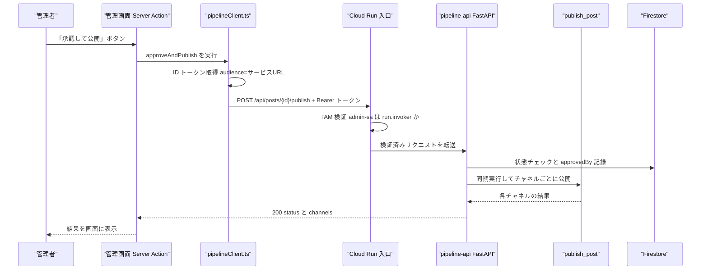

# pipeline-api 詳細設計 — 管理画面から呼ばれる承認 API

> 対象コード時点: コミット c694140 + 未コミット変更 / 最終更新: 2026-07-15(`/api/chat/*` と SSE 中継の route handler を追記)

## 1. この文書で分かること

- Cloud Run サービス `pipeline-api`(FastAPI 製の小さな Web API)が持つ投稿・ジョブ系の全 5 エンドポイントの仕様と、管理画面(admin)からの呼ばれ方(レポート調査用の `/api/research/*` 3 本は [10-research-agent.md](10-research-agent.md)、リサーチチャット用の `/api/chat/*` 3 本は [11-research-chat.md](11-research-chat.md) が担当)
- コードを読むと「無認証」に見えるこの API が、実際にはインフラ層(Cloud Run IAM)でどう守られているか
- ジョブの手動実行が「受け付けたら即応答」になっている仕組み(実 Cloud Run Job の起動)と、実行結果をどこで確認するか

投稿処理そのもの(notion → x → threads の公開順序、冪等性、失敗時のチャネル状態遷移)は [04-publish.md](04-publish.md) が担当する。この文書は「HTTP の窓口」だけを扱う。管理画面側の画面構成は [07-admin-ui.md](07-admin-ui.md)、システム全体の中での位置づけは [../02-architecture.md](../02-architecture.md) を参照。

## 2. 関連ファイル一覧

| ファイル | 役割 |
| --- | --- |
| `pipeline/app/main.py` | API 本体。全エンドポイントとジョブ名の対応表 `JOB_MODULES` を定義 |
| `pipeline/app/publishers/base.py` | `publish()` / `retry_channel()` から呼ばれる `publish_post()` の実体(詳細は [04-publish.md](04-publish.md)) |
| `pipeline/app/repo/posts.py` | Firestore(GCP のドキュメント型データベース)の `posts` コレクション読み書き |
| `pipeline/tests/test_api.py` | この API の挙動を固定するテスト(10 本) |
| `admin/src/lib/pipelineClient.ts` | 管理画面側の呼び出しクライアント。ID トークンを付けて fetch する |
| `admin/src/lib/actions.ts` | 管理画面の Server Action。`approveAndPublish()` / `retryChannel()` / `runJobNow()` が pipelineClient を呼ぶ |
| `infra/10-deploy-pipeline.sh` | デプロイスクリプト。`--no-allow-unauthenticated` と IAM 付与はここ |
| `pipeline/Dockerfile` | サービスとジョブが共有する単一イメージの定義 |

## 3. 全体フロー

管理画面のボタンが押されてから投稿が公開されるまでの経路を 1 枚で示す。



ポイントは 3 つ。

1. **管理画面はブラウザから直接この API を呼ばない。** ブラウザ → Next.js の Server Action(サーバ側で動く関数)→ `pipelineClient.ts` → pipeline-api、という経路で、トークンの取得・付与はすべてサーバ側で完結する。
2. **Cloud Run 入口でのトークン検証は、アプリのコードが動く前に行われる。** 検証に失敗したリクエストは FastAPI に届かない(4 章)。
3. **publish / retry-channel は同期、jobs run だけ非同期。** 前者は「応答が返った = 処理が終わった」。後者は pipeline-api 自身が処理するのではなく、**別の Cloud Run Job を起動して即応答する**(「応答が返った = 起動を受け付けただけ」)ので、ジョブ本体の結果は HTTP では分からない(6a 節)。

なお、pipeline-api と 7 つの Cloud Run Jobs は**同一の Docker イメージ**である。`pipeline/Dockerfile` の既定の起動コマンドは `uvicorn app.main:app`(= この API)で、ジョブは `infra/10-deploy-pipeline.sh` が `--command=python --args=-m,app.jobs.<name>` で起動コマンドだけ差し替えている。API とジョブでコードのずれが起きない構成になっている。

## 4. 認証の設計 — コードに認証処理が無いのは意図的

`pipeline/app/main.py` を読むと、パスワード確認もトークン検証も一切出てこない。**これはバグでも手抜きでもなく、冒頭の docstring に明記された設計判断**である。原文の要旨はこうだ。

> `--no-allow-unauthenticated` でデプロイし、認証は Cloud Run IAM が行う(admin-sa が run.invoker を持つ)。だからアプリレベルの認証はここには無い。表示用の読み書きは管理画面から Firestore へ直行する。

### 4.1 守っている 2 つの仕掛け

`infra/10-deploy-pipeline.sh` の 2 箇所がこの API の「鍵」になっている。

1. **`--no-allow-unauthenticated` フラグ** — Cloud Run(GCP のコンテナ実行サービス)には「誰でも呼べる公開モード」と「認証必須モード」がある。このフラグで後者になり、Google 発行の **ID トークン**(「私は誰々です」を Google が署名して証明する短命な文字列)を持たないリクエストは、**アプリに届く前に** Cloud Run の入口で 403 として弾かれる。
2. **IAM バインディング** — 同スクリプトが `gcloud run services add-iam-policy-binding` で、サービスアカウント(人間ではなくプログラム用の GCP アカウント)`admin-sa` にだけ `roles/run.invoker`(呼び出し許可)を与えている。つまり有効な ID トークンでも、**admin-sa 以外の名義なら拒否**される。

この 2 点により、「コードを読むと無認証に見えるが、インフラ層で保護されている」状態が成立する。逆に言えば、ローカルで `uvicorn` を立ち上げれば誰でも叩けるのは正常(守っているのは Cloud Run であってコードではない)。本番で疎通確認したいときは、呼び出し権限のあるアカウントで `gcloud auth print-identity-token` を取り、`Authorization: Bearer` ヘッダに付けて curl する。

### 4.2 なぜアプリ内で認証しないのか

- 呼び出し元は管理画面(admin-sa 名義)の 1 系統だけで、Cloud Run IAM の検証はトークンの署名・有効期限・宛先(audience、6b 節)まで確認する。アプリで再実装しても同じ検証の劣化コピーにしかならない。
- 認証コードが無いぶん `main.py` は 100 行少々に収まり、テストも認証のモックなしで書ける(8 章)。

なお、認証は二段構えである点に注意。**人間 → 管理画面**は IAP(Identity-Aware Proxy。Google アカウントでのログインを強制する仕組み)が守り、**管理画面 → pipeline-api** は Cloud Run IAM が守る。IAP を通った人間のメールアドレスは Server Action 経由で `approvedBy` として投稿に記録される(5.2 節)。

### 4.3 この API が「小さい」理由

docstring の最後の一文も設計上重要だ。投稿一覧や設定値など**表示のための読み書きは、管理画面が firebase-admin で Firestore を直接操作する**([07-admin-ui.md](07-admin-ui.md))。pipeline-api を通るのは「DB 更新にとどまらない副作用がある操作」= 外部 SNS への公開・再試行・**削除**・ジョブ起動(およびレポート調査 run の作成・中断・計画承認。[10-research-agent.md](10-research-agent.md))だけ。だから投稿・ジョブ系のエンドポイントは 5 つ(うち 1 つは死活確認)しかない。

**リサーチチャットだけはこの構図から1点外れる**([11-research-chat.md](11-research-chat.md))。`POST /api/chat/messages` は応答を SSE で**流し続ける**ため、値を1つ返して終わる Server Action では受けられない。そこで admin 側に本リポジトリ唯一の route handler(`src/app/api/chat/stream/route.ts`)を置き、ブラウザが fetch できる URL を与えている。役割は IAP 由来の `requestedBy` と ID トークンの注入だけで、本文は変換せずそのまま素通しする(パースするとバッファされ、ストリーミングの意味が消える)。チャットの cancel / handoff は通常どおり Server Action 経由。

## 5. エンドポイントリファレンス

| メソッド/パス | 役割 | 応答 | 呼び出し元 Server Action |
| --- | --- | --- | --- |
| GET `/healthz` | 死活確認 | 200 | (なし。手動確認用) |
| POST `/api/posts/{post_id}/publish` | 承認して公開 | 200(同期) | `approveAndPublish()` |
| POST `/api/posts/{post_id}/retry-channel` | 失敗チャネルの再試行 | 200(同期) | `retryChannel()` |
| POST `/api/posts/{post_id}/delete` | 公開済み投稿の削除(リモート成果物+任意で doc) | 200(同期) | `deletePostChannels()` / `deletePosts()` |
| POST `/api/jobs/{name}/run` | ジョブの手動実行 | 202(非同期) | `runJobNow()` |

### 5.1 GET /healthz — 死活確認

`pipeline/app/main.py` の `healthz()`。常に `{"ok": true}` を返すだけで、DB にも触らない。現時点でデプロイ設定から自動参照はしておらず、デプロイ直後にサービスが起動しているかを手で確かめる用途。認証必須モードはパスに関係なくかかるため、**このエンドポイントですら ID トークンなしでは 403** になる。

### 5.2 POST /api/posts/{post_id}/publish — 承認して公開

`pipeline/app/main.py` の `publish()`。下書きページの「承認して公開」ボタンの実体。

**リクエスト**(`PublishRequest`。両フィールドとも省略可なので `{}` も有効):

```json
{ "approvedBy": "moc9058@gmail.com", "channels": ["x", "notion"] }
```

- `approvedBy` — 承認者。管理画面の `approveAndPublish()` が `iapUserEmail()`(IAP が付けるヘッダから取得した、ログイン中の人間のメールアドレス)を渡す。API 自体はこの値を検証せず記録するだけ — 呼び出し元が admin-sa に限定されているから成り立つ設計(4 章)。
- `channels` — 公開するチャネル名の配列。**空配列は「有効な全チャネル」**の意味。

**処理の流れ**:

1. `posts.get()` で投稿を取得。無ければ 404。
2. 投稿の状態が `published` か `publishing` なら 409(二重公開の防止)。逆に `draft` / `approved` / `failed` / `partially_published` は受け付ける — 失敗後にもう一度このボタンで再公開できるということ。
3. `channels` が指定されていれば、**リストに載っておらず、かつ現在 `pending` のチャネル**を `enabled=false` + `skipped` に更新する。下書きページでチェックを外したチャネルを「今回は出さない」と確定させる処理で、すでに `published` のチャネルには触らない。
4. `posts.update_fields()` で `approvedBy` と `status: "approved"` を記録。
5. `publish_post(post_id)` を**同期**呼び出し。Notion・X・Threads への実際の投稿はここ([04-publish.md](04-publish.md))。

**レスポンス**(200):

```json
{ "status": "published", "channels": { "x": "published", "threads": "published", "notion": "published" } }
```

**エラー**:

| 状況 | ステータス | detail |
| --- | --- | --- |
| 投稿が存在しない | 404 | `post not found` |
| すでに `published` / `publishing` | 409 | `post is published` など |

注意点が 2 つ。第一に、**チャネル単位の公開失敗は HTTP エラーにならない**。全チャネル失敗でも HTTP は 200 のまま、本文の `status` が `failed` や `partially_published` になる(7 章)。第二に、一度 `skipped` にしたチャネルを API 経由で復活させる手段は無い(retry-channel は `failed` 専用)。チャネル選択は「後から出し直せる保留」ではなく確定操作である。

### 5.3 POST /api/posts/{post_id}/retry-channel — 失敗チャネルの再試行

`pipeline/app/main.py` の `retry_channel()`。posts ページで `failed` になったチャネルの横に出る「再試行」ボタンの実体。

**リクエスト**(`RetryRequest`。`channel` は必須): `{ "channel": "x" }`

**処理の流れ**:

1. 投稿を取得。無ければ 404。
2. 指定チャネルが投稿の `channels` に存在しなければ 400。
3. チャネルの状態が **`failed` 以外なら 409**(`pending` も `published` も `skipped` も再試行不可)。成功済みチャネルへの誤操作で二重投稿になる事故をここで防ぐ。
4. チャネルを `pending` に戻し `error` を空にしてから、`publish_post(post_id, only_channel=チャネル名)` を同期実行。`only_channel` により他チャネルには一切触れない。

**レスポンス**(200): `{ "status": "published", "channel": "published", "error": "" }`

再試行がまた失敗した場合も HTTP は 200 で、`channel` が `failed`、`error` に失敗理由(先頭 1000 字)が入る。管理画面が即座に理由を表示できるよう、エラー文字列を応答に含めている。

**エラー**:

| 状況 | ステータス | detail |
| --- | --- | --- |
| 投稿が存在しない | 404 | `post not found` |
| 未知のチャネル名 | 400 | `unknown channel mastodon` など |
| 状態が `failed` 以外 | 409 | `channel is pending, not failed` など |

### 5.4 POST /api/jobs/{name}/run — ジョブの手動実行

`pipeline/app/main.py` の `run_job()`。settings ページのジョブ実行ボタンの実体。スケジュール(Cloud Scheduler)を待たずに収集や生成を今すぐ走らせたいときに使う。

`name` は `JOB_MODULES` に定義された 7 種のみ:

| API での名前 | 実行モジュール | 対応する Cloud Run Job 名 |
| --- | --- | --- |
| `collect` | `app.jobs.collect` | `job-collect` |
| `generate_daily` | `app.jobs.generate_daily` | `job-generate-daily` |
| `generate_weekly` | `app.jobs.generate_weekly` | `job-generate-weekly` |
| `generate_monthly` | `app.jobs.generate_monthly` | `job-generate-monthly` |
| `cleanup_drafts` | `app.jobs.cleanup_drafts` | `job-cleanup-drafts` |
| `refresh_threads_token` | `app.jobs.refresh_threads_token` | `job-refresh-threads-token` |
| `seed` | `app.jobs.seed` | `job-seed` |

API 名はアンダースコア、Cloud Run Job 名は `job-` + ハイフンという対応(`main.py` の `_cloud_run_job_name()` が `name.replace("_", "-")` で変換している)。混同しやすいので注意。

**リクエスト**: ボディは空 `{}`。**レスポンス**(202 Accepted): `{ "accepted": true, "job": "job-generate-daily" }`(応答の `job` は起動した Cloud Run Job 名)。

未知の名前は 400(`unknown job nope`)。ジョブの起動自体に失敗したとき(権限不足・ネットワーク断など)は **502**(6a 節)。202 が返っても「起動を受け付けた」であって「ジョブが成功した」ではない — 仕組みと確認方法は次章。

### 5.5 POST /api/posts/{post_id}/delete — 公開済み投稿の削除

`pipeline/app/main.py` の `delete_post()`。投稿詳細ページのチャネル別削除ボタンと、投稿履歴ページの複数選択削除の実体。実処理は `publishers/base.py` の `delete_post_channels()`([04-publish.md](04-publish.md) §5)。

**リクエスト**(`DeleteRequest`。両フィールドとも省略可):

```json
{ "channels": ["x"], "deletePost": false }
```

- `channels` — 削除するチャネル名の配列。**空配列は「リモート成果物を持つ全チャネル」**の意味。
- `deletePost` — true なら、削除後に `published` のチャネルが残っておらず全チャネルがエラーなしのとき、Firestore の post ドキュメント自体も削除する。

**処理の内容**: X はツイート削除(`DELETE /2/tweets/{id}`。404 は成功扱い)、Threads はメディア削除(`DELETE /{media-id}`)、Notion はページのアーカイブ(`archived: true`。report は言語別ページも)。成功したチャネルは `deleted` + `enabled=false` になる。

**レスポンス**(200): `{ "channels": { "x": "deleted" }, "docDeleted": false }`。チャネル単位の失敗は HTTP エラーにならず、値が `"error: ..."` になる(publish と同じ流儀)。投稿が存在しなければ 404。

**制限**: X のスレッド投稿は先頭ツイート ID しか保存されないため、返信ツイートは残る。関連テストは `pipeline/tests/test_delete_post.py`。

## 6. 難所解説

### 6a. 実 Cloud Run Job の起動 — 「受け付けました」と「終わりました」は別物

ジョブは数分かかることがあり、pipeline-api の**サービス**インスタンス内で走らせると、リソース制約(メモリ 512Mi)や応答返却後のインスタンス縮退で処理が中断される恐れがある。そこでこの API は**自分では処理せず、対応する Cloud Run Job を起動して即応答する**。ジョブは自分専用のインスタンス上で、そのジョブの設定(メモリ・タイムアウト 1800s・リトライ。[../04-parameters.md](../04-parameters.md))どおりに確実に走り切る。`pipeline/app/main.py` から該当部を抜粋する。

```python
def _cloud_run_job_name(api_name: str) -> str:
    """`generate_daily` -> `job-generate-daily` (the deployed Cloud Run Job)."""
    return "job-" + api_name.replace("_", "-")


def _trigger_job(api_name: str) -> None:
    settings = get_settings()
    creds, _ = google.auth.default(
        scopes=["https://www.googleapis.com/auth/cloud-platform"],
    )
    creds.refresh(google.auth.transport.requests.Request())
    url = (
        f"https://run.googleapis.com/v2/projects/{settings.project_id}"
        f"/locations/{settings.region}/jobs/{_cloud_run_job_name(api_name)}:run"
    )
    resp = httpx.post(url, headers={"Authorization": f"Bearer {creds.token}"}, timeout=30)
    resp.raise_for_status()


@app.post("/api/jobs/{name}/run", status_code=202)
def run_job(name: str) -> dict:
    if name not in JOB_MODULES:
        raise HTTPException(400, f"unknown job {name}")
    job_name = _cloud_run_job_name(name)
    try:
        _trigger_job(name)
    except httpx.HTTPStatusError as exc:
        raise HTTPException(502, f"failed to start {job_name}: {exc.response.text[:300]}")
    except Exception as exc:
        raise HTTPException(502, f"failed to start {job_name}: {exc}")
    return {"accepted": True, "job": job_name}
```

- `google.auth.default(...)` — 実行環境から資格情報を自動検出する。Cloud Run 上では pipeline-api に紐づくサービスアカウント **pipeline-sa** の資格情報になる(鍵ファイル不要)。`creds.refresh()` で実際のアクセストークンを取り出す。
- `.../jobs/{job}:run` — Cloud Run Admin API のジョブ起動エンドポイント。POST するとジョブの新しい実行(execution)が 1 つ作られ、すぐ応答が返る。**完了は待たない。**
- `resp.raise_for_status()` — 起動要求自体が失敗(403 権限不足・404 ジョブ無し・ネットワーク断など)なら例外にし、`run_job()` 側で **502** に変換して管理画面へ返す。ここで返るのは「起動できたか」であって「ジョブが成功したか」ではない。
- `name not in JOB_MODULES` — 許可された 7 種以外の名前は 400。`JOB_MODULES` はモジュール実行には使わなくなったが、**許可リスト(ホワイトリスト)**として残している。
- `status_code=202` — HTTP 202 Accepted は「依頼は受理した。完了はまだ」の定番ステータス。

権限の前提: この起動には pipeline-sa が各ジョブに対する `roles/run.invoker`(ジョブ起動権限)を持っている必要がある。付与は `infra/10-deploy-pipeline.sh` がジョブ作成直後に行う(9 章の表)。

つまり管理画面に「OK」と出ても、それはジョブの**起動**を受け付けたにすぎない。**ジョブの成否は HTTP では分からず、各ジョブが書き込む Firestore の `runs` コレクション**(`runs.start()` / `runs.finish()`。管理画面のダッシュボードに表示)**と Cloud Logging で確認する**。手動実行もスケジュール実行も同じ Cloud Run Job を起動するので、ロジックや実行環境の差は出ない。確認手順と失敗時対応は [../../runbook.md](../../runbook.md)。

### 6b. pipelineClient.ts — ID トークンの取得と audience

管理画面側で「トークンを付けて呼ぶ」を一手に引き受けるのが `admin/src/lib/pipelineClient.ts` の `call()` である。

```typescript
import { GoogleAuth } from 'google-auth-library';

const auth = new GoogleAuth();

async function call(path: string, body: unknown): Promise<Response> {
  const base = process.env.PIPELINE_API_URL;
  if (!base) throw new Error('PIPELINE_API_URL is not configured');
  const client = await auth.getIdTokenClient(base);
  const token = await client.idTokenProvider.fetchIdToken(base);
  return fetch(`${base}${path}`, {
    method: 'POST',
    headers: {
      Authorization: `Bearer ${token}`,
      'Content-Type': 'application/json',
    },
    body: JSON.stringify(body ?? {}),
  });
}
```

- `new GoogleAuth()` — 引数なしで生成すると、実行環境から資格情報を自動検出する。Cloud Run 上の admin サービスでは、そのサービスに紐づくサービスアカウント **admin-sa** の資格情報が使われる。鍵ファイルの配置や管理は不要。
- `process.env.PIPELINE_API_URL` — 呼び先 URL。`infra/11-deploy-admin.sh` がデプロイ時に `gcloud run services describe pipeline-api` で実 URL を取得し、環境変数として注入している。
- `auth.getIdTokenClient(base)` — ID トークン発行用クライアントを作る。引数の `base` が **audience(宛先)** になる。
- `fetchIdToken(base)` — audience を刻印した ID トークンを取得する。**audience とは「このトークンは pipeline-api の URL 宛て」という刻印**で、Cloud Run は受信時に「署名は Google 製か」「期限内か」に加えて「audience が自分の URL と一致するか」を検証する。万一トークンが漏れても他のサービスには使い回せない、という安全装置。
- `Authorization: Bearer ${token}` — 取得したトークンをヘッダに載せて送る。Cloud Run 入口はこのヘッダを見る。
- 公開関数 `publishPost()` / `retryChannel()` / `deletePost()` / `runJob()`(および research 系)はすべてこの `call()` を通り、応答を `{ ok: resp.ok, detail: 本文 }` に整形して Server Action に返す。

ローカル開発では admin-sa がいないため、ADC(`gcloud auth` で作る開発者の資格情報)が代わりに使われる。その場合、開発者自身に pipeline-api の呼び出し権限が必要になる。

## 7. エラー時の挙動

pipelineClient は HTTP ステータスを隠さず `{ ok: 2xx かどうか, detail: 応答本文 }` として返し、管理画面はそれをほぼそのまま表示する。エラー本文は FastAPI の標準形式 `{"detail": "..."}` の JSON 文字列である。

| 状況 | HTTP | 管理画面での見え方 |
| --- | --- | --- |
| 公開: 投稿なし / 公開済み | 404 / 409 | 下書きエディタ(`DraftEditor`)のボタン下に赤字で本文(先頭 400 字) |
| 再試行: 未知チャネル / `failed` 以外 | 400 / 409 | posts ページの再試行ボタン横に赤字(`ActionButton`、先頭 200 字) |
| ジョブ: 未知の名前 | 400 | ダッシュボード/設定 ページのボタン横に赤字 |
| ジョブ: 起動の失敗(権限・ジョブ無し・ネットワーク) | 502 | ボタン横に赤字で理由(先頭 300 字)。pipeline-sa の `run.invoker` 欠落などはここで分かる |
| **チャネル公開の失敗** | **200** | HTTP は成功扱い。本文の `status` が `failed` / `partially_published`。posts ページで該当チャネルが `failed` + エラー文言 + 再試行ボタン表示 |
| **手動ジョブ本体の失敗** | **202** | 起動は成功したが**ジョブの中身**が失敗したケースは HTTP からは検知不可。ダッシュボードの `runs` 一覧と、そのジョブ自身の Cloud Logging で確認 |

太字の 2 行がこの API の読み方のコツで、**「HTTP 200/202 = 全部成功」ではない**。公開結果は投稿の `status` とチャネル状態、ジョブ結果は `runs` コレクションが真実である。収集 0 件・投稿失敗・トークン失効など典型パターンの切り分けは [../../runbook.md](../../runbook.md) を参照。

## 8. 関連テスト

`pipeline/tests/test_api.py` が FastAPI の TestClient で以下を固定している。この層は外部 HTTP を呼ばないため respx は不要で、`posts` リポジトリと `publish_post()` を monkeypatch で差し替えるだけの軽いテストになっている。

| テスト | 固定している挙動 |
| --- | --- |
| `test_healthz` | `/healthz` が `{"ok": true}` を返す |
| `test_publish_404` | 存在しない投稿の公開は 404 |
| `test_publish_conflict_when_already_published` | `published` 済み投稿の再公開は 409 |
| `test_publish_flow` | 正常系で 200、応答の `status`、**`approvedBy` が Firestore 更新に渡ること** |
| `test_retry_channel_requires_failed_state` | `pending` チャネルの再試行は 409 |
| `test_retry_unknown_channel` | 未定義チャネル(例 `mastodon`)は 400 |
| `test_run_unknown_job` | 未知ジョブ名は 400 |
| `test_run_job_accepted` | 202 が返り、応答の `job` が Cloud Run Job 名(`job-generate-daily`)、`_trigger_job()` に API 名が渡ること |
| `test_run_job_trigger_failure_is_502` | 起動が例外を投げたら 502 になり、detail にジョブ名が入ること |
| `test_cloud_run_job_name_mapping` | `_cloud_run_job_name()` の名前変換(`generate_daily`→`job-generate-daily`) |

`_trigger_job()` は `google.auth` と実 HTTP を叩くため、テストでは monkeypatch で丸ごと差し替える(外部 API を呼ばない)。エンドポイントの条件分岐(404/409/400/502 の境界)を変えるときは、必ずここに対になるテストを足すこと。

## 9. 変更するときは

この API は pipeline・admin・infra の 3 か所にまたがる「約束事」なので、片側だけ変えると静かに壊れる。変更種別ごとの触る場所:

| やりたい変更 | pipeline 側 | admin 側 | infra 側 |
| --- | --- | --- | --- |
| エンドポイント追加 | `main.py` + `tests/test_api.py` | `pipelineClient.ts` に関数追加 + `actions.ts` に Server Action + 画面([07-admin-ui.md](07-admin-ui.md)) | — |
| ジョブ追加 | `app/jobs/<name>.py` 新設 + `main.py` の `JOB_MODULES`(許可リスト) | `shared/constants.json` の `jobTypes`(admin の `JOB_TYPES` はここが源。prebuild でコピーされるため **admin の再ビルド必須**) | `infra/env.sh` の `JOBS` 配列(+ 定期実行するなら `20-schedulers.sh`)。`10-deploy-pipeline.sh` がジョブ作成直後に pipeline-sa へ `run.invoker` を付与するので Run-now ボタンが効く |
| リクエスト項目追加 | `PublishRequest` / `RetryRequest` + テスト | `pipelineClient.ts` の対応関数の引数とボディ | — |
| 認証・公開範囲の変更 | (コード変更なし) | — | `10-deploy-pipeline.sh`。**`--no-allow-unauthenticated` を外す変更は不可**(4 章の前提が崩れる) |

ジョブ追加時は名前の 3 形態(API 名 `generate_daily` / Cloud Run Job 名 `job-generate-daily` / モジュール名 `app.jobs.generate_daily`)がすべて機械的に対応している必要がある(5.4 節の表)。また、投稿系ジョブを増やす場合は `--max-retries=0` の方針([04-publish.md](04-publish.md)、`10-deploy-pipeline.sh` のコメント)を必ず引き継ぐこと。

リソース値(メモリ・タイムアウト・インスタンス数)を変えたいときはコードではなく `10-deploy-pipeline.sh` のフラグで、現行値の一覧は [../04-parameters.md](../04-parameters.md) にまとまっている。
