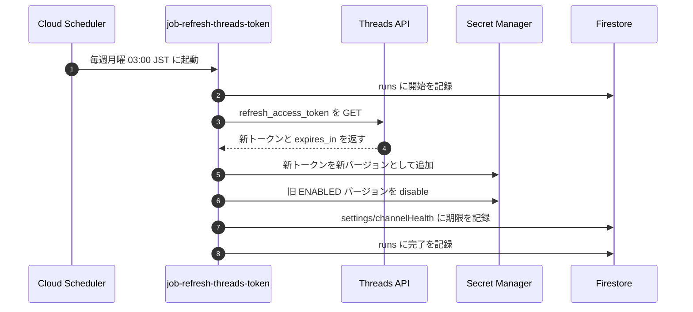

# 運用系ジョブ詳細設計 — Threads トークン自動更新・初期データ投入(seed)・下書き自動削除

> 対象コード時点: コミット f703290 + 未コミット変更 / 最終更新: 2026-07-13

本システムには 7 つのジョブ(Cloud Run Jobs — 「起動 → 処理 → 終了」する使い切りの実行環境)があります。このうち収集・生成の 4 つは他章で解説済みで、本書は残る 3 つの「運用系」ジョブを扱います。

- **第1部: `refresh_threads_token`** — Threads の投稿用トークンを毎週自動更新するジョブ(README フロー④)
- **第2部: `seed`** — カテゴリ・ソース・プロンプトなどの初期データを Firestore に投入する、初回のみ手動実行のジョブ
- **第3部: `cleanup_drafts`** — 承認されないまま 30 日を過ぎた下書きを毎日自動削除するジョブ

いずれも `shared/constants.json` の `jobTypes` に enum 値(`refresh_threads_token` / `seed` / `cleanup_drafts`)として登録されており、実行履歴は他ジョブと同じく Firestore の `runs` コレクションに残ります(共通の仕組みは [01-pipeline-foundation.md](01-pipeline-foundation.md) 参照)。

---

## 第1部: refresh_threads_token — Threads トークン自動更新(毎週月曜 03:00 JST)

### 1. この機能で分かること / なぜ必要か

Threads へ投稿するには**アクセストークン**(API を呼ぶための「合鍵」にあたる文字列)が必要です。Threads の long-lived token(長期トークン)は**約 60 日で失効**するため、放置するとある日突然 Threads への投稿だけが全滅します。

そこでこのジョブは、`pipeline/app/jobs/refresh_threads_token.py` の冒頭コメントにある通り「60 日寿命のトークンを毎週更新して約 8 倍の余裕を保つ」方針を取ります。週 1 回の更新なら、仮に数週連続で失敗しても失効までに気づいて手を打てる、という設計です。

やることは 4 つです。

1. Threads API に現在のトークンを渡し、新しいトークンをもらう
2. 新トークンを **Secret Manager**(GCP の秘密情報の金庫サービス。値をバージョン番号付きで保管する)に新バージョンとして保存し、旧バージョンを無効化する
3. 新しい有効期限を Firestore の `settings/channelHealth` に書き、管理画面ダッシュボードに「残り日数」を表示できるようにする
4. 実行結果を `runs` に記録する

起動は Cloud Scheduler(指定時刻に処理を蹴る GCP のタイマー)の `sched-threads-refresh` が担当し、`infra/20-schedulers.sh` で cron 式 `0 3 * * 1`・タイムゾーン `Asia/Tokyo`、つまり**毎週月曜 03:00 JST** に `job-refresh-threads-token` を実行するよう登録されています。管理画面からの手動実行も可能です(pipeline-api の `/api/jobs/refresh_threads_token/run`)。

### 2. 全体フロー



図の 3〜4 がトークンの再発行、5〜6 が Secret Manager 内での世代交代、7 がダッシュボード向けの健康状態(channelHealth)更新です。7 では成功時に `threadsRefreshError` を空文字でクリアするため、過去の失敗警告も同時に消えます。途中でどこかが失敗した場合は 7 の代わりにエラー内容が `threadsRefreshError` に書かれ、8 の `runs` には `ok=false` で記録されます(詳細は本部 5 節)。

### 3. 関数リファレンス

#### `main()` — `pipeline/app/jobs/refresh_threads_token.py`

- **役割**: ジョブ全体の進行役。再発行 → Secret 世代交代 → 健康状態更新を順に呼ぶ
- **入力**: なし(トークンは環境変数経由の `settings.threads_access_token`)/ **出力**: なし(結果は Firestore に書く)
- **外部アクセス**: Threads API、Secret Manager、Firestore(`runs`、`settings/channelHealth`)
- **要点**: 応答の `expires_in`(秒)が無い場合は `60 * 24 * 3600` 秒(= 60 日)を既定値として期限を計算する。成功時は `threadsLastRefreshAt` / `threadsTokenExpiresAt` を書き込み、`threadsRefreshError` を空にする

#### `_rotate_secret(new_token)` — 同ファイル

- **役割**: Secret Manager 上のトークンを新バージョンに世代交代する
- **入力**: 新トークン文字列 / **出力**: なし
- **外部アクセス**: Secret Manager(`config.py` の `threads_token_secret_name` = 既定 `threads-access-token`)
- **要点**: 新バージョン追加後、それ以外の `ENABLED`(有効)状態のバージョンを全て `disable`(無効化)する。削除はしない(本部 4-a 節)

#### `refresh_long_lived_token(current_token)` — `pipeline/app/publishers/threads.py`

- **役割**: Threads Graph API の `refresh_access_token` エンドポイントを呼び、トークンを再発行してもらう
- **入力**: 現在のトークン / **出力**: `{"access_token": ..., "expires_in": 秒数}` の辞書
- **外部アクセス**: `https://graph.threads.net/refresh_access_token` への GET(`grant_type=th_refresh_token`)。投稿系 API と違いバージョン番号 `/v1.0` を付けない URL を使う
- **要点**: 共通デコレータ `api_retry` 付き。一時的な失敗(HTTP 429/5xx・通信断)なら指数バックオフで最大 3 回まで自動再試行し、それ以外の 4xx は即失敗として上に投げる

### 4. 難所解説

#### 4-a. Secret Manager のバージョン管理 — なぜ「削除」ではなく「無効化」か

`pipeline/app/jobs/refresh_threads_token.py` の `_rotate_secret()` を抜粋します。

```python
def _rotate_secret(new_token: str) -> None:
    settings = get_settings()
    client = secretmanager.SecretManagerServiceClient()
    parent = f"projects/{settings.project_id}/secrets/{settings.threads_token_secret_name}"
    new_version = client.add_secret_version(
        request={"parent": parent, "payload": {"data": new_token.encode()}}
    )
    for version in client.list_secret_versions(request={"parent": parent}):
        if version.name != new_version.name and version.state.name == "ENABLED":
            client.disable_secret_version(request={"name": version.name})
```

- 1〜3 行目: Secret Manager のクライアントを作る。対象の Secret 名は `config.py` の `threads_token_secret_name` から取るため、ハードコードされていない
- 4 行目: `parent` は「どの金庫か」を指す完全なパス(`projects/<プロジェクト>/secrets/threads-access-token`)
- 5〜7 行目: `add_secret_version` で新トークンを**新しいバージョン**として積む。Secret Manager は同じ名前の下に v1, v2, ... と履歴を重ねる仕組みで、Cloud Run は `:latest`(最新版)を参照する設定なので、追加した瞬間から「最新」はこの新トークンになる
- 8〜10 行目: 既存バージョンを一覧し、**今追加したもの以外**で状態が `ENABLED` のものを `disable_secret_version` で無効化する

ポイントは **`destroy`(データごと削除)ではなく `disable`(無効化)** を選んでいることです。無効化なら中身は残るため、新トークンに問題があったとき旧バージョンを再有効化したり値を確認したりする**ロールバックの余地**が残ります。`destroy` は不可逆で、失敗時の逃げ道を自ら断つことになります。また、参照は常に `:latest` なので、旧バージョンが無効でも稼働中の設定が壊れることはありません。

なおこの操作には通常の読み取り権限(secretAccessor)では足りません。`infra/01-secrets.sh` が `threads-access-token` に限って pipeline-sa に **`secretmanager.secretVersionAdder`**(バージョン追加)と **`secretmanager.secretVersionManager`**(一覧・無効化)の 2 ロールを追加付与しています。この IAM を外すとジョブは権限エラーで失敗します。

#### 4-b. 新トークンはいつ効くのか — 環境変数は「起動時のスナップショット」

`main()` の中心部を抜粋します。

```python
        result = refresh_long_lived_token(settings.threads_access_token)
        new_token = result["access_token"]
        expires_in = int(result.get("expires_in", 60 * 24 * 3600))
        _rotate_secret(new_token)
        now = datetime.now(timezone.utc)
        configs.update_channel_health({
            "threadsLastRefreshAt": now,
            "threadsTokenExpiresAt": now + timedelta(seconds=expires_in),
            "threadsRefreshError": "",
        })
```

- 1 行目: 再発行に使う「現在のトークン」は `settings.threads_access_token`。これは Secret Manager から直接読むのではなく、**環境変数**(プログラム起動時に外から渡される設定値)`THREADS_ACCESS_TOKEN` の値です。`infra/10-deploy-pipeline.sh` が全ジョブ・サービスに `THREADS_ACCESS_TOKEN=threads-access-token:latest` を注入しています
- 2〜3 行目: 応答から新トークンと有効秒数を取り出す。`expires_in` 欠落時は 60 日相当を仮定
- 4 行目: Secret Manager 側を世代交代(4-a 節)
- 5〜10 行目: 新しい期限とリフレッシュ時刻を `settings/channelHealth` に書く。`update_channel_health()`(`pipeline/app/repo/configs.py`)は `set(fields, merge=True)`、つまり**指定フィールドだけを上書き**するので、同じドキュメントにある他チャネルの健康情報は消えない

ここで理解しておきたいのが**反映タイミング**です。Cloud Run の `:latest` 参照は「コンテナ起動時」に解決されます。つまり、

- このジョブが Secret を更新しても、**その時点で動いている他のジョブは起動時に読んだ古いトークンを環境変数として持ち続けます**
- 新トークンが効くのは**次にコンテナが起動するときから**(翌朝の投稿ジョブなど)です

旧トークンは Threads 側で即座に無効になるわけではないため、この「入れ替わりのずれ」は実害になりません。一つだけ注意が必要なのは pipeline-api(常駐サービス)経由の手動実行で、こちらはサービスのインスタンスが起動した時点のトークンを使い続けます。長期間インスタンスが生き続けた場合に備え、ジョブ本体(job-refresh-threads-token)は毎回新しいコンテナで起動する Cloud Scheduler 経由が正、と覚えてください。

### 5. エラー時の挙動

`main()` は処理全体を `try/except` で包んでおり、失敗時は次の 3 か所に痕跡が残ります。

1. **`runs`**: `ok=false` とエラー文字列付きで実行記録が残る(管理画面の Runs 一覧に表示)
2. **`settings/channelHealth` の `threadsRefreshError`**: エラーメッセージ先頭 500 文字が保存される
3. **構造化ログ**: Cloud Logging に `threads token refresh failed` が出る

管理画面ダッシュボード(`admin/src/app/[locale]/page.tsx`)は `threadsRefreshError` が空でないとき**赤いバナー**を表示し、トークンカードは「残り日数」が 14 日を切るかエラーがあると赤字になります。つまり 1 回失敗しただけで画面上部に警告が出ます。

なおこのジョブの Cloud Run 設定は `--max-retries=0`(collect/seed 以外の全ジョブ共通方針)なので、**失敗してもインフラ側の自動再実行はありません**。次の機会は翌週月曜か手動実行です。週次更新 × 60 日寿命の余裕設計はこのためにあります。手動でのリフレッシュ手順、完全失効時の再 OAuth 手順は [../../runbook.md](../../runbook.md) を、トークンの初回発行手順は [../../setup-credentials.md](../../setup-credentials.md) を参照してください。

---

## 第2部: seed — 初期データ投入(初回のみ手動実行)

### 6. 役割 — 何を初期投入するか

`seed` は、空っぽの Firestore に「システムが動くための土台データ」を投入するジョブです。デプロイ手順上は `infra/10-deploy-pipeline.sh` の直後に `gcloud run jobs execute job-seed --region asia-northeast1 --wait` で **1 回だけ手動実行**します(管理画面の `/api/jobs/seed/run` からも実行可能。`--max-retries=1`)。

seed を実行しないとシステムは実質何もできません。`pipeline/app/repo/configs.py` の `channel_config()` はドキュメントが無いと `enabled=False` にフォールバックして全チャネル無効扱いになり、`prompt_template()` は `None` を返して生成がスキップされるためです。

`pipeline/app/jobs/seed.py` が投入するのは 5 種類・**計 52 ドキュメント**です。

| コレクション | 件数 | 内容 |
|---|---|---|
| `categories` | 3 | `business-economics` / `science-technology` / `geopolitics-history`。表示名・並び順・検索ヒント(searchHints)付き、全て `enabled: true` |
| `sources` | 10 | 収集元。カテゴリごとに `gemini_grounded`(グラウンディング検索)1 件 + RSS 数件。**うち 2 件は `enabled: false` で投入**(arXiv の `scitech-arxiv-csai`、IEEE Xplore の `scitech-ieee` — 後者は別途 API キーが必要)。残り 8 件が最初から有効 |
| `promptTemplates` | 9 | 3 カテゴリ × 3 カデンス(`daily` / `weekly` / `monthly`)。本文は `pipeline/app/generators/prompts.py` の `DEFAULTS` をコピー |
| `channelConfigs` | 27 | 3 カテゴリ × 3 カデンス × 3 チャネル(`x` / `threads` / `notion`)。全て `enabled: true` |
| `settings` | 3 | `app`(timezone=Asia/Tokyo、`dailyRequireApproval: false`、`xAllowUrlOnDaily: false`、`attachImages: true`)/ `notion`(`databaseId: ""` — **後で管理画面から設定が必要**)/ `channelHealth`(空) |

補足を 3 点。

- **チャネル既定言語はここで決まります。** `seed.py` の `CHANNEL_LANGUAGES = {"x": "ja", "threads": "ko", "notion": "en"}` が 27 件の `channelConfigs` すべての `language` に展開されます。運用開始後の変更は管理画面で channelConfig 単位に行います
- `sources` には RSS の条件付き取得(前回から変わっていなければ再ダウンロードしない仕組み)用の `etag` / `lastModified` フィールドが空文字で用意されます
- `promptTemplates` の元ネタ `DEFAULTS` は、`daily` が systemPrompt + userPromptTemplate の 2 本、`weekly` / `monthly` はそれに加えて 2 段階生成用の outline 系プロンプト 2 本を持ちます(`daily` の outline 系は空文字で埋められる)。テンプレートは「内容の指示」のみで、**出力言語は channelConfigs 側から `{language}` 等のプレースホルダで注入される**分離設計です

各ドキュメントのフィールド定義は [../03-data-model.md](../03-data-model.md)、モデル名や Secret 名などの設定値一覧は [../04-parameters.md](../04-parameters.md) を参照してください。

### 7. 関数リファレンス

#### `main()` — `pipeline/app/jobs/seed.py`

- **役割**: 5 種類のデータを順に投入し、実際に新規作成した件数をログに出す
- **入力**: なし / **出力**: なし(ログに `seed finished` と `created` 件数)
- **外部アクセス**: Firestore のみ
- **要点**: ドキュメント ID は決め打ち(カテゴリは slug、promptTemplates は `{slug}_{cadence}`、channelConfigs は `{slug}_{cadence}_{channel}`)。ID が決まっているからこそ「既にあるか」を確認できる

#### `_create_if_absent(collection, doc_id, data)` — 同ファイル

- **役割**: 指定 ID のドキュメントが**存在しない場合のみ**作成する
- **入力**: コレクション名・ドキュメント ID・データ / **出力**: 作成したら `True`、既存なら `False`(件数集計に使う)
- **外部アクセス**: Firestore(読み 1 回 + 条件付き書き 1 回)
- **要点**: 既存ドキュメントには一切触れない。これが seed 全体の冪等性の要(次節)

### 8. 難所解説 — 「存在すれば絶対に上書きしない」冪等設計

**冪等(べきとう)**とは「何度実行しても結果が変わらない」性質のことです。seed は再実行しても安全ですが、その理由は「同じ値を上書きするから」ではなく「**既にあるものには指一本触れないから**」です。`pipeline/app/jobs/seed.py` から中核部を抜粋します。

```python
def _create_if_absent(collection: str, doc_id: str, data: dict) -> bool:
    ref = db().collection(collection).document(doc_id)
    if ref.get().exists:
        return False
    ref.set(data)
    return True

    # main() 内の sources 投入ループ
    for src in SOURCES:
        data = {"enabled": True, "etag": "", "lastModified": "",
                "url": src.get("url", ""), "query": src.get("query", ""), **src}
        source_id = data.pop("id")
        created += _create_if_absent("sources", source_id, data)
```

- 2 行目: 決め打ちの ID でドキュメントへの参照を作る
- 3〜4 行目: `ref.get().exists` — **先に存在確認**。存在すれば何も書かずに `False` を返して終わり。ここが本設計の心臓部で、「一部フィールドだけ足す」merge 更新すらしない
- 5〜6 行目: 存在しないときだけ丸ごと `set` する
- 10〜11 行目: 投入データは「既定値の辞書に `**src` を後から重ねる」形。Python の辞書展開は**後勝ち**なので、`SOURCES` に明示された `enabled: False`(arXiv・IEEE の 2 件)が既定の `enabled: True` を正しく上書きする
- 12〜13 行目: `id` はドキュメント ID に使うためデータ本体からは除いて渡す

この設計の実益は、**管理画面での編集が seed の再実行で消えないこと**です。運用開始後にソースの有効/無効を切り替えたり、プロンプトを管理画面で磨き込んだりした後、誤って(あるいはデプロイ手順の一環で)seed をもう一度実行しても、既存ドキュメントは存在確認で弾かれるため編集内容は無傷です。

裏返しの注意点として、**コード側の初期値を変えても既存環境には反映されません**。たとえば `prompts.py` の `DEFAULTS` を改善して seed を再実行しても、既にある 9 件の `promptTemplates` はそのままです。既存環境に反映したいときは管理画面で編集するか、対象ドキュメントを削除してから seed を再実行してください(新規環境には次回 seed から自然に反映されます)。

### 9. 共通事項 — 関連テストと変更ガイド

#### 9-1. 関連テスト

正直に書くと、`pipeline/tests/` に **この 2 ジョブ本体を直接検証するテストはありません**。`_rotate_secret()` / `refresh_long_lived_token()` / `_create_if_absent()` はいずれも未カバーです。

周辺では `pipeline/tests/test_api.py` が pipeline-api の手動実行エンドポイント `/api/jobs/{name}/run` を検証しています(未知のジョブ名 → 400、正常受付 → 202)。両ジョブとも `JOB_MODULES`(`pipeline/app/main.py`)に登録されているため、この経路の入口だけはテスト済みです。

トークン更新ロジックに手を入れる場合は、プロジェクト方針(HTTP モックは respx)に沿って `refresh_long_lived_token` の応答をモックしたテストを追加することを推奨します。Secret Manager クライアントは httpx ではないため、こちらは `monkeypatch` 等でのスタブが現実的です。

#### 9-2. 変更するときは

| 変えたいこと | 触る場所 | 注意点 |
|---|---|---|
| カテゴリ・ソースの初期値 | `pipeline/app/jobs/seed.py` の `CATEGORIES` / `SOURCES` | **新規環境にしか効かない**。既存環境は管理画面で編集(8 節) |
| プロンプトの既定文面 | `pipeline/app/generators/prompts.py` の `DEFAULTS` | 同上。既存の `promptTemplates` 9 件は上書きされない |
| チャネル既定言語 | `pipeline/app/jobs/seed.py` の `CHANNEL_LANGUAGES` | 同上。既存環境は `channelConfigs` を管理画面で変更 |
| Secret 名(`threads-access-token`) | `pipeline/app/config.py` の `threads_token_secret_name`、`infra/01-secrets.sh`(作成 + versionAdder / versionManager の IAM 2 件)、`infra/10-deploy-pipeline.sh` の `SECRET_ENV`(`THREADS_ACCESS_TOKEN=...:latest`) | 3 か所が揃わないと「更新先」と「読み込み元」がずれてトークン更新が空振りする |
| 更新スケジュール(月曜 03:00) | `infra/20-schedulers.sh` の `sched-threads-refresh`(cron `0 3 * * 1`) | 60 日寿命に対して十分な頻度を保つこと |
| ジョブ種別の追加・改名 | `shared/constants.json` の `jobTypes` + `pipeline/app/main.py` の `JOB_MODULES` | constants.json 変更後は admin の再ビルドが必要 |

障害時の一次対応(赤バナーが出た・トークンが完全失効した)は [../../runbook.md](../../runbook.md)、認証情報の発行手順は [../../setup-credentials.md](../../setup-credentials.md) にまとまっています。

---

## 第3部: cleanup_drafts — 未承認の下書きを自動削除(毎日 04:00 JST)

### 1. この機能で分かること / なぜ必要か

週次・月次の生成ジョブは記事を **`draft`(下書き)** として作り、管理画面で承認するまで公開しません([03-generate.md](03-generate.md))。承認されない下書きを放置すると Firestore に無限に溜まっていくため、このジョブが **作成から 30 日を過ぎた下書きを毎日削除**します。

対象は `pipeline/app/jobs/cleanup_drafts.py` の `DRAFT_TTL_DAYS = 30` で決まります。**削除対象は `status == "draft"` のものだけ**で、`published` / `approved` などの投稿には一切触れません(誤削除の防止)。

### 2. コードの流れ

```python
DRAFT_TTL_DAYS = 30

def main() -> None:
    run_id = runs.start("cleanup_drafts")
    run = Run(jobType="cleanup_drafts")
    for p in posts.old_drafts(DRAFT_TTL_DAYS):
        try:
            posts.delete(p.id)
            run.stats.deleted += 1
        except Exception as exc:
            run.errors.append(f"delete {p.id}: {exc}")
    run.ok = not run.errors
    runs.finish(run_id, run)
```

- `posts.old_drafts(30)`(`pipeline/app/repo/posts.py`)— `status == "draft"` を Firestore 側で絞り込み(単一フィールドの自動インデックス)、`createdAt` が 30 日より古いかは Python 側で判定する。下書きは多くて数十件なので複合インデックスは不要。
- `posts.delete(p.id)` — Firestore の該当ドキュメントを物理削除。下書きは全チャネルが `pending`(外部に何も出ていない)ので、Notion ページ等の後片付けは不要。
- `run.stats.deleted` — 削除件数。`RunStats` に追加したカウンタ([../03-data-model.md](../03-data-model.md))で、ダッシュボードの実行履歴に出る。

### 3. 起動と手動実行

Cloud Scheduler の `sched-cleanup-drafts`(`infra/20-schedulers.sh`、cron `0 4 * * *` / `Asia/Tokyo` = **毎日 04:00 JST**)が `job-cleanup-drafts` を実行します。管理画面の設定ページからの手動実行(`/api/jobs/cleanup_drafts/run`)も可能です。手動で個別の下書きを消したいときは、下書き一覧の削除ボタン([07-admin-ui.md](07-admin-ui.md) の `deleteDraft`)を使います — こちらは 30 日を待たず即削除します。

### 4. 関連テスト

`pipeline/tests/test_keywords_cleanup.py` の `test_cleanup_drafts_deletes_old_and_records_count` が、`posts.old_drafts` / `posts.delete` / `runs.*` を monkeypatch で差し替え、対象が全件削除され `run.stats.deleted` に件数が入ることを固定しています。
