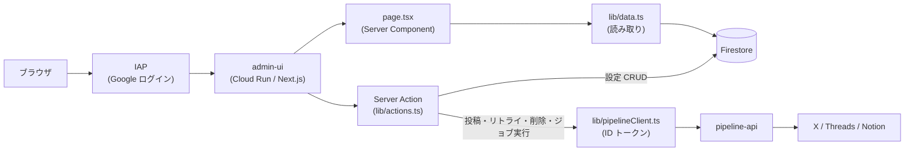

# 07. 管理画面(admin UI)詳細設計

> 対象コード時点: コミット c694140 + 未コミット変更 / 最終更新: 2026-07-15(リサーチチャット2画面・ダッシュボードパネル・初の route handler を追記)

## 1. この文書で分かること

- 管理画面(admin)の全 14 画面(うち research 2 画面の詳細は [10-research-agent.md](10-research-agent.md))それぞれで「何が見えて、何ができて、押すと何が起きるか」
- 画面の裏側にある `lib/` 層(Firestore 読み書き・pipeline-api 呼び出し・認証)の全関数
- Next.js 特有の仕組み(Server Component / Server Action / 多言語対応 / ビルド)の読み解き方

## 2. 関連ファイル一覧

| ディレクトリ | ファイル | 役割 |
|---|---|---|
| `admin/` | `package.json` | npm スクリプト定義(`dev` / `prebuild` / `build` / `typecheck`) |
| | `next.config.mjs` | Next.js 設定(`standalone` 出力、next-intl プラグイン) |
| | `Dockerfile` | 2 ステージビルド(node:24-slim、ポート 8080) |
| `admin/scripts/` | `sync-constants.mjs` | `shared/constants.json` を `src/lib/` へコピー(prebuild) |
| `admin/messages/` | `ko.json` `ja.json` `en.json` | UI 文言の翻訳ファイル(画面ごとの名前空間) |
| `admin/src/` | `middleware.ts` | 全リクエストに言語プレフィックスを付ける入口処理 |
| `admin/src/i18n/` | `routing.ts` `request.ts` | 対応言語の定義と、リクエストごとの翻訳読み込み |
| `admin/src/app/[locale]/` | `layout.tsx` | 全画面共通の枠。翻訳・IAP メールをサーバで解決し、シリアライズ可能な props にして `AppShell` へ渡す |
| | `page.tsx` ほか各画面の `page.tsx` | 各画面の本体(下記 5 章の 14 画面) |
| `admin/src/components/` | `AppShell.tsx` | 共通枠のレイアウト本体。デスクトップ固定サイドバー / モバイルのトップバー+スライドインドロワーを開閉状態付きで描く(ブラウザ側で動く) |
| | `DraftEditor.tsx` | 下書き編集・プレビュー・承認して投稿(ブラウザ側で動く) |
| | `PostsTable.tsx` | 投稿履歴のチェックボックス複数選択+一括削除(ブラウザ側で動く) |
| | `Markdown.tsx` | markdown の簡易レンダリング(投稿詳細ページの本文表示用) |
| | `ActionButton.tsx` | 実行ボタン+結果表示の汎用部品。`disabled` prop でボタン自体を無効化できる(ブラウザ側で動く) |
| | `SaveForm.tsx` | 設定保存フォームの共通ラッパー。`useActionState` で pending スピナーと保存後の ✓/エラー表示を付与する(ブラウザ側で動く) |
| | `AutomationCell.tsx` | ダッシュボード自動化グリッドの1セル。生成 ON/OFF チェックに応じてチャネルチェックボックス群を視覚的に無効化する(ブラウザ側で動く) |
| | `ManualRunPanel.tsx` | ダッシュボード手動実行カード。投稿先チャネルのUI状態選択(見た目のみ、保存はしない)に応じて記事・レポートボタンを無効化する(ブラウザ側で動く) |
| | `LocaleSwitcher.tsx` | 言語切替ボタン(ブラウザ側で動く) |
| | `NavLink.tsx` | サイドバーのナビ項目。現在 URL と照合してアクティブ表示(ブラウザ側で動く) |
| | `ui.tsx` | 共通 UI 部品(PageHeader・Card・StatCard・StatusBadge・Chip・EnabledBadge・EmptyState・Table)と共通 CSS クラス文字列 |
| | `icons.tsx` | インライン SVG アイコンセット(外部依存なし。ナビ・警告帯などで使用) |
| `admin/src/components/chat/` | `ChatView.tsx` | チャット本体。ダッシュボードパネル(`compact`)と専用ページで共用(ブラウザ側で動く) |
| | `useChatStream.ts` | SSE の受信とパース(`event:`/`data:` 行、`: ping` は無視)。**EventSource は POST 不可なので使わない**(ブラウザ側で動く) |
| | `Composer.tsx` | 入力欄+モード(壁打ち⇄調査)・深さ(クイック/深掘り)トグル+送信/中止(ブラウザ側で動く) |
| | `HandoffMenu.tsx` | 回答を短文/記事/レポートの作成に回す(ブラウザ側で動く) |
| | `ChatPanel.tsx` | ダッシュボード用ラッパー(サーバ側。翻訳とカテゴリを解決して ChatView へ渡す) |
| | `TrustBand.tsx` | 出典の信頼度を1件1本の帯で表す(塗り=tier / 高さ=スコア)。表示上限 `SCORE_SCALE` の正(ブラウザ側で動く) |
| | `Apparatus.tsx` | 番号付き出典リスト(ブラウザ側で動く) |
| | `ThreadList.tsx` | スレッド一覧(サーバ側) |
| | `labels.ts` | `chat` 名前空間の翻訳をサーバで解決し props 用の平オブジェクトにする |
| `admin/src/app/api/chat/stream/` | `route.ts` | **本リポジトリ唯一の route handler**。SSE を素通しする(7.6 節) |
| `admin/src/lib/` | `firestore.ts` | firebase-admin 初期化(シングルトン) |
| | `data.ts` | Firestore 読み取り関数(画面表示用) |
| | `actions.ts` | 書き込み処理(Server Action) |
| | `pipelineClient.ts` | pipeline-api を ID トークン付きで呼ぶ HTTP クライアント |
| | `iap.ts` | IAP ヘッダからログインユーザーのメールを取り出す |
| | `constants.ts` / `shared-constants.json` | Python と共通の enum(取りうる値の一覧) |
| | `textLimits.ts` | X/Threads の文字数計算(pipeline 側のミラー) |
| | `types.ts` | Firestore ドキュメントの TypeScript 型定義 |
| `infra/` | `11-deploy-admin.sh` | Cloud Run へのデプロイ(`--iap` 付き、環境変数注入) |

## 3. 全体構造

管理画面は **Next.js 15**(React ベースの Web アプリフレームワーク)製の単一 Cloud Run サービスで、手前に **IAP**(Identity-Aware Proxy: Google アカウントでログインさせる門番)が立つ。データの読み取りは Firestore(GCP のドキュメント型データベース)へ直接、外部への副作用がある操作だけ pipeline-api を経由する。



図の読み方: ブラウザからのアクセスはまず IAP で Google ログインを強制され、許可されたメールアドレスだけが admin-ui に到達する。画面の表示(左下ルート)は `page.tsx` がサーバ側で `lib/data.ts` を呼び、Firestore を直接読んで HTML を組み立てる。ボタン操作(右ルート)は Server Action(`lib/actions.ts`)がサーバ側で実行され、設定の保存なら Firestore へ直接書き、投稿・リトライ・ジョブ実行なら `lib/pipelineClient.ts` 経由で pipeline-api を呼ぶ。ブラウザ自身は Firestore にも pipeline-api にも一切触れない。

### 3.1 ビルドと起動の流れ

`admin/package.json` の scripts が入口になる:

| コマンド | 何が起きるか |
|---|---|
| `npm run dev` | 開発サーバ起動(ローカル。Firestore へは gcloud の ADC で接続) |
| `npm run build` | 本番ビルド。**直前に `prebuild` が自動実行** され `scripts/sync-constants.mjs` が走る(7.5 節) |
| `npm run start` | ビルド済み成果物でサーバ起動 |
| `npm run typecheck` | `tsc --noEmit` による型検査のみ(admin にテストスクリプトはない) |

ビルドの挙動は `admin/next.config.mjs` の 2 つの設定で決まる:

- `output: 'standalone'` — 実行に必要なファイル一式を `.next/standalone/` に自己完結でまとめ、`node server.js` だけで起動できる形にする。Docker イメージを小さくするための定石
- `serverExternalPackages: ['firebase-admin']` — firebase-admin はバンドル(複数ファイルを 1 つに束ねる処理)の対象から外し、実行時に node_modules から読む指定。ネイティブ依存を含むサーバ専用ライブラリのための措置

`admin/Dockerfile` は 2 ステージ構成: build ステージ(node:22-slim)で `npm ci` → `npm run build` し、runtime ステージには `.next/standalone` + `.next/static` + `public` **だけ** をコピーする(node_modules 全体は持ち込まない)。`PORT=8080` で `CMD ["node", "server.js"]`。このイメージを `infra/11-deploy-admin.sh` が Cloud Run に `--iap` 付きでデプロイし、環境変数 `PROJECT_ID` / `PIPELINE_API_URL`(pipeline-api の URL を `gcloud run services describe` で取得して注入)/ `GCS_BUCKET` を渡す。

## 4. 最重要の設計判断 — 「Firestore 直書き」と「pipeline-api 経由」の使い分け

管理画面の書き込み処理の経路は 2 種類に分かれる。境界線は **「データベースの外に副作用があるか」**。

| 経路 | 対象 | 理由 |
|---|---|---|
| **Firestore 直書き** | カテゴリ・ソース・プロンプト・チャネル設定・フォーカス(キーワード+カスタム指示)・自動化グリッド・アプリ設定(globalChannels 含む)の保存、下書きテキストの保存・下書き削除 | 結果が DB の中で完結する。admin-sa(管理画面のサービスアカウント)に Firestore 権限があれば済み、API を挟む価値がない |
| **pipeline-api 経由** | `approveAndPublish()`(承認して投稿)/ `retryChannel()`(失敗チャネルの再投稿)/ `runJobNow()`(ジョブの手動実行)/ `runReportNow()`(レポート調査 run の作成)/ `deletePostChannels()` / `deletePosts()`(公開済み投稿のリモート削除) | SNS への投稿・削除やジョブ起動という **外部への副作用** がある。冪等制御・公開順(notion → x → threads)・チャネル状態遷移のロジックは pipeline 側に一本化されており、管理画面に複製しない |

つまり「SNS に何かが飛ぶ・ジョブが動く」操作だけが pipeline-api(`05-pipeline-api.md` 参照)へ行き、それ以外はただの DB 編集として扱う。`admin/src/lib/actions.ts` の冒頭コメントにもこの方針が明記されている。新しい操作を足すときも、この基準で経路を選ぶこと。

## 5. 画面リファレンス

### 5.1 画面一覧

URL の先頭には言語プレフィックス(`/ko` `/ja` `/en`、8 章)が付く。以下では省略する。

| # | 画面(ja 表示名) | URL | ファイル(`admin/src/app/[locale]/` 配下) | 主な読み取り(data.ts) | できる操作(actions.ts) |
|---|---|---|---|---|---|
| 1 | ダッシュボード | `/` | `page.tsx` | `getDrafts()` `getRecentPosts()` `getCostSummary()` `getChannelHealth()` `getCategories()` `getPromptTemplates()` `getChannelConfigs()` `getAppSettings()` | `saveAutomation()` `runJobNow('generate_short' / 'generate_article')` `runReportNow()` |
| 2 | 下書き | `/drafts` | `drafts/page.tsx` | `getDrafts()` | `deleteDraft()`(詳細へのリンクも) |
| 3 | 下書き編集 | `/drafts/[id]` | `drafts/[id]/page.tsx` | `getPost()` | `saveDraft()` `approveAndPublish()` |
| 4 | 投稿履歴 | `/posts` | `posts/page.tsx` | `getRecentPosts(50)` | `deletePosts()`(複数選択、詳細へのリンクも) |
| 5 | 投稿詳細 | `/posts/[id]` | `posts/[id]/page.tsx` | `getPost()` | `retryChannel()` `deletePostChannels()` `deletePosts()` |
| 6 | フォーカス | `/focus` | `focus/page.tsx` | `getCategories()` `getPromptTemplates()` | `saveFocus()`(キーワード+カスタム指示) |
| 7 | カテゴリ | `/categories` | `categories/page.tsx` | `getCategories()` | `saveCategory()` |
| 8 | ソース | `/sources` | `sources/page.tsx` | `getSources()` `getCategories()` | `saveSource()` `toggleSource()` `deleteSource()` `runJobNow('collect')` |
| 9 | プロンプト | `/prompts` | `prompts/page.tsx` | `getPromptTemplates()` `getCategories()` | なし(編集へのリンク) |
| 10 | プロンプト編集 | `/prompts/[id]` | `prompts/[id]/page.tsx` | `getPromptTemplate()` | `savePromptTemplate()` |
| 11 | チャネル | `/channels` | `channels/page.tsx` | `getCategories()` `getChannelConfigs()` | `saveChannelConfig()` |
| 12 | 設定 | `/settings` | `settings/page.tsx` | `getAppSettings()` `getNotionDatabaseId()` `getRecentRuns()` | `saveAppSettings()`(globalChannels 含む) `runJobNow(各ジョブ)` |

このほか research 2 画面(`/research` 一覧・`/research/[id]` 実行詳細。実行詳細には `ResearchFlow.tsx`(`@xyflow/react`)による Agent flow カード = 6 フェーズ+コネクタ+言語別 localize ノードの DAG 表示がある)がある(詳細は [10-research-agent.md](10-research-agent.md))。

さらに**リサーチチャット 2 画面**(`/chat` 新規会話・`/chat/[id]` スレッド)がある(詳細は [11-research-chat.md](11-research-chat.md))。読み取りは `getChatThreads()` / `getChatThread(id)` / `getChatMessages(id)`、操作は `cancelChat()` / `handoffChat()`。ダッシュボード最上部にも同じ `ChatView` を `compact` で載せた `ChatPanel` が常設される(Threads 失効の赤帯より下 = 障害告知の優先を崩さない位置)。**送信だけは Server Action ではなく route handler `src/app/api/chat/stream/route.ts` を fetch する**(唯一の例外。理由は 7 章)。

全画面は `layout.tsx` の共通枠の中に表示される。共通枠のレイアウトは `AppShell.tsx`(Client Component)が描く。濃紺(ink)のサイドバーのナビゲーションは日常運用に絞った 2 グループ・5 項目 — **Main**(ダッシュボード / 投稿履歴 / 下書き / フォーカス)と **System**(設定)— に再編されている(`layout.tsx` の `NAV_GROUPS`)。カテゴリ・ソース・プロンプト・チャネル・research の各ページはルーティングとしては残っており、**設定ページ下部の「詳細設定」リンクグリッドから開く**(5.13 節)(グループラベルは `messages/*.json` の `nav.group*` キー。翻訳は `layout.tsx` がサーバ側で解決し props で渡す)。各項目はアイコン付きで、現在表示中の画面が `NavLink.tsx`(`usePathname()` で URL と照合)によりハイライトされる。サイドバー下部には IAP 認証済みユーザーのメールアドレス(`iapUserEmail()`)と言語切替を表示する。

**レスポンシブ挙動**: `lg` ブレークポイント以上では従来どおり固定サイドバー(`lg` 未満のデスクトップ幅ではアイコンのみに縮小)。`lg` 未満(モバイル・タブレット縦)では**サイドバーを隠し、代わりに sticky なトップバー**(ハンバーガー+ロゴ)を表示する。ハンバーガーを押すと左からスライドインする**オフキャンバスのドロワー**が開き、ラベル・グループ見出し・メールを常時表示する(`NavBody` の `expanded` フラグ)。ドロワーは背景タップ / Esc キー / ナビ項目タップ(遷移)で閉じ、開いている間は body スクロールをロックする。`NavLink` / `LocaleSwitcher` は `expanded` prop でドロワー内の常時ラベル表示に対応する。本文の左右パディングもモバイルで縮む(`px-4 sm:px-5 lg:px-10`)。

デザイントークン(配色・フォント)は `tailwind.config.ts` の `theme.extend` に定義されている: `ink`(サイドバー・見出しの濃紺)/ `paper`(背景の暖色系グレー)/ `line`(罫線)/ `accent`(ボタン・リンク・アクティブ表示の深いティール)。ステータス色(琥珀=`draft`、緑=`published`、赤=`failed` など)は意味論専用で、`ui.tsx` の `StatusBadge`(色ドット+等幅フォントラベル)に集約されている。周期(`daily` 等)やソース種別のような「状態ではない enum 値」は中立色の `Chip` で表示し、色が状態を意味する原則を保つ。**この原則はチャットの信頼度表示にも効いている** — tier(一次/二次/三次)は状態ではないので色を使えず、代わりに ink の濃度と高さで表す(`TrustBand`、[11-research-chat](11-research-chat.md) §6.9)。

数値・ID・時刻は等幅フォント(`font-mono`)で統一する。**この `font-mono` は唯一の同梱書体 IBM Plex Mono**(ラテン3ウェイト 44KB。`[locale]/layout.tsx` の `next/font/local` が読み、`tailwind.config.ts` の `fontFamily.mono` が `var(--font-plex-mono)` で参照する)。本文には適用されない — 回答や記事はユーザーの言語(ja/ko/en)で出るため、ラテン専用書体では中身のある場所で黙ってフォールバックしてしまう。本文は閲覧者のシステム CJK スタックのままで、書体の人格は**数字と apparatus** に集約している(理由と代替案は [11-research-chat](11-research-chat.md) §6.11)。

### 5.2 ダッシュボード(`/`)

システムの健康状態を 1 画面に集約し、自動化の設定と手動実行の起点も兼ねる。上から順に:

- **Threads トークン更新失敗の赤帯** — `settings/channelHealth` の `threadsRefreshError` が空でないときだけ表示。対処は `../../runbook.md` 参照
- **4 枚の StatCard** — **今月の LLM コスト**と**累計コスト**(いずれも `getCostSummary()`: `runs` の `costUsd` + `researchRuns` の `budget.usdSpent` を、当月分(UTC 月初起点)と全期間で合計。JST とは最大 9 時間ずれる)/ Threads トークンの残り日数(失効 14 日前を切るか更新エラーがあると赤字)/ 承認待ち下書き数
- **自動化グリッド** — 行 = カテゴリ、列 = フォーマット(short / article / report)の表。各セルにフォーマット別のスケジュールラベル(short = 毎日 08:00 JST / article = 月曜 07:00 / report = 毎月1日 07:00)、生成の有効チェック(`promptTemplates.enabled`)、**チャネル別トグル**(`channelConfigs.enabled` を書き込む。表示されるのは `settings/app.globalChannels` で有効なチャネル列のみ)が並ぶ。セル本体は `AutomationCell.tsx`(Client Component)で、生成 ON/OFF チェックを外すとチャネルチェックボックス群が `pointer-events-none opacity-40` で視覚的に無効化される(チェック状態自体は DOM に残り、フォーム送信もそのまま行われるので、既存のチャネル設定は生成を再度 ON にすれば復元される — 送信内容は変えず見た目だけ変える設計)。保存は `SaveForm.tsx` 経由で `saveAutomation()` を呼ぶ(バッチ書き込み。未存在の channelConfigs は既定言語 X=ja / Threads=ko / Notion=en で新規作成し、既存の言語設定は保持する)。保存後はボタン横に緑の `✓ 保存しました` / 失敗時は赤字のエラー詳細が表示される(9 章)
- **手動実行カード** — `ManualRunPanel.tsx`(Client Component)。投稿先チャネル(Notion / X / Threads)を選ぶチップ群があるが、これは**見た目だけの状態**で実際の投稿先は変えない(実際の投稿先チャネルは既存の `channelConfigs` のまま。バックエンドへ渡す仕組みは未実装)。X または Threads を選ぶと、短文しか対応しないという理由で記事・レポートのボタンが無効化される(`ActionButton` の `disabled` prop)。short / article は `runJobNow('generate_short' / 'generate_article')` で Cloud Run Job を起動、report は `runReportNow()` → pipeline-api の `POST /api/research/runs`(自動テーマ選定・trigger=manual・requestedBy に IAP メール)で Research Agent の run を作成する
- **承認待ちの下書き**(先頭 5 件) — フォーマットチップ+タイトル。クリックで下書き編集へ
- **直近の投稿**(8 件) — 投稿ステータスとチャネルごとのステータスバッジ

ジョブ実行履歴(`runs` 一覧)は設定ページへ移動した(5.13 節)。

### 5.3 下書き(`/drafts`)

`status == "draft"` の投稿(post)を新しい順に最大 30 件表示する一覧。列は周期・タイトル・カテゴリ・作成日時・操作で、タイトルをクリックすると下書き編集へ遷移する。運用フロー上、ここに並ぶのは主に週次・月次の長文記事(日次は既定で自動投稿)。各行に**削除ボタン**があり、`deleteDraft(id)`(server action)が Firestore の該当ドキュメントを削除する。安全策として `deleteDraft` は **`status == "draft"` のときだけ**削除を実行し、公開済み投稿には効かない。下書きは全チャネル `pending`(外部に何も出ていない)ので後片付けは不要。画面上部には「承認されない下書きは 30 日後に自動削除される」旨の注記があり、その自動削除の実体が cleanup_drafts ジョブ([06-ops-jobs.md](06-ops-jobs.md) 第3部)。

### 5.4 下書き編集(`/drafts/[id]`)— DraftEditor

この画面が管理画面の心臓部。`drafts/[id]/page.tsx` はサーバ側で `getPost()` を呼び(存在しなければ 404)、ヘッダにステータスバッジ・周期・カテゴリ・生成コストを出したうえで、編集本体を `admin/src/components/DraftEditor.tsx`(ブラウザで動く Client Component、7.1 節)に渡す。

**左列 = 編集フォーム**(すべて入力のたびにブラウザ内の state に保持):

- タイトル / 要約 / 本文(markdown、24 行の広いテキストエリア)
- **チャネル別テキスト**: X 用テキストと Threads 用テキスト。X 側は入力のたびに `xWeightedLength()`(`textLimits.ts`)で **加重文字数** を再計算し、`n/280` の数値と小さなプログレスバー(`LimitMeter`)で残量を表示、280 を超えると赤くなる(超えていても保存・投稿ボタン自体は塞がない。最終検証は pipeline 側)。Threads 側は単純な文字数 `n/500`
- **保存ボタン**: 入力内容を `FormData`(フォーム送信用の入れ物)に詰めて `saveDraft()` を呼ぶ。書き込まれるのは `posts/{id}` の `title` `summary` `body` `channels.x.text` `channels.threads.text` のみ(ステータスは変わらない)

**右列 = プレビューと投稿**:

- **プレビュータブ**(`notion` / `x` / `threads`、初期表示は `notion`): 編集中のテキストをそのまま整形表示する。`x` / `threads` タブはアバターとハンドル名付きの投稿カード風に描画し、読者が実際に見る形に近づけている。周期が `daily` 以外のとき「+ Notion URL」という注記が付く — 週次・月次のティーザー投稿には pipeline が Notion 公開 URL を末尾に付加するため(公開順が notion 先行である理由。`05-pipeline-api.md`)
- **投稿先チェックボックス**: `post.channels` の各チャネルにつき 1 つ。初期チェックは「有効かつ `pending`」のチャネル。`published` 済みチャネルはチェック不可(二重投稿防止)。`failed` / `skipped` は手動でチェックし直せる
- **「承認して投稿」ボタン**: 確認ダイアログ → まず `saveDraft()` で編集内容を保存 → `approveAndPublish(post.id, selected)` を呼ぶ。1 チャネルも選んでいないと押せない

`approveAndPublish()` の裏側では: IAP ヘッダから承認者メールを取得(7.3 節)→ pipeline-api の `POST /api/posts/{id}/publish` に `{approvedBy, channels}` を送信 → pipeline-api 側で「選択しなかった `pending` チャネルを `skipped` に落とす → `approvedBy` を記録して `status` を `approved` に更新 → 実際の公開処理(notion → x → threads)」が **同期実行** される。つまりボタンを押してから応答が返るまで数十秒かかりうる。応答ボディ(各チャネルの結果 JSON)がそのまま画面下部に表示され、成功時はページを再読込して最新ステータスを反映する。すでに `published` / `publishing` の投稿には 409 が返る(連打対策)。

### 5.5 投稿履歴(`/posts`)

直近 50 件の投稿を、投稿ステータス・タイトル・フォーマット・**チャネルごとの状態**・コスト・作成日時で一覧する(`PostsTable.tsx`、Client Component)。タイトルをクリックすると投稿詳細(5.6 節)へ遷移する。各行に**チェックボックス**があり、複数選択して**一括削除**できる — `deletePosts(postIds)` が投稿ごとに pipeline-api の `POST /api/posts/{id}/delete` を `channels=[]`(全チャネル)+ `deletePost=true` で呼び、リモート成果物(ツイート・Threads メディア・Notion ページ)を削除したうえで Firestore の post ドキュメントも削除する(確認ダイアログあり)。チャネル単位のリトライ・削除は投稿詳細ページで行う。

### 5.6 投稿詳細(`/posts/[id]`)

投稿 1 件のフルビュー。`getPost()` で読み(無ければ 404)、以下を表示する:

- **チャネルカード**(x / threads / notion) — 状態バッジ・言語・公開 URL・エラー文言。`failed` チャネルには**リトライボタン**(`retryChannel()`。成功済みチャネルには二重投稿されない)、リモート成果物のあるチャネルには**チャネル別削除ボタン**(`deletePostChannels(postId, [channel])` → delete エンドポイント。`deletePost=false` なので doc は残る)
- **本文** — `summary` / `body` を `Markdown.tsx` で整形表示
- **レポートの言語別コンテンツ** — `post.localizations`(ja/ko/en)をカード表示
- **投稿全体の削除** — `deletePosts([id])`(全チャネルのリモート削除+ doc 削除)

### 5.7 フォーカス(`/focus`)

カテゴリ × フォーマットのグリッドで、生成の方向づけを 1 画面で編集する(プロンプト本文を開かずに済む日常運用の入口)。セルごとに:

- **焦点キーワード**(`focusKeywords`、カンマ区切り) — 収集と生成の両方に効く([03-generate.md](03-generate.md) / [02-collect.md](02-collect.md))
- **カスタム指示**(`customInstructions`、自由記述) — オーナーの常設リクエスト。ko/ja/en どの言語で書いてもよい旨の注記が画面上部にある。生成プロンプト末尾に OWNER INSTRUCTIONS ブロックとして付加され(short / article / report write)、**出力言語は変えない**

保存は `saveFocus()`(merge のみの set なので、seed 済みプロンプト本文には触らない)。セル右上の「詳細編集」リンクからプロンプト編集(5.11 節)へ飛べる。

### 5.8 カテゴリ(`/categories`)

収集・生成の単位となるカテゴリ(`categories` コレクション)の一覧と追加フォーム。一覧は slug(URL 用の識別子)・表示名・検索ヒント・有効/無効バッジ。追加フォームの `saveCategory()` は **slug をドキュメント ID とした upsert**(あれば更新・なければ作成)なので、既存 slug を入力すれば編集にもなる。検索ヒントはカンマ区切りで入力し、配列に分解して保存される。なお `actions.ts` には `toggleCategory()` も定義されているが、現時点でどの画面からも使われていない(無効化はフォームのチェックを外して再保存する)。

### 5.9 ソース(`/sources`)

収集元(`sources` コレクション)の管理。画面上部に **「collect を今すぐ実行」ボタン**(`runJobNow('collect')`)があり、収集ジョブを待たずにソース追加の結果を確かめられる。一覧は ID・カテゴリ・種別・URL/クエリ・最終取得時刻・有効/無効と、行ごとの操作(有効/無効の切替、削除)。**削除は確認ダイアログなしで即実行される** 点に注意。

追加フォームでは種別を `rss` / `gemini_grounded` / `ieee_xplore`(`shared-constants.json` 由来)から選び、`rss` 系は URL、検索系はクエリを入れる。ID を空にすると `src-{タイムスタンプ}` が自動採番される。`saveSource()` は保存時に `etag` / `lastModified`(HTTP キャッシュ制御用フィールド)を空文字にリセットするため、既存ソースを編集すると次回は全件取得し直しになる。

### 5.10 プロンプト(`/prompts`)

カテゴリ × 周期(`daily` / `weekly` / `monthly`)のマトリクス表。セルには `{カテゴリslug}_{周期}` という ID のプロンプトテンプレートへのリンクが入り、未作成のセルは「未シード」リンク(クリックすると空の編集画面が開き、保存すれば新規作成される)。有効/無効バッジ付き。

### 5.11 プロンプト編集(`/prompts/[id]`)

LLM に渡すプロンプト(指示文)の編集フォーム。ID 文字列を最後の `_` で分割してカテゴリと周期を復元し、隠しフィールドで一緒に保存する。フォーム先頭に、青枠で強調した**焦点キーワード欄**(`focusKeywords`、カンマ区切り入力)がある — 「システムプロンプトはあまり触らないが、重視したいキーワードだけ入れたい」という運用を想定した主役の入力欄で、収集と生成の両方に効く([03-generate.md](03-generate.md) / [02-collect.md](02-collect.md))。以下に共通項目のシステムプロンプト・ユーザープロンプトテンプレート(`{placeholder}` 記法が使える旨のヒント付き)・モデル上書き・有効フラグ。**周期が `weekly` / `monthly` のときだけ** アウトライン用のシステム/ユーザープロンプト欄が追加表示される — 長文生成が「小型モデルで記事選定 → 大型モデルで執筆」の 2 段階だからで、その 1 段目に使われる。`savePromptTemplate()` は merge 付き set(upsert)で、`focusKeywords` はカンマ分割して配列で保存する。

### 5.12 チャネル(`/channels`)

カテゴリごとのカードに、行 = 周期、列 = チャネル(`x` / `threads` / `notion`)の表を描き、**セル 1 つ 1 つが独立したミニフォーム**(有効チェック+言語セレクト+保存リンク)になっている。保存先はドキュメント ID `{slug}_{周期}_{チャネル}` の `channelConfigs`。未設定セルの既定値は「無効・言語 `en`」。このセル内フォームはファイル内に直接書かれた Server Action(7.2 節)で処理される。運用上の既定(X=日本語 / Threads=韓国語 / Notion=英語)はここで上書きできる。

### 5.13 設定(`/settings`)

上から順に:

- **グローバルチャネルスイッチ**: X / Threads / Notion のチャネル全体の有効/無効(`settings/app` の `globalChannels`。既定 X=off / Threads=off / Notion=on)。生成時にカテゴリ別 `channelConfigs.enabled` と AND され、off のチャネルはダッシュボードの自動化グリッドの列からも消える
- **アプリ設定**: タイムゾーン、短文も承認制にする(`shortRequireApproval`)、短文 X 投稿に URL を含める(`xAllowUrlOnShort`)、画像添付(`attachImages`)、Notion データベース ID。`saveAppSettings()` は 1 回の送信で `settings/app`(globalChannels 含む)と `settings/notion` の 2 ドキュメントに書き分ける
- **詳細設定リンクグリッド**: カテゴリ / ソース / プロンプト / チャネル / research 各ページへのリンク集(ナビ再編でサイドバーから外れたページの入口。5.1 節)
- **ジョブ手動実行**: `collect` `generate_short` `generate_article` `cleanup_drafts` `refresh_threads_token` `seed` の 6 ボタン(`shared/constants.json` の `jobTypes` 由来。レポートはジョブ直起動ではなくダッシュボードの `runReportNow()` → `POST /api/research/runs` で作成する)。`runJobNow()` → pipeline-api の `POST /api/jobs/{name}/run` は **202(受付)を即返し**、pipeline-api が対応する **Cloud Run Job を起動する**(スケジューラ経由と同じジョブ・同じ実行環境。`05-pipeline-api.md` 6a 節)
- **ジョブ実行履歴**(12 件、ダッシュボードから移設): `runs` の `jobType`・成否・開始時刻・統計・先頭エラーの一覧。手動実行の進行結果はここで確認する

## 6. lib リファレンス

### 6.1 `firestore.ts` — 接続の一元化

`db()` は firebase-admin(サーバ用 Firestore クライアント)の初期化を **シングルトン**(プロセス内で 1 回だけ生成して使い回す方式)にした関数。認証は `applicationDefault()` — Cloud Run 上では admin-sa の権限が、ローカルでは `gcloud auth application-default login` の資格情報が自動で使われ、**秘密鍵ファイルを一切持たない**。プロジェクト ID は環境変数 `PROJECT_ID`(未設定なら `trend-news-generator`)。もう 1 つの `toIso()` は Firestore の Timestamp 型を表示用の ISO 文字列に変換する小道具で、`data.ts` 全体から使われる。

### 6.2 `data.ts` — 読み取り関数一覧

すべて Server Component 専用(ブラウザからは呼べない)。書き込みは 1 つもない。

| 関数 | 読む場所 | 返すもの / 補足 |
|---|---|---|
| `getCategories()` | `categories` | 全件を `sortOrder` 順に |
| `getSources()` | `sources` | 全件 |
| `getPromptTemplates()` / `getPromptTemplate(id)` | `promptTemplates` | 全件 / 1 件(なければ null) |
| `getChannelConfigs()` | `channelConfigs` | 全件 |
| `getDrafts()` | `posts` | `status == "draft"` を新しい順に 30 件 |
| `getPost(id)` | `posts` | 1 件(なければ null) |
| `getRecentPosts(limit)` | `posts` | 新しい順(既定 30 件) |
| `getRecentRuns(limit)` | `runs` | 開始時刻順(既定 20 件) |
| `getMonthCostUsd()` | `runs` | 当月(UTC 起点)の `costUsd` 合計 |
| `getCostSummary()` | `runs` + `researchRuns` + `chatUsage` | `{monthUsd, totalUsd}`。累計 = 全 `runs.costUsd` + 全 `researchRuns.budget.usdSpent` + 全 `chatUsage.costUsd` の合計(ダッシュボードの 2 コストカード用)。`chatUsage` は月別に集計済みなので、当月分はドキュメント ID(`YYYY-MM`、UTC)の一致で拾う |
| `getAppSettings()` | `settings/app` | 欠損フィールドは既定値で補完 |
| `getNotionDatabaseId()` | `settings/notion` | `databaseId` 文字列 |
| `getChannelHealth()` | `settings/channelHealth` | Threads トークンの期限・最終更新・エラー |
| `getChatThreads(limit)` | `chatThreads` | `status == "active"` を `lastMessageAt` 降順(既定 30 件) |
| `getChatThread(id)` | `chatThreads` | 1 件(なければ null) |
| `getChatMessages(threadId, limit)` | `chatThreads/{id}/messages` | **`seq` 昇順**(既定 100 件)。`createdAt` 順ではない理由は [11-research-chat.md](11-research-chat.md) §6.4 |

投稿系は内部の `mapPost()` で欠損に強い形(`?? ''` で補完)へ整形する。各コレクションのフィールド定義は `../03-data-model.md` 参照。

### 6.3 `actions.ts` — Server Action 一覧

先頭に `'use server'` が付いたファイル(7.2 節)。全書き込みがこの 1 ファイルに集まっている。

| 関数 | 経路 | 書き込み先 / 呼び先 | 戻り値 |
|---|---|---|---|
| `saveCategory(formData)` | Firestore | `categories/{slug}` merge set | `ActionResult` |
| `toggleCategory(slug, enabled)` | Firestore | `categories/{slug}` update(**現状 UI 未使用**) | void |
| `saveSource(formData)` | Firestore | `sources/{id}` merge set(etag リセット) | `ActionResult` |
| `toggleSource(id, enabled)` | Firestore | `sources/{id}` update | void |
| `deleteSource(id)` | Firestore | `sources/{id}` delete | void |
| `savePromptTemplate(formData)` | Firestore | `promptTemplates/{id}` merge set | `ActionResult` |
| `saveChannelConfig(...)` | Firestore | `channelConfigs/{id}` merge set | `ActionResult` |
| `saveAppSettings(formData)` | Firestore | `settings/app` と `settings/notion` | `ActionResult` |
| `saveFocus(formData)` | Firestore | `promptTemplates/{id}` の `focusKeywords` / `customInstructions` のみ merge set | `ActionResult` |
| `saveAutomation(formData)` | Firestore | 自動化グリッドの一括保存(`promptTemplates.enabled` + 表示チャネル分の `channelConfigs`、バッチ書き込み) | `ActionResult` |
| `saveDraft(formData)` | Firestore | `posts/{id}` の本文とチャネルテキストのみ update | `ActionResult` |
| `deleteDraft(postId)` | Firestore | `posts/{id}` delete(`status == "draft"` のときのみ) | void |
| `saveReportDraft(formData)` | Firestore | `posts/{id}` の `localizations.{lang}.{title\|summary\|body}` のみ dot-path update | `ActionResult` |
| `approveAndPublish(postId, channels)` | pipeline-api | `publishPost()`(承認者メール付き) | `ActionResult` |
| `retryChannel(postId, channel)` | pipeline-api | `retryChannel()` | `ActionResult` |
| `runJobNow(name)` | pipeline-api | `runJob()` | `ActionResult` |
| `runReportNow()` | pipeline-api | `createResearchRun({trigger: 'manual', requestedBy})`(自動テーマ選定のレポート run 作成) | `ActionResult` |
| `deletePostChannels(postId, channels)` | pipeline-api | `deletePost(postId, channels, false)`(チャネル別リモート削除、doc は残す) | `ActionResult` |
| `deletePosts(postIds)` | pipeline-api | 各 post に `deletePost(id, [], true)`(全チャネル削除+ doc 削除)を順次実行 | `ActionResult` |

`ActionResult` は `{ ok: boolean; detail: string }`。設定保存系の Firestore 書き込みは内部で `saveResult()`(`actions.ts` 冒頭のヘルパー)を介して try/catch し、成功時は `{ ok: true, detail: '' }`、例外時は `{ ok: false, detail: err.message }` を返す(9 章)。**全関数が最後に `revalidatePath('/', 'layout')` を呼ぶ**(7.4 節)。

### 6.4 `pipelineClient.ts` — ID トークン付き HTTP クライアント

pipeline-api はアプリレベル認証を持たない代わりに Cloud Run の IAM で守られており、呼び出しには **ID トークン**(呼び出し元サービスアカウントを Google が署名して証明する短命トークン)が要る。`call()` が google-auth-library でトークンを取得(audience = 環境変数 `PIPELINE_API_URL`)し、`Authorization: Bearer` ヘッダ付きで POST する。公開関数:

| 関数 | 呼ぶエンドポイント |
|---|---|
| `publishPost(postId, approvedBy, channels)` | `POST /api/posts/{postId}/publish` |
| `retryChannel(postId, channel)` | `POST /api/posts/{postId}/retry-channel` |
| `deletePost(postId, channels, deletePost)` | `POST /api/posts/{postId}/delete` |
| `runJob(name)` | `POST /api/jobs/{name}/run` |
| `createResearchRun(...)` / research 系 | `POST /api/research/runs` ほか([10-research-agent.md](10-research-agent.md)) |

戻り値は常に `{ ok: レスポンスが 2xx か, detail: レスポンスボディの生テキスト }`。エンドポイント仕様は `05-pipeline-api.md`。

### 6.5 `iap.ts` — ログインユーザーの特定

`iapUserEmail()` は IAP が付与するリクエストヘッダ `x-goog-authenticated-user-email`(形式: `accounts.google.com:user@example.com`)から `:` より後ろを取り出して返す。用途は 1 つ — 「承認して投稿」時に **誰が承認したか**(`approvedBy`)を投稿ドキュメントへ記録すること(7.3 節)。

### 6.6 `constants.ts` と `shared-constants.json` — Python/TS 共通 enum

周期・チャネル・投稿ステータス・ソース種別・言語・ジョブ種別の取りうる値は、リポジトリ直上の `shared/constants.json` が唯一のソース。admin では prebuild(7.5 節)で `src/lib/shared-constants.json` にコピーされ、`constants.ts` がそれを `CADENCES` `CHANNELS` `POST_STATUSES` `SOURCE_TYPES` `LANGUAGES` `JOB_TYPES` として re-export する。画面のセレクトボックスやマトリクス表の軸はすべてここ由来なので、**値を足すときは JSON を直して admin を再ビルドする**(値の意味は `../04-parameters.md`)。なお JSON にある `channelStatuses` は現状 `constants.ts` から export されていない。

### 6.7 `textLimits.ts` — 文字数ルールのミラー(正は pipeline 側)

X は単純な文字数ではなく **加重文字数**(CJK などの全角級文字 = 2、その他 = 1、URL は長さによらず一律 23)で 280 制限を判定する。`xWeightedLength()` はそのルールを TypeScript で再実装したもので、**`pipeline/app/publishers/renderer.py` のミラー**。編集中のライブ表示のための近似であり、**正は常に pipeline 側**(投稿時に再検証される)。renderer.py の判定を変えたら、このファイルも必ず追随させること。定数は `X_LIMIT = 280`、`THREADS_LIMIT = 500`。

### 6.8 `types.ts` — 型定義

`Post`(チャネル状態 `ChannelState` の辞書を内包)・`Category`・`Source`・`PromptTemplate`・`ChannelConfig`・`Run`・`AppSettingsDoc`・`ChannelHealth` を定義。Firestore 側のフィールドと 1:1 なので、詳細は `../03-data-model.md` を正とする。

## 7. 難所解説

Web フロントエンド未経験者が admin のコードで最初に戸惑う 5 点を、抜粋付きで解説する。読み進める前提知識は `00-code-reading-primer.md` にもまとめてある。

### 7.1 Server Components と Client Components の境界

Next.js の App Router では、**コンポーネント(画面部品)は既定でサーバ側で実行される**(Server Component)。ブラウザに届くのは実行結果の HTML だけ。だから `page.tsx` が平然とデータベースを読める。`admin/src/app/[locale]/drafts/[id]/page.tsx` を見る:

```tsx
import { DraftEditor } from '@/components/DraftEditor';
import { getPost } from '@/lib/data';

export default async function DraftDetailPage({
  params,
}: {
  params: Promise<{ locale: string; id: string }>;
}) {
  const { id } = await params;
  const [t, post] = await Promise.all([getTranslations('drafts'), getPost(id)]);
  if (!post) notFound();
  ...
  return <DraftEditor post={post} />;
}
```

- `export default async function ...` — ページ自体が **async 関数**。リクエストが来るたびサーバで実行される
- `params` から URL の `[id]` 部分を受け取る(Next.js 15 では Promise になったので `await` が要る)
- `getPost(id)` — **ここで Firestore を直接読んでいる**。firebase-admin はサーバ専用ライブラリだが、このコードはサーバでしか動かないので問題ない
- `notFound()` — 404 ページに切り替える Next.js の組み込み
- 最後に取得済みデータを `<DraftEditor post={post} />` に **props(引数)として渡す**。ここがサーバ→ブラウザの受け渡し点

一方、クリックや入力に反応するコードはブラウザで動く必要がある。ファイル先頭に `'use client'` と書いたものだけがブラウザに JavaScript として配送される(Client Component)。admin でこの宣言を持つのは `AppShell.tsx` / `DraftEditor.tsx` / `ReportDraftEditor.tsx` / `PostsTable.tsx` / `ActionButton.tsx` / `SaveForm.tsx` / `AutomationCell.tsx` / `ManualRunPanel.tsx` / `LocaleSwitcher.tsx` / `NavLink.tsx` と、チャットの `chat/ChatView.tsx` / `chat/Composer.tsx` / `chat/HandoffMenu.tsx` / `chat/TrustBand.tsx` / `chat/Apparatus.tsx` / `chat/useChatStream.ts`(NavLink は `usePathname()` で現在 URL を読むため。AppShell はモバイルドロワーの開閉状態を `useState` で持つため。チャットはストリーム受信と入力状態をブラウザで持ち、帯と本文の `[n]` が相互にハイライトし合うため)。チャットでも `chat/ChatPanel.tsx`(サーバで翻訳とカテゴリを解決)/ `chat/ThreadList.tsx` は宣言を持たず、原則どおりサーバ側に留めている。`ui.tsx` と `icons.tsx` には宣言がなく、サーバ・ブラウザ両方から import されて双方で使える。原則: **表示とデータ取得はサーバ、対話だけブラウザ**。設定保存フォームは `SaveForm.tsx` 経由にすることで、フォーム自体は Server Action 呼び出しのまま、保存結果の表示だけをブラウザ側の `useActionState` に閉じ込めている。

### 7.2 Server Actions — フォームから直接サーバ関数を呼ぶ

`actions.ts` 先頭の `'use server'` は「このファイルの関数はサーバで実行される。ただしブラウザから **リモート呼び出しできる**」という宣言(Server Action)。API エンドポイントを自分で定義しなくても、Next.js が裏で HTTP POST に変換してくれる。使い方は 3 パターンある。

**(1) フォームに関数を渡す** — `categories/page.tsx` の `<form action={saveCategory}>`。送信すると各 `<input name=...>` が `FormData`(名前→値の入れ物)に詰められ、サーバ側の `saveCategory(formData)` が受け取る。

**(2) `bind` で引数を事前固定** — `posts/page.tsx` の `retryChannel.bind(null, p.id, name)`。`bind(null, a, b)` は「第 1・第 2 引数を `a, b` に固定した新しい関数を作る」JavaScript の標準機能(先頭の `null` は `this` 相当で不使用)。行ごとに違う `postId` / `channel` をボタンに焼き込むためにこう書く。ソース画面の `toggleSource.bind(null, s.id, !s.enabled)` も同じ。

**(3) インライン定義** — `channels/page.tsx` はセルごとにその場で Server Action を作る:

```tsx
<form
  action={async (formData: FormData) => {
    'use server';
    await saveChannelConfig(
      id, cat.slug, cadence, channel,
      formData.get('enabled') === 'on',
      String(formData.get('language') ?? 'en'),
    );
  }}
>
```

- 関数本体の 1 行目に `'use server'` — この無名関数だけを Server Action にする書き方
- `id` `cat.slug` `cadence` `channel` はサーバでの描画時に決まった値で、クロージャ(関数が外側の変数を覚える仕組み)として自動的に同梱される
- `formData.get('enabled') === 'on'` — HTML のチェックボックスは「チェック時のみ `'on'` が送られる」仕様なので、こう booleans に変換する(`actions.ts` 全体で頻出のイディオム)

### 7.3 IAP 認証フロー

admin-ui は Cloud Run の `--iap` フラグ付きでデプロイされ(`infra/11-deploy-admin.sh`)、IAP を通過できるのは `roles/iap.httpsResourceAccessor` を付与されたアカウントだけ。アプリ側にはログイン画面が **存在しない** — 認証は全部 IAP 任せで、アプリは「通過者の身元」をヘッダで受け取るだけ。`admin/src/lib/iap.ts` の全体と使用箇所:

```ts
export async function iapUserEmail(): Promise<string> {
  const h = await headers();
  const raw = h.get('x-goog-authenticated-user-email') ?? '';
  return raw.includes(':') ? raw.split(':').pop()! : raw;
}

// actions.ts での使用箇所
export async function approveAndPublish(postId, channels) {
  const email = await iapUserEmail();
  const result = await pipeline.publishPost(postId, email, channels);
```

- `headers()` — 現在処理中のリクエストのヘッダ一覧(Server Action / Server Component から呼べる Next.js API)
- IAP はヘッダ値を `accounts.google.com:user@example.com` 形式で入れるので、`:` の後ろだけ切り出す
- 用途は承認記録のみ: `approveAndPublish()` がこのメールを pipeline-api に渡し、投稿ドキュメントの `approvedBy` に永続化される。画面の出し分けや権限分岐には使っていない(IAP を通れた人は全員フル権限)

なお本プロジェクトは組織なし GCP のため IAP はカスタム OAuth クライアントで構成済み。IAP が使えない環境の代替は `../../runbook.md` 参照。

### 7.4 常に最新の Firestore を表示する仕組み — force-dynamic と revalidatePath

Next.js は既定でページ結果を積極的にキャッシュするが、管理画面で古い情報を出すと誤操作(承認済みをまた承認する等)につながる。そこで 2 段構えでキャッシュを殺している。

1. **`layout.tsx` の `export const dynamic = 'force-dynamic'`** — この 1 行が配下の **全画面** に効き、「ビルド時に固めず、アクセスごとに毎回サーバで描画し直す」指定になる。だから常に Firestore の現在値が表示される
2. **全 Server Action 末尾の `revalidatePath('/', 'layout')`** — ブラウザ側にも画面遷移用のキャッシュ(Router Cache)があり、書き込み後に古い画面へ戻れてしまう。この呼び出しは「ルート layout 以下すべてのキャッシュを無効化せよ」という合図で、操作後の再表示時に必ずサーバへ取りに行かせる

つまり「サーバ側キャッシュは 1(layout の 1 行)で、ブラウザ側キャッシュは 2(各 action)で」無効化している。画面や action を追加するときも、この 2 つの流儀を踏襲すればキャッシュ起因の不整合は起きない。

### 7.5 sync-constants.mjs — shared/constants.json の prebuild コピー

`admin/scripts/sync-constants.mjs` の全体:

```js
// Copies the monorepo-shared constants into src/lib so the admin app builds
// both locally (with ../shared present) and inside its own Docker context
// (where only the committed copy exists). Runs automatically via prebuild.
import { copyFileSync, existsSync } from 'node:fs';

const source = new URL('../../shared/constants.json', import.meta.url);
const target = new URL('../src/lib/shared-constants.json', import.meta.url);

if (existsSync(source)) {
  copyFileSync(source, target);
  console.log('synced shared/constants.json');
} else {
  console.log('shared/constants.json not found; using committed copy');
}
```

- npm には「`build` の前に `prebuild` という名前のスクリプトを自動実行する」規約があり、`package.json` の `"prebuild": "node scripts/sync-constants.mjs"` がこれに乗っている。`npm run build` するだけで必ず同期が走る
- **なぜコピーが必要か**: `infra/11-deploy-admin.sh` の Docker ビルドは `admin/` ディレクトリだけをビルドコンテキスト(Docker に渡されるファイル一式)として送るため、コンテナ内に `../shared` が **存在しない**。加えて Next.js のビルドはプロジェクト外(`admin/` の外)のファイル import を嫌う
- そこで `src/lib/shared-constants.json` という **コミット済みのコピー** を持ち、ローカルビルドでは本物から上書き同期(if 側)、Docker 内ではコミット済みコピーをそのまま使う(else 側)
- 帰結として、`shared/constants.json` を変更したら「`npm run prebuild` を実行してコピーも更新・コミットし、admin を再ビルドする」までがワンセット。怠ると Python と TypeScript で enum がずれる

### 7.6 route handler — 本リポジトリで1つだけの例外(`/api/chat/stream`)

7.2 のとおり、admin の書き込みは原則すべて Server Action を通る。**リサーチチャットの送信だけがそこから外れる**(`src/app/api/chat/stream/route.ts`)。理由は単純で、**Server Action は値を1つ返して終わる仕組みなので、流れ続ける応答(SSE)を返せない**。ブラウザ側が `fetch` して少しずつ読める URL が必要になる。

この handler がやることは 3 つだけ:

1. `iapUserEmail()` で**サーバ側から** `requestedBy` を注入する(クライアントの body を信用しない)
2. `getIdToken()` で pipeline-api 用の ID トークンを取る(`pipelineClient.ts` の `call()` と同じ経路。SSE を返すためだけに `getIdToken` を export した)
3. 上流のレスポンス body を**変換せずそのまま** `new Response(upstream.body, ...)` で返す

3 が肝で、**ここで body をパースすると全体が届くまで待つことになり、ストリーミングの意味が消える**。`export const runtime = 'nodejs'` / `dynamic = 'force-dynamic'` と、`Cache-Control: no-cache, no-transform` / `X-Accel-Buffering: no` も同じ目的(途中の層にバッファさせない)。なお `src/middleware.ts` の matcher は `/api` を除外済みなので、このパスに i18n のロケールプレフィックスは付かない。

チャットでも **cancel と handoff は普通の Server Action**(`cancelChat()` / `handoffChat()`)。ストリームを返す必要がある送信だけが例外、と覚えるのが正しい。設計の全体は [11-research-chat.md](11-research-chat.md) §6.1。

## 8. i18n(多言語対応)の仕組み

UI 文言は next-intl で ko / ja / en の 3 言語(既定 **ko**)。仕組みは「URL の先頭に言語コードを付ける」プレフィックス方式:

- **`src/middleware.ts`** — 全ページリクエストの入口で next-intl のミドルウェアが動き、`/drafts` のようなプレフィックスなし URL を `/ko/drafts` へリダイレクトする。matcher 正規表現で `api` / `_next` /(`.` を含む)静的ファイルは対象外
- **`src/i18n/routing.ts`** — `locales: ['ko', 'ja', 'en']`、`defaultLocale: 'ko'`、そして `localeDetection: false`。この false により **ブラウザの言語設定(Accept-Language)や cookie による自動判定を無効化** し、言語は URL プレフィックスのみで決まる。管理ツールでは「開いた URL と表示言語が常に一致する」方が混乱がない、という判断
- **`src/i18n/request.ts`** — リクエストごとに `messages/{locale}.json` を動的 import して翻訳辞書を供給。不正な言語コードなら ko に落とす
- **`messages/*.json`** — `nav` `common` に加え画面ごとの名前空間(`dashboard` `drafts` …)で構成。サーバ側は `getTranslations('名前空間')`、Client Component(DraftEditor)は `useTranslations()` で同じキーを引く
- **`LocaleSwitcher.tsx`** — サイドバー下部の 3 ボタン。押すと (1) `NEXT_LOCALE` cookie(next-intl の標準永続化先)を 1 年期限で書き、(2) 現 URL の先頭プレフィックスを正規表現 `/^\/(ko|ja|en)(?=\/|$)/` で剥がして新言語で組み直し、遷移する。`localeDetection: false` の本構成では実際の言語決定は URL のみなので、cookie は保険的な書き込み

なお対応言語を増やす場合、`routing.ts` だけでなく **LocaleSwitcher 内のハードコードされた正規表現と `LOCALES` 配列** も直す必要がある(10 章)。UI 言語(3 つ)と投稿の生成言語(`channelConfigs` の `language`)は別物である点にも注意。

## 9. エラー時の挙動

- **ActionButton**(リトライ・ジョブ実行系): 実行中はラベル横に回転スピナーが出て連打不可。完了すると隣に、成功なら緑の `✓`、失敗なら **赤字でレスポンス本文の先頭 200 文字** を表示する。表示は次の操作まで残る。自動リトライはしない。`disabled` prop が true の間はクリック自体を受け付けない(`ManualRunPanel` が X/Threads 選択時に記事・レポートボタンへ使う)
- **SaveForm**(カテゴリ・ソース・プロンプト・チャネル設定・フォーカス・自動化グリッド・アプリ設定などすべての設定保存フォームの共通ラッパー): `useActionState` で保存中はボタンにスピナー+disabled、完了後はボタン横に成功なら緑の `✓ 保存しました`、失敗なら赤字でエラー詳細を表示する。これにより「保存を押しても画面に変化がなく反映されたか分からない」状態を防ぐ
- **自動化グリッド**: 生成 ON/OFF チェックを外すと、同じ行のチャネルチェックボックスが `AutomationCell.tsx` により視覚的に無効化される(投稿先の選択が生成OFFの間は意味を持たないことを示す)
- **DraftEditor の「承認して投稿」**: 同様に結果をボタン下へ表示(先頭 400 文字)。pipeline-api からの応答 JSON(チャネルごとの結果)が生のまま見えるので、部分失敗(あるチャネルだけ `failed`)もここで分かる。保存(`saveDraft()` / `saveReportDraft()`)が先に失敗した場合はそこで打ち切り、公開処理には進まない
- **部分失敗の後始末**: 投稿全体のステータスは `partially_published` になり、投稿履歴画面で該当チャネルに赤い `failed` バッジ+エラー文+リトライボタンが並ぶ。ここからのリトライが正規の回復手順。原因別の対処は `../../runbook.md`
- **Threads トークン失効**: ダッシュボード最上部の赤帯と残日数カードで前警告(14 日前から赤字)。これも対処は runbook
- **設定保存系 Server Action が例外を投げた場合**: `actions.ts` の `saveResult()` ヘルパーが try/catch し `{ ok: false, detail: err.message }` を返すので、`SaveForm` がその場でエラー文を表示する(Next.js 既定のエラー画面には落ちない)。`data.ts` の読み取り(ページ描画時)が例外を投げた場合は従来どおり Next.js 既定のエラー画面になる(専用 `error.tsx` は未定義)
- **`PIPELINE_API_URL` 未設定**: `pipelineClient.ts` が即例外。デプロイスクリプト(`infra/11-deploy-admin.sh`)が pipeline-api の URL を自動注入するので、通常はローカル起動時のみ遭遇する

## 10. 変更するときは

| やりたいこと | 触るファイル | 注意 |
|---|---|---|
| 画面を 1 枚増やす | `src/app/[locale]/<名前>/page.tsx` 新規、`layout.tsx` の `NAV_GROUPS` 配列(所属グループとアイコン名を選ぶ)、`messages/{ko,ja,en}.json` に nav キーと画面用名前空間 | 読み取りは `data.ts` に関数を足してから使う。`force-dynamic` は layout 継承で自動適用。アイコンは `icons.tsx` の `PATHS` に追加 |
| 見た目(配色・部品)を変える | `tailwind.config.ts`(トークン)、`src/components/ui.tsx`(共通部品)、`src/app/globals.css` | ステータス色は `StatusBadge` の `STATUS_STYLES` に集約。状態以外の enum は `Chip` を使う(5.1 節) |
| enum(周期・チャネル・ソース種別など)を変える | `shared/constants.json` → `npm run prebuild` でコピー更新 → **admin 再ビルド必須** | コピー(`src/lib/shared-constants.json`)のコミットを忘れると Docker ビルドが古い値を使う(7.5 節)。pipeline 側の対応も同時に |
| pipeline-api のエンドポイントを変える | pipeline 側と **`pipelineClient.ts` のパス/ボディを両方** | 仕様の正は `05-pipeline-api.md`。actions.ts は署名が変わらない限り無改修 |
| X/Threads の文字数ルールを変える | 正は `pipeline/app/publishers/renderer.py`。**`textLimits.ts` を必ず追随** | ずれても投稿は pipeline 側で検証されるが、編集画面の赤字警告が嘘をつく |
| 投稿(post)にフィールドを足す | `types.ts`、`data.ts` の `mapPost()`、表示するなら各画面 / `DraftEditor.tsx` | スキーマの正は `../03-data-model.md` |
| UI 言語を足す | `i18n/routing.ts`、`messages/<locale>.json`、`LocaleSwitcher.tsx`(`LOCALES` と正規表現) | 正規表現のハードコードを見落としやすい(8 章) |
| 環境変数を足す | `infra/11-deploy-admin.sh` の `--set-env-vars` | 既存は `PROJECT_ID` / `PIPELINE_API_URL` / `GCS_BUCKET`。一覧は `../04-parameters.md` |
| 書き込み操作を足す | `actions.ts` に追加 | **4 章の基準で経路を選ぶ**。末尾の `revalidatePath('/', 'layout')` を忘れない |
