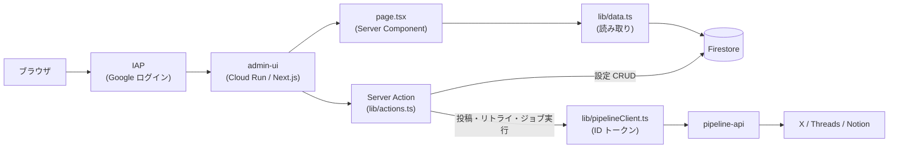

# 07. 管理画面(admin UI)詳細設計

> 対象コード時点: コミット f703290 + 未コミット変更 / 最終更新: 2026-07-12

## 1. この文書で分かること

- 管理画面(admin)の 10 画面それぞれで「何が見えて、何ができて、押すと何が起きるか」
- 画面の裏側にある `lib/` 層(Firestore 読み書き・pipeline-api 呼び出し・認証)の全関数
- Next.js 特有の仕組み(Server Component / Server Action / 多言語対応 / ビルド)の読み解き方

## 2. 関連ファイル一覧

| ディレクトリ | ファイル | 役割 |
|---|---|---|
| `admin/` | `package.json` | npm スクリプト定義(`dev` / `prebuild` / `build` / `typecheck`) |
| | `next.config.mjs` | Next.js 設定(`standalone` 出力、next-intl プラグイン) |
| | `Dockerfile` | 2 ステージビルド(node:22-slim、ポート 8080) |
| `admin/scripts/` | `sync-constants.mjs` | `shared/constants.json` を `src/lib/` へコピー(prebuild) |
| `admin/messages/` | `ko.json` `ja.json` `en.json` | UI 文言の翻訳ファイル(画面ごとの名前空間) |
| `admin/src/` | `middleware.ts` | 全リクエストに言語プレフィックスを付ける入口処理 |
| `admin/src/i18n/` | `routing.ts` `request.ts` | 対応言語の定義と、リクエストごとの翻訳読み込み |
| `admin/src/app/[locale]/` | `layout.tsx` | 全画面共通の枠(サイドバー・ナビ・言語切替) |
| | `page.tsx` ほか 9 つの `page.tsx` | 各画面の本体(下記 5 章の 10 画面) |
| `admin/src/components/` | `DraftEditor.tsx` | 下書き編集・プレビュー・承認して投稿(ブラウザ側で動く) |
| | `ActionButton.tsx` | 実行ボタン+結果表示の汎用部品(ブラウザ側で動く) |
| | `LocaleSwitcher.tsx` | 言語切替ボタン(ブラウザ側で動く) |
| | `ui.tsx` | Card・StatusBadge・共通 CSS クラス文字列 |
| `admin/src/lib/` | `firestore.ts` | firebase-admin 初期化(シングルトン) |
| | `data.ts` | Firestore 読み取り関数 13 個(画面表示用) |
| | `actions.ts` | 書き込み処理(Server Action)12 個 |
| | `pipelineClient.ts` | pipeline-api を ID トークン付きで呼ぶ HTTP クライアント |
| | `iap.ts` | IAP ヘッダからログインユーザーのメールを取り出す |
| | `constants.ts` / `shared-constants.json` | Python と共通の enum(取りうる値の一覧) |
| | `textLimits.ts` | X/Threads の文字数計算(pipeline 側のミラー) |
| | `types.ts` | Firestore ドキュメントの TypeScript 型定義 |
| `infra/` | `11-deploy-admin.sh` | Cloud Run へのデプロイ(`--iap` 付き、環境変数注入) |

## 3. 全体構造

管理画面は **Next.js 15**(React ベースの Web アプリフレームワーク)製の単一 Cloud Run サービスで、手前に **IAP**(Identity-Aware Proxy: Google アカウントでログインさせる門番)が立つ。データの読み取りは Firestore(GCP のドキュメント型データベース)へ直接、外部への副作用がある操作だけ pipeline-api を経由する。



図の読み方: ブラウザからのアクセスはまず IAP で Google ログインを強制され、許可されたメールアドレスだけが admin-ui に到達する。画面の表示(左下ルート)は `page.tsx` がサーバ側で `lib/data.ts` を呼び、Firestore を直接読んで HTML を組み立てる。ボタン操作(右ルート)は Server Action(`lib/actions.ts`)がサーバ側で実行され、設定の保存なら Firestore へ直接書き、投稿・リトライ・ジョブ実行なら `lib/pipelineClient.ts` 経由で pipeline-api を呼ぶ。ブラウザ自身は Firestore にも pipeline-api にも一切触れない。

### 3.1 ビルドと起動の流れ

`admin/package.json` の scripts が入口になる:

| コマンド | 何が起きるか |
|---|---|
| `npm run dev` | 開発サーバ起動(ローカル。Firestore へは gcloud の ADC で接続) |
| `npm run build` | 本番ビルド。**直前に `prebuild` が自動実行** され `scripts/sync-constants.mjs` が走る(7.5 節) |
| `npm run start` | ビルド済み成果物でサーバ起動 |
| `npm run typecheck` | `tsc --noEmit` による型検査のみ(admin にテストスクリプトはない) |

ビルドの挙動は `admin/next.config.mjs` の 2 つの設定で決まる:

- `output: 'standalone'` — 実行に必要なファイル一式を `.next/standalone/` に自己完結でまとめ、`node server.js` だけで起動できる形にする。Docker イメージを小さくするための定石
- `serverExternalPackages: ['firebase-admin']` — firebase-admin はバンドル(複数ファイルを 1 つに束ねる処理)の対象から外し、実行時に node_modules から読む指定。ネイティブ依存を含むサーバ専用ライブラリのための措置

`admin/Dockerfile` は 2 ステージ構成: build ステージ(node:22-slim)で `npm ci` → `npm run build` し、runtime ステージには `.next/standalone` + `.next/static` + `public` **だけ** をコピーする(node_modules 全体は持ち込まない)。`PORT=8080` で `CMD ["node", "server.js"]`。このイメージを `infra/11-deploy-admin.sh` が Cloud Run に `--iap` 付きでデプロイし、環境変数 `PROJECT_ID` / `PIPELINE_API_URL`(pipeline-api の URL を `gcloud run services describe` で取得して注入)/ `GCS_BUCKET` を渡す。

## 4. 最重要の設計判断 — 「Firestore 直書き」と「pipeline-api 経由」の使い分け

管理画面の書き込み処理は 12 個あるが、経路は 2 種類に分かれる。境界線は **「データベースの外に副作用があるか」**。

| 経路 | 対象 | 理由 |
|---|---|---|
| **Firestore 直書き**(9 個) | カテゴリ・ソース・プロンプト・チャネル設定・アプリ設定の保存、下書きテキストの保存 | 結果が DB の中で完結する。admin-sa(管理画面のサービスアカウント)に Firestore 権限があれば済み、API を挟む価値がない |
| **pipeline-api 経由**(3 個) | `approveAndPublish()`(承認して投稿)/ `retryChannel()`(失敗チャネルの再投稿)/ `runJobNow()`(ジョブの手動実行) | SNS への投稿やジョブ起動という **外部への副作用** がある。冪等制御・公開順(notion → x → threads)・チャネル状態遷移のロジックは pipeline 側に一本化されており、管理画面に複製しない |

つまり「SNS に何かが飛ぶ・ジョブが動く」操作だけが pipeline-api(`05-pipeline-api.md` 参照)へ行き、それ以外はただの DB 編集として扱う。`admin/src/lib/actions.ts` の冒頭コメントにもこの方針が明記されている。新しい操作を足すときも、この基準で経路を選ぶこと。

## 5. 画面リファレンス

### 5.1 画面一覧

URL の先頭には言語プレフィックス(`/ko` `/ja` `/en`、8 章)が付く。以下では省略する。

| # | 画面(ja 表示名) | URL | ファイル(`admin/src/app/[locale]/` 配下) | 主な読み取り(data.ts) | できる操作(actions.ts) |
|---|---|---|---|---|---|
| 1 | ダッシュボード | `/` | `page.tsx` | `getDrafts()` `getRecentPosts()` `getRecentRuns()` `getMonthCostUsd()` `getChannelHealth()` | `runJobNow('collect' / 'generate_daily' / 'generate_weekly' / 'generate_monthly')` |
| 2 | 下書き | `/drafts` | `drafts/page.tsx` | `getDrafts()` | なし(詳細へのリンク) |
| 3 | 下書き編集 | `/drafts/[id]` | `drafts/[id]/page.tsx` | `getPost()` | `saveDraft()` `approveAndPublish()` |
| 4 | 投稿履歴 | `/posts` | `posts/page.tsx` | `getRecentPosts(50)` | `retryChannel()` |
| 5 | カテゴリ | `/categories` | `categories/page.tsx` | `getCategories()` | `saveCategory()` |
| 6 | ソース | `/sources` | `sources/page.tsx` | `getSources()` `getCategories()` | `saveSource()` `toggleSource()` `deleteSource()` `runJobNow('collect')` |
| 7 | プロンプト | `/prompts` | `prompts/page.tsx` | `getPromptTemplates()` `getCategories()` | なし(編集へのリンク) |
| 8 | プロンプト編集 | `/prompts/[id]` | `prompts/[id]/page.tsx` | `getPromptTemplate()` | `savePromptTemplate()` |
| 9 | チャネル | `/channels` | `channels/page.tsx` | `getCategories()` `getChannelConfigs()` | `saveChannelConfig()` |
| 10 | 設定 | `/settings` | `settings/page.tsx` | `getAppSettings()` `getNotionDatabaseId()` | `saveAppSettings()` `runJobNow(各ジョブ)` |

全画面は `layout.tsx` の共通枠(左サイドバーに 8 項目のナビゲーションと言語切替)の中に表示される。

### 5.2 ダッシュボード(`/`)

システムの健康状態を 1 画面に集約し、手動実行の起点も兼ねる。上から順に:

- **Threads トークン更新失敗の赤帯** — `settings/channelHealth` の `threadsRefreshError` が空でないときだけ表示。対処は `../../runbook.md` 参照
- **コンテンツ生成カード**(手動実行) — 「① 収集」「② 日次生成」「② 週次生成」「② 月次生成」の 4 ボタン(`ActionButton` + `runJobNow(...)`)。押すと対応する Cloud Run Job を起動する(5.11 と同じ仕組み)。日次は各チャネルへ自動投稿、週次・月次は下書きを作成 → 下書きページで承認。スケジュール(06:00 収集 / 08:00 日次 / 月曜 週次 / 月初 月次)を待たずに今すぐ走らせたいとき用。実行状況は下の「ジョブ実行履歴」で確認する
- **3 枚のカード** — 今月の LLM コスト(`getMonthCostUsd()`: `runs` コレクションの当月分 `costUsd` 合計。月初は UTC 基準なので JST と最大 9 時間ずれる)/ Threads トークンの残り日数(失効 14 日前を切るか更新エラーがあると赤字)/ 承認待ち下書き数
- **承認待ちの下書き**(先頭 5 件) — 周期バッジ(`daily` 等)+タイトル。クリックで下書き編集へ
- **直近の投稿**(10 件) — 投稿ステータスとチャネルごとのステータスバッジ
- **ジョブ実行履歴**(10 件) — `runs` の `jobType`・成否・開始時刻・統計 JSON・先頭エラー(80 文字まで)。成否バッジは `StatusBadge` を流用しているため、表示文言は `published` / `failed` になる(投稿の状態ではなくジョブの成否を意味する点に注意)

### 5.3 下書き(`/drafts`)

`status == "draft"` の投稿(post)を新しい順に最大 30 件表示するだけの一覧。列は周期・タイトル・カテゴリ・作成日時で、タイトルをクリックすると下書き編集へ遷移する。運用フロー上、ここに並ぶのは主に週次・月次の長文記事(日次は既定で自動投稿)。

### 5.4 下書き編集(`/drafts/[id]`)— DraftEditor

この画面が管理画面の心臓部。`drafts/[id]/page.tsx` はサーバ側で `getPost()` を呼び(存在しなければ 404)、ヘッダにステータスバッジ・周期・カテゴリ・生成コストを出したうえで、編集本体を `admin/src/components/DraftEditor.tsx`(ブラウザで動く Client Component、7.1 節)に渡す。

**左列 = 編集フォーム**(すべて入力のたびにブラウザ内の state に保持):

- タイトル / 要約 / 本文(markdown、24 行の広いテキストエリア)
- **チャネル別テキスト**: X 用テキストと Threads 用テキスト。X 側は入力のたびに `xWeightedLength()`(`textLimits.ts`)で **加重文字数** を再計算して `X 加重文字数: n/280` と表示し、280 を超えると赤字になる(超えていても保存・投稿ボタン自体は塞がない。最終検証は pipeline 側)。Threads 側は単純な文字数 `n/500`
- **保存ボタン**: 入力内容を `FormData`(フォーム送信用の入れ物)に詰めて `saveDraft()` を呼ぶ。書き込まれるのは `posts/{id}` の `title` `summary` `body` `channels.x.text` `channels.threads.text` のみ(ステータスは変わらない)

**右列 = プレビューと投稿**:

- **プレビュータブ**(`notion` / `x` / `threads`、初期表示は `notion`): 編集中のテキストをそのまま整形表示する。`x` と `threads` のタブでは、周期が `daily` 以外のとき「+ Notion URL」という注記が付く — 週次・月次のティーザー投稿には pipeline が Notion 公開 URL を末尾に付加するため(公開順が notion 先行である理由。`05-pipeline-api.md`)
- **投稿先チェックボックス**: `post.channels` の各チャネルにつき 1 つ。初期チェックは「有効かつ `pending`」のチャネル。`published` 済みチャネルはチェック不可(二重投稿防止)。`failed` / `skipped` は手動でチェックし直せる
- **「承認して投稿」ボタン**: 確認ダイアログ → まず `saveDraft()` で編集内容を保存 → `approveAndPublish(post.id, selected)` を呼ぶ。1 チャネルも選んでいないと押せない

`approveAndPublish()` の裏側では: IAP ヘッダから承認者メールを取得(7.3 節)→ pipeline-api の `POST /api/posts/{id}/publish` に `{approvedBy, channels}` を送信 → pipeline-api 側で「選択しなかった `pending` チャネルを `skipped` に落とす → `approvedBy` を記録して `status` を `approved` に更新 → 実際の公開処理(notion → x → threads)」が **同期実行** される。つまりボタンを押してから応答が返るまで数十秒かかりうる。応答ボディ(各チャネルの結果 JSON)がそのまま画面下部に表示され、成功時はページを再読込して最新ステータスを反映する。すでに `published` / `publishing` の投稿には 409 が返る(連打対策)。

### 5.5 投稿履歴(`/posts`)

直近 50 件の投稿を、投稿ステータス・タイトル・周期・**チャネルごとの状態**・コスト・作成日時で一覧する。チャネル列が実務上の主役で、チャネルごとに:

- `published` なら公開 URL への `link`(別タブで開く)
- `failed` なら赤字のエラーメッセージ(省略表示、ホバーで全文)と **リトライボタン**

リトライは `retryChannel(postId, channel)` → pipeline-api の `POST /api/posts/{id}/retry-channel`。失敗した 1 チャネルだけを再実行するので、成功済みチャネルに二重投稿されることはない。結果は ActionButton の隣に `OK` またはエラー本文で表示される(9 章)。

### 5.6 カテゴリ(`/categories`)

収集・生成の単位となるカテゴリ(`categories` コレクション)の一覧と追加フォーム。一覧は slug(URL 用の識別子)・表示名・検索ヒント・有効/無効バッジ。追加フォームの `saveCategory()` は **slug をドキュメント ID とした upsert**(あれば更新・なければ作成)なので、既存 slug を入力すれば編集にもなる。検索ヒントはカンマ区切りで入力し、配列に分解して保存される。なお `actions.ts` には `toggleCategory()` も定義されているが、現時点でどの画面からも使われていない(無効化はフォームのチェックを外して再保存する)。

### 5.7 ソース(`/sources`)

収集元(`sources` コレクション)の管理。画面上部に **「collect を今すぐ実行」ボタン**(`runJobNow('collect')`)があり、収集ジョブを待たずにソース追加の結果を確かめられる。一覧は ID・カテゴリ・種別・URL/クエリ・最終取得時刻・有効/無効と、行ごとの操作(有効/無効の切替、削除)。**削除は確認ダイアログなしで即実行される** 点に注意。

追加フォームでは種別を `rss` / `gemini_grounded` / `ieee_xplore`(`shared-constants.json` 由来)から選び、`rss` 系は URL、検索系はクエリを入れる。ID を空にすると `src-{タイムスタンプ}` が自動採番される。`saveSource()` は保存時に `etag` / `lastModified`(HTTP キャッシュ制御用フィールド)を空文字にリセットするため、既存ソースを編集すると次回は全件取得し直しになる。

### 5.8 プロンプト(`/prompts`)

カテゴリ × 周期(`daily` / `weekly` / `monthly`)のマトリクス表。セルには `{カテゴリslug}_{周期}` という ID のプロンプトテンプレートへのリンクが入り、未作成のセルは「未シード」リンク(クリックすると空の編集画面が開き、保存すれば新規作成される)。有効/無効バッジ付き。

### 5.9 プロンプト編集(`/prompts/[id]`)

LLM に渡すプロンプト(指示文)の編集フォーム。ID 文字列を最後の `_` で分割してカテゴリと周期を復元し、隠しフィールドで一緒に保存する。共通項目はシステムプロンプト・ユーザープロンプトテンプレート(`{placeholder}` 記法が使える旨のヒント付き)・モデル上書き・有効フラグ。**周期が `weekly` / `monthly` のときだけ** アウトライン用のシステム/ユーザープロンプト欄が追加表示される — 長文生成が「小型モデルで記事選定 → 大型モデルで執筆」の 2 段階だからで、その 1 段目に使われる。`savePromptTemplate()` は merge 付き set(upsert)。

### 5.10 チャネル(`/channels`)

カテゴリごとのカードに、行 = 周期、列 = チャネル(`x` / `threads` / `notion`)の表を描き、**セル 1 つ 1 つが独立したミニフォーム**(有効チェック+言語セレクト+保存リンク)になっている。保存先はドキュメント ID `{slug}_{周期}_{チャネル}` の `channelConfigs`。未設定セルの既定値は「無効・言語 `en`」。このセル内フォームはファイル内に直接書かれた Server Action(7.2 節)で処理される。運用上の既定(X=日本語 / Threads=韓国語 / Notion=英語)はここで上書きできる。

### 5.11 設定(`/settings`)

2 枚のカード:

- **アプリ設定**: タイムゾーン、日次も承認制にする(`dailyRequireApproval`)、日次 X 投稿に URL を含める(`xAllowUrlOnDaily`)、画像添付(`attachImages`)、Notion データベース ID。`saveAppSettings()` は 1 回の送信で `settings/app` と `settings/notion` の 2 ドキュメントに書き分ける
- **ジョブ手動実行**: `collect` `generate_daily` `generate_weekly` `generate_monthly` `refresh_threads_token` `seed` の 6 ボタン(seed / token 更新も含む全ジョブ。日次〜月次だけならダッシュボードのカードが便利)。`runJobNow()` → pipeline-api の `POST /api/jobs/{name}/run` は **202(受付)を即返し**、pipeline-api が対応する **Cloud Run Job を起動する**(スケジューラ経由と同じジョブ・同じ実行環境。`05-pipeline-api.md` 6a 節)。進行結果はダッシュボードのジョブ実行履歴で確認する

## 6. lib リファレンス

### 6.1 `firestore.ts` — 接続の一元化

`db()` は firebase-admin(サーバ用 Firestore クライアント)の初期化を **シングルトン**(プロセス内で 1 回だけ生成して使い回す方式)にした関数。認証は `applicationDefault()` — Cloud Run 上では admin-sa の権限が、ローカルでは `gcloud auth application-default login` の資格情報が自動で使われ、**秘密鍵ファイルを一切持たない**。プロジェクト ID は環境変数 `PROJECT_ID`(未設定なら `trend-news-generator`)。もう 1 つの `toIso()` は Firestore の Timestamp 型を表示用の ISO 文字列に変換する小道具で、`data.ts` 全体から使われる。

### 6.2 `data.ts` — 読み取り関数一覧

すべて Server Component 専用(ブラウザからは呼べない)。書き込みは 1 つもない。

| 関数 | 読む場所 | 返すもの / 補足 |
|---|---|---|
| `getCategories()` | `categories` | 全件を `sortOrder` 順に |
| `getSources()` | `sources` | 全件 |
| `getPromptTemplates()` / `getPromptTemplate(id)` | `promptTemplates` | 全件 / 1 件(なければ null) |
| `getChannelConfigs()` | `channelConfigs` | 全件 |
| `getDrafts()` | `posts` | `status == "draft"` を新しい順に 30 件 |
| `getPost(id)` | `posts` | 1 件(なければ null) |
| `getRecentPosts(limit)` | `posts` | 新しい順(既定 30 件) |
| `getRecentRuns(limit)` | `runs` | 開始時刻順(既定 20 件) |
| `getMonthCostUsd()` | `runs` | 当月(UTC 起点)の `costUsd` 合計 |
| `getAppSettings()` | `settings/app` | 欠損フィールドは既定値で補完 |
| `getNotionDatabaseId()` | `settings/notion` | `databaseId` 文字列 |
| `getChannelHealth()` | `settings/channelHealth` | Threads トークンの期限・最終更新・エラー |

投稿系は内部の `mapPost()` で欠損に強い形(`?? ''` で補完)へ整形する。各コレクションのフィールド定義は `../03-data-model.md` 参照。

### 6.3 `actions.ts` — Server Action 一覧

先頭に `'use server'` が付いたファイル(7.2 節)。全書き込みがこの 1 ファイルに集まっている。

| 関数 | 経路 | 書き込み先 / 呼び先 | 戻り値 |
|---|---|---|---|
| `saveCategory(formData)` | Firestore | `categories/{slug}` merge set | void |
| `toggleCategory(slug, enabled)` | Firestore | `categories/{slug}` update(**現状 UI 未使用**) | void |
| `saveSource(formData)` | Firestore | `sources/{id}` merge set(etag リセット) | void |
| `toggleSource(id, enabled)` | Firestore | `sources/{id}` update | void |
| `deleteSource(id)` | Firestore | `sources/{id}` delete | void |
| `savePromptTemplate(formData)` | Firestore | `promptTemplates/{id}` merge set | void |
| `saveChannelConfig(...)` | Firestore | `channelConfigs/{id}` merge set | void |
| `saveAppSettings(formData)` | Firestore | `settings/app` と `settings/notion` | void |
| `saveDraft(formData)` | Firestore | `posts/{id}` の本文とチャネルテキストのみ update | void |
| `approveAndPublish(postId, channels)` | pipeline-api | `publishPost()`(承認者メール付き) | `ActionResult` |
| `retryChannel(postId, channel)` | pipeline-api | `retryChannel()` | `ActionResult` |
| `runJobNow(name)` | pipeline-api | `runJob()` | `ActionResult` |

`ActionResult` は `{ ok: boolean; detail: string }`。**全関数が最後に `revalidatePath('/', 'layout')` を呼ぶ**(7.4 節)。

### 6.4 `pipelineClient.ts` — ID トークン付き HTTP クライアント

pipeline-api はアプリレベル認証を持たない代わりに Cloud Run の IAM で守られており、呼び出しには **ID トークン**(呼び出し元サービスアカウントを Google が署名して証明する短命トークン)が要る。`call()` が google-auth-library でトークンを取得(audience = 環境変数 `PIPELINE_API_URL`)し、`Authorization: Bearer` ヘッダ付きで POST する。公開関数は 3 つだけ:

| 関数 | 呼ぶエンドポイント |
|---|---|
| `publishPost(postId, approvedBy, channels)` | `POST /api/posts/{postId}/publish` |
| `retryChannel(postId, channel)` | `POST /api/posts/{postId}/retry-channel` |
| `runJob(name)` | `POST /api/jobs/{name}/run` |

戻り値は常に `{ ok: レスポンスが 2xx か, detail: レスポンスボディの生テキスト }`。エンドポイント仕様は `05-pipeline-api.md`。

### 6.5 `iap.ts` — ログインユーザーの特定

`iapUserEmail()` は IAP が付与するリクエストヘッダ `x-goog-authenticated-user-email`(形式: `accounts.google.com:user@example.com`)から `:` より後ろを取り出して返す。用途は 1 つ — 「承認して投稿」時に **誰が承認したか**(`approvedBy`)を投稿ドキュメントへ記録すること(7.3 節)。

### 6.6 `constants.ts` と `shared-constants.json` — Python/TS 共通 enum

周期・チャネル・投稿ステータス・ソース種別・言語・ジョブ種別の取りうる値は、リポジトリ直上の `shared/constants.json` が唯一のソース。admin では prebuild(7.5 節)で `src/lib/shared-constants.json` にコピーされ、`constants.ts` がそれを `CADENCES` `CHANNELS` `POST_STATUSES` `SOURCE_TYPES` `LANGUAGES` `JOB_TYPES` として re-export する。画面のセレクトボックスやマトリクス表の軸はすべてここ由来なので、**値を足すときは JSON を直して admin を再ビルドする**(値の意味は `../04-parameters.md`)。なお JSON にある `channelStatuses` は現状 `constants.ts` から export されていない。

### 6.7 `textLimits.ts` — 文字数ルールのミラー(正は pipeline 側)

X は単純な文字数ではなく **加重文字数**(CJK などの全角級文字 = 2、その他 = 1、URL は長さによらず一律 23)で 280 制限を判定する。`xWeightedLength()` はそのルールを TypeScript で再実装したもので、**`pipeline/app/publishers/renderer.py` のミラー**。編集中のライブ表示のための近似であり、**正は常に pipeline 側**(投稿時に再検証される)。renderer.py の判定を変えたら、このファイルも必ず追随させること。定数は `X_LIMIT = 280`、`THREADS_LIMIT = 500`。

### 6.8 `types.ts` — 型定義

`Post`(チャネル状態 `ChannelState` の辞書を内包)・`Category`・`Source`・`PromptTemplate`・`ChannelConfig`・`Run`・`AppSettingsDoc`・`ChannelHealth` を定義。Firestore 側のフィールドと 1:1 なので、詳細は `../03-data-model.md` を正とする。

## 7. 難所解説

Web フロントエンド未経験者が admin のコードで最初に戸惑う 5 点を、抜粋付きで解説する。読み進める前提知識は `00-code-reading-primer.md` にもまとめてある。

### 7.1 Server Components と Client Components の境界

Next.js の App Router では、**コンポーネント(画面部品)は既定でサーバ側で実行される**(Server Component)。ブラウザに届くのは実行結果の HTML だけ。だから `page.tsx` が平然とデータベースを読める。`admin/src/app/[locale]/drafts/[id]/page.tsx` を見る:

```tsx
import { DraftEditor } from '@/components/DraftEditor';
import { getPost } from '@/lib/data';

export default async function DraftDetailPage({
  params,
}: {
  params: Promise<{ locale: string; id: string }>;
}) {
  const { id } = await params;
  const [t, post] = await Promise.all([getTranslations('drafts'), getPost(id)]);
  if (!post) notFound();
  ...
  return <DraftEditor post={post} />;
}
```

- `export default async function ...` — ページ自体が **async 関数**。リクエストが来るたびサーバで実行される
- `params` から URL の `[id]` 部分を受け取る(Next.js 15 では Promise になったので `await` が要る)
- `getPost(id)` — **ここで Firestore を直接読んでいる**。firebase-admin はサーバ専用ライブラリだが、このコードはサーバでしか動かないので問題ない
- `notFound()` — 404 ページに切り替える Next.js の組み込み
- 最後に取得済みデータを `<DraftEditor post={post} />` に **props(引数)として渡す**。ここがサーバ→ブラウザの受け渡し点

一方、クリックや入力に反応するコードはブラウザで動く必要がある。ファイル先頭に `'use client'` と書いたものだけがブラウザに JavaScript として配送される(Client Component)。admin でこの宣言を持つのは **`DraftEditor.tsx` / `ActionButton.tsx` / `LocaleSwitcher.tsx` の 3 ファイルだけ**。`ui.tsx` には宣言がなく、サーバ・ブラウザ両方から import されて双方で使える。原則: **表示とデータ取得はサーバ、対話だけブラウザ**。

### 7.2 Server Actions — フォームから直接サーバ関数を呼ぶ

`actions.ts` 先頭の `'use server'` は「このファイルの関数はサーバで実行される。ただしブラウザから **リモート呼び出しできる**」という宣言(Server Action)。API エンドポイントを自分で定義しなくても、Next.js が裏で HTTP POST に変換してくれる。使い方は 3 パターンある。

**(1) フォームに関数を渡す** — `categories/page.tsx` の `<form action={saveCategory}>`。送信すると各 `<input name=...>` が `FormData`(名前→値の入れ物)に詰められ、サーバ側の `saveCategory(formData)` が受け取る。

**(2) `bind` で引数を事前固定** — `posts/page.tsx` の `retryChannel.bind(null, p.id, name)`。`bind(null, a, b)` は「第 1・第 2 引数を `a, b` に固定した新しい関数を作る」JavaScript の標準機能(先頭の `null` は `this` 相当で不使用)。行ごとに違う `postId` / `channel` をボタンに焼き込むためにこう書く。ソース画面の `toggleSource.bind(null, s.id, !s.enabled)` も同じ。

**(3) インライン定義** — `channels/page.tsx` はセルごとにその場で Server Action を作る:

```tsx
<form
  action={async (formData: FormData) => {
    'use server';
    await saveChannelConfig(
      id, cat.slug, cadence, channel,
      formData.get('enabled') === 'on',
      String(formData.get('language') ?? 'en'),
    );
  }}
>
```

- 関数本体の 1 行目に `'use server'` — この無名関数だけを Server Action にする書き方
- `id` `cat.slug` `cadence` `channel` はサーバでの描画時に決まった値で、クロージャ(関数が外側の変数を覚える仕組み)として自動的に同梱される
- `formData.get('enabled') === 'on'` — HTML のチェックボックスは「チェック時のみ `'on'` が送られる」仕様なので、こう booleans に変換する(`actions.ts` 全体で頻出のイディオム)

### 7.3 IAP 認証フロー

admin-ui は Cloud Run の `--iap` フラグ付きでデプロイされ(`infra/11-deploy-admin.sh`)、IAP を通過できるのは `roles/iap.httpsResourceAccessor` を付与されたアカウントだけ。アプリ側にはログイン画面が **存在しない** — 認証は全部 IAP 任せで、アプリは「通過者の身元」をヘッダで受け取るだけ。`admin/src/lib/iap.ts` の全体と使用箇所:

```ts
export async function iapUserEmail(): Promise<string> {
  const h = await headers();
  const raw = h.get('x-goog-authenticated-user-email') ?? '';
  return raw.includes(':') ? raw.split(':').pop()! : raw;
}

// actions.ts での使用箇所
export async function approveAndPublish(postId, channels) {
  const email = await iapUserEmail();
  const result = await pipeline.publishPost(postId, email, channels);
```

- `headers()` — 現在処理中のリクエストのヘッダ一覧(Server Action / Server Component から呼べる Next.js API)
- IAP はヘッダ値を `accounts.google.com:user@example.com` 形式で入れるので、`:` の後ろだけ切り出す
- 用途は承認記録のみ: `approveAndPublish()` がこのメールを pipeline-api に渡し、投稿ドキュメントの `approvedBy` に永続化される。画面の出し分けや権限分岐には使っていない(IAP を通れた人は全員フル権限)

なお本プロジェクトは組織なし GCP のため IAP はカスタム OAuth クライアントで構成済み。IAP が使えない環境の代替は `../../runbook.md` 参照。

### 7.4 常に最新の Firestore を表示する仕組み — force-dynamic と revalidatePath

Next.js は既定でページ結果を積極的にキャッシュするが、管理画面で古い情報を出すと誤操作(承認済みをまた承認する等)につながる。そこで 2 段構えでキャッシュを殺している。

1. **`layout.tsx` の `export const dynamic = 'force-dynamic'`** — この 1 行が配下の **全 10 画面** に効き、「ビルド時に固めず、アクセスごとに毎回サーバで描画し直す」指定になる。だから常に Firestore の現在値が表示される
2. **全 Server Action 末尾の `revalidatePath('/', 'layout')`** — ブラウザ側にも画面遷移用のキャッシュ(Router Cache)があり、書き込み後に古い画面へ戻れてしまう。この呼び出しは「ルート layout 以下すべてのキャッシュを無効化せよ」という合図で、操作後の再表示時に必ずサーバへ取りに行かせる

つまり「サーバ側キャッシュは 1(layout の 1 行)で、ブラウザ側キャッシュは 2(各 action)で」無効化している。画面や action を追加するときも、この 2 つの流儀を踏襲すればキャッシュ起因の不整合は起きない。

### 7.5 sync-constants.mjs — shared/constants.json の prebuild コピー

`admin/scripts/sync-constants.mjs` の全体:

```js
// Copies the monorepo-shared constants into src/lib so the admin app builds
// both locally (with ../shared present) and inside its own Docker context
// (where only the committed copy exists). Runs automatically via prebuild.
import { copyFileSync, existsSync } from 'node:fs';

const source = new URL('../../shared/constants.json', import.meta.url);
const target = new URL('../src/lib/shared-constants.json', import.meta.url);

if (existsSync(source)) {
  copyFileSync(source, target);
  console.log('synced shared/constants.json');
} else {
  console.log('shared/constants.json not found; using committed copy');
}
```

- npm には「`build` の前に `prebuild` という名前のスクリプトを自動実行する」規約があり、`package.json` の `"prebuild": "node scripts/sync-constants.mjs"` がこれに乗っている。`npm run build` するだけで必ず同期が走る
- **なぜコピーが必要か**: `infra/11-deploy-admin.sh` の Docker ビルドは `admin/` ディレクトリだけをビルドコンテキスト(Docker に渡されるファイル一式)として送るため、コンテナ内に `../shared` が **存在しない**。加えて Next.js のビルドはプロジェクト外(`admin/` の外)のファイル import を嫌う
- そこで `src/lib/shared-constants.json` という **コミット済みのコピー** を持ち、ローカルビルドでは本物から上書き同期(if 側)、Docker 内ではコミット済みコピーをそのまま使う(else 側)
- 帰結として、`shared/constants.json` を変更したら「`npm run prebuild` を実行してコピーも更新・コミットし、admin を再ビルドする」までがワンセット。怠ると Python と TypeScript で enum がずれる

## 8. i18n(多言語対応)の仕組み

UI 文言は next-intl で ko / ja / en の 3 言語(既定 **ko**)。仕組みは「URL の先頭に言語コードを付ける」プレフィックス方式:

- **`src/middleware.ts`** — 全ページリクエストの入口で next-intl のミドルウェアが動き、`/drafts` のようなプレフィックスなし URL を `/ko/drafts` へリダイレクトする。matcher 正規表現で `api` / `_next` /(`.` を含む)静的ファイルは対象外
- **`src/i18n/routing.ts`** — `locales: ['ko', 'ja', 'en']`、`defaultLocale: 'ko'`、そして `localeDetection: false`。この false により **ブラウザの言語設定(Accept-Language)や cookie による自動判定を無効化** し、言語は URL プレフィックスのみで決まる。管理ツールでは「開いた URL と表示言語が常に一致する」方が混乱がない、という判断
- **`src/i18n/request.ts`** — リクエストごとに `messages/{locale}.json` を動的 import して翻訳辞書を供給。不正な言語コードなら ko に落とす
- **`messages/*.json`** — `nav` `common` に加え画面ごとの名前空間(`dashboard` `drafts` …)で構成。サーバ側は `getTranslations('名前空間')`、Client Component(DraftEditor)は `useTranslations()` で同じキーを引く
- **`LocaleSwitcher.tsx`** — サイドバー下部の 3 ボタン。押すと (1) `NEXT_LOCALE` cookie(next-intl の標準永続化先)を 1 年期限で書き、(2) 現 URL の先頭プレフィックスを正規表現 `/^\/(ko|ja|en)(?=\/|$)/` で剥がして新言語で組み直し、遷移する。`localeDetection: false` の本構成では実際の言語決定は URL のみなので、cookie は保険的な書き込み

なお対応言語を増やす場合、`routing.ts` だけでなく **LocaleSwitcher 内のハードコードされた正規表現と `LOCALES` 配列** も直す必要がある(10 章)。UI 言語(3 つ)と投稿の生成言語(`channelConfigs` の `language`)は別物である点にも注意。

## 9. エラー時の挙動

- **ActionButton**(リトライ・ジョブ実行系): 実行中はボタンが `…` になり連打不可。完了すると隣に、成功なら緑の `OK`、失敗なら **赤字でレスポンス本文の先頭 200 文字** を表示する。表示は次の操作まで残る。自動リトライはしない
- **DraftEditor の「承認して投稿」**: 同様に結果をボタン下へ表示(先頭 400 文字)。pipeline-api からの応答 JSON(チャネルごとの結果)が生のまま見えるので、部分失敗(あるチャネルだけ `failed`)もここで分かる
- **部分失敗の後始末**: 投稿全体のステータスは `partially_published` になり、投稿履歴画面で該当チャネルに赤い `failed` バッジ+エラー文+リトライボタンが並ぶ。ここからのリトライが正規の回復手順。原因別の対処は `../../runbook.md`
- **Threads トークン失効**: ダッシュボード最上部の赤帯と残日数カードで前警告(14 日前から赤字)。これも対処は runbook
- **void 型の Server Action(設定保存系)や data.ts の読み取りが例外を投げた場合**: try/catch を置いていないため、Next.js 既定のエラー画面になる(専用 `error.tsx` は未定義)。Firestore 障害など稀なケースの割り切り
- **`PIPELINE_API_URL` 未設定**: `pipelineClient.ts` が即例外。デプロイスクリプト(`infra/11-deploy-admin.sh`)が pipeline-api の URL を自動注入するので、通常はローカル起動時のみ遭遇する

## 10. 変更するときは

| やりたいこと | 触るファイル | 注意 |
|---|---|---|
| 画面を 1 枚増やす | `src/app/[locale]/<名前>/page.tsx` 新規、`layout.tsx` の `NAV` 配列、`messages/{ko,ja,en}.json` に nav キーと画面用名前空間 | 読み取りは `data.ts` に関数を足してから使う。`force-dynamic` は layout 継承で自動適用 |
| enum(周期・チャネル・ソース種別など)を変える | `shared/constants.json` → `npm run prebuild` でコピー更新 → **admin 再ビルド必須** | コピー(`src/lib/shared-constants.json`)のコミットを忘れると Docker ビルドが古い値を使う(7.5 節)。pipeline 側の対応も同時に |
| pipeline-api のエンドポイントを変える | pipeline 側と **`pipelineClient.ts` のパス/ボディを両方** | 仕様の正は `05-pipeline-api.md`。actions.ts は署名が変わらない限り無改修 |
| X/Threads の文字数ルールを変える | 正は `pipeline/app/publishers/renderer.py`。**`textLimits.ts` を必ず追随** | ずれても投稿は pipeline 側で検証されるが、編集画面の赤字警告が嘘をつく |
| 投稿(post)にフィールドを足す | `types.ts`、`data.ts` の `mapPost()`、表示するなら各画面 / `DraftEditor.tsx` | スキーマの正は `../03-data-model.md` |
| UI 言語を足す | `i18n/routing.ts`、`messages/<locale>.json`、`LocaleSwitcher.tsx`(`LOCALES` と正規表現) | 正規表現のハードコードを見落としやすい(8 章) |
| 環境変数を足す | `infra/11-deploy-admin.sh` の `--set-env-vars` | 既存は `PROJECT_ID` / `PIPELINE_API_URL` / `GCS_BUCKET`。一覧は `../04-parameters.md` |
| 書き込み操作を足す | `actions.ts` に追加 | **4 章の基準で経路を選ぶ**。末尾の `revalidatePath('/', 'layout')` を忘れない |
