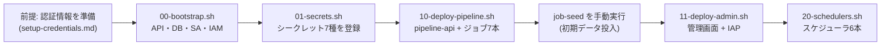

# インフラスクリプト詳細設計 — infra/ の gcloud スクリプト読解

> 対象コード時点: コミット 6cdcccd + 未コミット変更(M0-a: LangSmith)/ 最終更新: 2026-07-15

## 1. この文書で分かること

- `infra/` にある 5 本の実行スクリプト+共通設定 `env.sh` が「何を作り、なぜそう作るのか」を、gcloud コマンドを読んだことがない人でも追えるように解説します。
- 各スクリプトが再実行して安全か(冪等性)、失敗したらどうなるかの考え方が分かります。
- あわせて 2 つの Dockerfile(pipeline / 管理画面)の構造と、ジョブを追加するときにどこを触るかが分かります。

本システムは Terraform のような IaC ツールを使わず、**gcloud コマンドを並べたシェルスクリプト**でインフラを構築します。規模が小さく(Cloud Run サービス 2 つ+ジョブ 7 本)、個人運用のため、状態管理ツールを持ち込むより「読めば分かるスクリプト」を選んだ構成です。なお、IAM ロールの網羅表・Cloud Run の設定値一覧・cron 一覧の「正」は [../04-parameters.md](../04-parameters.md) にあり、本書はそれを転記せず**スクリプトの読解**に集中します。システム全体の構成は [../02-architecture.md](../02-architecture.md) を参照してください。

実行順序は次の 1 本道です。番号がそのまま順序を表します(00 → 01 → 10 → 11 → 20)。



順序に意味があります。00 で GCP の各機能(API)を有効化しサービスアカウントを作らないと、01 のシークレット登録も権限付与もできません。10 は 01 で作ったシークレットをデプロイ時に参照するので、シークレットが先に存在する必要があります。`job-seed`(Firestore にカテゴリ・ソース・プロンプトの初期データを入れるジョブ)は 10 で作られるため、その後に手動実行します。11 の管理画面は 10 でできた pipeline-api の URL を自動取得して埋め込むので 10 の後、20 のスケジューラは起動対象のジョブが存在しないと権限付与できないので最後です。各スクリプトの末尾には「次に実行すべきスクリプト」が echo で表示され、この順序を迷わないようになっています。認証情報(X / Threads / Notion / OpenAI / Gemini のキー類)の入手手順は [../../setup-credentials.md](../../setup-credentials.md) を参照してください。

## 2. 関連ファイル一覧

| ファイル | 役割 |
|---|---|
| `deploy.sh`(リポジトリ直下) | 00→01→10→seed→11→20 を 1 コマンドで通す一括デプロイ補助スクリプト(4.6 参照) |
| `infra/env.sh` | 全スクリプトが読み込む共通変数(プロジェクト ID・リージョン・SA 名・ジョブ一覧) |
| `infra/00-bootstrap.sh` | 一度きりの土台作り: API 有効化、Firestore、GCS、Artifact Registry、SA と IAM |
| `infra/01-secrets.sh` | 対話式でシークレット 7 種を Secret Manager に登録し、pipeline-sa に読み取り権限を付与 |
| `infra/10-deploy-pipeline.sh` | pipeline イメージを Cloud Build でビルドし、pipeline-api(サービス)とジョブ 7 本をデプロイ |
| `infra/11-deploy-admin.sh` | 管理画面(admin)イメージをビルドし、IAP 付きでデプロイ、管理者を許可 |
| `infra/20-schedulers.sh` | Cloud Scheduler 6 本を作成し、ジョブを定時起動させる |
| `infra/firestore.indexes.json` | Firestore 複合インデックス定義のミラー(`firebase deploy --only firestore:indexes` 用) |
| `pipeline/Dockerfile` / `pipeline/.dockerignore` | pipeline イメージの作り方と、イメージに入れないファイルの指定 |
| `admin/Dockerfile` / `admin/.dockerignore` | 管理画面イメージ(2 ステージビルド)の作り方 |
| `admin/scripts/sync-constants.mjs` | 管理画面ビルド前に `shared/constants.json` を同期するスクリプト(5 章で説明) |

## 3. 共通の仕組み

### 3.1 env.sh — 全スクリプト共通の変数

各スクリプトは冒頭で `cd "$(dirname "$0")"` により「自分自身が置かれたディレクトリ」へ移動してから `source ./env.sh` を実行します。こうすることで、どのディレクトリから叩いても相対パス(`./env.sh` や `../pipeline`)が正しく解決されます。`source` は「別ファイルの内容を今のシェルに読み込む」命令で、`env.sh` の変数がそのまま使えるようになります。

`env.sh` の変数はすべて `export VAR="${VAR:-既定値}"` という形です。`${VAR:-既定値}` は Bash の記法で「環境変数 VAR が既にあればそれを、無ければ既定値を使う」という意味です。つまり `PROJECT_ID=my-test ./00-bootstrap.sh` のように実行時に上書きでき、別プロジェクトでの検証がしやすくなっています。

| 変数 | 既定値 | 意味 |
|---|---|---|
| `PROJECT_ID` | `trend-news-generator` | GCP プロジェクト ID。全リソースの入れ物 |
| `REGION` | `asia-northeast1` | リソースを置く地域(東京)。Cloud Run・Firestore・GCS など全てこのリージョン |
| `ADMIN_EMAIL` | `moc9058@gmail.com` | IAP(後述)で管理画面への入場を許可する Google アカウント |
| `BUCKET` | `${PROJECT_ID}-media` | 収集画像を置く GCS バケット名 |
| `AR_REPO` | `pipeline` | Docker イメージ置き場(Artifact Registry)のリポジトリ名 |
| `IMAGE` | `${REGION}-docker.pkg.dev/${PROJECT_ID}/${AR_REPO}/pipeline:latest` | pipeline イメージの完全な名前(置き場のアドレス+タグ) |
| `PIPELINE_SA` / `ADMIN_SA` / `SCHEDULER_SA` | `pipeline-sa@…` など 3 つ | サービスアカウント(後述)のメールアドレス形式の ID |
| `JOBS` | `(collect generate-daily generate-weekly generate-monthly cleanup-drafts refresh-threads-token seed)` | デプロイするジョブ 7 本の名前の配列。10 のループと 8 章の変更手順の起点 |

**サービスアカウント(SA)** とは「プログラムに持たせる Google アカウント」です。人間のアカウントと同様に権限(IAM ロール)を付与でき、本システムでは役割ごとに 3 つに分けています: パイプライン実行用の `pipeline-sa`、管理画面用の `admin-sa`、スケジューラ用の `scheduler-sa`。分ける理由は「それぞれに必要最小限の権限だけ与える」ためで、たとえば管理画面が乗っ取られてもシークレットは読めない、という守りになります。

### 3.2 `set -euo pipefail` — 途中で失敗したら止まる

全スクリプトの冒頭にある 1 行で、シェルスクリプトの安全装置 3 点セットです。

- `-e` … どれかのコマンドが失敗(終了コードが 0 以外)したら、そこでスクリプト全体を即座に中断する。既定のシェルは失敗しても次の行へ進んでしまうため、「Firestore 作成に失敗したのに IAM 付与だけ成功した」ような中途半端な状態を防ぐ。
- `-u` … 未定義の変数を使ったらエラーにする。タイプミスした変数が空文字として通ってしまう事故(例: バケット名が `gs://` だけになる)を防ぐ。
- `-o pipefail` … `A | B` のようなパイプで、途中の A が失敗したときも全体を失敗扱いにする。

### 3.3 冪等パターン — 何度実行しても同じ結果になる書き方

**冪等(べきとう)** とは「同じ操作を何度繰り返しても、結果が 1 回やったときと同じ」という性質です。gcloud の「作成」系コマンドは既に存在するリソースに対して実行するとエラーになるため、`-e` と組み合わせると再実行時に即死してしまいます。そこで各スクリプトは次の 2 パターンで冪等にしています。

1. **`作成 2>/dev/null || echo "already exists"`** — `||` は「左側が失敗したら右側を実行する」演算子。作成に失敗(=既にある)しても echo が成功するので `-e` に引っかからず先へ進めます。`2>/dev/null` は「エラーメッセージ(標準エラー出力)を捨てる」という意味で、既存エラーの赤い出力で画面が汚れないようにしています。例: `infra/00-bootstrap.sh` の Firestore・GCS・Artifact Registry・SA 作成。
2. **`describe で存在確認してから分岐`** — `gcloud secrets describe`(情報表示)が成功するかどうかで「ある/ない」を判定し、あれば更新・なければ作成します。例: `infra/01-secrets.sh` の `create_or_update` 関数。
3. **`create … || update …`** — 作成を試み、失敗したら同じ引数で更新する。作成済みでも設定変更(cron の変更など)が反映される点が 1 のパターンより優れています。例: `infra/20-schedulers.sh` の `create_sched` 関数。

また `gcloud run deploy` や `add-iam-policy-binding` のように**元から冪等なコマンド**(既存なら更新・同じ権限の再付与は何も起きない)はそのまま使っています。注意点として、パターン 1 は「既にある」以外の失敗(権限不足など)も `already exists` と表示してしまうため、7 章で述べるとおり出力を過信しないことが大切です。

## 4. スクリプト別リファレンス

### 4.1 00-bootstrap.sh — 一度きりの土台作り

**目的**: プロジェクトの土台(API・データベース・ストレージ・イメージ置き場・SA・権限)を作る。最初に 1 回実行し、以後は構成変更時のみ再実行します。

**① API の有効化** — `gcloud services enable` で 9 つの API を有効化します。GCP では機能ごとに「API」というスイッチがあり、オンにしないとそのサービス自体が使えません。

| API | 何のためにオンにするか |
|---|---|
| `run.googleapis.com` | Cloud Run(サービスとジョブの実行基盤) |
| `firestore.googleapis.com` | Firestore(データベース) |
| `storage.googleapis.com` | GCS(画像ファイル置き場) |
| `artifactregistry.googleapis.com` | Artifact Registry(Docker イメージ置き場) |
| `secretmanager.googleapis.com` | Secret Manager(API キー等の金庫) |
| `cloudscheduler.googleapis.com` | Cloud Scheduler(定時起動) |
| `cloudbuild.googleapis.com` | Cloud Build(クラウド上での Docker ビルド) |
| `iap.googleapis.com` | IAP(管理画面の門番。4.4 参照) |
| `iamcredentials.googleapis.com` | IAM Credentials(署名 URL の発行に必須。下記⑥参照) |

**② Firestore データベース作成** — `gcloud firestore databases create --location="$REGION" --type=firestore-native` で東京リージョンにネイティブモードの Firestore を作ります。`--type=firestore-native` は旧 Datastore モードではなく現行の Firestore として作る指定です。**ロケーションは後から変更できない**ため、リージョンを変えたくなったら作り直しになります(8 章)。`|| echo` で冪等化されています。

**③ 複合インデックス** — Firestore は「categoryId で絞り込み、collectedAt の新しい順に並べる」のような**複数フィールドを組み合わせたクエリ**に、事前定義の複合インデックスを要求します。スクリプト内の `create_index` 関数は `gcloud firestore indexes composite create` の共通部分をくくり出したもので、第 1 引数がコレクション名、`"${@:2}"`(2 番目以降の全引数)が `--field-config=field-path=…,order=…` の列としてそのまま渡ります。`--query-scope=COLLECTION` は「単一コレクション内のクエリ用」、`--async` は「作成完了を待たずに次へ進む」(インデックス構築は数分かかるため)という意味です。作られる 5 本は `items`×2(カテゴリ別新着一覧、タイトル近似重複の 7 日窓チェック用)、`posts`×2(管理画面のステータス別・cadence 別一覧用)、`sources`×1(カテゴリ内の有効ソース絞り込み用)。同じ定義が `infra/firestore.indexes.json` にもあり、これは Firebase CLI(`firebase deploy --only firestore:indexes`)でも同じインデックスを張れるように残したミラーです。**両者は手で同期する**必要があります。

**④ GCS バケット** — `gcloud storage buckets create "gs://${BUCKET}" --location="$REGION" --uniform-bucket-level-access` で画像置き場を作ります。`--uniform-bucket-level-access`(均一なバケットレベルのアクセス)は「ファイル 1 個ずつの公開設定(ACL)を無効化し、アクセス制御を IAM に一本化する」設定です。誰かが誤って 1 ファイルだけ全世界公開してしまう事故を構造的に防げます。バケットには公開権限を一切付けないため**完全に非公開**で、外部(X への画像添付など)には次項の「署名 URL」で期限付きアクセスだけを渡します。

**⑤ Artifact Registry** — `gcloud artifacts repositories create "$AR_REPO" --repository-format=docker` で Docker イメージ置き場を作ります。10・11 でビルドしたイメージはここに push され、Cloud Run はここから pull します。

**⑥ SA 3 つの作成と IAM 付与** — for ループで `pipeline-sa` / `admin-sa` / `scheduler-sa` を作成後、権限を付与します。ロールの網羅表は [../04-parameters.md](../04-parameters.md) に譲り、ここでは「なぜその権限か」だけ述べます。

- `pipeline-sa` — プロジェクトに対する `roles/datastore.user`(Firestore の読み書き。名前が datastore なのは歴史的経緯)、バケットに対する `roles/storage.objectAdmin`(画像のアップロード・削除)。
- **`pipeline-sa` の自己 `serviceAccountTokenCreator`(最重要)** — `gcloud iam service-accounts add-iam-policy-binding` で、pipeline-sa に「**pipeline-sa 自身**に対する `roles/iam.serviceAccountTokenCreator`」を付与しています。一見無意味に見えますが、これが**署名 URL の発行に必須**です。署名 URL とは「この URL を知っている人は非公開バケットのこのファイルを期限内だけ読める」という、暗号署名付きの URL です。署名には本来 SA の秘密鍵ファイルが必要ですが、Cloud Run 上には秘密鍵を置きません(漏えいリスクを避けるため)。代わりに IAM Credentials API の signBlob(①で有効化した `iamcredentials.googleapis.com`)へ「自分の名前で署名してほしい」と依頼する方式を使い、その依頼に必要な権限がまさに serviceAccountTokenCreator です。対象が自分自身なので「自己トークン作成者」と呼んでいます。**この 1 行を消すと画像添付が全滅する**ため、スクリプトにもその旨のコメントがあります。
- `admin-sa` — プロジェクトに `roles/datastore.user`(管理画面は Firestore を直接読み書きするため)、バケットに `roles/storage.objectViewer`(画像のプレビュー表示は読み取りだけでよい)。書き込み権限を与えないのが最小権限の考え方です。

なお IAM 付与コマンドに付いている `--condition=None` は「条件なしの付与」を明示する指定(条件付き IAM が混在するプロジェクトで対話プロンプトが出るのを防ぐ)、`-q` は確認プロンプトを省略、`>/dev/null` は成功時に表示される長大なポリシー全文を捨てて画面を静かにするためのものです。

**再実行**: 安全。全リソースが冪等パターンで守られており、IAM 付与も再実行で重複しません。

### 4.2 01-secrets.sh — シークレットの対話式登録

**目的**: API キーやトークンを Secret Manager(値を暗号化保管し、読み取りを IAM で制御する金庫)に登録し、pipeline-sa だけが読めるようにする。値の入手方法は [../../setup-credentials.md](../../setup-credentials.md) が前提資料です。

**create_or_update 関数の仕組み** — 中核はこの関数です。`read -r -p "プロンプト: " value` でターミナルに質問を表示して入力を受け取り(`-r` はバックスラッシュをそのまま扱う指定)、次のように分岐します。

- 第 3 引数に `optional` が渡された場合(`ieee-api-key` のみ): 空入力なら「skipped」と表示して登録をスキップ。IEEE Xplore は任意ソースのため、キーが無くてもシステムは動く設計です。
- 必須シークレットで空入力: `exit 1` でスクリプト全体を中断。
- 登録処理は `gcloud secrets describe` で存在確認し、**あれば** `gcloud secrets versions add`(新しいバージョンとして値を追加。過去の値も履歴として残る)、**なければ** `gcloud secrets create --replication-policy=automatic`(保管場所を Google 任せにする標準設定)で新規作成。

値の受け渡しは `printf '%s' "$value" | gcloud … --data-file=-` という形です。`--data-file=-` は「値をファイルではなく標準入力(パイプ)から読む」指定で、コマンドライン引数に値を書かないのは**シェル履歴やプロセス一覧に秘密が残るのを防ぐ**ためです。`echo` ではなく `printf '%s'` を使うのは、echo が末尾に改行を付けてしまい「改行入りの API キー」として保存され認証が謎に失敗する、という古典的事故を避けるためです。

**登録される 7 シークレット**: `openai-api-key` / `gemini-api-key` / `x-credentials`(X の OAuth 1.0a 認証情報 4 点を 1 行 JSON で) / `threads-access-token` / `threads-user-id` / `notion-api-key` / `ieee-api-key`(任意)。

**権限付与** — 後半の for ループで 7 つ全てに対し pipeline-sa へ `roles/secretmanager.secretAccessor`(値の読み取り)を付与します。ループ先頭の `gcloud secrets describe "$s" >/dev/null 2>&1 || continue` は「存在しないシークレット(スキップされた ieee-api-key)は権限付与も飛ばす」ための行です。

**threads-access-token だけ追加権限が付く理由** — Threads のトークンは約 60 日で失効するため、`job-refresh-threads-token`(毎週実行)が**プログラムから**新しいトークンを Secret Manager に書き戻します。つまり pipeline-sa はこのシークレットに限り「読む」だけでなく「書く」必要があり、`roles/secretmanager.secretVersionAdder`(新バージョンの追加)と `roles/secretmanager.secretVersionManager`(古いバージョンの無効化などの管理)を追加付与しています。他の 6 つは人間が更新するので読み取り専用のままです。

**再実行**: 安全(既存シークレットには新バージョンが積まれるだけ)。ただし対話式のため**必須シークレット全部の再入力を要求される**点に注意。1 つだけ更新したいときは、[../../runbook.md](../../runbook.md) の Threads トークン節にあるように `gcloud secrets versions add <name> --data-file=-` を直接叩く方が実用的です。

### 4.3 10-deploy-pipeline.sh — pipeline のビルドと 7 つのデプロイ

**目的**: pipeline の Docker イメージを 1 つビルドし、そこから pipeline-api(常駐サービス)1 つとジョブ 7 本、計 8 つの Cloud Run リソースを作る。コードを変更したら再実行するのがこのシステムの「デプロイ」です(CI/CD はありません)。

**① イメージビルド** — `gcloud builds submit ../pipeline --tag "$IMAGE" --region="$REGION"`。ローカルに Docker が無くても、ソース一式を Cloud Build(クラウド上のビルドサーバー)へアップロードし、`pipeline/Dockerfile` に従ってビルドし、`--tag` で指定した Artifact Registry のアドレスへ push するところまで一括で行うコマンドです。アップロード対象からは `.gcloudignore`(無い場合は `.gitignore` 由来の既定)で不要物が除外され、さらにビルド時には `pipeline/.dockerignore` がイメージへの取り込みを絞ります(5 章)。

**② シークレットと環境変数の組み立て** — `SECRET_ENV` 変数に `環境変数名=シークレット名:latest` をカンマ区切りで連結していきます。`:latest` は「常に最新バージョンを使う」という指定で、コンテナ起動時(ジョブなら各実行の開始時)に解決されるため、`job-refresh-threads-token` が新トークンを登録すれば**次の実行から自動で新しい値**が使われます。`ieee-api-key` だけは `gcloud secrets describe` で存在を確認してから条件付きで追加します(6.2 で逐行解説)。`COMMON_ENV` には秘密でない設定(`PROJECT_ID` / `REGION` / `GCS_BUCKET` / `PIPELINE_SERVICE_ACCOUNT`)をまとめます。最後の変数は署名 URL の署名者名として `pipeline/app/config.py` が参照します。

**③ pipeline-api のデプロイ** — `gcloud run deploy pipeline-api` の主なフラグ:

- `--image="$IMAGE"` … ①で push したイメージを使う。
- `--service-account="$PIPELINE_SA"` … このサービスが pipeline-sa の権限で動く(=Firestore・GCS・シークレットに触れる)。
- `--no-allow-unauthenticated` … **認証なしのアクセスを拒否**。Cloud Run の IAM で `roles/run.invoker`(呼び出し権限)を持つ者しか呼べなくなります。pipeline-api は投稿承認やジョブ即時実行を受け付ける危険な入口なので、アプリ内での認証実装の代わりに Cloud Run の玄関で認証を済ませる設計です(意図的にアプリレベル認証なし)。
- `--memory` / `--cpu` / `--max-instances` / `--timeout` … リソース量・最大インスタンス数(暴走時のコスト上限)・リクエスト最大処理時間。値の正は [../04-parameters.md](../04-parameters.md)。
- `--set-env-vars` / `--set-secrets` … ②で組み立てた 2 つを注入。

直後の `gcloud run services add-iam-policy-binding pipeline-api … --member=serviceAccount:${ADMIN_SA} --role=roles/run.invoker` で、**admin-sa にだけ**呼び出しを許可します。つまり pipeline-api を叩けるのは管理画面(のサーバー側)だけ、という閉じた経路になります。

**④ ジョブ 7 本のデプロイ** — `env.sh` の `JOBS` 配列を for ループで回し、**同じイメージ**から起動コマンドだけ差し替えた `gcloud run jobs deploy job-<名前>` を 7 回実行します。ここがこのスクリプトの核心で、6.1 で抜粋・逐行解説します。要点は 3 つ:

- イメージの既定起動コマンド(uvicorn で API サーバー)を `--command=python --args=-m,<モジュール>` で上書きし、`python -m app.jobs.collect` のような**単発バッチ**として動かす。
- ジョブ名はハイフン区切り(Cloud Run の命名規則)、Python モジュール名はアンダースコア区切りなので、`${job//-/_}` で変換する。
- `--max-retries` は**投稿系ジョブ = 0、collect / seed = 1** と使い分ける。Cloud Run Jobs はタスクが失敗すると自動でやり直す機能がありますが、投稿ジョブが「X に投稿した直後・記録する前」にクラッシュして再実行されると**二重投稿**になり得ます。収集(collect)と初期データ投入(seed)は冪等(何度やっても同じ)なので 1 回のリトライを許しています。この方針は崩さないこと。
- 各ジョブ作成の直後に、pipeline-sa へそのジョブの `roles/run.invoker` を付与する(`gcloud run jobs add-iam-policy-binding`)。これがないと管理画面の「今すぐ実行」= pipeline-api からのジョブ起動([05-pipeline-api.md](05-pipeline-api.md) 6a)が 502 になる。

**再実行**: 安全。`gcloud run deploy` / `gcloud run jobs deploy` は「無ければ作成、あれば更新」の冪等コマンドです。`--set-env-vars` が環境変数を丸ごと置き換える点には注意(gcloud で直接足した上書きは再実行で消える)。ただし Gemini のモデル名は `config.py` の既定(`gemini-3.5-flash`)が正しいため、以前必要だった `GEMINI_MODEL` の手動上書きは**現在は不要**です。

### 4.4 11-deploy-admin.sh — 管理画面のデプロイと IAP

**目的**: Next.js 製の管理画面をビルドし、IAP(Identity-Aware Proxy)という「Google ログインの門番」の後ろにデプロイする。

**① pipeline-api URL の動的取得** — 冒頭で `PIPELINE_API_URL="$(gcloud run services describe pipeline-api --region "$REGION" --format='value(status.url)')"` を実行します。Cloud Run サービスの URL はデプロイ時に自動生成されるため、ハードコードせず `describe`(リソース情報の表示)+ `--format='value(status.url)'`(その中の URL フィールドだけを裸の文字列で取り出す書式指定)で毎回取得します。pipeline-api が未デプロイならここで失敗して(`set -e`)ビルドにすら進まない、という順序ガードも兼ねています。取得した URL は環境変数として管理画面に渡され、`admin/src/lib/pipelineClient.ts` が ID トークン付きで呼び出す先になります。

**② イメージビルド** — `gcloud builds submit ../admin --tag "$ADMIN_IMAGE"`。pipeline と同じ仕組みで、`admin/Dockerfile`(2 ステージビルド、5 章)を使います。イメージは同じ Artifact Registry リポジトリに `admin:latest` として置かれます。

**③ IAP 付きデプロイ** — `gcloud beta run deploy admin-ui --iap …`。`beta` が付くのは「Cloud Run に直接 IAP を付ける」機能がベータ段階のコマンド群にあるためです。`--iap` を付けると、サービスの前段に IAP が立ち、**Google アカウントでログインし、かつ許可された人**でなければアプリに一切到達できなくなります。従来 IAP はロードバランサー必須でしたが、この直結方式なら Cloud Run 単体で使えます。サービスアカウントは `admin-sa`(Firestore 読み書きと画像閲覧のみ可能)。環境変数は `PROJECT_ID` / `PIPELINE_API_URL` / `GCS_BUCKET` の 3 つだけで、**シークレットは一切渡しません** — 管理画面は SA の権限(ADC)で Firestore にアクセスし、外部 API キーを必要とする処理はすべて pipeline-api 側に寄せているためです。

**④ IAP へのユーザー許可** — `gcloud beta iap web add-iam-policy-binding --member="user:${ADMIN_EMAIL}" --role=roles/iap.httpsResourceAccessor --resource-type=cloud-run --service=admin-ui`。IAP の門番に「このメールアドレスの人は通してよい」と教える操作で、`roles/iap.httpsResourceAccessor` が「IAP 越しに HTTPS アクセスしてよい」ロールです。`--resource-type=cloud-run --service=admin-ui` で対象を admin-ui サービスに限定しています。通過したユーザーのメールは IAP がヘッダー `x-goog-authenticated-user-email` に載せ、`admin/src/lib/iap.ts` がそれを読んで承認者名などに使います。

なお本プロジェクトは**組織なし(no-organization)の GCP** のため、IAP が要求する OAuth クライアントはカスタムのものを `gcloud iap settings set` で**スクリプト外で一度だけ**適用済みです(この作業は infra/ にはコード化されていません)。IAP 自体が使えない環境向けの代替(NextAuth + メール allowlist)は [../../runbook.md](../../runbook.md) の「Cloud Run 直結 IAP が使えない場合」を参照してください。スクリプト冒頭のコメントにも同じ案内があります。

**再実行**: 安全。deploy は冪等、IAP バインディングの再付与も冪等です。管理者を追加したいときは④のコマンドを別メールで実行するだけです(8 章)。

### 4.5 20-schedulers.sh — 定時起動の配線

**目的**: Cloud Scheduler(GCP 版 cron。指定時刻に HTTP リクエストを撃つサービス)でジョブ 6 本を定時起動させる。

**仕組み** — Cloud Run Jobs には「実行せよ」という REST API があり、`https://run.googleapis.com/v2/projects/<PROJECT>/locations/<REGION>/jobs/<JOB>:run` へ POST すると 1 回実行されます。スクリプトはこの URL を組み立て、`gcloud scheduler jobs create http` で「毎日◯時にこの URL へ POST する」予約を作ります。主なフラグ:

- `--schedule="0 6 * * *"` … cron 式(分 時 日 月 曜日)。`--time-zone="Asia/Tokyo"` により**日本時間**で解釈されます。
- `--uri=… --http-method=POST` … 叩き先とメソッド。
- `--oauth-service-account-email="$SCHEDULER_SA"` … リクエストに **scheduler-sa の OAuth アクセストークン**を添付する指定。叩き先が `run.googleapis.com` という Google の API なので OAuth トークンを使います(自前サービスの URL を叩く場合は OIDC トークン用の別フラグ `--oidc-service-account-email` を使う、という使い分けがあります)。

`create_sched` 関数はまず `grant_invoker` で対象ジョブに scheduler-sa の `roles/run.invoker` を付与し(これが無いと POST が 403 で弾かれる)、次に `create … || update …` パターンでスケジューラを作成または更新します。update 側があるおかげで、**cron を変えて再実行すれば変更が反映**されます。

作られる 6 本の対応(cron 値と時刻の正は [../04-parameters.md](../04-parameters.md)):

| スケジューラ | 起動するジョブ | 実行状態 |
|---|---|---|
| `sched-collect` | `job-collect`(毎日の収集) | ENABLED |
| `sched-generate-short` | `job-generate-short`(毎日の短文生成・自動投稿) | ENABLED |
| `sched-generate-article` | `job-generate-article`(週次の記事下書き) | ENABLED |
| `sched-generate-report` | pipeline-api `POST /api/research/runs`(→ `job-generate-report`)。**この1本だけ OIDC** | ENABLED |
| `sched-cleanup-drafts` | `job-cleanup-drafts`(古い下書きの削除) | ENABLED |
| `sched-threads-refresh` | `job-refresh-threads-token`(Threads トークン更新) | **PAUSED** |

**実行状態の宣言(末尾の照合ループ)** — スクリプト末尾に `ACTIVE_SCHEDS` と `PAUSED_SCHEDS` の2配列があり、前者を `resume`、後者を `pause` で**毎回強制的に宣言どおりへ寄せます**。なぜ必要かというと、`gcloud scheduler jobs update`(上記の create||update パターン)は cron や宛先は変えても**実行状態(ENABLED/PAUSED)には触れない**ためで、放っておくと「移行手順の pause ステップで止めたまま」「手で止めたまま」の状態が残り続けます。逆に言えば **コンソールでの手動 pause/resume は次の `./deploy.sh` で宣言に上書きされて消えます** — `--set-env-vars` が env を全置換するのと同じ「スクリプトが唯一のソース」という思想です。恒久的に止めたいものは `PAUSED_SCHEDS` へ名前を移すのが唯一の正しいやり方です(現在は `sched-threads-refresh` が該当。X/Threads 未運用のため。→ [../../runbook.md](../../runbook.md))。

`job-seed` にはスケジューラが**ありません**。初期データ投入は一度きりの手動実行(`gcloud run jobs execute job-seed --region asia-northeast1 --wait`)だからです。なお、冒頭で取得している `PROJECT_NUMBER` は現在のスクリプト内では**使われていない変数**です(v2 API の URL がプロジェクト ID で組み立てられるため不要になった名残と見られます)。動作に影響はありませんが、読解時に「どこで使うのか」と探して迷わないよう記しておきます。

**再実行**: 安全(create || update)。

### 4.6 `deploy.sh` — 一括デプロイ補助スクリプト

**目的**: 4.1〜4.5 の 5 本を毎回手で順番に叩く代わりに、`./deploy.sh` 1 コマンドで通せるようにする**薄いラッパー**。リポジトリ直下(`infra/` の外)に置かれており、内部で各スクリプトを`infra/`に`cd`してから順に呼び出すだけで、gcloud コマンド自体はほぼ増やしていません(ロジックの重複を避けるため)。

**デプロイ方針(2026-07 確定)**: あらゆる更新のデプロイは `./deploy.sh` で完結させます。通常のコード/設定/スキーマ更新は素の `./deploy.sh`、一回性のデータ移行が必要な更新は手順書化ではなく本スクリプトのフラグとして実装します(例: cadence→format リネームの `--migrate`)。なお 10-deploy-pipeline.sh は `--set-env-vars` で環境変数を毎デプロイ全置換するため、手動の env 上書きはデプロイで消え、モデル名等は常に config.py が正となります。

**既定の動作**(オプション無しで実行): `00-bootstrap.sh` → `10-deploy-pipeline.sh` → `job-seed` 実行(`--wait`) → `11-deploy-admin.sh` → `20-schedulers.sh`、の順に実行します。

**`01-secrets.sh` だけ既定でスキップされる理由** — 対話式でターミナルからの入力を待つため、他の 5 本のように無人実行できません。`deploy.sh` は「1 コマンドで最後まで自動で通る」ことを目的としているため、対話が必要なこの 1 本だけ既定から外し、含めたい場合は `--with-secrets` フラグで明示的にオプトインする設計です。

**オプション一覧**(`./deploy.sh --help` でも表示):

| フラグ | 意味 |
|---|---|
| `--migrate` | cadence→format のデータ移行ロールアウト(バックアップ→スケジューラ一時停止→デプロイ→dry-run→apply→孤児削除の安全順序)。一回性 |
| `-y, --yes` | `--migrate` の破壊的ステップを無人承認 |
| `--skip-backup` | (`--migrate` 時のみ)Firestore エクスポートを省略 |
| `--with-secrets` | `01-secrets.sh` も実行する(初回セットアップで使う想定) |
| `--skip-bootstrap` | `00-bootstrap.sh` を飛ばす(土台は既にある通常の再デプロイ向け) |
| `--skip-seed` | `job-seed` の実行を飛ばす |
| `--skip-schedulers` | `20-schedulers.sh` を飛ばす |

**末尾の model config check(warn-only)**: どちらのチェーンでも最後に (a) pipeline-api・全ジョブの env に `*MODEL*` の上書きが残っていないか、(b) Firestore `promptTemplates.modelOverride` が config.py の現行モデル以外を固定していないか、を検査して警告します((b) は pipeline venv + ADC がある場合のみ。検出しても deploy は失敗しません)。モデル世代の入れ替え(例: GPT-5.6 移行)後の旧モデル残留はここで拾えます。

**再実行**: 安全。呼び出す先の 5 本(01 を除く)がすべて冪等であることに支えられており、`deploy.sh` 自体は分岐と呼び出し順序を管理するだけで状態を持ちません。ただし `01-secrets.sh` を `--with-secrets` 付きで含めた場合は 4.2 と同じ注意(対話式・必須シークレット全再入力)がそのまま当てはまります。

## 5. Dockerfile 解説

### 5.1 pipeline/Dockerfile — 1 イメージ 7 役の単純構成

ベースは `python:3.12-slim`(Python 3.12 入りの最小限 Linux)。作業ディレクトリ `/srv` で `PYTHONUNBUFFERED=1`(ログをためずに即出力 → Cloud Logging にリアルタイムで届く)を設定します。インストーラは素の `pip` ではなく **uv**(`ghcr.io/astral-sh/uv` から `/uv` バイナリを COPY してピン留め)。`pyproject.toml` と `app/` をコピーして `uv pip install --system .` で依存ごとインストールします — `--system` はコンテナのインタプリタへ直接入れる指定(venv 不要)、`UV_NO_CACHE=1` でキャッシュを残さずイメージを小さく保ちます。素の `pip install` が root 実行時に出す "running pip as root" / "upgrade pip" の警告が消え、Cloud Build も速くなります。レイヤーキャッシュの最適化(依存だけ先に入れる)はせず、読みやすさ優先の 1 発インストールです。

最後の `CMD ["sh", "-c", "uvicorn app.main:app --host 0.0.0.0 --port ${PORT:-8080}"]` が肝です。CMD は「コンテナ起動時の既定コマンド」で、既定では **uvicorn(Python の Web サーバー)で FastAPI アプリ = pipeline-api を起動**します。`sh -c` を挟むのは `${PORT:-8080}`(Cloud Run が注入する PORT 環境変数、無ければ 8080)を展開するためです。一方ジョブとしてデプロイするときは、4.3 で見たとおり `--command=python --args=-m,app.jobs.<name>` がこの CMD を**丸ごと上書き**します。つまり「既定 = API サーバー、上書き = バッチ」という 1 イメージ 7 役の構成で、Dockerfile 内のコメントにもその旨が書かれています。イメージが 1 つなので、API とジョブでコードのバージョンがずれる事故が起きません。

### 5.2 admin/Dockerfile — 2 ステージビルド

Next.js アプリは「ビルドに必要な道具」と「動かすのに必要な成果物」が大きく異なるため、**マルチステージビルド**(1 つの Dockerfile 内で 2 つのイメージを作り、最終イメージには成果物だけコピーする手法)を使います。

- **ステージ 1(build)**: `node:22-slim` 上で、まず `package.json` と `package-lock.json*` だけをコピーして `npm ci || npm install` で依存をインストール(`ci` はロックファイル厳密一致の高速インストール。ロックファイルが無い環境向けに `install` へフォールバック)。先に依存だけ入れるのは、コード変更時にこの重いレイヤーをキャッシュで飛ばすためです。その後全ソースをコピーして `npm run build`。このとき `prebuild` フックで `admin/scripts/sync-constants.mjs` が走り、`shared/constants.json`(Python/TS 共通 enum の唯一のソース)を `src/lib/shared-constants.json` に同期します。ただし Cloud Build へアップロードされるのは `admin/` ディレクトリだけで **`../shared` はコンテナ内に存在しない**ため、スクリプトは「見つからなければコミット済みのコピーを使う」と表示してそのまま進みます。つまり **`shared/constants.json` を変更したら、ローカルでビルド(または prebuild)して `admin/src/lib/shared-constants.json` を更新・コミットしてからデプロイ**しないと、管理画面には反映されません。
- **ステージ 2(実行)**: まっさらな `node:22-slim` に、`next.config` の `output: 'standalone'` が生成する自己完結サーバー(`.next/standalone` — 必要な node_modules だけを同梱した最小セット)と静的ファイル(`.next/static`、`public/`)だけをコピーし、`node server.js` で起動します。`ENV NODE_ENV=production PORT=8080 HOSTNAME=0.0.0.0` は本番モード・Cloud Run の待ち受けポート・全インターフェースでの待ち受けを指定するものです。ビルド道具(TypeScript、Tailwind など)を含まないため、イメージが小さく攻撃面も減ります。

### 5.3 .dockerignore — イメージに入れないもの

`.dockerignore` は「ビルド時にコンテキストから除外するファイル」の一覧です。pipeline 側は `tests/`(本番に不要)、`.env`(**ローカルの秘密情報をイメージに焼き込まない** — 最重要)、`__pycache__/` などのキャッシュ類。admin 側は `node_modules`(コンテナ内で入れ直すため)、`.next`(ローカルの古いビルド成果物の混入防止)、`.env*`(同じく秘密の焼き込み防止)です。秘密は必ず Secret Manager 経由で実行時に注入し、イメージには決して入れない、という原則がここで担保されます。

## 6. 難所解説

### 6.1 `infra/10-deploy-pipeline.sh` のジョブ生成ループ

同一イメージから 7 本のジョブを量産する、このスクリプトで最も密度の高い箇所です。

```bash
echo "--- deploy jobs (same image, module entrypoints)"
for job in "${JOBS[@]}"; do
  module="app.jobs.${job//-/_}"
  # --max-retries=0 on publishing jobs prevents double posts on crash
  retries=0
  [[ "$job" == "collect" || "$job" == "seed" ]] && retries=1
  gcloud run jobs deploy "job-${job}" \
    --image="$IMAGE" --region="$REGION" \
    --service-account="$PIPELINE_SA" \
    --memory=512Mi --cpu=1 --max-retries="$retries" --task-timeout=1800 \
    --set-env-vars="$COMMON_ENV" \
    --set-secrets="$SECRET_ENV" \
    --command=python --args=-m,"$module"
  # pipeline-api (as pipeline-sa) triggers these jobs for the admin "Run now" button
  gcloud run jobs add-iam-policy-binding "job-${job}" --region="$REGION" \
    --member="serviceAccount:${PIPELINE_SA}" --role=roles/run.invoker -q >/dev/null
done
```

- `for job in "${JOBS[@]}"` — `env.sh` の配列 `JOBS` の 6 要素(`collect` `generate-daily` …)を 1 つずつ `job` に入れて繰り返す。ジョブの追加・削除は配列を書き換えるだけ。
- `module="app.jobs.${job//-/_}"` — Bash の置換記法 `${変数//検索/置換}` で**ハイフンを全てアンダースコアに変換**。Cloud Run のリソース名はハイフンしか使えず、Python のモジュール名はアンダースコアしか使えないため、`generate-daily` → `app.jobs.generate_daily` の橋渡しをここで行う。命名規則のずれを 1 行で吸収する要所。
- `retries=0` → `[[ … ]] && retries=1` — 既定は**リトライ 0 回**。`[[ 条件 ]] && コマンド` は「条件が真なら実行」の省略形で、`collect` と `seed` のときだけ 1 に上げる。投稿系ジョブは途中クラッシュ後の自動再実行が二重投稿を招くため 0 固定、収集と seed は再実行しても重複排除が効く(冪等)ため 1 回許す。**この分岐は運用上の確定方針**であり、崩してはいけない。
- `gcloud run jobs deploy "job-${job}"` — ジョブ名は `job-collect` のように接頭辞 `job-` 付き。deploy は「無ければ作成・あれば更新」。
- `--service-account` / `--set-env-vars` / `--set-secrets` — pipeline-api と全く同じ SA・環境変数・シークレット。動きが違うのは次の 1 点だけ。
- `--command=python --args=-m,"$module"` — イメージ既定の CMD(uvicorn)を捨てて `python -m app.jobs.<name>` に差し替える。`--args` はカンマ区切りで複数引数(`-m` と モジュール名)を渡す記法。
- `--task-timeout=1800` — 1 回の実行の制限時間(30 分)。サービス側の `--timeout`(リクエスト単位)とは別物。
- `gcloud run jobs add-iam-policy-binding … --role=roles/run.invoker` — ループ内でジョブを作った直後に、pipeline-sa へそのジョブの起動権限を付与する。管理画面の「今すぐ実行」は pipeline-api(pipeline-sa 名義)がこの `jobs:run` API を叩くので、この権限がないと 502 になる。

### 6.2 条件付き Secret 注入(ieee-api-key / semantic-scholar-api-key / langsmith-api-key)

同じく `infra/10-deploy-pipeline.sh` の、デプロイに先立つシークレット文字列の組み立て部分です。

```bash
SECRET_ENV="OPENAI_API_KEY=openai-api-key:latest"
SECRET_ENV+=",GEMINI_API_KEY=gemini-api-key:latest"
SECRET_ENV+=",X_CREDENTIALS=x-credentials:latest"
SECRET_ENV+=",THREADS_ACCESS_TOKEN=threads-access-token:latest"
SECRET_ENV+=",THREADS_USER_ID=threads-user-id:latest"
SECRET_ENV+=",NOTION_API_KEY=notion-api-key:latest"
if gcloud secrets describe ieee-api-key >/dev/null 2>&1; then
  SECRET_ENV+=",IEEE_API_KEY=ieee-api-key:latest"
fi
```

- 1〜6 行目 — `+=` は文字列の末尾連結。`環境変数名=シークレット名:latest` をカンマでつなぎ、`--set-secrets` に渡す 1 本の文字列を組み立てる。左辺(大文字スネークケース)がコンテナ内の環境変数名で、`pipeline/app/config.py`(pydantic-settings)がこの名前で読み取る。右辺の `:latest` は「最新バージョン」参照で、トークン自動更新(4.2)を次回実行から効かせるための選択。
- `if gcloud secrets describe ieee-api-key >/dev/null 2>&1; then` — `describe` の成否(終了コード)そのものを if の条件に使う。シークレットが存在すれば成功(0)、無ければ失敗。`>/dev/null 2>&1` で通常出力もエラー出力も捨て、**判定のためだけ**にコマンドを走らせている。
- なぜ条件付きか — IEEE Xplore は `01-secrets.sh` でスキップできる**任意**のソース。それにもかかわらず無条件で `--set-secrets` に含めると、Cloud Run が起動時に存在しないシークレットを解決できず**デプロイ自体が失敗**する。つまりこの if は「登録した人にはフル機能、しない人にも壊れないデプロイ」を両立させる分岐。後から IEEE キーを登録した場合は、`01-secrets.sh`(または直接 `versions add`)→ `10-deploy-pipeline.sh` 再実行、の順で環境変数が生える。

同じ describe ゲートを使う任意シークレットが他に2つある。`semantic-scholar-api-key`(academic コネクタ)と、`langsmith-api-key`(LangSmith トレーシング)。

```bash
if gcloud secrets describe langsmith-api-key >/dev/null 2>&1; then
  SECRET_ENV+=",LANGSMITH_API_KEY=langsmith-api-key:latest"
  COMMON_ENV+=",LANGSMITH_TRACING=true,LANGSMITH_PROJECT=${PROJECT_ID}"
fi
```

- `langsmith-api-key` だけは `SECRET_ENV` と `COMMON_ENV` の**両方**に足す点が他と違う。アプリ側(`utils/observability.py` の `langsmith_enabled()`)がキーとフラグの両方を要求する設計なので、「シークレットの存在」という1つの事実からフラグまで導出させ、**シークレットの有無だけが唯一のスイッチ**になるようにしている。
- **キルスイッチとしての性質**: `--set-env-vars`/`--set-secrets` は毎デプロイ**全置換**(§6.1・CLAUDE.md 落とし穴)なので、シークレットを削除/無効化して再デプロイすれば3つの env がまとめて消え、トレーシングが確実に止まる。手動 `gcloud run jobs update` で env を足しても次のデプロイで消えるのは同じ理由。
- `LANGSMITH_ENDPOINT` は設定しない(既定 = LangSmith の US SaaS)。プロンプト・生成文が米国へ送られることはユーザー承認済み → [runbook](../../runbook.md)。

## 7. エラー時の挙動と再実行の考え方

全スクリプトは `set -euo pipefail`(3.2)により**失敗した行で即停止**します。途中まで作られた状態で止まっても、全リソースが冪等パターンで守られているため、**原因を直してから同じスクリプトを頭から再実行すれば続きから復旧**できます。「途中から再開する」ための特別な手順は不要です。

| スクリプト | 再実行 | 注意点 |
|---|---|---|
| `00-bootstrap.sh` | 安全 | `2>/dev/null || echo` が権限不足など「既存以外の失敗」も already exists と表示し得る。挙動が怪しいときは `2>/dev/null` を一時的に外して素のエラーを確認する |
| `01-secrets.sh` | 安全 | 対話式のため必須シークレット全ての再入力が必要。1 件だけの更新は `gcloud secrets versions add` を直接使う([../../runbook.md](../../runbook.md) 参照) |
| `10-deploy-pipeline.sh` | 安全 | **`--set-env-vars` は env を全置換**するため、本番ジョブへ手動で足した上書き(`GEMINI_MODEL` 等)は消える。再実行後に上書きを再適用すること(モデル名は `config.py` の既定と本番 env の両方を確認、という CLAUDE.md の落とし穴と同根) |
| `11-deploy-admin.sh` | 安全 | pipeline-api 未デプロイだと冒頭の describe で即停止(正しい順序ガード) |
| `20-schedulers.sh` | 安全 | `create || update` なので cron 変更の反映にも再実行を使う |

ビルド(`gcloud builds submit`)が失敗した場合はコマンドが表示するログ URL(Cloud Build コンソール)で原因を確認します。デプロイ済みリソースには一切触れずに失敗するため、壊れた状態が本番に出ることはありません。またジョブの実行時エラー(デプロイではなく日々の運用)の対応は本書の範囲外で、[../../runbook.md](../../runbook.md) の障害対応節が担当です。

## 8. 変更するときは

| やりたいこと | 触る場所(順序どおり) |
|---|---|
| **ジョブを追加する** | ① `pipeline/app/jobs/<新名>.py` を実装 → ② `infra/env.sh` の `JOBS` 配列に**ハイフン区切り**で追加 → ③ 管理画面から即時実行させるなら `pipeline/app/main.py` の `JOB_MODULES` と `shared/constants.json` の `jobTypes` に**アンダースコア区切り**で追加(admin は prebuild 反映のため `admin/src/lib/shared-constants.json` を更新・コミットして再ビルド) → ④ リトライ可否を判断し、必要なら `infra/10-deploy-pipeline.sh` の retries 分岐へ(既定 0 のままが原則) → ⑤ 定時実行するなら `infra/20-schedulers.sh` に `create_sched` を 1 行追加 → ⑥ `./10-deploy-pipeline.sh` と `./20-schedulers.sh` を再実行 |
| **シークレットを追加する** | `infra/01-secrets.sh` に `create_or_update` と権限付与ループへの追加 → `infra/10-deploy-pipeline.sh` の `SECRET_ENV`(任意なら describe の if 分岐で) → `pipeline/app/config.py` に対応フィールド → 01 と 10 を再実行 |
| **スケジュール(時刻)を変える** | `infra/20-schedulers.sh` の cron 値を編集して再実行(update が効く)。[../04-parameters.md](../04-parameters.md) の一覧も更新 |
| **Cloud Run のメモリ等を変える** | `infra/10-deploy-pipeline.sh` / `infra/11-deploy-admin.sh` の該当フラグを編集して再実行。値の正は [../04-parameters.md](../04-parameters.md) |
| **管理者(管理画面に入れる人)を足す** | `gcloud beta iap web add-iam-policy-binding` を追加メールで実行(`infra/11-deploy-admin.sh` の④と同形)。既定管理者は `env.sh` の `ADMIN_EMAIL` |
| **コードだけ変えた(デプロイし直す)** | pipeline なら `./10-deploy-pipeline.sh`、管理画面なら `./11-deploy-admin.sh` を再実行。両方まとめて確実に反映したいなら repoルートの `./deploy.sh --skip-bootstrap` |
| **Firestore インデックスを足す** | `infra/00-bootstrap.sh` の `create_index` と `infra/firestore.indexes.json` の**両方**に追加(手動ミラー)して 00 を再実行 |
| **リージョンを変える** | `env.sh` の `REGION` を変えれば新規プロジェクトでは全てそのリージョンに作られる。ただし**既存プロジェクトでは Firestore・GCS バケット・Artifact Registry のロケーションは変更不可**のため、実質「新プロジェクトに作り直してデータ移行」になる |
| **共通 enum(`shared/constants.json`)を変える** | 変更後、ローカルで `npm run build`(prebuild)を走らせ `admin/src/lib/shared-constants.json` を更新・コミットしてから `./11-deploy-admin.sh`。コミットを忘れると Cloud Build ではコミット済みの古いコピーが使われる(5.2) |

いずれの場合も、変更が確定事項(投稿系 `--max-retries=0`、pipeline-api の認証方式、pipeline-sa の自己 token-creator)に触れていないかを先に確認してください。これらは障害対応・二重投稿防止・画像添付の前提であり、変更には設計の見直しが必要です。
