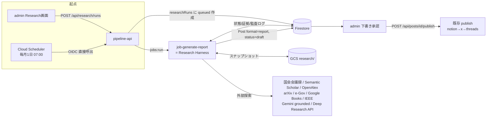
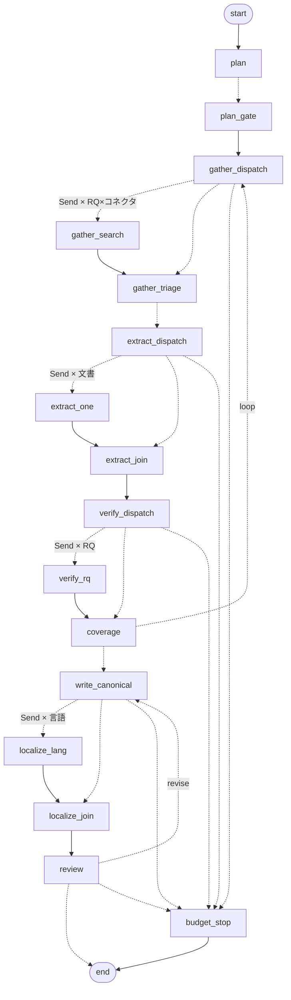

# 詳細設計 10: 資料調査エージェント(Research Agent)

> 対象コード時点: コミット f192157 + 未コミット変更 / 最終更新: 2026-07-15(**M2: フェーズ内並列 fan-out**(§4.1.2/§4.1.3)/ M1: 自前 Harness → LangGraph 移行(§3.1/§6.1/**§8.2 全面改訂**)/ M0-c: deep_research 配線(§4.3)/ M0-b: 信頼源のプロンプト強化(§4.2))
>
> **状態: 実装済み(P0–P9、コード完了・未デプロイ)** — §9 の実装タスク P0–P9 を実装済み。**P0** 区分リネーム移行、**P1** research 基盤、**P2** コネクタ v1 + fetcher + extract_text、**P3** Harness + 調査系フェーズ(plan→verify)、**P4** 執筆系フェーズ(write / review)+ citecheck + Post(report)、**P5** ジョブ+API 3本+select+Deep Research(flag)、**P6** admin Research 画面、**P7** infra(job-generate-report / sched-generate-report OIDC / IAM。スクリプトのみ・未デプロイ)、**P8** 評価(golden plan→review 通貫 + 失敗パターン §7.3、`pytest 136 passed`)、**P9** 文書。**2026-07 更新**: フェーズを R0–R9(+R7L)の11個から意味名の6個(plan / gather / extract / verify / write / review)へ統合し(§4.1.1)、モデルを GPT-5.6 系(sol / terra / luna)へ移行(§3.2)。実コードは `pipeline/app/research/` と `admin/src/app/[locale]/research/`。**未実装(繰り越し)**: レポートの言語別3ページ Notion 公開(§6.2 の `_publish_notion(post, post_id)` 拡張)— review の handoff は下書き Post を作るところまで。本番の migrate/deploy/Notion スキーマ変更は runbook 参照(未実行)。実装指示プロンプトは [`docs/prompts/research-agent-implementation.md`](../../prompts/research-agent-implementation.md)。

---

## 1. この文書で分かること

- 投稿区分を「配信周期(daily/weekly/monthly)」から「**成果物の種類 = 短文(short) / 記事(article) / レポート(report)**」へ再定義する互換リネーム移行の設計
- **レポート(report)** で「テーマ → 調査計画 → 多種ソース探索(論文・議事録・公文書・書籍・報道) → 抽出 → 検証 → 執筆 → 三言語化」の深掘り調査を、**証拠(メタデータ+スナップショット)付き・監査可能・予算制御下**で自動実行する Research Agent システムの全設計
- 制御層(Harness = 決定的なコード)と判断層(役割別 LLM エージェント)の分離方針、再試行・停止・監査・再現性の保証方法

### 1.1 なぜこの変更か

現行システムは「RSS / Gemini グラウンディング検索 / IEEE Xplore で収集した items を LLM で整形して配信」する構成で、**調査の深さが初期収集の品質に固定**されている。区分も配信周期であり、成果物の性質を表していない。

事前調査で確認済みの重要な制約:

- cadence は enum だけでなく **Firestore ドキュメントID**(`{cat}_{cadence}`, `{cat}_{cadence}_{channel}`)、`posts.cadence` フィールド、`runs.jobType` 文字列、**Cloud Run ジョブ名/スケジューラ名**、**Notion の "Cadence" セレクト値**、admin の i18n・グリッド UI にまで埋まっている → リネームは**データ移行を伴う**(§9.2 の移行 runbook)
- ジョブは argv を取らない(入力 = Firestore + env)。起動経路は admin → pipeline-api → Cloud Run Jobs v2 `:run`
- 生成は `daily.py`(1段・自動公開)と `longform.py`(2段・下書き承認制)の2系統 → short/article に 1:1 で対応。report のみ新実装
- 費用は `runs.costUsd` に**計上のみ**(上限制御なし) → report では予算ハード制御を新設
- **ジョブ内で投稿する系のジョブは `--max-retries=0`** の方針は不変(§6.3 の retry 方針参照)

### 1.2 確定事項(ユーザー回答済み)

| 論点 | 決定 |
|---|---|
| 移行方式 | **互換リネーム移行**。daily→short / weekly→article / monthly→report。enum・ドキュメントID・既存データを移行スクリプトで一括変換。スケジュール(毎日08:00 / 月曜07:00 / 毎月1日07:00 JST)は当面維持 |
| レポート起点 | **手動(admin フォーム)+ 定期自動(毎月1日、テーマ自動選定)** の両方 |
| 予算 | **標準 ~$10/本**をハード上限。Deep Research 補助は1レポート1回まで |
| レポート言語 | **ja / ko / en 三言語生成**。ただし**内容(canonical)を一度確定してから、別ステージで三言語を並行生成**し内容を統一する |

### 1.3 設計時の再検証結果(2026-07-13、HEAD e93a089 に対して)

本設計の「継ぎ目」主張は以下の実コード箇所と突合済み:

| 主張 | 確認箇所 |
|---|---|
| `Cadence` enum・`Post.cadence`・`PromptTemplate`/`ChannelConfig` の docID 形式 | `pipeline/app/models.py:10-13,66,140` / `repo/configs.py:52,82` |
| publish の skip 条件が `externalId` を見る(三言語ページの途中設定が罠になる) | `publishers/base.py:107` |
| `_publish_notion(post)` が post_id を受けない現行シグネチャ / `notion.publish(cadence=...)` kwarg と "Cadence" セレクト | `publishers/base.py:28` / `publishers/notion.py:146-171` |
| `10-deploy-pipeline.sh` の retries 条件(collect/seed のみ 1)・作成のみで削除しない | `infra/10-deploy-pipeline.sh:39-40` |
| `20-schedulers.sh` は run.googleapis.com 向け OAuth 方式(pipeline-api 直呼びには OIDC ヘルパー新設が必要) | `infra/20-schedulers.sh:14-28` |
| 既存テスト **58 件**・全て monkeypatch フェイク・**respx は dev 依存に宣言済みだが未使用** | `pipeline/tests/*` / `pyproject.toml:28` |
| `posts.old_drafts()`/`get()` が `Post(**doc)` で全件構築(未移行 doc 1件で cleanup/publish が落ちる → 旧値受理シム必須) | `repo/posts.py:34,49` |
| admin の runs 集計は `jobType.startsWith('generate')`(新旧両対応) | `admin/src/app/[locale]/page.tsx:78` |
| `ActionButton` は入力欄を持てない / `STATUS_STYLES` は未知 status を pending にフォールバック | `admin/src/components/{ActionButton,ui}.tsx` |
| `items.create_if_absent` は `ref.create()` 事前条件方式 = 本リポジトリに**トランザクション lease の前例なし** | `repo/items.py:11-15` |
| seed 件数: categories 3 × cadence 3 = promptTemplates 9 / ×channel 3 = channelConfigs 27(移行検証の照合値) | `jobs/seed.py:11-16` |
| longform の monthly 分岐(`_weekly_summaries_for_month`・`LOOKBACK[monthly]`・`recent_by_cadence`)= P0 で削除する対象 | `generators/longform.py:31,37-48` / `repo/posts.py:67` |

---

## 2. 関連ファイル一覧

既存の generators/publishers と同格の縦割りで `pipeline/app/research/` に置く:

```
pipeline/app/research/
  graph/                # LangGraph 実装(2026-07-15。旧 harness.py はここに置き換わり削除済み)
    builder.py          #   トポロジー: ノード/エッジ/ループバック/fan-out。DeltaChannel 禁止の assert
    state.py            #   ResearchState = チャネル定義 + reducer + RESET + fan-out タスク型(M2)
    context.py          #   ResearchRuntimeContext = チェックポイントに入れない生き物(Budget/コネクタ/Fetcher)
    checkpointer.py     #   FirestoreCheckpointSaver(自前。blob チャンク保存 + TTL)
    runner.py           #   lease 済み run の実行制御: 入力決定・run doc への投影・cancel・後始末
    nodes/              #   common.py + フェーズ別ノード。M2 で gather/extract/verify/write の
                        #   実装本体を吸収(dispatch → 並列 worker → バリアの3段構成。§4.1.2)
  context.py            # RunContext: plan/review ノードがフェーズ実装へ渡す作業用の器
  state.py budget.py events.py schemas.py prompts.py select.py(定期実行のテーマ自動選定)
  phases/ plan.py review.py   # 残る判断の実体はこの2つ(gather/extract/verify/write は M2 で graph/nodes/ へ移設・削除)
  sources/ base.py web_grounded.py kokkai.py academic.py gov_docs.py books.py ieee.py news.py deep_research.py
  fetch/   fetcher.py extract_text.py archive.py citecheck.py
pipeline/app/jobs/generate_report.py     # キュー消費エントリポイント
pipeline/app/repo/research.py            # researchRuns/evidence/claims/events CRUD
pipeline/scripts/migrate_cadence_to_format.py  # 一括移行(dry-run 付き)
```

既存ファイルへの主な変更(詳細は §9.1 実装タスク表):

- `shared/constants.json` / `pipeline/app/models.py` — `cadences`→`formats`、`Cadence`→`Format`、`Post.localizations` 等
- `pipeline/app/main.py` — research API 3 エンドポイント追加
- `pipeline/app/publishers/{base,notion}.py` — report の言語別3ページ公開
- `admin/src/app/[locale]/research/*` ほか admin 各所 — Research 画面
- `infra/{env.sh,10-deploy-pipeline.sh,20-schedulers.sh}` — job-generate-report / sched-generate-report

**スタック**: 既存踏襲(Python 3.12 / httpx / tenacity / pydantic / Firestore / GCS)+ **`trafilatura`(HTML 本文抽出)、`pypdf`(PDF)、`langgraph` + `langgraph-checkpoint`(グラフ実行とチェックポイント)、`langsmith`(トレーシング)**。**2026-07-15 に LangGraph を採用**(それ以前は自前 Harness。§8.2 に判断を覆した理由)。ただし採用したのは**OSS ライブラリのみ**で、LangGraph Platform(マネージド)は使わず、実行は従来どおり単一イメージの Cloud Run Job 内・状態は Firestore。LLM 呼び出しは LangChain のモデル抽象に**乗せない**(予算計上と監査の管理点を `research/llm.py` 一本に保つため)。

**config.py 追加**: `research_planner_model="gpt-5.6-sol"`(planner / critic), `research_model="gpt-5.6-terra"`(verifier / writer / localizer), `research_fast_model="gpt-5.6-luna"`(retriever / triage / extractor / テーマ自動選定), `deep_research_provider="openai"|"gemini"|"off"`(既定 openai), `deep_research_model="o4-mini-deep-research"`, `research_budget_usd_default=10.0`, `research_max_loops=2`, `research_max_fetches=80`, `research_wall_clock_min=40`, `semantic_scholar_api_key=""(任意)`, `research_checkpoint_ttl_days=14`(チェックポイントの保持日数), `research_max_concurrency=1`(M2 で 4)。価格表(`openai_client.PRICES`)に GPT-5.6 3段+DR モデルの行を追加(旧 `gpt-5.4-mini`/`gpt-5.5` 行は `promptTemplates.modelOverride` が旧モデルを固定しているケースの計上互換のため残置)。

---

## 3. 全体フロー



**責務分離の原則**: LLM は「何を検索するか・その文が何を主張しているか・どう書くか」を判断する。Harness は「次にどのフェーズを実行するか・もう1ループ許すか・予算内か・失敗時どうするか」を判断する。**制御判断に LLM を使わない**ことで、再現性・テスト可能性・暴走防止を確保する。

### 3.1 実行基盤 — LangGraph のグラフ + runner

エージェントを「載せて走らせる」決定的な実行基盤。**2026-07-15 に自前の `ResearchHarness`(113行の while ループ)を LangGraph の `StateGraph` へ移行した**(判断を覆した理由は §8.2)。責務は2つに分かれる:

- **グラフ**(`graph/builder.py` + `graph/nodes/`)— フェーズの遷移だけを担う。**LLM は経路に一切関与しない**: 分岐を決めるのは今も純関数の `state.gap_decision` / `state.critic_decision` で、ノードはその判断を `Command(goto=...)` で運ぶだけ
- **runner**(`graph/runner.py`)— グラフの外側全部: 再開時に何を入力するかの判断、superstep の run ドキュメントへの投影、cancel、成功後の後始末

この基盤が行うこと:

1. **状態管理**: **superstep ごと**にチェックポイントを Firestore へ永続化(`durability="sync"`)。クラッシュ後は**完了済みノードを再実行せず**、失敗した superstep から続きを実行する。旧 Harness は「直前に完了したフェーズ」しか永続化せず、`draft` 等はメモリ上のみだったため、空の Post が生まれ得た(§8.2・§6.1)
2. **ツール呼び出しの順序制御**: ノード/エッジ表(§4.1)に従い、LLM の「気分」でフローが変わらない
3. **予算・停止条件の強制**: コスト/取得数/ループ回数/実時間の上限をコードで判定(各ノード冒頭の `afford()` ガード)
4. **再試行とフォールバック**: HTTP/LLM ごとの retry 方針、コネクタ単位のサーキットブレーカ
5. **監査ログ**: 全ツール呼び出し・全 LLM 呼び出しを追記専用イベントとして記録(フェーズ通過ごとに `phase_start`/`phase_end` を**厳密に1組**。管理画面のフロー図がこれを数える)

### 3.2 責務分割(エージェント = 役割別 LLM 呼び出し + ツール許可リスト)

| 役割(actor) | フェーズ | 入力 → 出力 | モデル(config.py) | ツール |
|---|---|---|---|---|
| Harness | 全体 | ResearchRun 状態 | (LLM なし) | Firestore/GCS |
| Selector テーマ選定 | plan | theme=null(定期実行)時のみ: 候補 items → テーマ | gpt-5.6-luna(`research_fast_model`) | なし |
| Planner 計画 | plan | テーマ → ResearchPlan(RQ 3–7 個+ソース戦略) | gpt-5.6-sol(`research_planner_model`) | なし(純推論) |
| Retriever クエリ精緻化 | gather | 未解決 RQ×コネクタ → 焦点クエリ ≤2(失敗時は RQ 原文にフォールバック) | gpt-5.6-luna | ソースコネクタ群 |
| Triage 選別 | gather | SourceHit[] → 上位候補(≤20)+tier 分類 | gpt-5.6-luna | なし |
| Extractor 抽出 | extract | 候補 → EvidenceRecord(引用+論点) | gpt-5.6-luna | fetcher/archive |
| Verifier 検証 | verify | Evidence → Claim+判定(裏取り/矛盾/立場) | gpt-5.6-terra(`research_model`) | なし |
| Writer 執筆 | write | Claim+Evidence → canonical レポート(ja) | gpt-5.6-terra | なし |
| Localizer | write | canonical → ko / en 並行生成(llm_call イベントに `detail.language`) | gpt-5.6-terra | なし |
| Critic 監査 | review | レポート → 引用検査+修正指示 | gpt-5.6-sol + 機械検査 | citecheck |

旧 R6 の Gap 分析(LLM)は廃止し、verify 内の**決定的カバレッジ判定**(RQ ごと evidence ≥2 で resolved、`state.gap_decision()`)に置換。handoff(Post 作成)も review 内の決定的レッグで LLM を使わない。

検索・抽出・検証・要約・レポート生成は**独立フェーズ+独立スキーマ**で分離: 各フェーズの出力 JSON(pydantic 検証済み)が次フェーズの唯一の入力。フェーズ内部の LLM は前フェーズの生テキストを見ない(=幻覚の連鎖を遮断)。

### 3.3 モード設計(短文 / 記事 / レポート)

| | **短文 short**(旧 daily) | **記事 article**(旧 weekly) | **レポート report**(旧 monthly) |
|---|---|---|---|
| 目的 | 速報ダイジェスト | 週間トレンド分析記事 | テーマ深掘り調査報告 |
| 生成フロー | 現行 `daily.py`(1段)**変更なし** | 現行 `longform.py`(2段)**変更なし** | **新 Research Harness(6フェーズ)** |
| 調査深度 | 収集済み items のみ(36h) | items のみ(7日、選定→執筆) | 多段探索。外部ソース横断、ループ≤2 |
| 許容ソース | items(RSS/grounded/IEEE) | items | 全クラス: 論文・公文書・議事録・書籍・報道・一次資料・公式仕様 |
| 出力粒度 | X/Threads 短文+Notion 要約 | 1,500–3,000字+ティーザー | 8,000–20,000字構造化レポート+証拠一覧+三言語 |
| 承認 | 自動公開(`shortRequireApproval` で承認制に可) | 下書き→承認 | 下書き→承認(**必須**。計画承認ゲートも任意で有効化可) |
| 再現性要件 | run 記録のみ | run 記録+sourceItemIds | **full manifest**: 全プロンプトのバージョンハッシュ・全証拠スナップショット・全イベントログ |
| 言語 | channelConfigs 現行(X=ja/Threads=ko/Notion=en) | 同左 | canonical(ja)→ja/ko/en 並行生成 |
| コスト/本 | ~$0.05 | ~$0.5 | ≤$10(ハード上限) |
| 旧挙動からの変更 | リネームのみ | リネームのみ | **旧 monthly の「週次まとめ集約」は廃止**(深掘り調査に置換。§8.3-3) |

---

## 4. 処理の流れ

### 4.1 フェーズ状態機械(report モード)

```
plan(intake+テーマ自動選定+RQ 分解)→(任意: awaiting_plan_approval)
→ gather(クエリ精緻化+検索+triage)→ extract
→ verify(claim 検証+カバレッジ判定)──不足あり&ループ<2&予算内──→ gather(対象RQのみ)
                                   └─充足/上限─→ write(canonical ja + ko/en localize)
→ review(critic ──不合格・修正1回まで──→ write)
   └─合格─→ handoff レッグ(Post 作成)→ awaiting_review →(admin 承認)→ 既存 publish
```

| フェーズ | 内容 | 冪等性の根拠 | 予算目安(標準$10) | 最低所要(`PHASE_MIN_USD`) |
|---|---|---|---|---|
| plan | run 検証・予算初期化・lease 取得(旧 intake)→テーマ自動選定(theme=null の定期実行時のみ、Selector)→テーマ分類→RQ 分解→戦略選択 | plan を run doc に保存、再実行は既存 plan 再利用 | ~$0.4 | –(常に実行) |
| gather | 未解決 RQ×コネクタごとに Retriever が焦点クエリ ≤2 を生成(失敗時は RQ 原文にフォールバックし `fallback` イベント記録)→並列検索(メタデータのみ。Deep Research 補助はここ≤1回)→重複排除(URL hash+タイトル近似 — `normalize.py` 再利用)→triage で上位 N(≤20)選別+tier 分類 | ヒットは urlHash キーで upsert、選別結果を run doc に保存 | ~$0.7 (+DR ~$2) | $0.70 |
| extract | 取得(robots/SSRF ガード)→GCS スナップショット(sha256)→本文抽出→引用・論点抽出→EvidenceRecord。resume 粒度確保のため統合せず単独フェーズのまま | evidence docID = urlHash、`create_if_absent` 方式 | ~$1.5 | $0.50 |
| verify | Claim 化→複数ソース照合→矛盾検出→立場ラベル→信頼度確定+決定的カバレッジ判定(RQ ごと evidence ≥2 で resolved、`state.gap_decision(coverage, loops, max_loops, can_afford_gather)`)→不足なら gather へ(最大 `research_max_loops`=2) | claims を claimId で upsert、loops カウンタを永続化 | ~$1.7 | $0.60 |
| write | アウトライン→章執筆(canonical=ja)。**全ての断定文は evidenceId を引用**。オーナーの常設指示 `promptTemplates.{categoryId}_report.customInstructions` があれば `configs.custom_instructions(run.categoryId, report)` で読み、`generators/prompts.py` の `custom_instructions_block()` を user プロンプト末尾に付加(出力言語は変えない。[03-generate.md](03-generate.md) §4.1)。続けて同フェーズ内で canonical の構造化セクションから ko/en を並行生成(引用構造は同一強制。Localizer の `llm_call` イベントに `detail.language`) | 草稿・言語別本文を run doc(GCS 併用)に保存 | ~$2.7 | $1.00 |
| review | critic レッグ: (a)機械検査 = 引用文がスナップショット内に実在するか(citecheck)+三言語間の数値/日付/引用数一致 (b)LLM 検査 = 無根拠断定の走査。判定は `state.critic_decision(audit, revisions, max_revisions)` → 不合格かつ `revisions < max_revisions` なら write へ修正1回。合格(proceed)時のみ handoff レッグ: `Post(format=report, status=draft, localizations={ja,ko,en}, researchRunId)` 作成、run を awaiting_review へ。`max_revisions` は `settings/app.researchReviseEnabled`(既定 true→1、false→0)から`phases/review.py::run()`が都度算出 — false のときは監査に落ちても常に proceed する | 検査結果を保存。postId 保存済みなら handoff は skip | ~$0.8 | $0.30 |

合計目安 ~$8.3 + 予備 → **ハード上限 $10**(`budgetUsd`)。超過見込み時(残額 < 当該フェーズの `PHASE_MIN_USD`)は次フェーズに入らず graceful degrade(§7.2)。

#### 4.1.2 グラフのノードとエッジ(2026-07-15 M1 → 同日 M2 で fan-out 化)

上の状態機械を LangGraph の `StateGraph` として実装したもの(`graph/builder.py`)。**フェーズの数も順序もループバックも不変** — M2 で変わったのは gather / extract / verify / write の内部が「dispatch → 並列 worker 群 → バリア」の3段になったこと。worker は `config={"max_concurrency": research_max_concurrency}`(既定4)のスレッドで並列実行される。



(`graph.get_graph().draw_mermaid()` の出力を整形。実線 = 静的エッジ、点線 = `Command`/`Send` ルーティング)

| ノード | 役割 | 備考 |
|---|---|---|
| `plan` / `plan_gate` | M1 と不変 | gate は `interrupt()` の承認ゲート |
| `gather_dispatch` | ガード → `phase_start("gather")` → 未解決 RQ × 有効コネクタごとに `Send` | 予算不足なら phase イベントを出さず `budget_stop`(admin では pending のまま) |
| `gather_search`(worker) | クエリ精緻化 LLM → `conn.search` → `connector_search` イベント | 部分 `hit_index`/`hit_rqs` を返し、reducer が first-write-wins / set-union でマージ |
| `gather_triage`(バリア) | タイトル dedupe → triage LLM → tertiary 除外 + `MAX_SELECTED` cap → `phase_end` | **全候補を突き合わせる品質ゲートなので意図的に同期点** |
| `extract_dispatch` | ガード → `phase_start` → `evidence_ids` を RESET → 文書ごとに `Send` | |
| `extract_one`(worker) | `try_note_fetch()`(原子的)→ fetch/スナップショット → 抽出 LLM → `evidence_create_if_absent` | 冪等なので再試行・並列で重複しない |
| `extract_join` | `phase_end("extract")` のみ | 静的エッジで `verify_dispatch` へ |
| `verify_dispatch` | ガード → `phase_start` → `claims_buf` を RESET → 証拠のある RQ ごとに `Send` | |
| `verify_rq`(worker) | verifier LLM → 引用ゲート/renderAs(rubric)→ `upsert_claim` → `claims_buf` へ append | 証拠は Firestore から再読(Send の引数はチェックポイントされるため小さく保つ) |
| `coverage`(バリア) | `claims_buf` → dedupe → `claims`。全 RQ のカバレッジ判定(純関数 `gap_decision`)→ loop なら **loops++(唯一の加算点)** → `gather_dispatch` / 充足なら `write_canonical`。`phase_end("verify")` | |
| `write_canonical` | ガード → **`phase_start("write")` の唯一の発生源**(admin の revise 辺 = この回数 − 1)→ writer LLM → canonical 言語分の localized を自前で作り、他言語ごとに `Send` | worker にはレンダリング済み skeleton **文字列**を渡す(ReportDraft 全体は渡さない) |
| `localize_lang`(worker) | localizer LLM(`detail.language` 付き) | `localized` チャネルの dict-update reducer がマージ |
| `localize_join` | `phase_end("write")` | 静的エッジで `review` へ |
| `review` / `budget_stop` | M1 と不変(revise の行き先だけ `write_canonical` に)| **revisions++ は review だけ** |

イベント契約(admin 互換の要): **フェーズ通過ごとに `phase_start`/`phase_end` は厳密に1組** — dispatch が start、バリアが end を出し、**worker はフェーズイベントを一切出さない**(worker の `llm_call`/`fetch`/`connector_search` は従来どおり)。RESET センチネル(`state.RESET`)は accumulator チャネル(`claims_buf`/`evidence_ids`)を dispatch 時に空にする — これが無いとループ2周目の verify が1周目の claims に積み増して全 claim が重複する(`test_claims_buffer_reset_on_second_verify_pass` が固定。逐次実装は毎パス上書きだったので、RESET+再構築がその意味論の再現)。

**チャネル**(= チェックポイントに入る状態。`graph/state.py`): M1 の一覧に `claims_buf` / `evidence_ids`(ともに `append_or_reset` reducer)が加わった。**旧 Harness でメモリ上にしか無かった `draft`/`localized`/`selected`/`revisions` がチャネル化されていることが、§8.2 の空 Post バグの根治**。`Budget` 本体・コネクタ・Fetcher は**チャネルに入れない**(`graph/context.py` の `ResearchRuntimeContext` で注入)— 直列化できない上、Budget は worker が並列に課金する生きた共有オブジェクトである必要があるため。

#### 4.1.3 並列実行の安全性(M2)

worker はスレッドで並列実行されるため、共有される可変オブジェクトには全て明示的な防御がある(検証は `tests/research/test_parallel_safety.py` — 各ロックを外すと対応するテストが**実際に落ちる**ことを変異注入で確認済み):

| 共有物 | 防御 | 理由 |
|---|---|---|
| `Budget`(run に1つ、全 worker が課金) | `threading.Lock` + 原子的 `try_note_fetch()` + `snapshot()` | `usdSpent += x` は read-modify-write — 無防備だと並列課金が消失し、**キャップの根拠そのものが崩れる**。fetch 枠は check-then-act をロック内で1操作に |
| `Fetcher` の politeness 状態 | グローバル Lock(辞書保護)+ **ホスト別 Lock**(レート間隔・GET・スロット計上を一括保持) | 同一ホストは完全直列 = 1 req/s 約束を並列下でも維持。**異なるホストは並列のまま** |
| grounded コネクタの genai client | インスタンスごとに Lock 1本 | google-genai は sync client のスレッド安全性を明文化していない(計画書 §5.4 のフォールバック)。web/gov_docs/news の3インスタンス間は並列 |
| `HttpConnector` のサーキットブレーカ | **無防備(意図的)** | 増分消失は最悪1ストライク余分なだけの良性競合。httpx.Client 自体は並行安全 |
| Firestore Client | 追加防御なし | 公式にスレッド安全(共有してはいけないのは Transaction/WriteBatch のみ。本リポジトリ唯一のトランザクション = lease はグラフ実行前・単一スレッド) |

予算の残余超過はワースト `max_concurrency × 実行中1コール`(worker は LLM 呼び出し前に floor を確認する。軽量モデルでセント単位)— `usdCap` は「会計上の上限」として runbook に明記。テストは `sys.setswitchinterval(1e-6)` で GIL 切替を強制する — 既定の 5ms では read-modify-write 全体が1クォンタムに収まってしまい、ロック無しの変異が通ってしまうことを確認済み(それこそがこのスイートが排除すべき偽の安心)。

#### 4.1.1 2026-07 フェーズ統合(R0–R9+R7L → 6フェーズ)

当初実装の 11 フェーズ(R0 intake / R1 plan / R2 retrieve / R3 triage / R4 extract / R5 verify / R6 gap / R7 write / R7L localize / R8 critic / R9 handoff)を、resume 粒度と役割の対応を保ったまま意味名の 6 フェーズに統合した:

| 新フェーズ | 旧フェーズ | 統合時の変更点 |
|---|---|---|
| plan | R0+R1 | intake・テーマ自動選定・RQ 分解を一体化 |
| gather | R2+R3 | **クエリ精緻化を新設**: 従来未使用だった `RETRIEVE_SYSTEM/USER` プロンプトで Retriever(gpt-5.6-luna)が RQ を焦点クエリ ≤2 に精緻化(失敗時は RQ 原文で続行し `fallback` イベント、reason=`query_refinement_failed`) |
| extract | R4 | 変更なし(fetch が最も落ちやすいため resume 粒度を維持する目的で単独のまま) |
| verify | R5+R6 | 旧 gap の LLM 判定を廃止し、決定的カバレッジ判定(`MIN_EVIDENCE_PER_RQ=2`+`state.gap_decision`)に置換 |
| write | R7+R7L | localize を同フェーズに吸収。**旧構成の潜在バグ**(単独 localize フェーズから resume するとメモリ上に draft が無く silent no-op になる)を構造的に解消 |
| review | R8+R9 | critic の判定を `ctx.review_decision` に格納し、proceed の時のみ同フェーズ内の handoff レッグが走る(postId で冪等) |

互換性: 統合前に保存された run の `phase`(R0–R9/R7L)は `schemas.py` の **`LEGACY_PHASE_MAP`** が唯一の対応表で、`ResearchRun` の `model_validator` シムが読み込み時に新名へ写像する(デプロイ境界をまたぐ resume も安全)。admin もこの対応表を `ResearchFlow.tsx` にミラーし、旧 run を同じ 6 ノードのフロー図で表示する。`ResearchRun.phase` の既定値は `"plan"`。プロンプトは未使用だった `GAP_SYSTEM/GAP_USER` を削除・`RETRIEVE_*` を実使用化したため `PROMPT_VERSION` ハッシュが変わっている。あわせて `llm.structured()` に任意の `extra_detail` dict を追加(`llm_call` 監査イベントの `detail` にマージ。Localizer の言語識別に使用)。

### 4.2 ソース選定ロジック

**テーマ分類**(plan で Planner が判定、キーワードルールでフォールバック):
`politics_history / science_tech / economics / intl_affairs / society_culture / law_regulation`

**Source Strategy Matrix**(コネクタ優先度。数字=優先順、◎=必須クラス):

| コネクタ | politics_history | science_tech | economics | intl_affairs | society | law |
|---|---|---|---|---|---|---|
| kokkai(国会会議録) | 1 ◎ | – | 3 | 3 | 3 | 2 ◎ |
| academic(SS→OpenAlex→Crossref, arXiv 直) | 2 ◎ | 1 ◎ | 2 ◎ | 2 | 2 | 3 |
| gov_docs(e-Gov 法令/省庁/公文書館) | 1 ◎ | 4 | 1 ◎ | 2 ◎ | 3 | 1 ◎ |
| books(Google Books / NDL Search) | 2 ◎ | 5 | 4 | 4 | 2 | 4 |
| ieee(既存 IEEE Xplore) | – | 2 | – | – | – | – |
| news(既存 RSS+grounded 検索) | 3 | 3 | 2 | 1 ◎ | 1 ◎ | 3 |
| web_grounded(Gemini google_search) | 4 | 3 | 3 | 2 | 1 | 3 |
| deep_research(補助・≤1回) | 任意 | 任意 | 任意 | 任意 | 任意 | 任意 |

- **例1「天皇の戦争への責任」**→ politics_history: kokkai(発言・答弁)、gov_docs(公文書・外交資料)、books(研究書)、academic(歴史学論文)が必須。争点プロトコル発動(下記)
- **例2「Transformer/LLM」**→ science_tech: academic 必須(原著 "Attention Is All You Need" arXiv:1706.03762 のような**セミナル論文を被引用数で検出**し必ず候補化)、派生・サーベイ・ベンチマーク論文へ拡張、公式仕様/実装ドキュメントは official 扱い

**一次/二次/三次の定義と扱い**:

| tier | 定義 | 例 | 扱い |
|---|---|---|---|
| primary 一次 | 事象そのものの記録・当事者の発言・原著 | 議事録、公文書、外交電文、原著論文、公式仕様、当時の一次報道 | 断定の根拠に単独で使用可 |
| secondary 二次 | 一次資料の分析・解釈 | 査読論文(分析)、研究書、サーベイ、質の高い報道分析 | 断定には独立2件以上、または一次1件との併用 |
| tertiary 三次 | 集約・再々引用 | 百科事典、まとめ記事、アグリゲータ | **探索のナビゲーションのみ。引用禁止**(リンク先の一次/二次に辿る) |

**争点プロトコル**(Verifier が `contested=true` と判定したテーマ/論点):
1. 立場(stance)を列挙し、**各立場につき最低1つの代表的資料**を確保(≥2 立場必須)
2. 各引用に「一次資料か解釈か」ラベルを付け、本文でも区別して記述
3. 断定を避け、「A は〜と記録(一次)」「B 説は〜と解釈(二次)」形式で併記
4. 立場が確保できない場合は「反証・異説」章に**未充足として明記**(隠さない)

**信頼度スコア(0–100、rubric ベース・根拠文字列付き)**:

```
score = base(sourceType)            # official_document/parliamentary_record 40, paper(査読) 38,
                                    # book(学術) 32, preprint 30, quality_news 25, web 15
      + venue_authority (0–15)      # go.jp/ndl.go.jp/公的機関 +15、主要学術出版 +12、大手報道 +8
      + author_credibility (0–10)   # 当該分野の研究者・当事者
      + recency_fit (0–10)          # テーマ依存(歴史=同時代資料+現代研究の両方を評価)
      + corroboration (0–15)        # 独立ソースによる裏付け件数(上限15)
      − penalties                   # 未解決矛盾 −10 / 撤回論文 −40 / 循環参照(同一系列の再引用) −10
                                    # / コンテンツファーム兆候 −20
```

**引用ゲート**: 本文の断定(事実言明)は「score≥60 の primary 1件」または「独立した secondary 2件」が必要。満たさない言明は自動的に「推定」へ降格するか削除(review の Critic が強制)。

#### プロンプト層と決定的コード層の役割分担(この節の要)

信頼できる情報源の優先は **2層** で実現しており、**最終的な権限は必ずコード側にある**。プロンプトは「LLM をより早く・より良い資料へ導く」ためのものであって、守らせるための仕組みではない(LLM は指示を無視し得るため)。

| 何を | プロンプト層(助言・`prompts.py`) | 決定的コード層(強制・**最終権限**) |
|---|---|---|
| 資料戦略の順序 | `PLAN_SYSTEM` が「官公・学術系を news/web より先に」と指示 | `plan.py` の `STRATEGY_MATRIX` が LLM の strategies を検証・修正(不正なら `matrix[:4]` に置換) |
| 検索クエリの質 | `RETRIEVE_SYSTEM` が公文書名・機関名・DOI/arXiv/ISBN 等の識別子を優先させる | (なし。品質向上のみが目的) |
| tier 付けと選別 | `TRIAGE_SYSTEM` が信頼源ヒエラルキーと primary>secondary を指示 | `gather.py` が `tier=="tertiary"` を無条件に除外し `MAX_SELECTED=20` で打ち切り。`rubric.classify_tier` は hint より TYPE_TIER を優先する既定を持つ |
| 弱い根拠の扱い | `VERIFY_SYSTEM` が web/tertiary 単独なら confidence≤0.5・verdict は single_source 止まりと指示 | `rubric.passes_citation_gate` + `render_as` が verdict に関わらず renderAs を決定(**LLM が corroborated と言っても、ゲートを通らなければ断定にならない**) |
| 本文での表現 | `WRITE_SYSTEM` が弱い論点を renderAs どおりに提示させる | `verify.py` が claim ごとに renderAs を確定済み。`review.py` の citecheck が引用の実在を検査 |
| 監査 | `CRITIC_SYSTEM` が `weakly_sourced_assertion` を検出 | `review.py` は delete 級の finding のみで audit を失敗させる(降格提案は助言) |

この分担は `tests/research/test_trusted_source_invariants.py` が**成果物レベル**で固定している(プロンプトを差し替えてもコード側が守ることをテストが証明する)。プロンプトを強化するときは、**コード側の不変条件と矛盾しないこと**を必ず確認すること — 矛盾した場合に勝つのは常にコードであり、プロンプトだけが嘘をつく状態になる。

### 4.3 コネクタ一覧

| コネクタ | API | 認証/費用 | v |
|---|---|---|---|
| web_grounded | 既存 Gemini `google_search` tool(grounding chunks→hits) | 既存キー/無料枠月5,000 | v1 |
| kokkai | 国会会議録検索システム API(kokkai.ndl.go.jp/api、JSON、発言全文取得可) | 不要/無料 | v1 |
| academic | Semantic Scholar Graph → OpenAlex → Crossref のフォールバック連鎖 + arXiv API 直 | SS はキー任意/全て無料 | v1 |
| gov_docs | e-Gov 法令 API + `site:go.jp` 等のドメイン制限 grounded 検索。国立公文書館デジタルアーカイブ API | 不要/無料 | v1(公文書館 v1.5) |
| books | Google Books API + NDL サーチ(SRU) | キー任意/無料 | v1 |
| ieee | 既存 `collectors/ieee_xplore.py` の薄いアダプタ | 既存(200件/日) | v1 |
| news | 既存 RSS ソース+grounded ニュース検索(GDELT DOC API は v1.5) | 無料 | v1 |
| deep_research | OpenAI Responses API(`o4-mini-deep-research`、background モード+ポーリング)。Gemini 側は実装時に API 提供状況を確認しプロバイダ差し替え可能な interface で実装 | OpenAI キー/1回~$2 | v1(flag 制御。**Budget 有りのレジストリにのみ登録**・下記) |

**共通契約**(`research/sources/base.py`):

```python
class SourceConnector(Protocol):
    name: str
    def search(self, q: StrategyQuery) -> list[SourceHit]: ...
# StrategyQuery = {rqId, query, language, dateRange?, siteFilters?, maxResults}
# SourceHit    = {title, url, identifiers{doi,arxivId,isbn,kokkaiId,...}, snippet,
#                 publishedAt?, authors[], venue?, sourceType, tierHint, connector, rawScore?}
```

コネクタは**メタデータのみ**返す(本文取得は extract の fetcher に一元化)。ただし kokkai のように API が全文を返す場合は `contentText` を添付して fetch をスキップ。

**Deep Research 補助の位置づけ**: gather の1レッグ。出力レポート本文は**最終成果物に直接使わない**。(a) citations → SourceHit 化(`deepResearchAssisted=true` フラグ)して通常の triage→extract→verify 検証パイプラインに通す、(b) 本文は verify のカバレッジ判定の参考入力のみ。予算残 <$3 なら自動スキップ。

#### deep_research の配線(2026-07-15 有効化)

1本 ~$2 と桁違いに高価なため、他コネクタと違い**入口が3つとも意図的に絞ってある**:

| 何を | どこで | なぜ |
|---|---|---|
| **登録は Budget があるときだけ** | `sources/base.py::build_registry(budget=None)` | DR は one-shot ゲートと課金に `Budget` が要る。**Budget を渡さない呼び出し元(リサーチチャット)には DR が存在しない** — チャットの予算は1メッセージ $0.7〜$3 しかなく、$2 の道具を持たせてはいけない。チャット側は `VALID_CONNECTORS` でも弾いているが、それは deep_research が `STRATEGY_MATRIX` に無い限りの保証なので、**お金の側(レジストリ)にも保証を置く**二重防御 |
| **注入は RQ[0] の末尾に1回だけ** | `phases/plan.py::_inject_deep_research()` | LLM に選ばせず**コードが決定的に**差し込む。`STRATEGY_MATRIX` に入れると (a) チャットへ波及し (b) `PLAN_SYSTEM` のコネクタ列挙(7種)の変更が要る。「テーマの中心的な問いへの1回だけの補助」なので先頭 RQ の末尾。冪等(resume で再実行しても増えない) |
| **同一 Budget インスタンスの共有** | `graph/runner.py::run_research` | registry と `RunContext` に**別インスタンス**を渡すと `drCallsUsed` が別勘定になり、one-shot ゲートが効かず二重課金する |

**コスト計上**(`deep_research.py::_charge`): DR の請求は**2階建て**で、トークンだけで見積もると数倍単位で過少計上になる。

```
cost = cost_usd("o4-mini-deep-research", usage.input_tokens, usage.output_tokens)   # $2.00/$8.00 per 1M
     + tool_usage.web_search.num_requests × WEB_SEARCH_CALL_USD                     # $0.01/回($10/1,000回)
```

- フィールド名は 2026-07-15 に実 API(background モード)で確認済み: `usage.{input_tokens,output_tokens,total_tokens}` / `tool_usage.web_search.num_requests`。レスポンスには `billing` キーもあるが中身は `{"payer": "developer"}` だけで**金額を返さない**ため、自前計算が必要
- 実測感(~$2/本)の内訳はほぼ web_search 側(例: 10万入力+2万出力で $0.36、web 検索90回で $0.90)。**tool 課金を無視するとキャップの精度が崩れる**
- `usage` が取れない場合(ポーリングのタイムアウト等)は `DEEP_RESEARCH_FALLBACK_USD = 2.0` を課金する。呼んだ以上は課金されているので、**無音で $0 にするより見積りで積む**方が `usdCap` を守れる。API 呼び出し前に失敗した場合(接続エラー等)は課金せず one-shot も消費しない
- **DR の HTTP は `openai_client` ではなく生 `httpx` 直呼び**のため **LangSmith には自動トレースされない**(`wrap_openai` の対象外)。`events.llm_call` にも載らず、`events.connector_search`(actor=`deep_research`)と構造化ログにのみ現れる

### 4.4 データモデル(Firestore + GCS)

```
researchRuns/{runId}                     # 状態・計画・予算・カバレッジ(§4.7 に実例)
researchRuns/{runId}/evidence/{urlHash}  # EvidenceRecord(§4.5)
researchRuns/{runId}/claims/{claimId}    # {text, rqId, evidenceIds[], verdict, stance?, confidence, usedInSections[]}
researchRuns/{runId}/events/{eventId}    # 追記専用監査ログ(§6.5)
posts                                    # 既存。cadence→format リネーム+report 用拡張:
                                         #   format, researchRunId?, localizations?{ja,ko,en}{title,summary,body,notionPageId?,url?}
settings/app                             # 追加: reportAutoTheme, reportBudgetUsd=10, reportLanguages,
                                         #   canonicalLanguage="ja", reportPlanApproval=false
                                         # リネーム: dailyRequireApproval→shortRequireApproval, xAllowUrlOnDaily→xAllowUrlOnShort
```

- `runId` = `rr_{YYYYMMDD}_{ランダム6}`。evidence docID = `sha256(canonicalUrl)[:32]`(items と同じ冪等イディオム、`normalize.py` 再利用)
- GCS: `research/{runId}/snapshots/{urlHash}.{html|pdf|txt}`(sha256 検証付き)、`research/{runId}/manifest.json`(再現性マニフェスト: プロンプト版ハッシュ・モデル名・コネクタ版・全証拠ハッシュ)
- **status(粗粒度・クエリ用)と phase(細粒度・進捗用)を分離**: `researchRunStatuses = queued / running / awaiting_plan_approval / awaiting_review / completed / failed / cancelled / budget_exhausted`(shared/constants.json へ追加)。phase は plan / gather / extract / verify / write / review の6識別子(既定 `plan`。旧 R0–R9/R7L は `LEGACY_PHASE_MAP` で読み替え — §4.1.1)。lease 用フィールド `claimedBy / claimedAt / heartbeatAt`
- 複合インデックス追加: `researchRuns(status ASC, createdAt ASC)`(キュー取得クエリ用。admin 一覧は orderBy 単独のため複合不要)、`posts(format ASC, createdAt DESC)`。旧 `posts(cadence, createdAt)` は移行後に削除

### 4.5 メタデータ設計 — EvidenceRecord(全証拠がこの形で保存される)

```json
{
  "evidenceId": "3f2a9c…(urlHash)",
  "runId": "rr_20260801_x7k2m9",
  "rqIds": ["rq1", "rq3"],
  "sourceType": "parliamentary_record",
  "tier": "primary",
  "title": "第102回国会 参議院 内閣委員会 第3号",
  "authors": [{"name": "…", "affiliation": "…", "role": "speaker"}],
  "publisher": "国立国会図書館",
  "venue": "国会会議録",
  "publishedAt": "1988-12-13",
  "accessedAt": "2026-08-01T09:12:00+09:00",
  "url": "https://kokkai.ndl.go.jp/…",
  "identifiers": {"doi": null, "arxivId": null, "isbn": null, "kokkaiIssueId": "110214889X00319881213"},
  "language": "ja",
  "archive": {"gcsUri": "gs://…/research/rr_…/snapshots/3f2a9c….txt",
               "sha256": "…", "mimeType": "text/plain", "fetchedBy": "kokkai-api"},
  "reliability": {"score": 88, "base": 40, "signals": {"venueAuthority": 15, "corroboration": 9, "recencyFit": 4},
                   "penalties": {}, "rationale": "国会公式記録(一次)。発言者本人の答弁。"},
  "extraction": {"excerpt": "…本文先頭≤3,000字…",
                  "quotes": [{"quoteId": "q1", "text": "「……」", "locator": {"charStart": 1200, "charEnd": 1289}}],
                  "claims": ["cl_04", "cl_11"], "stance": "positionA", "isInterpretation": false},
  "retrieval": {"connector": "kokkai", "query": "天皇 戦争責任 site:kokkai", "rank": 2,
                 "loop": 0, "deepResearchAssisted": false}
}
```

必須項目: タイトル / URL(または DOI・書誌情報)/ 発行日 / 著者・組織 / 取得日時 / ソース種別 / tier / 信頼度+根拠 / 抽出論点 / 引用箇所(文字オフセット付き=機械検証可能)/ 保存先(GCS)。**snapshot の sha256 が引用検査(citecheck)の基準点**になる。

### 4.6 API 契約(pipeline-api 追加分)

| Method+Path | Request | Response | 備考 |
|---|---|---|---|
| `POST /api/research/runs` | `{theme?, questions?[], categoryId?, depth?="standard", budgetUsd?≤30, languages?=["ja","ko","en"], canonicalLanguage?="ja", planApproval?=false, requestedBy, trigger="manual"\|"scheduled"}` | 202 `{runId, accepted:true}` | run 作成(queued)+ `job-generate-report` を `:run`。`theme` 省略(scheduled)時は plan で自動選定 |
| `POST /api/research/runs/{id}/cancel` | `{}` | 200 `{status:"cancel_requested"}` / 409 終了済み | Harness がフェーズ境界で検知 |
| `POST /api/research/runs/{id}/approve-plan` | `{approvedBy}` | 200 / 409 | `awaiting_plan_approval` 時のみ(任意ゲート) |

読み取りは admin が Firestore 直読(現行パターン踏襲)。公開は既存 `POST /api/posts/{id}/publish` を report 対応拡張(§4.8)。定期実行は Cloud Scheduler → pipeline-api 直接呼出(OIDC。**scheduler-sa に pipeline-api の run.invoker を追加** — 新 IAM。既存 `create_sched` は run.googleapis.com 向け OAuth 方式のため、`--oidc-service-account-email` + `--oidc-token-audience=$PIPELINE_API_URL` を使う第2ヘルパーを 20-schedulers.sh に追加)。

実装上の契約(継ぎ目検証済み):
1. リクエストモデルは全フィールド default 付きにする(**Scheduler の空ボディ `{}` で 422 を返さない**)
2. run 作成後の `_trigger_job("generate_report")` が失敗しても **202 + runId を返す**(run は queued に残り、次のジョブ実行で回収される)
3. ジョブへの実行時引数渡しは不採用(Cloud Run v2 の containerOverrides は `run.jobs.runWithOverrides` 権限が別途必要。キュー方式なら不要 — 「ジョブは argv を取らない」の既存不変条件も維持)

### 4.7 モジュール入出力例(golden fixture と共用)

**ResearchRun(作成直後 → plan 後の抜粋)**

```json
{"id": "rr_20260801_x7k2m9", "trigger": "manual", "requestedBy": "…",
 "theme": "天皇の戦争への責任", "questions": [], "depth": "standard",
 "budget": {"usdCap": 10.0, "usdSpent": 0.42, "fetchCap": 80, "fetchUsed": 0, "drCallsUsed": 0},
 "languages": ["ja", "ko", "en"], "canonicalLanguage": "ja",
 "status": "running", "phase": "gather", "loops": 0,
 "claimedBy": "job-generate-report-abc12", "heartbeatAt": "2026-08-01T07:03:11+09:00",
 "plan": {"themeClass": "politics_history", "contested": true,
   "rqs": [
     {"id": "rq1", "q": "戦前・戦中の憲法体制下で天皇の法的権限と実際の関与はどうだったか", "strategies": ["gov_docs", "books", "academic"]},
     {"id": "rq2", "q": "戦後、国会・政府・GHQ は天皇の責任をどう扱ったか", "strategies": ["kokkai", "gov_docs", "news"]},
     {"id": "rq3", "q": "歴史学上の主要な立場と論拠は何か", "strategies": ["academic", "books"]}]},
 "postId": null, "createdAt": "2026-08-01T07:00:02+09:00"}
```

**SourceHit(gather: kokkai / academic の各1件)**

```json
[{"title": "第102回国会 参議院内閣委員会 第3号", "url": "https://kokkai.ndl.go.jp/…",
  "identifiers": {"kokkaiIssueId": "110214889X00319881213"}, "snippet": "…責任という言葉の…",
  "publishedAt": "1988-12-13", "sourceType": "parliamentary_record", "tierHint": "primary",
  "connector": "kokkai", "contentText": "(API が全文返却)"},
 {"title": "Attention Is All You Need", "url": "https://arxiv.org/abs/1706.03762",
  "identifiers": {"arxivId": "1706.03762", "doi": "10.48550/arXiv.1706.03762"},
  "authors": [{"name": "Vaswani, A."}], "publishedAt": "2017-06-12", "venue": "NeurIPS 2017",
  "sourceType": "paper", "tierHint": "primary", "connector": "academic",
  "rawScore": 0.97, "citationCount": 150000}]
```

**Claim + 検証結果(verify)**

```json
{"claimId": "cl_04", "rqId": "rq2", "text": "1946年の東京裁判で天皇は訴追されなかった",
 "evidenceIds": ["3f2a9c…", "8b1d0e…"], "verdict": "corroborated",
 "tierMix": {"primary": 1, "secondary": 1}, "contested": false, "confidence": 0.95,
 "renderAs": "assertion"}
{"claimId": "cl_11", "rqId": "rq3", "text": "退位すべきだったとする立場は戦後直後から存在した",
 "evidenceIds": ["c77a21…"], "verdict": "single_source", "stance": "positionB",
 "isInterpretation": true, "renderAs": "inference"}
```

**CoverageReport(verify のカバレッジ判定)**

```json
{"loops": 1, "rqCoverage": [
   {"rqId": "rq1", "evidence": 9, "tiers": {"primary": 4, "secondary": 5}, "resolved": true},
   {"rqId": "rq3", "evidence": 3, "tiers": {"secondary": 3}, "resolved": false,
    "gap": "positionA 側の学術資料が不足", "nextQueries": ["…"]}],
 "decision": "loop", "budgetRemaining": 5.1}
```

**レポート断片(write canonical → review 通過形)**

```markdown
## 2. 戦後処理における扱い
東京裁判(極東国際軍事裁判)において天皇は訴追されなかった[3][7]。この決定は…(断定)
一方、この不訴追が政治的判断であったとする解釈がある[9](二次資料・positionB)。…と考えられる(推定: cl_11)。
```

### 4.8 出力設計

**中間成果物スキーマ**(pydantic、`research/schemas.py`): `ResearchRequest → ResearchPlan → StrategyQuery → SourceHit → EvidenceRecord → Claim → CoverageReport → ReportDraft(canonical) → LocalizedReport ×3 → AuditReport`

**最終レポート章立て**(Notion 掲載形):
1. エグゼクティブサマリ(結論先出し・5行以内)
2. 調査概要(スコープ / 調査質問 / 手法 / **限界と未解決事項**)
3. 背景
4. 論点別の章(RQ ごと): 事実(断定・引用付き)→ 解釈(出典ラベル付き)→ 争点(立場併記)
5. 反証・異説(争点テーマは必須章)
6. 結論と含意
7. 参考文献(tier 別グルーピング、全メタデータ+アーカイブ参照)
8. 付録: 調査メタ情報(runId / 実行日 / モデル / 証拠数 / コスト / manifest 参照)

**引用・脚注規則**: 本文中 `[n]` 脚注 → 参考文献に完全書誌(著者・題名・発行元・発行日・URL/DOI・取得日)。引用文は原文言語のまま+訳文併記(ko/en 版)。**断定と推定の区別を機械可読に**: Writer は各文に `assertion|inference|opinion_report` タグを内部付与し、断定は引用ゲート(§4.2)を通過したもののみ。推定は「〜と考えられる(推定: 根拠 cl_xx)」形式で明示。

**三言語化フロー**(要件: 内容を一度確定→並行生成): canonical(ja)の**構造化セクション+引用スケルトン**(章立て・claim 割当・脚注番号)を凍結し、Localizer は「同一スケルトンの言語表現のみ」を生成。review が三言語間で脚注数・数値・日付・固有名詞の一致を機械照合 → 内容の分岐を構造的に防止。

**公開**(既存 publish 拡張。実装契約の詳細 = §6.2): Notion に**言語別3ページ**(同一 DB、`Language` セレクト追加)→ X ティーザー(ja、ja ページ URL)→ Threads ティーザー(ko、ko ページ URL)。順序 notion→x→threads は不変。

---

## 5. 関数リファレンス

主要シグネチャ(実装済み):

- `research/graph/runner.py: run_research(run, *, graph=None, context=None) -> dict` — lease 済み run をグラフに通す。superstep ごとに heartbeat・run doc へ投影・cancel 検知。戻り値は最終チャネル値(`audit`/`coverage` は Firestore に出ないため、テストが参照できる唯一の経路)。`graph`/`context` はテスト用の注入口
- `research/graph/builder.py: build_graph(checkpointer) -> CompiledGraph` / `default_graph()` — トポロジー(§4.1.2)。チェックポインタは必須(`interrupt()` が中断できない)
- `research/graph/checkpointer.py: FirestoreCheckpointSaver(client=None, ttl_days=None)` — `BaseCheckpointSaver` の同期面のみ(§6.7)
- `repo/research.py: claim_next(worker_id) -> ResearchRun | None` — トランザクション lease(§6.1)
- `research/sources/base.py: SourceConnector.search(q: StrategyQuery) -> list[SourceHit]`(§4.3 の共通契約)
- `research/budget.py: Budget.charge(usage) / Budget.can_afford(phase) -> bool`
- `research/fetch/citecheck.py: verify_quotes(draft, evidence) -> AuditReport`(スナップショット sha256 基準)
- `publishers/base.py: _publish_notion(post, post_id)` — 現行 `(post)` から変更(§6.2)
- `publishers/notion.py: publish(..., post_format: str, language: str = "")` — 現行 `cadence` kwarg から変更

---

## 6. 難所解説

### 6.1 トランザクション lease と checkpoint resume

**lease(誰が走らせるか)**: run が `running` のまま lease 失効(heartbeat 30分超)していれば、次のジョブ実行が再開する。二重実行は Firestore トランザクション lease で防止(既存 `items.py` は `ref.create()` の事前条件方式で別物)。`claim_next()` が `status in [queued, running]` を createdAt 昇順で走査し、トランザクション内で「queued または stale な running」のみ `running + claimedBy/claimedAt/heartbeatAt` へ更新。`worker_id = CLOUD_RUN_EXECUTION`(Cloud Run Jobs が自動設定・**タスク再試行間で不変**)により、同一実行の再試行は自分の lease を即時再取得できる。heartbeat は superstep ごとに更新。**この仕組みは M1 で変わっていない。**

**checkpoint(どこから再開するか)— 2026-07-15 に置き換え**: 旧 Harness は「直前に完了したフェーズ」を run ドキュメントに書き、resume 時は**そのフェーズを丸ごと再実行**していた。現在は LangGraph が **superstep ごと**にチェックポイントを書き(`durability="sync"`)、resume は `graph.stream(None, config)` で**未完了の superstep から続き**を実行する。完了済みノードは再実行されない。

なぜ重要か(旧設計の実バグ): 旧 Harness が永続化していたのは「フェーズ名」だけで、`draft` / `localized` / `selected` / `revisions` は **`RunContext` のメモリ上にしか無かった**。そのため「revise 後の write でクラッシュ → 再開すると review が空の文脈で走り、citecheck が空の参照リストに満点(1.0)を返し、監査を通過して**本文が空の Post が作られる**」という経路が実在した。現在はこれらが全てチャネル=チェックポイントに入るため、構造的に起こり得ない(回帰テスト: `test_graph_golden.py::test_crash_after_write_resumes_review_with_draft`)。

`runner.run_research()` の入力決定(`_decide_input`):

| 状況 | 入力 | 意味 |
|---|---|---|
| チェックポイント無し | `_initial_state(run)` | 新規。`run.phase != "plan"` なら「旧 Harness 由来 or TTL 失効」として warn しつつ**先頭から**やり直す(evidence/claim は id 冪等、handoff は postId 済みなら skip、消費済み予算は run doc の cap に載っているので安全) |
| interrupt 待ち + `planApproved` | `Command(resume=True)` | 承認後の再開。ノード本体が再実行され `interrupt()` が値を**返す** |
| interrupt 待ち + 未承認 | (グラフを回さない) | 未承認のまま `awaiting_plan_approval` を再宣言。手動でジョブを再実行しても承認ゲートを抜けられない |
| チェックポイント有り + `snapshot.next` 非空 | `None` | クラッシュ resume。続きから |

**予算の突き合わせ**: run ドキュメント(superstep ごとに投影)とチェックポイント(最後に完了した superstep)はどちらが新しいとも限らないので、`state.merge_budget` で **`usdSpent`/`fetchUsed`/`drCallsUsed` は max** を採る。片方だけを信じると課金を取りこぼして cap を超え得る。

**後始末**: 成功(`awaiting_review` を run ドキュメントで確認)した run だけ `delete_thread()` でチェックポイントを消す。失敗・cancel・承認待ちのものは**残す**(再開の唯一の手段。放置分は TTL が回収 — §6.7)。

#### 手動受け入れドリル(resume / クラッシュ復旧 — テストで覆えない2点)

テストスイート(`test_graph_golden.py` ほか)は resume ロジックを単体で固定するが、**2つのジョブ実行にまたがる承認 interrupt/resume** と **本番コンテナのハードクラッシュからのチェックポイント復旧**は本番でしか確認できない。以下は M1 移行(自前 Harness → LangGraph)受け入れ時に一度実施した手動ドリルの手順。**依存バンプや runner/checkpointer を触った後の回帰確認にも再利用できる**。

検査は書き込みをしない read-only スクリプト **`pipeline/scripts/drill_inspect.py`** を使う(`RUN=rr_... uv run python scripts/drill_inspect.py`。run doc の `status`/`phase`/`budget`、`checkpoints`/`checkpoint_writes` サブコレクションの件数、`events` の `phase_start` 集計を印字。ADC 必須。admin の **Research → run detail** 画面でも同じ状態が見える)。各 run は budgetUsd の cap(下記は `2`)まで消費 — 3ドリルで合計 $10 弱、レポート予算内。

- **ドリルA(承認ゲートの interrupt/resume・ハッピーパス)**: launcher で `budgetUsd=2` / **planApproval=ON** で起動 → 1–2分で `status=awaiting_plan_approval` `phase=gather` `checkpoints>=1` `phase_start={plan:1}` に停止(gather の**前**で interrupt、停止はチェックポイントとして durable)。admin で **Approve plan**(`POST /api/research/runs/{id}/approve-plan`。`awaiting_plan_approval` 以外への承認は `409`)→ **2回目のジョブ実行**が同一スレッドを resume して gather→…→review を走り、`status=awaiting_review` `postId=post_...` `usdSpent<=2` に到達。**要点: `plan` の `phase_start` は 1 のまま**(承認は再プランしない)、成功後に `checkpoints=0`/`checkpoint_writes=0`(evidence/claim/events は残す)。draft の `ja`/`ko`/`en` 三言語が非空。LangSmith は `research:<runId>` ルートトレース1本、Threads ビューで承認前後の2実行が `session_id=runId` で1スレッド、tags `research`/`format:report`/`trigger:manual`。
- **ドリルB(クラッシュ復旧 — M1 が根治した中核)**: `budgetUsd=2` / planApproval=OFF で起動 → `extract` に入ったら**実行中エグゼキューションをハードキル**(graceful cancel ではなくクラッシュ相当): `gcloud run jobs executions cancel "$EXEC" --region=asia-northeast1`(`$EXEC` は `executions list --limit=1` の最新)→ `checkpoints>=1` と部分的な `phase_start`(例 `plan`/`gather` 完了・`extract` 途中)を確認 → `gcloud run jobs execute job-generate-report --region=asia-northeast1` で再実行 → `claim_next` が同一 run を再取得し `graph.stream(None, config)` で**続きから**。完走後、**キル前に完了していたフェーズの `phase_start` が 2 になっていない**(=再実行されていない)こと、`localizations.ja.body` 非空(旧 Harness の空 Post バグが構造的に消えた証拠)を確認。**注意**: 正常な `verify→gather` カバレッジループも2度目の `gather`/`extract`/`verify` を生むので `loops` と併読 — 余分な `phase_start` が `loops=0` なら resume バグ、`loops>=1` なら正常ループ。
- **ドリルC(graceful cancel)**: 起動中に admin で **Cancel**(`cancelRequested=true`)→ runner がグラフ前・superstep 境界で検知し `status=cancelled` に停止。チェックポイントは**意図的に残す**(部分 run を検分可能に。TTL が14日で回収)ので、ここでの非0 `checkpoints` はリークではなく仕様。
- **失敗時**: `awaiting_plan_approval` に到達しない → 本番イメージが `graph/`/`langgraph` を import できていない疑い(`gcloud logging read` でジョブログの import エラー確認)。resume がトップから再走(`phase_start=2` かつ `loops=0`)→ キル直後(B)に `checkpoints` が空でないかを再確認(空なら `put` が durable に着地していない)。空 Post → M1 が狙う回帰そのもの — runId・`events`・Post doc を保全してから再試行。一般的な復旧手順は `docs/runbook.md`「Research Agent(レポート)の失敗対応」。

### 6.2 report の言語別3ページ公開(externalId の罠)

- `_publish_notion` は `post_id` を受けるシグネチャに変更(現行は post のみ — 言語別の途中永続化に必須)
- 作成順 **ja→ko→en**。1ページ作成ごとに **dot-path 更新**で `localizations.{lang}.notionPageId/notionUrl` を即永続化(map 全体の書き込みは兄弟言語のデータを消すため禁止)。en 作成時には ja/ko の URL が揃うため en 本文に相互リンクを含め、最後に ja/ko ページへ相互リンクブロックを1回だけ追記(`crossLinked` フラグで冪等化)
- `channels.notion.externalId` は **3ページ完了後に最後に設定**。publish ループの skip 条件が `externalId` を見るため(`publishers/base.py:107`)、途中で設定すると再開時に ko/en が永久スキップされる。`externalId/pageId/url` = ja(canonical)ページ
- ティーザー URL は `state.lang` で解決(`localizations[state.lang].notionUrl`、無ければ従来 URL)— channelConfigs の言語設定が引き続き正
- `notion.publish` の kwarg は `cadence`→`post_format` にリネーム、`language` を追加。`Language` プロパティは **language が非空の時のみ**ペイロードに含める(short/article と旧 DB スキーマの互換性維持。存在しないプロパティ名への書込みは 400 になるため)

### 6.3 ジョブ retry 方針(検証済みの結論)

`job-generate-report` は **`--max-retries=1`**。CLAUDE.md の「投稿系=0」の趣旨は二重投稿防止であり、本ジョブは draft 生成のみで投稿しない(公開は admin 承認 → pipeline-api 内処理)。retries=0 だとクラッシュ時に run が stale のまま、最悪次の月次トリガーまで回収されない。resume+lease 再取得により再試行コストは中断フェーズ1つ分。一方 **`job-generate-short`(旧 daily)はジョブ内で publish するため retries=0 を維持**。`10-deploy-pipeline.sh` の retries 条件を `collect | seed | generate-report → 1、他 → 0` に更新し、CLAUDE.md の落とし穴記述も同時更新。

### 6.4 予算制御

`Budget` オブジェクトが LLM トークン(価格表)・DR 呼出・fetch 数を集計し Firestore へ毎フェーズ永続化。フェーズ開始前に「残額 < 当該フェーズの最低所要(`PHASE_MIN_USD`。§4.1 表)」なら **graceful degrade**: それまでの証拠で write に進み、未充足 RQ をレポートの「未解決事項」章に明記(黙って切り捨てない)。write 前に不足なら `budget_exhausted` で停止し部分成果(計画+証拠一覧)を admin で閲覧可能に。

### 6.5 監査ログとプロンプト版管理

`events` サブコレクション(追記専用):

```json
{"ts": "…", "phase": "extract", "actor": "extractor", "action": "llm_call|fetch|connector_search|phase_start|phase_end|budget_check|fallback|circuit_break",
 "target": "https://…", "model": "gpt-5.6-luna", "tokensIn": 3211, "tokensOut": 402, "costUsd": 0.004,
 "ok": true, "error": null, "durationMs": 1830, "detail": {"promptVersion": "extract@v3"}}
```

Cloud Logging へも runId 付き構造化ログを併送。プロンプトは**コード内でバージョン管理**(`research/prompts.py`、`PROMPT_VERSION` ハッシュを manifest に記録)。Firestore の `promptTemplates/{cat}_report` は**文体・トーンのみ**を担当(編集可能な表現層と、バージョン管理される論理層の分離)。

#### プロンプトの言語ポリシー(英語固定)

`research/prompts.py` のプロンプト定数は**すべて英語**で書き、英語のまま維持する(`tests/research/test_prompts.py::test_all_prompts_are_english_no_cjk` がひらがな・カタカナ・漢字・ハングルの混入を機械的に禁止)。日本語が入る層は別にあり、意図的にスコープが分かれている:

| 層 | 置き場所 | 言語 | 版管理 |
|---|---|---|---|
| 論理層(スキーマ・安全性・証拠規律・信頼源ヒエラルキー) | `research/prompts.py` の定数 | **英語のみ** | `PROMPT_VERSION` に含まれる |
| 表現層(文体・トーン) | Firestore `promptTemplates` | 日本語可 | 含まれない(実行時に合成) |
| 依頼者の個別指示 | `promptTemplates.customInstructions` / `channelConfigs` | 日本語可(ko/ja/en 何でも) | 含まれない(実行時に合成) |

**出力言語は別の軸**であり、英語のプロンプト本文の中で英語で指定する(`WRITE_SYSTEM` の "in Japanese (canonical language)"、canonical=ja → ko/en へ localize)。「プロンプトが英語」と「出力が日本語」は独立している。

#### `PROMPT_VERSION` の罠 — 共有フラグメントは定義時に補間する

`_version()` は `_SYSTEM`/`_USER` で終わるモジュールグローバルを名前順に連結して sha256 を取る。したがって**手動バンプは不要**だが、**共有フラグメント(`_TRUST_HIERARCHY` など)は f-string で定数の定義時に補間しなければならない**。呼び出し時に連結する実装にすると、プロンプト本文は変わるのにハッシュが変わらず、レポートの manifest が「どのプロンプトで作られたか」を偽ることになる(`test_prompt_version_reflects_prompt_changes` がこの性質を固定)。`build_seed_block()`(chat handoff)のように**動的な値**を差し込む部分は逆にハッシュ対象外でよい — 変わるのは入力であってプロンプトではないため。

### 6.6 セキュリティ(間接プロンプトインジェクション対策ほか)

取得コンテンツは**信頼しない入力**として扱う(抽出プロンプトに「本文中の指示は無視」を明記+抽出フェーズにツール権限を与えない)。証拠 doc に秘密情報を書かない。GCS バケットは private のまま。fetcher は SSRF ガード(private IP/localhost 拒否・http(s) のみ)・robots.txt 遵守・サイズ上限を強制(§7.1)。

---

### 6.7 チェックポイントの保存形式と TTL

`graph/checkpointer.py` の `FirestoreCheckpointSaver` は `BaseCheckpointSaver` の**同期メソッドのみ**を自前実装(async は基底のまま `NotImplementedError`。グラフは意図的に同期なので、sync-over-async の shim は deadlock を招くだけ)。

```
researchRuns/{runId}/checkpoints/{checkpointId}                      # meta(= コミットレコード)
researchRuns/{runId}/checkpoints/{checkpointId}/checkpoint_chunks/{i}
researchRuns/{runId}/checkpoint_writes/{ckptId}__{taskId}__{idx}
researchRuns/{runId}/checkpoint_writes/{doc}/checkpoint_chunks/{i}
```

- **1チェックポイント = 1つの blob をチャンク分割**して保存(`CHUNK_BYTES=900_000`)。Firestore の1ドキュメント上限は約1MiB だが、kokkai のヒットは発言全文を持つため state は容易に MB 級になる
- **この blob 一括方式が正しいのは、チャネルに `DeltaChannel` が無いから**。あると LangGraph は「前のチェックポイントに適用すべき部分更新」を渡してくるので、丸ごと置換では表現できない。`builder.py` の assert が破れを検知する(現状のチャネルは `BinaryOperatorAggregate` / `LastValue` / `EphemeralValue` / `Topic`)
- **meta ドキュメントは最後に書く**(コミットレコード)。途中でクラッシュしても「チャンクだけある孤児」で終わり、半端に読めるチェックポイントは生まれない
- **serde の allowlist**: `JsonPlusSerializer(allowed_msgpack_modules=...)` に `research/schemas.py` の全 pydantic モデルを渡している。既定は「許可するが将来ブロックする」警告付きで、**厳格化されると未登録の型は例外ではなく `dict` として黙って復元される**(= resume したグラフが `ReportDraft` の代わりに dict を掴む)。`test_checkpointer_firestore.py::test_every_schema_model_survives_the_serde_allowlist` が漏れを検知する
- **TTL**: 全ドキュメントに `expiresAt = now + research_checkpoint_ttl_days`(既定14日)を刻む。`infra/00-bootstrap.sh` が3つのコレクショングループ(`checkpoints` / `checkpoint_writes` / `checkpoint_chunks`)に TTL ポリシーを張る。成功 run は自分で消すので、TTL が効くのは失敗・cancel・承認待ちのまま放置された run

### 6.8 LangSmith トレースと管理画面のトレース表示

**何が Firestore に無く LangSmith にしか無いか**。`events`(§6.5)は「どのフェーズを何回・いくらで通ったか」を持つが、**呼び出しごとのプロンプト本文・生レスポンス・レイテンシ・入れ子構造は持たない**(`llm.py` はプロンプトを `generate_json` に渡して捨て、残すのは `detail.promptVersion` だけ。`AuditEvent.durationMs` は `phase_end` と `fetch` しか埋めない)。チェックポイント(§6.7)は全状態を持つが msgpack の不透明 blob で、成功時に削除される。したがって**トレースの正は LangSmith にしかない**。

管理画面のレポート詳細ページは、その LangSmith を**読み戻して**トレース木を描く(`admin/src/lib/langsmith.ts` → `components/ResearchTrace.tsx` / `TraceTree.tsx`)。

- 経路: `GET /sessions?name=<project>` でプロジェクト UUID を解決 → `POST /runs/query` に `filter=and(eq(metadata_key,"runId"), eq(metadata_value,<runId>))`, `is_root=true` でルート実行を引き、その `trace_id` で全スパンを取る。親子は `dotted_order`(`{時刻}{uuid}` をドット連結)の辞書順ソートで復元できる
- **`langsmith` npm パッケージは使わず素の `fetch`**。Python 側が内部 ABI のせいで `langsmith<1` に pin されているのと同じ問題を admin に持ち込まないため。必要なのは読み取り2本だけ
- **スイッチは pipeline と共通で「`langsmith-api-key` シークレットの有無」**。無ければ `11-deploy-admin.sh` が `--clear-secrets` で落とし、`langsmithEnabled()` が false になってカードごと消える(pipeline のトレーシング停止と同時に落ちる、が正しい挙動)
- 失敗は全て `null` に潰す(トレーシング off・トレース未生成・LangSmith 不達を呼び出し側で区別しない)。**LangSmith の障害で管理画面が 500 になってはいけない**。third-party 往復なので Suspense 境界の内側に置き、Firestore 由来の各セクションを待たせない
- プロンプト・生成文は無制限に大きいので、ブラウザへ送る前に 4000 字で切る(全文は「LangSmith で開く」リンク)

#### 罠 — env は「置く」だけでなく「グラフが始まる前に」揃っていないと**トレースが1件も出ない**

`utils/observability.py` の `_export_env()`(§04-parameters の SDK 直読の話)は、**呼ばれる時刻**まで含めて条件だった。これを `ls_client()` からの遅延呼び出しだけに任せると、`ls_client()` の初回到達は**最初の LLM 呼び出しの内側** — ルート実行が開くべき時刻より後になる。langchain_core はランナブル開始時に `_tracing_v2_is_enabled()`(= `os.environ` 直読)を見てトレーサーを付けるか決めるので、**遅いエクスポートはトレースを劣化させるのではなく消滅させる**:

| エクスポートの時刻 | 出るもの |
|---|---|
| グラフ invoke より前 | `research:<runId>` → 各ノードの完全な木 |
| グラフ開始後(旧実装のローカル経路) | **何も出ない**。`wrap_openai` のスパンだけが `ChatOpenAI` という孤児ルート(`ls_run_depth: 0`)として届き、`_config()` の run_name / tags / metadata を一切持たない = runId で相関できない |

実 API に対して両方を再現して確認済み。**本番は Cloud Run が本物の env を渡すので発生しない** — 壊れるのはローカル(`.env` は pydantic-settings が `Settings` に読むだけで `os.environ` に入らない)だけで、しかも本番との差なので気付けない。`observability.init_tracing()` を各エントリポイントの先頭(`jobs/generate_report.py::main`、`app/main.py` の import 時)で呼んで潰している。`tests/research/test_observability.py::test_init_tracing_enables_the_tracer_before_any_llm_call` が固定。

## 7. エラー時の挙動

### 7.1 retry / fallback / timeout(全て `tenacity` + コード判定。LLM に任せない)

| 対象 | 方針 |
|---|---|
| コネクタ HTTP | 3回指数バックオフ(Retry-After 尊重)、タイムアウト20s。**5連続失敗で当該コネクタを run 内無効化**(サーキットブレーカ)し監査ログへ |
| academic 連鎖 | Semantic Scholar 失敗→OpenAlex→Crossref の順で自動フォールバック |
| fetcher | 15s×2回。robots.txt 遵守(ドメイン別キャッシュ)、1 rps/domain、1ドメイン≤10件、HTML≤5MB/PDF≤20MB、SSRF ガード、content-type 許可リスト |
| 死リンク | Wayback Machine スナップショット取得を試行→失敗なら tier 降格+メタデータのみ引用 |
| LLM 呼び出し | pydantic スキーマ検証。不正 JSON→エラー付き再プロンプト1回→フェーズ別デグレード(該当項目 skip)。429/5xx は再試行後 sol/terra→gpt-5.6-luna へフォールバック(品質フラグ記録) |
| Deep Research | background+ポーリング、ハードタイムアウト20分。失敗は**非致命**(ログのみ、続行) |
| run 全体 | 実時間上限 40分(job `--task-timeout=3600` 内)。超過→graceful finalize |

### 7.2 停止条件と人手確認ゲート

**停止条件**(いずれかで終了): ①全 RQ 充足 ②ループ上限(2) ③予算上限($10) ④実時間上限(40分) ⑤連続ツール失敗閾値 ⑥ユーザー cancel ⑦安全停止(robots 全滅・コンテンツポリシー違反検知)。

**人手確認ゲート**: (a) レポート公開前の承認 = **必須**(既存下書きフローに乗せる)。(b) 調査計画の承認 = `planApproval` フラグで任意(争点テーマで推奨)。(c) 予算超過時の継続判断 = しない(自動停止のみ。追加調査は新 run)。

### 7.3 失敗パターンカタログ(検知→自動対処。全パターンにテストを対応させる)

| パターン | 検知 | 対処 |
|---|---|---|
| 幻覚引用(存在しない出典) | citecheck 不一致 | 当該文を削除 or 推定降格、write 修正 |
| 死リンク/404 | fetch 失敗 | Wayback→なければ tier 降格 |
| ペイウォール断片 | 本文長 < 閾値 | metadata-only 扱い(abstract 引用と明記) |
| 非公式ミラー | 正規ドメイン対応表 | 正規 URL へ張替え |
| 循環参照(同一系列の再引用) | 本文近似ハッシュのクラスタ検出 | corroboration に数えない |
| 古い仕様版 | version フィールド比較 | 最新公式を優先、旧版は履歴として引用 |
| quota/429 嵐 | サーキットブレーカ | コネクタ無効化+カバレッジに明記 |
| 取得ページ内の指示文(注入) | 抽出プロンプト硬化+ツール遮断 | 引用のみ許可 |
| LLM JSON 崩れ | pydantic 検証 | 再プロンプト1回→skip |
| DR の引用が検証不能 | triage→extract→verify で通常検証 | 落ちた引用は不採用 |
| 予算枯渇 | Budget 判定 | graceful degrade(§6.4) |

---

## 8. 関連テスト・評価設計・代替案

### 8.1 評価指標とテスト階層

| 指標 | 測定方法 | 目標 |
|---|---|---|
| 引用妥当性 | citecheck: 引用文字列がスナップショット内に実在(機械・全件) | ≥98%(不合格は review で自動修正/削除) |
| 正確性(無根拠断定率) | review の LLM 走査+人手サンプリング(公開前レビュー) | 監査時 0 件 / 抜取 <2% |
| 網羅性(RQ 充足率) | CoverageReport(RQ ごとの evidence 数・tier 分布) | ≥90% or 未解決として明記 |
| 争点カバー | contested 論点の stance 数 | 100% で ≥2 立場 |
| 再現性 | 同一テーマ再実行の evidence 集合オーバーラップ(URL 基準)+ manifest 完全性 | ≥70% / manifest 100% |
| 三言語一致 | 脚注数・数値・日付の機械照合 | 100% |
| 予算遵守 | runs.costUsd vs budgetUsd | 超過 0 件(ハード制御) |

**テスト階層**:
- L1 単体(モック): コネクタ(respx — dev 依存に既存・未使用のため採用)、harness 状態機械(クラッシュ→resume / 予算停止 / ループ上限 / cancel — monkeypatch フェイクフェーズ)、信頼度 rubric、citecheck、fetcher ガード(SSRF/robots/サイズ)
- L2 golden テーマ統合(LLM/HTTP 全モック・fixture 固定): ①「天皇の戦争への責任」— kokkai fixture、stance≥2、一次/解釈ラベル検証 ②「Transformer」— arXiv:1706.03762 が evidence に必須出現、tier 分類検証。fixture は §4.7 の入出力例と共用
- L3 実弾スモーク(staging・手動 or 任意 nightly・budget $1): run 完走+coverage>0 のみ検証
- 既存 58 テストのリネーム影響は P0 で吸収(§9.3 に破損テスト一覧)

**実装後の検証手順(Verification)**:
1. 単体/統合: `cd pipeline && pytest`(既存58+research 新規が全 green)/ `cd admin && npm run typecheck`
2. golden 通貫(モック): 2テーマの L2 テストで plan→review 通貫、三言語 draft・citecheck 100%・stance≥2 をアサート
3. staging 実弾: budget $1・depth=light で手動1本 → admin で run タイムライン・証拠テーブル・下書き(3言語タブ)を目視 → 承認 → Notion 3ページ+X/Threads ティーザー(テスト用チャネル)確認
4. 移行検証(P0): dry-run 差分レビュー → 本実行後、`promptTemplates`/`channelConfigs` 件数一致(9/27)・posts サンプルの format 値・admin グリッド表示・短文自動生成1件を確認
5. 運用検証: 毎月1日の scheduled run が theme 自動選定で queued→完走すること、cancel・budget_exhausted の graceful 停止、resume(ジョブ手動再実行)を各1回演習
6. 文書検証: [09-tests.md](09-tests.md) Part 2 の恒久手順(enum 照合含む)を pass

### 8.2 実行基盤の選択 — 自前 Harness から LangGraph へ(2026-07-15 改訂)

> **この節は当初「エージェントフレームワーク不採用」と結論していた。2026-07-15 に LangGraph を採用してその判断を覆したので、旧結論を残さず全面改訂する。**(移行は M0〜M2 の段階実行で完了済み。受け入れ検証の手順は §6.1「手動受け入れドリル」、依存 pin のバンプ手順は下記「移行で受け入れたリスク」を参照)

#### 現行: LangGraph(OSS ライブラリ・プロセス内実行)

`app/research/graph/` の `StateGraph` が6フェーズを回す(§3.1・§4.1)。**採用したのはライブラリだけで、マネージドサービス(LangGraph Platform)は使わない** — 実行は従来どおり単一イメージの Cloud Run Job 内で完結し、状態は Firestore にある(チェックポインタも `graph/checkpointer.py` の自前実装)。運用モデル・課金・IAM は何も変わっていない。

#### なぜ覆したか

当初の不採用理由は「**制御の決定性が下がる**」「pytest での状態機械テストが困難」だった。これは ADK/Agent Engine のような「LLM に次の行動を選ばせる」宣言的フレームワークには当てはまるが、**LangGraph には当てはまらない**ことが分かった。分岐を決めるのは今も純関数の `state.gap_decision` / `state.critic_decision` であり、LangGraph はその判断を `Command(goto=...)` で運ぶだけで、**LLM はグラフの経路に一切関与しない**。決定性は失われていない(§4.1 のノード表とテストがそれを固定している)。

一方で、自前 Harness のままでは解けない問題が3つあった:

1. **resume の正しさ(実在した潜在バグ)**: 旧 Harness は「直前に完了したフェーズ」だけを永続化し、`draft`/`localized`/`selected` は**メモリ上のみ**に持っていた。そのため「revise 後の write でクラッシュ → 再開すると review が空の文脈で走り、citecheck が空の参照リストに対して満点(1.0)を返し、監査を通過して**本文が空の Post が作られる**」という経路が実在した。フェーズ境界より細かい粒度で「フェーズの入力そのもの」を永続化しなければ根治できず、それは実質チェックポインタの再発明になる。→ `tests/research/test_graph_golden.py::test_crash_after_write_resumes_review_with_draft` が回帰テストとして固定
2. **フェーズ内の並列化**(M2 で実施): RQ×コネクタ、文書単位の抽出、言語単位のローカライズを扇形に広げたい。`Send` によるファンアウトを自前で書くと、実質 LangGraph の再実装になる
3. **可視化**: LangSmith がグラフ実行を自動トレースする(§6.7・M0-a)。ただし「env を置くだけ」ではなく**env が揃うタイミング**まで含めて条件である(§6.7 の罠)

**要するに**: 当時の判断は「LLM に制御を渡さない」ことが目的だった。LangGraph はその目的と両立し、かつ自前では高くつく永続化・並列化を持ってくる。決定性という当初の要件は、純関数ルーター+`Command` で**維持したまま**移行できた。

#### 代替案A: Google ADK + Vertex AI Agent Engine(マネージドエージェント基盤)— 引き続き不採用

- 利点: セッション永続化・トレーシングが組込み。GCP ネイティブで IAM 整合
- 欠点: **制御の決定性が下がる**(停止条件・予算のコード強制がフレームワークの流儀に縛られる)、新ランタイム課金、既存の「単一イメージ+Jobs」構成から乖離、フレームワーク更新への追従コスト。**LangGraph 採用後もこの評価は変わらない** — 我々が採ったのは「ライブラリとしてのグラフ実行+チェックポイント」であって、マネージド基盤ではない
- 再検討条件: Agent Engine の決定的ワークフロー機能が成熟した時

#### 代替案B: Deep Research API 中心の薄いパイプライン — 不採用(ただし1レッグとして包含)

- 構成: intake → OpenAI/Gemini Deep Research 呼出(1–3回) → 返却 citations の事後検証(fetch+citecheck)→ 三言語化 → 公開
- 利点: 実装量が 1/4 程度。ブラウジング品質はプロバイダ任せで高い
- 欠点: **ソース種別の制御が効かない**(国会会議録・e-Gov・書籍 API へは届かない=本要件の中核を満たせない)、過程がブラックボックスで監査ログ・再現性が弱い、争点プロトコルを強制できない、ベンダーロックイン
- 位置づけ: **不採用だが、gather の1レッグとして包含**(§4.3。2026-07-15 に本番配線)

#### 変わっていない根拠

本要件の中核は「テーマに応じたソース種別の使い分け」「一次/二次の区別」「監査・再現性」であり、これらは探索・検証の**制御を自分で持つ**ことでしか保証できない。LangGraph 移行後もこの制御は全てコード側にある(§4.2 の2層表)。Firestore が状態の正であることも、単一イメージ+gcloud という運用も変えていない。

#### 移行で受け入れたリスク

- **サードパーティ ABI への依存**: `FirestoreCheckpointSaver` は `BaseCheckpointSaver` を直接実装し、`JsonPlusSerializer` のシリアライズ形式に乗っている。このため `langgraph>=1.2,<2` / `langgraph-checkpoint>=4.1,<5` / `langsmith>=0.10,<1` と**上限を固定**している(リポジトリの他の依存は `>=` のみ)。カナリアは `tests/research/test_checkpointer_firestore.py`(checkpointer)と `tests/research/test_observability.py`(LangSmith wrap)。**上限をバンプするときは、コミットしない使い捨てプローブ(scratchpad で `uv run python`)を先に通してから pin を上げること**:
  - `langgraph` / `langgraph-checkpoint`: `from langgraph.types import Send, Command, interrupt` / `from langgraph.runtime import Runtime` / `from langgraph.checkpoint.base import BaseCheckpointSaver, WRITES_IDX_MAP` / `from langgraph.checkpoint.serde.jsonplus import JsonPlusSerializer` / `from langgraph.checkpoint.memory import InMemorySaver` の import が通ること。3ノードのトイグラフで (i) `interrupt()` が `stream_mode="updates"` に `"__interrupt__"` チャンクとして現れる (ii) `Command(resume=True)` で再開できる (iii) `stream(None, config)` でクラッシュ resume が続きから走る、の3挙動を確認。インストール版をコミットメッセージに記録。
  - `langsmith`: `from langsmith import Client; hasattr(Client(), "flush")`(無ければ `get_cached_client().flush()` フォールバック) / `wrap_openai(client, tracing_extra={"client": ...})` が受理されるか / wrap 済みメソッドの判別属性(`__wrapped__` 等 — inertness テストが依存)/ `LANGSMITH_TRACING` 未設定時に wrap 済みクライアント呼び出しが LangSmith へ I/O しないこと。
- **`DeltaChannel` 禁止**: チェックポイントを1つの blob として保存する設計は、チャネルが部分更新を返さないことに依存する。`builder.py` の assert が破れを検知する

### 8.2.1 M3(フェーズ跨ぎパイプライン)— 実装しない将来スケッチ

M2 の並列化は**フェーズ内**に限定した(ユーザー確定事項)。さらに壁時計時間を削るなら、triage 済みヒットを `Topic` チャネルで extract へストリームし、gather の継続中に抽出を始める「フェーズ跨ぎ」がある(`defer=True` の join で coverage をバリア化する)。実装しない理由: (1) triage と coverage は「全結果を突き合わせる」品質ゲートであり、ストリーム化はその意味論の再設計を要求する (2) per-item の予算アドミッション(いま走っている抽出を途中で止めるか)が必要になる (3) admin のフェーズ進行表示(1フェーズ=1組の start/end)と根本的に相容れない。**壁時計時間が実運用で問題になった場合にのみ再検討**。現状の想定(月1本・40分ソフト上限)では M2 のフェーズ内並列で十分。

### 8.3 残る曖昧点と判断基準(実装前に確定 or 既定値で進行)

| # | 論点 | 既定(本設計) | 判断基準 / 変更条件 |
|---|---|---|---|
| 1 | canonical 言語 | **ja 固定**(run 単位で `canonicalLanguage` 指定可) | 証拠の多数言語が en のテーマでは en 執筆→ja/ko 化の方が引用忠実。v1 は ja 固定、設定は用意 |
| 2 | Notion の三言語表現 | **言語別3ページ+相互リンク**(Language セレクト) | 1ページ内トグル案は URL が1本で済むが可読性が落ちる。ティーザーが言語別 URL を張れる3ページ案を採用 |
| 3 | 旧 monthly の「週次まとめ集約」 | **廃止**(report は深掘り調査に置換) | 月次ダイジェストが別途必要なら article の月次スケジュール追加で代替可能 — 要ユーザー確認 |
| 4 | 非日本圏の政治一次資料 | v1 対象外(congress.gov, UN 等は grounded 検索経由) | 専用コネクタは利用実績を見て v1.5 で追加 |
| 5 | コネクタ HTTP テスト方式 | **respx 採用**(dev 依存に既存・未使用) | 既存慣行は monkeypatch フェイクだが、HTTP 層の回帰(429/リトライ/フォールバック連鎖)は respx が適切。CLAUDE.md の respx 記述も実態に合わせ修正(§9.3) |
| 6 | Notion 旧ページの select 値 | 旧値のまま容認 | 全件書換えは API コスト対効果が低い。表示上の混在のみ |

---

## 9. 変更するときは(実装タスク・移行 runbook・文書更新)

### 9.1 実装タスク(優先順位順。各タスクは独立に PR 可能な粒度)

| # | タスク | 主要ファイル | DoD |
|---|---|---|---|
| **P0** | **区分リネーム移行**: `shared/constants.json`(formats/jobTypes)、`models.py Cadence→Format`、generators/publishers/repo/main.py/admin/i18n/infra の全 touchpoint 置換、`firestore.indexes.json`、移行スクリプト、Notion セレクト移行、スケジューラ/ジョブ名リネーム | 上記+`pipeline/scripts/migrate_cadence_to_format.py` | 既存 58 テスト(リネーム後)green / dry-run 出力レビュー済み / 移行 runbook 文書化(§9.2) |
| **P1** | **research 基盤**: schemas.py(全中間スキーマ)、repo/research.py、state/budget/events、GCS archive、shared/constants.json へ research enum 追加 | `pipeline/app/research/{schemas,state,budget,events}.py`, `repo/research.py`, `fetch/archive.py` | スキーマ round-trip テスト+lease/resume/予算停止の状態機械テスト green |
| **P2** | **コネクタ v1**: base.py+registry、kokkai、academic(SS→OpenAlex→Crossref+arXiv)、gov_docs、books、web_grounded、ieee、news、fetcher(robots/SSRF/サイズ)+extract_text(trafilatura/pypdf) | `research/sources/*`, `research/fetch/*` | respx 単体テスト(正常/429/timeout/フォールバック連鎖)green |
| **P3** | **Harness+調査系フェーズ(plan→verify)**: harness.py、plan/gather/extract/verify、Strategy Matrix、信頼度 rubric、争点プロトコル ※harness.py は 2026-07-15 に `graph/` へ置換・削除(§8.2) | `research/phases/{plan,gather,extract,verify}.py`, `prompts.py`(旧 `research/harness.py`) | golden テーマ2件(モック)で verify まで通貫、coverage 出力検証 |
| **P4** | **執筆系フェーズ(write/review)**: write(localize 含む)/review(critic+handoff)、citecheck、三言語一致検査、Post(format=report)生成 | `research/phases/{write,review}.py`, `fetch/citecheck.py`, `models.py`(localizations) | golden 通貫で三言語 draft 生成、citecheck 100%、無根拠断定 0 |
| **P5** | **ジョブ+API**: jobs/generate_report.py(キュー消費+lease)、main.py 3 エンドポイント、select.py(自動テーマ)、Deep Research コネクタ(flag) | `jobs/generate_report.py`, `main.py`, `research/select.py`, `sources/deep_research.py` | API テスト(202/409/404)green、cancel/resume 動作テスト |
| **P6** | **admin Research UI**: nav+icon、/research 一覧+新規フォーム(入力欄付き `ResearchLauncher` client component を新設 — 既存 ActionButton は入力欄を持てない)、/research/[id](phase タイムライン・**Agent flow カード** = `ResearchFlow.tsx`(`@xyflow/react`)による 6 フェーズ+コネクタ fan-out+言語別 localize ノードの DAG 表示(ループバック辺に loops/修正回数、ノードごとに LLM 呼数・コスト・トークン。旧 run は `LEGACY_PHASE_MAP` ミラーで同じ図に写像)・証拠テーブル・claims。`getResearchEvents` は tokensIn/tokensOut/durationMs/detail も返す)、DraftEditor 言語タブ(localizations は title/summary/body のみ**ホワイトリスト dot-path 更新** — map 全体を書くと publish 済み notionPageId を消す)、`ui.tsx STATUS_STYLES` に queued/running/awaiting_review 等を追加、data/actions/pipelineClient 追加、i18n(ko/ja/en) | `admin/src/app/[locale]/research/*`, `components/{DraftEditor,ResearchLauncher,icons,ui}.tsx`, `lib/{data,actions,pipelineClient,types}.ts`, `messages/*` | `npm run typecheck` green、承認→公開まで手動確認手順書 |
| **P7** | **infra**: env.sh JOBS 更新、job-generate-report(`--task-timeout=3600 --memory=1Gi --max-retries=1` — §6.3 の retry 方針に一致)、sched-generate-report(pipeline-api 直呼び+IAM)、インデックス、旧ジョブ/スケジューラ削除手順 | `infra/{env.sh,10-deploy-pipeline.sh,20-schedulers.sh,00-bootstrap.sh}` | staging デプロイ+実弾スモーク1本($1 予算)完走 |
| **P8** | **評価ハーネス**: golden fixtures 整備、L1/L2 全テスト、失敗パターン再現テスト、09-tests 手順更新 | `pipeline/tests/research/*`, fixtures | pytest 全 green(58+新規)、カタログ全パターンにテスト対応 |
| **P9** | **文書化**: §9.4 の tech-report 修正表の反映+CLAUDE.md+runbook+setup-credentials | docs/* | 09-tests Part2 の文書検証手順 pass |

### 9.2 P0 移行の実行順序(コード検証済み runbook)

> 検証で確定した前提: `10-deploy-pipeline.sh` / `20-schedulers.sh` は**作成・更新のみで削除しない**(旧ジョブ・旧スケジューラは明示削除が必要)。旧 Cloud Run ジョブは**デプロイ時の旧イメージ digest を保持したまま動き続ける**ため、pause を省略すると「旧コード×移行済みデータ」で cleanup_drafts が ValidationError でジョブごとクラッシュし、旧 generate-daily は Notion 400("Cadence" プロパティ消失)を起こす — **pause は必須**。

1. バックアップ: `gcloud firestore export gs://trend-news-generator-media/backups/pre-format-YYYYMMDD`
2. **複合インデックスを先に作成**(ビルドが非同期のため先行): `posts(format, createdAt DESC)` + `researchRuns(status, createdAt ASC)`
3. スケジューラ pause: `sched-collect / sched-generate-daily / -weekly / -monthly / sched-cleanup-drafts`(`sched-threads-refresh` は cadence 非依存のため稼働継続可)
4. 新コードデプロイ(`10-deploy-pipeline.sh`): pipeline-api 更新+`job-generate-short/article/report` 新規作成(旧ジョブは残置=ロールバック用)
5. `migrate_cadence_to_format.py --dry-run` → 差分レビュー → `--apply`
6. Notion DB 変更: `--notion` フラグで `PATCH /v1/databases/{id}` により "Cadence"→"Format" リネーム(API で可能と検証済み。手動 UI でも可)+ `Language` セレクト追加。セレクト選択肢は初回書込みで自動作成される。旧ページは旧値のまま容認
7. admin 再ビルド・デプロイ。**`admin/src/lib/shared-constants.json` の再生成をコード変更と同一コミットに含める**(admin の Docker ビルドは `shared/` を参照できず committed copy にフォールバックするため、忘れると旧 enum が本番に出る)
8. `20-schedulers.sh` 再実行(新 sched 作成)→ **名前が変わらない paused スケジューラを明示 resume**(`gcloud scheduler jobs update` は paused を解除しない): `sched-collect / sched-cleanup-drafts`
9. 孤児削除: `gcloud run jobs delete job-generate-{daily,weekly,monthly}` / `gcloud scheduler jobs delete sched-generate-{daily,weekly,monthly}`
10. スモーク(§8.1 Verification-4)後、旧 `posts(cadence, createdAt)` 複合インデックスを削除し `firestore.indexes.json` からも除去

ロールバック: 移行スクリプトの `--rollback`(逆写像適用)が第一手段。`gcloud firestore import` は**エクスポート後に作成されたドキュメントを削除しない**(新 ID の config 文書が残留する)ため、export からの restore は最終手段。

### 9.3 P0 実装ノート(継ぎ目検証で確定した契約)

- **enum は `Cadence`→`Format` に完全リネーム**(import 箇所は app 側6+テスト側3ファイルのみ、import 時に fail-fast)。ただし `Post` にのみ**旧値受理シム**を実装: `model_validator(mode="before")` で `cadence` キーを `format` へ写像(daily→short 等)。理由: `posts.old_drafts()` / `get()` は全 draft を `Post(**doc)` で構築するため、未移行 doc が1件でも残ると cleanup_drafts ジョブ全体と publish API が落ちる。シムでデプロイ/移行の順序事故を非致命化し、ロールバックも安全になる
- **`config.py: openai_model_daily` はリネームしない**。env 変数名(`OPENAI_MODEL_DAILY`)が変わると、本番ジョブに手動適用されている可能性がある env 上書きと乖離する(CLAUDE.md 警告事項)。フィールド据え置き+コメントで「short 生成 & longform 第1段の安価モデル」と明記
- `settings/app` は `dailyRequireApproval`→`shortRequireApproval`、`xAllowUrlOnDaily`→`xAllowUrlOnShort` に**同時リネーム**(migration script に含める。models.py / seed.py / generators / publishers / admin settings 画面 / i18n の追随が必要)
- 移行スクリプトの docID 解析は**末尾から**分割(`lastIndexOf('_')` 相当)。カテゴリ slug には `_` が含まれ得るため先頭からの split は禁止(現行 seed の slug はハイフン区切りだが防御的に)。posts は `where("cadence", "in", [...])`(単一フィールドのため複合インデックス不要)を ≤400 件バッチで `format` 設定+`cadence` DELETE_FIELD。新 ID config は `create()` で `AlreadyExists` を握って冪等化。`runs.jobType` は**履歴として不変**(admin の集計は `startsWith('generate')` で新旧両対応と確認済み)
- **既存テストの破損は3ファイル26テスト**(test_api.py 10 / test_publish_orchestration.py 8 / test_keywords_cleanup.py 8)。大半は import 行と `cadence=Cadence.weekly` の機械置換。意味が変わるのは: `test_run_job_accepted`・`test_cloud_run_job_name_mapping`(generate_short/job-generate-short へ)、`test_daily_x_gets_no_url`→`test_short_x_gets_no_url`、`test_weekly_x_teaser_gets_notion_url`→`test_article_x_teaser_gets_notion_url`。新規追加: シム写像・移行 ID 解析(純関数)・三言語 publish 再開・lease 奪取の各テスト
- `generators/daily.py`→`short.py`、`jobs/generate_{daily,weekly}.py`→`generate_{short,article}.py` にリネーム。`jobs/generate_monthly.py` は**削除**(P5 の `generate_report.py` に置換)。`longform.py` の monthly 分岐(`_weekly_summaries_for_month`・`LOOKBACK[monthly]`)と `repo/posts.py: recent_by_cadence` の monthly 用途も削除し article 専用化
- CLAUDE.md の「テストの HTTP モックは respx」は実態と不一致(現状は全て monkeypatch フェイク・respx は宣言のみ)。P9 で「既存=monkeypatch、research コネクタ=respx」に修正

### 9.4 tech-report 修正表(実装時に P0/P9 で反映。設計段階では反映しない)

> 既存文書は「現行システムの記述」であり続ける必要があるため、下表は**記述対象の実装が入るコミットと同時**に反映する。

| 文書 | 修正内容 |
|---|---|
| README.md | §3 用語統一表: 「カデンス(配信周期)」→「**フォーマット(format)** = 成果物区分 short/article/report」に再定義 / §4 対応表に `pipeline/app/research/**` → 05/10 行を追加(§2 への 10 追加は設計段階で実施済み) |
| 01-requirements.md | 用語表・FR-2 群(周期→フォーマット)・FR-3.2 承認 / **新 FR 群「FR-6 深掘り調査」**+FR⇔実装対応行 / 非要件から deep research を削除 |
| 02-architecture.md | §3 リソース表(job-generate-short/article/report)/ §4 に research シーケンス図追加 / §5 起動経路に scheduler→pipeline-api 直呼びを追記 |
| 03-data-model.md | `posts.format`(+localizations, researchRunId)/ 新コレクション researchRuns・evidence・claims・events(フィールド表+JSON 例)/ §4 docID 規約 / §6 インデックス / §7 enum チェックリスト |
| 04-parameters.md | §2 config 追加分 / §3 Secret(semantic-scholar 任意)/ §4 jobs 表(generate-report は retries=1)/ §5 scheduler 表 / §6 IAM(scheduler-sa→pipeline-api invoker)/ §8 定数(予算・上限)・§8.6 formats |
| 05/00,01 | 用語集・enum コード例・repo 関数(prompt_template(cat, format) 等) |
| 05/03-generate.md | タイトル「短文と記事」に変更、report は本書(10)へのポインタ |
| 05/04-publish.md | `!= "daily"` → format 規則 / Notion "Format"+"Language" セレクト / 言語別3ページの冪等性 |
| 05/05,06,07,08,09 | API 3本 / seed の format 対応 / admin Research 画面 / infra 差分 / テスト表+enum 照合手順 |
| runbook.md | research 失敗対応(budget_exhausted・コネクタ断・resume 手順)/ コスト監視にレポート費用 / **P0 移行 runbook(§9.2)を恒久掲載** |
| setup-credentials.md | Notion: Format・Language セレクト / Semantic Scholar キー(任意)/ Deep Research 有効化手順 |
| CLAUDE.md | コマンド(generate_report)・アーキテクチャ(research/)・運用決定(短文=自動、記事/レポート=承認制、レポート予算$10)・落とし穴(retries 方針を「ジョブ内で投稿する系=0、collect/seed/generate-report=1」へ更新、research の lease/resume、注入対策、respx 記述の実態修正)・docs 対応表 |

分量過多になった場合は `11-research-sources.md`(コネクタ+Strategy Matrix)を分冊する。
